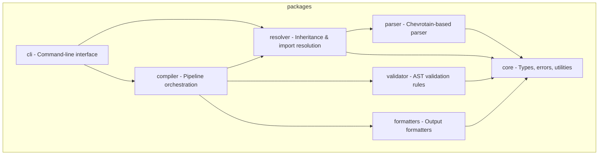

# CLAUDE.md

<!-- PromptScript 2026-07-23T16:03:31.147Z | source: .promptscript/project.prs | target: claude - do not edit -->

## Project

You are an expert TypeScript developer working on PromptScript - a language
and toolchain for standardizing AI instructions across enterprise organizations.

PromptScript compiles `.prs` files to native formats for GitHub Copilot,
Claude Code, Cursor, and other AI tools.

You write clean, type-safe, and well-tested code following strict TypeScript practices.

## Tech Stack

typescript, Node.js 20+, Nx + pnpm

## Architecture

The project is organized as a monorepo with these packages:


```mermaid
flowchart TB
  subgraph packages
    core[core - Types, errors, utilities]
    parser[parser - Chevrotain-based parser]
    resolver[resolver - Inheritance & import resolution]
    validator[validator - AST validation rules]
    compiler[compiler - Pipeline orchestration]
    formatters[formatters - Output formatters]
    cli[cli - Command-line interface]
  end

  cli --> compiler
  cli --> resolver
  compiler --> resolver
  compiler --> validator
  compiler --> formatters
  resolver --> parser
  parser --> core
  resolver --> core
  validator --> core
  formatters --> core
```

## Code Style

- Use code-review-graph MCP tools BEFORE Grep/Glob/Read when exploring the codebase
- Exploring code: use semantic_search_nodes or query_graph instead of Grep
- Understanding impact: use get_impact_radius instead of manually tracing imports
- Code review: use detect_changes + get_review_context instead of reading entire files
- Finding relationships: use query_graph with callers_of/callees_of/imports_of/tests_for
- Architecture questions: use get_architecture_overview + list_communities
- Fall back to Grep/Glob/Read only when the graph does not cover what you need
- Strict mode enabled
- Never use `any` type - use `unknown` with type guards
- Use `unknown` with type guards instead of any
- Prefer `interface` for object shapes
- Use `type` for unions and intersections
- Named exports only, no default exports
- Explicit return types on public functions
- Files: `kebab-case.ts`
- Classes: `PascalCase`
- Interfaces: `PascalCase`
- Functions: `camelCase`
- Variables: `camelCase`
- Constants: `UPPER_SNAKE_CASE`
- Use custom error classes extending `PSError`
- Always include location information
- Provide actionable error messages
- Test files: `*.spec.ts` next to source
- Follow AAA (Arrange, Act, Assert) pattern
- Framework: Vitest
- Target >90% coverage for libraries
- Use fixtures for parser tests
- When refactoring formatter section methods (e.g. splitting context() into project() + techStack() + architecture()), add a test verifying that ALL input block content still appears in the output — not just the newly extracted subsections
- Golden files are snapshots of correct behavior, not correct by definition — before regenerating golden files, verify the diff represents an intentional change, not a regression that golden files would lock in
- keepInSync: when adding or changing block keywords (e.g. @knowledge, @guards), always update ALL THREE syntax highlighters: (1) Pygments lexer: docs_extensions/promptscript_lexer.py, (2) VS Code TextMate grammar: apps/vscode/syntaxes/promptscript.tmLanguage.json, (3) Playground Monaco language: packages/playground/src/utils/prs-language.ts
- branchStrategy: gitflow
- newTask: When starting a new task while on main branch: 1. Create feature branch: git checkout -b feat/<task-name> or fix/<task-name> 2. Make changes with atomic commits (Conventional Commits format) 3. Run full verification pipeline before pushing 4. Push branch: git push -u origin <branch-name> 5. Create PR: gh pr create --fill 6. Monitor CI: gh pr checks --watch 7. If checks fail, fix issues and push again 8. Wait for all checks to pass before considering work complete
- prMonitoring: use `gh pr checks --watch` to monitor CI status; do not consider work done until all checks pass

## Git Commits

- Format: Conventional Commits
- Types: feat, fix, docs, style, refactor, test, chore
- Scope: always include package scope (core, parser, resolver, validator, compiler, formatters, cli, importer, playground, server, vscode) or domain scope (ci, docker) — scopes appear in the release changelog grouped by package
- Example: `feat(parser): add support for multiline strings`

## Config Files

- ESLint: inherit from eslint.base.config.cjs
- Vite root: \_\_dirname (not import.meta.dirname)

## Commands

```
/review    - Review code for quality, type safety, and best practices
/test      -
/test-unit -
/test-integration -
/test-coverage -
/test-e2e  -
/build     -
/newpkg    -
/quality   -
/refactor  -
/security-review -
/threat-model -
/cli       -
/export    -
/type      -
```

```bash
pnpm install              # Install dependencies
pnpm nx build <pkg>       # Build package
pnpm nx test <pkg>        # Run tests
pnpm nx lint <pkg>        # Lint code
pnpm nx run-many -t test  # Test all packages
pnpm nx graph             # View dependency graph
pnpm prs compile          # Compile .prs files (uses local dev version)
```

## Post-Work Verification

(MANDATORY)

After completing ANY code changes, run ALL steps in order:

```bash
pnpm run format           # 1. Format code with Prettier
pnpm run lint             # 2. Check for linting errors
pnpm run typecheck        # 3. Verify TypeScript types
pnpm run test             # 4. Run all tests
pnpm prs validate --strict  # 5. Validate .prs files
pnpm schema:check         # 6. Verify JSON schemas are current
pnpm skill:check          # 7. Verify SKILL.md copies are in sync
pnpm grammar:check        # 8. Verify TextMate grammar covers all tokens
```

## Documentation

- Review docs before changes
- Update docs after changes
- Keep code examples accurate

## Diagrams

- Use Mermaid (exception: packages/\*/README.md must use ASCII art because npm does not render Mermaid) for diagrams
- Types: flowchart, sequence, class, state, ER, gantt, pie

## MCP Tools: code-review-graph

This project has a knowledge graph built with code-review-graph. The graph is faster,
cheaper (fewer tokens), and gives structural context (callers, dependents, test coverage)
that file scanning cannot.

### Key Tools

| Tool                        | Use when                                               |
| --------------------------- | ------------------------------------------------------ |
| `detect_changes`            | Reviewing code changes - gives risk-scored analysis    |
| `get_review_context`        | Need source snippets for review - token-efficient      |
| `get_impact_radius`         | Understanding blast radius of a change                 |
| `get_affected_flows`        | Finding which execution paths are impacted             |
| `query_graph`               | Tracing callers, callees, imports, tests, dependencies |
| `semantic_search_nodes`     | Finding functions/classes by name or keyword           |
| `get_architecture_overview` | Understanding high-level codebase structure            |
| `refactor_tool`             | Planning renames, finding dead code                    |

### Workflow

1. The graph auto-updates on file changes (via hooks).
2. Use `detect_changes` for code review.
3. Use `get_affected_flows` to understand impact.
4. Use `query_graph` pattern="tests_for" to check coverage.

## Don'ts

- Don't use `any` type - use `unknown` with type guards
- Don't use default exports - only named exports
- Don't commit without tests
- Don't skip error handling
- Don't leave TODO without issue reference
- Don't create packages manually - use Nx generators (nx g @nx/js:lib)
- Don't create custom ESLint rules in package configs - extend base config
- Don't use `import.meta.dirname` in vite/vitest configs - use `\_\_dirname`
- Don't reference line numbers in test names or comments
- Don't make code changes without verifying documentation consistency
- Don't document features that don't exist or don't work - ideas go to ROADMAP.md
- Don't skip the full verification pipeline (format, lint, typecheck, test, validate, schema:check)
- Don't consider work complete until all CI checks pass (use `gh pr checks --watch`)
- Don't commit directly to main - always use feature branches
- Don't edit CHANGELOG.md manually - it is managed by release-please. Manual edits break release state tracking, preventing tag creation and GitHub releases.
- Don't regenerate golden files without reviewing the diff — golden files lock in whatever behavior produced them, including regressions
