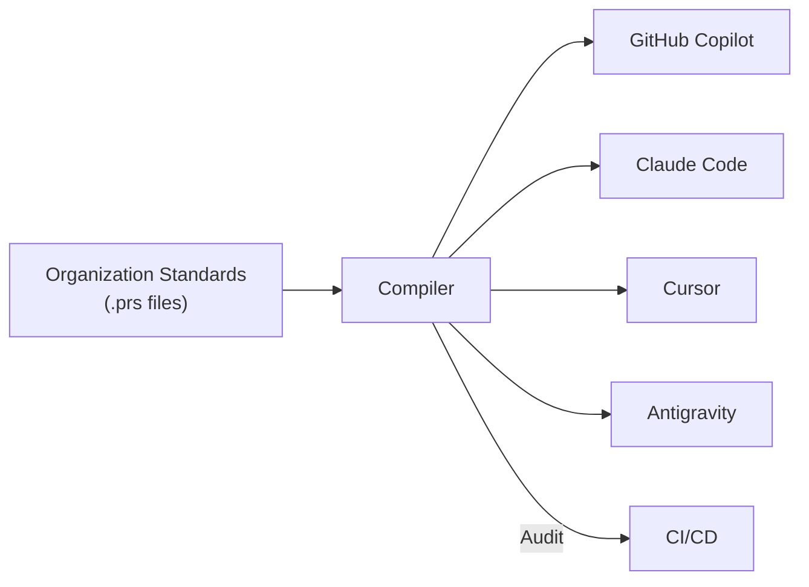

<div align="center">
  
  
  # PromptScript
  
  **The Infrastructure-as-Code for AI Context**

_Standardize, Audit, and Deploy AI Instructions across your entire Engineering Organization._

[](https://github.com/mrwogu/promptscript/actions/workflows/ci.yml)
[](https://codecov.io/github/mrwogu/promptscript)
[](https://getpromptscript.dev/)
[](https://opensource.org/licenses/MIT)
[](CONTRIBUTING.md)

[Getting Started](#-getting-started) · [Why PromptScript?](#-why-promptscript) · [Contributing](CONTRIBUTING.md)

</div>

---

## 📉 The Business Problem: "Prompt Drift"

Modern engineering organizations face a critical challenge: **AI Context Fragmentation**.

As you scale to 50+ repositories and deploy multiple AI tools (GitHub Copilot, Claude, Cursor), maintaining coherent AI instructions becomes impossible manually.

- **The Scale Problem:** Updating a security policy across 100 microservices takes weeks of manual PRs.
- **The Model Volatility:** New models (e.g., Claude Sonnet 4 vs 3.5) require different prompting strategies. You shouldn't have to rewrite 1000 instruction files when a model upgrades.
- **The Governance Void:** Developers use local, unvetted instructions. Junior devs miss critical security context. There is no audit trail for what constraints your AI is operating under.

Result: **Inconsistent code quality, security risks, and operational chaos.**

## 🛡️ The Solution: PromptOps

**PromptScript turns AI context into managed infrastructure.**

It treats your prompts as code—compiled, validated, and deployed.



## ✨ Why PromptScript?

### 1. Enterprise Governance

Enforce non-negotiable standards globally. Define policies once, apply them everywhere.

- _Example:_ "All TypeScript code must us `unknown` instead of `any`."
- _Example:_ "All SQL queries must use parameterized inputs."

### 2. Vendor Independence

Don't lock your organization's intellectual property into a specific tool's format.

- Write logic in PromptScript (`.prs`).
- Deploy to **Cursor** today.
- Deploy to **Windsurf** or **GitHub Copilot** tomorrow.
- Your context moves with you.

### 3. Hierarchical Inheritance

Structure instructions like you structure code.

- `@company/global-security` (CISO approved)
- `@company/backend-java` (Platform team approved)
- `@team/checkout-service` (Project specific)

## 💻 Code Example

One source of truth that compiles to every native format you need.

**Source:** `.promptscript/project.prs`

```promptscript
@meta { id: "checkout-service", syntax: "1.0.0" }

// Inherit approved company standards
@inherit @company/backend-security
@inherit @company/typescript-standards

// Project-specific identity
@identity {
  """
  You are an expert Backend Engineer working on the Checkout Service.
  This service handles payments and utilizes a hexagonal architecture.
  """
}

// Define reusable tools/skills
@skills {
  review: {
    description: "Security-focused code review"
    content: "Check for: IDOR, SQL Injection, and PII leaks."
  }
}
```

**Run Compilation:**

```bash
prs compile
```

**Generated Outputs (Native Formats):**

- **GitHub Copilot:** `.github/copilot-instructions.md` (Optimized XML/Markdown)
- **Claude Code:** `CLAUDE.md` (With local memory hooks)
- **Cursor:** `.cursor/rules/tech-stack.mdc` (With glob patterns)

👉 **[See full example with all outputs →](https://getpromptscript.dev/latest/#quick-example)**

## 📊 Supported Platforms

Write once, compile to native formats for the industry's leading AI tools.

| Tool                   | Output Path                       | Format Types      |
| :--------------------- | :-------------------------------- | :---------------- |
| **GitHub Copilot**     | `.github/copilot-instructions.md` | Markdown, XML     |
| **Claude Code**        | `CLAUDE.md`                       | Markdown, XML     |
| **Cursor**             | `.cursor/rules/*.mdc`             | MDC (Frontmatter) |
| **Google Antigravity** | `.agent/rules/*.md`               | Markdown          |

## 🚀 Getting Started

### For Team Leads & Architects

1.  **Install the CLI:**

    ```bash
    npm install -g @promptscript/cli
    ```

2.  **Initialize your repo:**

    ```bash
    prs init
    ```

    _Auto-detects your tech stack (React, Node, Python) and generates a tailored configuration._

3.  **Compile & Commit:**
    ```bash
    prs compile
    git add .
    git commit -m "chore: setup PromptScript infrastructure"
    ```

## 📦 Installation

```bash
npm install -g @promptscript/cli
```

The CLI bundles all required functionality. Internal packages (core, parser, compiler, etc.) are not published separately.

## 🗺️ Roadmap

🎯 **Current Focus:** Web Playground — Try PromptScript in the browser

**Coming Soon:**

- More platforms: Windsurf, Aider, Continue, Cline, Zed
- GitHub Action for CI/CD drift detection
- VS Code Extension with LSP
- Public Registry for sharing rule sets

👉 **[See full roadmap →](ROADMAP.md)**

## Contributing

We welcome contributions from the community! Please read our [Contributing Guide](CONTRIBUTING.md) to get started.

---

<div align="center">
  <sub>Built with ❤️ for the AI-First Engineering Community</sub>
</div>
