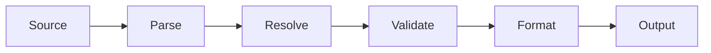

# @promptscript/compiler

Orchestrates the PromptScript compilation pipeline.

## Installation

```bash
npm install @promptscript/compiler
```

## Functions

### compile (Standalone)

Compile PromptScript source to target format without creating a compiler instance.

```typescript
function compile(source: string, options?: CompileOptions): Promise<CompileResult>;
```

**Parameters:**

| Parameter | Type             | Description              |
| --------- | ---------------- | ------------------------ |
| `source`  | `string`         | PromptScript source code |
| `options` | `CompileOptions` | Compilation options      |

**Returns:** `Promise<CompileResult>` - Compilation result

**Example:**

```typescript
import { compile } from '@promptscript/compiler';

// Compile to multiple targets at once
const result = await compile(source, {
  targets: ['github', 'claude', 'cursor'],
  registryPath: './registry',
});

if (result.success) {
  for (const [path, output] of result.outputs) {
    console.log(`✓ ${path}`);
  }
}
```

**CompileOptions (Standalone):**

```typescript
interface CompileOptions {
  /** Target formatters (e.g., 'github', 'claude', 'cursor') */
  targets?: string[];

  /** Path to registry directory */
  registryPath?: string;

  /** Path to local .promptscript directory */
  localPath?: string;

  /** Validation configuration */
  validator?: ValidatorConfig;
}
```

### createCompiler

Create a compiler instance for repeated use.

```typescript
function createCompiler(options: CompilerOptions): Compiler;

interface Compiler {
  compile(entryPath: string): Promise<CompileResult>;
  getFormatters(): readonly Formatter[];
}
```

**Example:**

```typescript
import { Compiler } from '@promptscript/compiler';

const compiler = new Compiler({
  resolver: {
    registryPath: './registry',
    localPath: './.promptscript',
  },
  validator: {
    requiredGuards: ['@core/guards/compliance'],
  },
  formatters: ['github', 'claude', 'cursor'],
});

// Compile
const result = await compiler.compile('./project.prs');

for (const [path, output] of result.outputs) {
  console.log(`✓ ${path}`);
}

for (const result of results) {
  console.log(`${result.target}: ${result.outputPath}`);
}
```

## Options

### CompileOptions

```typescript
interface CompileOptions {
  /** Target format */
  target: 'github' | 'claude' | 'cursor' | string;

  /** Registry path or URL */
  registry?: string;

  /** Output file path */
  output?: string;

  /** Validation options */
  validation?: {
    strict?: boolean;
    rules?: Record<string, RuleSeverity>;
  };

  /** Formatter options */
  formatter?: FormatterOptions;

  /** Base path for relative imports */
  basePath?: string;
}
```

### CompilerOptions

```typescript
interface CompilerOptions {
  /** Registry path or URL */
  registry?: string;

  /** Target formats */
  targets?: string[];

  /** Target-specific options */
  targetOptions?: Record<string, FormatterOptions>;

  /** Validation options */
  validation?: ValidateOptions;

  /** Enable caching */
  cache?: boolean;

  /** Watch mode options */
  watch?: WatchOptions;
}
```

## Result Types

### CompileResult

```typescript
interface CompileResult {
  /** Target format */
  target: string;

  /** Compiled output */
  output: string;

  /** Output file path (if specified) */
  outputPath?: string;

  /** Source file path */
  sourcePath: string;

  /** Validation diagnostics */
  diagnostics: Diagnostic[];

  /** Compilation metadata */
  metadata: {
    parseTime: number;
    resolveTime: number;
    validateTime: number;
    formatTime: number;
    totalTime: number;
  };
}
```

### CompileAllResult

```typescript
interface CompileAllResult {
  /** Results for each target */
  results: CompileResult[];

  /** Overall success */
  success: boolean;

  /** Combined diagnostics */
  diagnostics: Diagnostic[];
}
```

## Pipeline

The compilation pipeline:



### Pipeline Stages

```typescript
interface Pipeline {
  parse(source: string): Program;
  resolve(program: Program): Promise<ResolvedProgram>;
  validate(program: ResolvedProgram): Diagnostic[];
  format(program: ResolvedProgram, target: string): string;
}
```

### Custom Pipeline

```typescript
import { createPipeline } from '@promptscript/compiler';

const pipeline = createPipeline({
  parser: customParser,
  resolver: customResolver,
  validator: customValidator,
  formatters: {
    custom: customFormatter,
  },
});

const result = await pipeline.compile(source, { target: 'custom' });
```

## Watch Mode

### Basic Watch

```typescript
const compiler = createCompiler({
  registry: './registry',
  targets: ['github'],
});

compiler.watch('./project.prs', (event) => {
  if (event.type === 'compile') {
    console.log('Compiled:', event.result.outputPath);
  } else if (event.type === 'error') {
    console.error('Error:', event.error);
  }
});
```

### Watch Options

```typescript
interface WatchOptions {
  /** Debounce delay (ms) */
  debounce?: number;

  /** Files to watch */
  include?: string[];

  /** Files to ignore */
  ignore?: string[];

  /** Clear console on rebuild */
  clearScreen?: boolean;
}
```

### Watch Events

```typescript
type WatchEvent =
  | { type: 'start' }
  | { type: 'compile'; result: CompileResult }
  | { type: 'error'; error: Error }
  | { type: 'change'; path: string };

type WatchCallback = (event: WatchEvent) => void;
```

## Error Handling

### CompileError

```typescript
import { compile, CompileError } from '@promptscript/compiler';

try {
  await compile(source, options);
} catch (error) {
  if (error instanceof CompileError) {
    console.log('Stage:', error.stage); // 'parse' | 'resolve' | 'validate' | 'format'
    console.log('Diagnostics:', error.diagnostics);
  }
}
```

### Handling Validation Errors

```typescript
const result = await compile(source, options);

if (result.diagnostics.length > 0) {
  const errors = result.diagnostics.filter((d) => d.severity === 'error');

  if (errors.length > 0) {
    console.error('Compilation failed with errors');
    for (const error of errors) {
      console.error(`  ${error.code}: ${error.message}`);
    }
  }
}
```

## Caching

The compiler supports caching for performance:

```typescript
const compiler = createCompiler({
  cache: true,
});

// First compilation - full pipeline
await compiler.compile(source);

// Second compilation - uses cached parse/resolve
await compiler.compile(source);

// Clear cache
compiler.clearCache();
```

## Incremental Compilation

For large projects, use incremental compilation:

```typescript
import { createIncrementalCompiler } from '@promptscript/compiler';

const compiler = createIncrementalCompiler({
  registry: './registry',
  targets: ['github'],
});

// Initial compilation
await compiler.compile('./project.prs');

// Subsequent compilations only reprocess changed files
await compiler.compile('./project.prs');
```

## Programmatic Usage

### Full Control

```typescript
import { parse } from '@promptscript/parser';
import { resolve, createFileSystemRegistry } from '@promptscript/resolver';
import { validate } from '@promptscript/validator';
import { format } from '@promptscript/formatters';

// Step 1: Parse
const ast = parse(source);

// Step 2: Resolve
const registry = createFileSystemRegistry('./registry');
const resolved = await resolve(ast, { registry });

// Step 3: Validate
const diagnostics = validate(resolved);
if (diagnostics.some((d) => d.severity === 'error')) {
  throw new Error('Validation failed');
}

// Step 4: Format
const output = format(resolved, { target: 'github' });
```

### Middleware

Add custom processing to the pipeline:

```typescript
const compiler = createCompiler({
  middleware: [
    async (context, next) => {
      console.log('Before compilation');
      const result = await next();
      console.log('After compilation');
      return result;
    },
  ],
});
```
