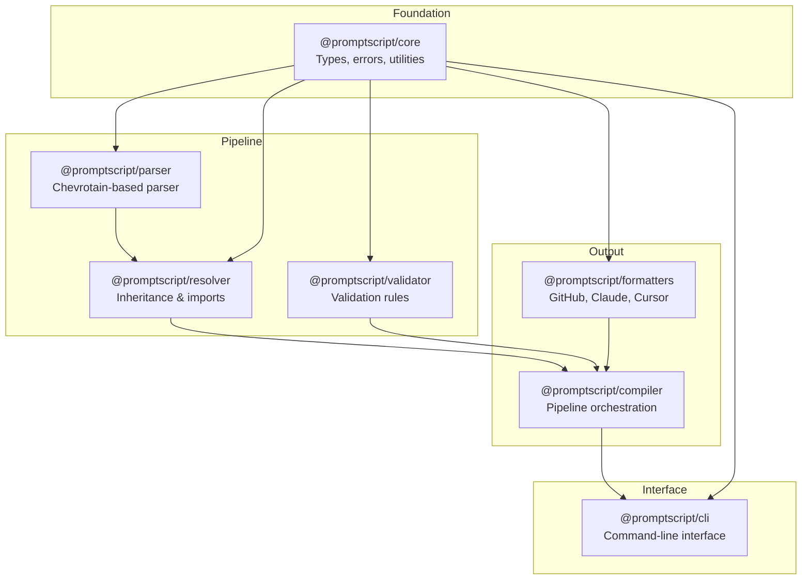

# API Documentation

Reference documentation for PromptScript's TypeScript packages.

## Package Overview



## Packages

<div class="feature-grid" markdown>

<div class="feature-card" markdown>
### @promptscript/core
Core types, errors, and utilities shared across all packages.

[Core API →](core.md)
</div>

<div class="feature-card" markdown>
### @promptscript/parser
Chevrotain-based parser for PromptScript syntax.

[Parser API →](parser.md)
</div>

<div class="feature-card" markdown>
### @promptscript/resolver
Resolves inheritance and imports.

[Resolver API →](resolver.md)
</div>

<div class="feature-card" markdown>
### @promptscript/validator
Validates PromptScript AST for correctness.

[Validator API →](validator.md)
</div>

<div class="feature-card" markdown>
### @promptscript/compiler
Orchestrates the compilation pipeline.

[Compiler API →](compiler.md)
</div>

<div class="feature-card" markdown>
### @promptscript/formatters
Output formatters for various AI tools.

[Formatters API →](formatters.md)
</div>

<div class="feature-card" markdown>
### @promptscript/cli
Command-line interface.

[CLI API →](cli.md)
</div>

</div>

## Quick Start

### Using Individual Packages

```typescript
import { parse } from '@promptscript/parser';
import { resolve } from '@promptscript/resolver';
import { validate } from '@promptscript/validator';
import { compile } from '@promptscript/compiler';

// Parse source code
const ast = parse(sourceCode);

// Resolve inheritance
const resolved = await resolve(ast, { registry });

// Validate
const diagnostics = validate(resolved);

// Compile to target
const output = compile(resolved, { target: 'github' });
```

### Using the Compiler Directly

```typescript
import { createCompiler } from '@promptscript/compiler';

const compiler = createCompiler({
  registry: './registry',
  targets: ['github', 'claude', 'cursor'],
});

const results = await compiler.compile('./project.prs');
```

## Installation

Install individual packages:

```bash
npm install @promptscript/core
npm install @promptscript/parser
npm install @promptscript/compiler
```

Or use the CLI which includes all packages:

```bash
npm install -g @promptscript/cli
```

## TypeScript Support

All packages include TypeScript declarations and are written in strict TypeScript.

```typescript
import type { Program, Block, Diagnostic } from '@promptscript/core';
```
