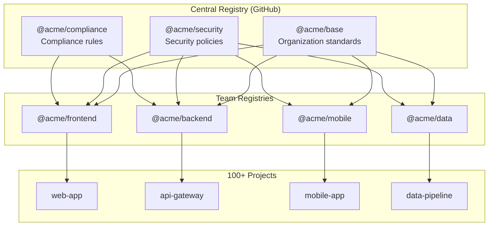

# Enterprise Example

Complete enterprise PromptScript deployment with central governance.

## Architecture



## Central Registry

### Repository Structure

```
acme-promptscript-registry/
├── README.md
├── CHANGELOG.md
├── CODEOWNERS
├── @acme/
│   ├── base.prs              # Organization base
│   ├── security.prs          # Security standards
│   └── compliance.prs        # Compliance (SOC2, GDPR)
├── @frontend/
│   ├── base.prs              # Frontend team base
│   ├── react.prs             # React-specific
│   └── vue.prs               # Vue-specific
├── @backend/
│   ├── base.prs              # Backend team base
│   ├── node.prs              # Node.js
│   └── python.prs            # Python
├── @mobile/
│   ├── base.prs
│   ├── ios.prs
│   └── android.prs
├── @data/
│   └── base.prs
└── @fragments/
    ├── testing.prs
    ├── documentation.prs
    └── ci-cd.prs
```

### @acme/base.prs

```promptscript
@meta {
  id: "@acme/base"
  syntax: "1.0.0"
  org: "ACME Corporation"
}

@identity {
  """
  You are an AI coding assistant at ACME Corporation.

  ## Core Values

  - **Quality First**: Write production-ready code
  - **Security Always**: Security is not optional
  - **User Focus**: Consider the end user
  - **Team Player**: Write code others can maintain

  ## Standards

  Follow ACME Engineering Standards v3.0
  (https://wiki.acme.com/engineering-standards)
  """
}

@standards {
  code: [
    "Code review required with minimum 2 approvers"
    "Document all public APIs"
    "Add inline comments for complex logic"
    "Write tests for all code (80% coverage)"
  ]

  git: [
    "Use conventional commits format"
    "Branch naming: type/TICKET-description"
    "Signed commits required"
  ]

  deployment: [
    "Environments: dev, staging, prod"
    "Production requires team-lead and security approval"
  ]
}

@restrictions {
  - "Never commit secrets, credentials, or API keys"
  - "Never bypass code review for production changes"
  - "Never deploy without passing CI/CD"
  - "Never ignore security scanner findings"
  - "Never use deprecated dependencies with known CVEs"
  - "Never store PII in logs"
}

@shortcuts {
  "/standards": "Review against ACME standards"
  "/security": "Security review"
  "/perf": "Performance review"
}
```

<!-- playground-link-start -->
<a href="https://getpromptscript.dev/playground/?s=N4IgZglgNgpgziAXAbVABwIYBcAWSQwAeGAtmrAHRoBOCANCAMYD2AdljO-gAIkxYYABMAA6rQYIgATRIJEhuGRnwD0AIwxwY8sRLgBPdhkKz5ARgoAGKzvGDm1AOamQAQQDCAWQCig9w7QHbAg2WwBfMTFuaU4sCCx9YV05EB1UuwBNZgBXQQxqGDzxVwBJQRYpCFZHPLg4CDgBdjysQQ8fPwCguLYKSLsAYgHOgsEANQwobPh+iQBaQQAqRYBFbMn4xIAxCFosZdkAdWp4wppmKWzGHtY5gowpRIrtOwXlgGUYRmyThLaoADuGH0cAOgk+31+iQaglYzFazDQN0myTeiwAqlpqIItsxvqDFrJ-Kx6lIYNjcIVOFJBNksailosACowUiCAAKUGB5LBx1O5QuhXhOHJcHKGHEJAwVQEVVmgiG4KaUnyUjg8txUCgzABbS8vm81SqMHJVRq72VqrFADcAMw2OwAChwWCwaDgiBUKgBEAA1hAKEo+BQWCQVJxHMbTdU5o0JSrqGqAJTJNLhfrcOOsBNqpJ2Z6yZDJCTyfxkwQFa0QGC6goAR2yuxgNJ9uEEJCqEBI2RIggATHk0OdraLbBISyAACJ4nuxPJawRobJqKAQRhtdkldXpccpVxSGlVVesQqhvjsMVgBwCsiwQiCbWRxhj8fyPkcQQcRqX6+TKAC8tHQADksABSAUR2oDBHBgFMd0EABdeVIywQtixSTFTzYEd2BCVhJhvDssB-agpSwF8JwAISg1hGBwWFSDNWQEjQGAVCZEp3AAaW8Jk5jJOBGBOJE8IolJ3ggRwTxpM94jFetGwKKQXyQ1hkjJchmH0c9UMEIs7AnQ0q2oNgdI9QQyWtOhBDjSNqms85lPgid2RMy5rjwisYAbJsxQ4Ug5lgB4ihpLRIU2QdhxReDVIiNTWG4ApGhODy2DFURXhSAA5GBIMI+IbK+ApiOsoTm1iCBJjgazr1cTdBF9GAQRfBZ5ByvK1H0TA6gAwpK2rXUr2xRyrhucocAlGDtwZNrcvJCyYE0xJWxwHJWm6+pqj8EoVHcScWuyubsUkuFRjCn4IsEiUT2xSBszNabMtmvK6UKDSCkYbBmwW1js04RhqzFFaGrhAFxHcMZvEe+ZDryxoHEKTcyiqB9mEcR64qiOBVuoLBvmIvMJxULMc23FwACVcoGvJHGlElWnaXwSatF95GJr4LoSeQXAhTnEn6mtWZAFRWOoMBuZSdlySGqVaL6qnBfSMIQDCBCGFiah9HwIhSHIGAqFoEAGEg+o2HwMwVaAA" target="_blank" rel="noopener noreferrer">
  
</a>
<!-- playground-link-end -->

### @acme/security.prs

```promptscript
@meta {
  id: "@acme/security"
  syntax: "1.0.0"
}

@identity {
  """
  Apply ACME security standards to all code.
  Security is everyone's responsibility.
  """
}

@standards {
  authentication: [
    "Use OAuth 2.0 / OIDC"
    "MFA required (TOTP or WebAuthn)"
    "Session timeout: 3600 seconds"
    "Enable refresh token rotation"
  ]

  authorization: [
    "RBAC with ABAC extensions"
    "Apply least privilege principle"
    "Audit logging required"
  ]

  dataProtection: [
    "Encrypt at rest with AES-256"
    "Encrypt in transit with TLS 1.3"
    "Mask PII in all outputs"
    "Follow data classification for retention"
  ]

  dependencies: [
    "Daily vulnerability scanning"
    "Critical vulnerabilities block deployment"
    "High vulnerabilities: fix within 7 days"
    "Medium vulnerabilities: fix within 30 days"
  ]

  secrets: [
    "Store in HashiCorp Vault"
    "Rotate every 90 days"
    "Never store secrets in code"
  ]
}

@restrictions {
  - "Never store passwords in plain text"
  - "Never log sensitive data (passwords, tokens, PII)"
  - "Never use MD5 or SHA1 for security purposes"
  - "Never disable TLS certificate verification"
  - "Never use eval() or similar unsafe functions"
  - "Never trust user input without validation"
  - "Never expose stack traces in production"
  - "Always use parameterized queries (no SQL concatenation)"
  - "Always validate and sanitize file uploads"
  - "Always implement rate limiting for APIs"
}

@knowledge {
  """
  ## Security Resources

  - Security Guidelines: https://wiki.acme.com/security
  - Incident Response: https://wiki.acme.com/incident-response
  - Security Training: https://learn.acme.com/security
  - Bug Bounty: https://hackerone.com/acme

  ## Contacts

  - Security Team: security@acme.com
  - Incident Hotline: +1-800-SEC-ACME
  - Slack: #security-help
  """
}

@shortcuts {
  "/threat-model": "Help create a threat model"
  "/vuln-check": "Check for common vulnerabilities"
  "/secure-code": "Review code for security issues"
}
```

<!-- playground-link-start -->
<a href="https://getpromptscript.dev/playground/?s=N4IgZglgNgpgziAXAbVABwIYBcAWSQwAeGAtmrAHRoBOCANCAMYD2AdljO-gAIkxYYABMAA6rQYIgATRIJEhuGRnwD0cGIwCu1CFgCe8sRLh72GQrPkBGCgAY7h1gF8xY7tM5Zde4UbkhDAPFBAEE0ch8QgGEAWQBRQXUtHX1EgVYpDGopOEEsZkEMKChBFikYCj8AZQ1tb0lcmAA3GGo9NhgAclzqeDQ2OAgAI2hvSuDAxxdWNzh0zOzc0WCMTVxPCEZsCDZZZD8JeQBVdUEAeRC1nEEAJjtBFXOASQARKMcJQ5AYgDEQwV6AEdNBBelJBAAKAAqZyhAAVBMxqIIAOowIaXXCsACUH0+8hqcEGbDyED4zDWsgAzAA2Wy2RIaNg5PFfOKsDBDWAAmBgXpwa75ADWnABzAEXjYeIAuq4VlckRAAF7bXaCfbBL4AJQAQtFBAB3XTXEJ6qKCIgcVjE62s-xhCKCWAYOaCGgQJrQGAAcxgbp0rEYEHIMDt8kuUl0TuY3u9EFY3p5wNBMCkMrlEkyAjh1HFGklrD2B387MYbTQWEKlf5laNuFCcSqAFobgBWGlhkCl8uV+N5agYa1RuvXKEAGSqghsVM7MRdQsEcKeT0k4iKJQpWDQazgnZ+zGKzANgizQkYUBdg0gWwLgjASJ5VoL6ZmwXKaE45UDEHgRc1-heDBoB8JpNCgVhWk5UZUjgLZWFYeNvU7KIUk2IpBFA8DIJGKBdB-XIuWYRgF3fKBmD0Ph2E7AAJCBvWuTCIIHHC8N-O8IEIQ1jT7AB2E8MD0Xcgk+fwYlTCBNBIDCwKYqDcK8NjIE4kc+ypBlMkEl8-CSXosDgP8RIJfJelXQRqJdHAICiJE0EEAA1VYoCwTstXFbA-WaVofAATnUgShOLeQADlPOROYkT9HT+FyPsylDYTBFlZw5W4GsdEYAslj8Jt-BClowuMv1MCJA0kRyUzyCA8QOEIZyEpy4LQujRN1CHLwWn4gRIWKuBSsWOg8mYEVrQGpcnlxercqazRThiF5W0RZEqmokIrDvB8kjqVJt2ofp1AC4IGpAPLWhPCA4E5blx0nRhWi8a93Iw1oIAe59Jsa-LBBmjymiKCFsUWxIyWgLIvutDAwD9MBNEDTK8SOk7kSwagZsrb7kXjbda2NTcMKKaRVRmd7jqaog9sigRiP7JR4Aq3MpE0DKdiJ7L7SgA1-K+05MAHPgOB0JVU0EYFntpiFWAKKoAEUx1KNgb04QmJtZ8N2c537cKzP1B3BC6EK8QX2O5TRyGYDAWWJkI1cEyQyFgSjq0e3CSDwhN1uREIlwO6Y3CFCWDVgKRfV8CYAjDvwAGII8EGpknqLV4Apahbt3V8JBy2Otp8ABxEFylwiD9MEHAsC3fSVBUI0hQgCglD4CgWBINRahSAxDsEJ5vy-SsE7gfprRgWQS7LxAK6rmu64qRuVHjINu6bfl+-UVnM9bwQoQHeNEKH0u0HLlRnWoVha+UKfmCbzbW9ZnVNETHUKXYPQd5HiucCUEVcwghvz5USeM0EKOghrJmAyqnFeLd6hQhgKQWQl9vCKFPt-EgrNO5z08GZcUBdB6CAANRWCbAADnpE2KocQohNmiPEFeF5iKyAjnA-QTYcAwCgGgPwkwgg+1YNwAUSIsBaD0iHL4KhcC9GwE2EgzB87yEsCAaiLDbJlmgRwQoeQcBiMrJI6RCV5AqEYk2RgzDiIyP8FEIxC57zIkbpI8QjFsLQXwniXRl8YAGKkfFWRCdPQwGPHFd2jI46pHOnATQ8ApggCcNKBgng2j4CIKQEMVBaAgAYPlG0+ArARKAA" target="_blank" rel="noopener noreferrer">
  
</a>
<!-- playground-link-end -->

### @acme/compliance.prs

```promptscript
@meta {
  id: "@acme/compliance"
  syntax: "1.2.0"
}

@identity {
  """
  Ensure code meets ACME compliance requirements.
  We are SOC 2 Type II and GDPR compliant.
  """
}

@standards {
  soc2: [
    "Logging required with 1 year retention"
    "Tamper-proof audit logs"
    "Access control documented and reviewed quarterly"
    "Change management: documented, approved, tested"
  ]

  gdpr: [
    "Apply data minimization"
    "Enforce purpose limitation"
    "Consent management required"
    "Support right to erasure"
    "Enable data portability"
    "Breach notification within 72 hours"
  ]

  pci: [
    "Applies to payment services only"
    "Never store full PAN"
    "Encryption required"
  ]
}

@restrictions {
  - "Never process data beyond stated purpose"
  - "Never retain data longer than necessary"
  - "Always document data processing activities"
  - "Always provide data subject rights mechanisms"
  - "Never transfer data to non-approved regions"
}

@knowledge {
  """
  ## Compliance Resources

  - Compliance Portal: https://compliance.acme.com
  - Data Classification: https://wiki.acme.com/data-classification
  - Privacy Policy: https://acme.com/privacy

  ## Data Classification

  - **Public**: Marketing materials, public docs
  - **Internal**: Internal communications, non-sensitive
  - **Confidential**: Business data, customer info
  - **Restricted**: PII, financial data, credentials

  ## Regional Requirements

  - EU: GDPR compliance required
  - California: CCPA compliance required
  - Healthcare: HIPAA where applicable
  """
}
```

<!-- playground-link-start -->
<a href="https://getpromptscript.dev/playground/?s=N4IgZglgNgpgziAXAbVABwIYBcAWSQwAeGAtmrAHRoBOCANCAMYD2AdljO-gAIkxYYABMAA6rQYIgATRIJEhuGRnwD0LMlAgZWjGPLES4AT3YZCs+QEYKAJgoAGfawC+Ysd2mcsELEeEG5EH0g8UEAUVY4AFdqGEEWKTi+fjhBAEEAYQBZMPjmDS0dONiARyiIWL52OAoAgHU4jFjBAGUAeQzBG0EAFSM0OIBJQcFtKUEAcQARAAUAJTyC7Sxa0OCnV1Z3OAFWKSapVNFQuGZGG1lkAIl5ABlmAHMHiFYHwVLy2PGAdx8cQUsgiMMCa734XggbCcEhuIB6pAG1AAtDRmMwwKMolIfIIoI84NCYfI0oxdHBUix2NRmFBBFIzlEqhxxmMwQA3CAwb4wcZlJocahQIyE2EZHDaB5JbQYSVM2T0xiMrw8uijNCotkqwQcHY8wkAXTcoQeUhol2ugTS6qFdOwQhILwgDoAXthIVsQjDAhEwMxqLpBGgYmhmHA4poHQJvFDPUSQBk2GH2IISNLZV4wWUKnrY7CWlF1X6sO8IA8cMWsMxBDBqBhorERd7WBgAEawW0CQNF1vQHzC3OBABCsSU-1YzG8kEYbrYgl+uBeggA7N0cMwYgTY4atqE0IwIObQrCreROalK4GMEYmYIw9QOWTBGwhY35AA5GCa6i3yvNMBRKBaRmNI31fEAIkYah+mjcQPmzKQDTETZ3FiHZqAgRgYKOAIkUCD8v0DakyVSfZOxbGAjDYcYdmwHlA2DUM9FjXD30-GswQERdSKEPFXnY3BtEEVgYGIpp+xwy0oG+K8SIZG9uMIs54DgF43iUbwOW8eBCRYkA0ikmTFI5RIOyEaIWwAKxE4t0LLLBUj4RhxVYCA4BITcJNYgisFrSIwHYhSL3HVgkQwdVqU1cZYmeRMNiNbgAGtx2+WApElfw1iCLKAgAYhywQEyWIpBDmeB139bSdwkXDCtPbQAxmbsoFkcssDQOBEBUNR8jqooKCUPgKHUCSpjtAqoDrFSpxnVgWqwNqOq634EogfrlBgIb8hUbikUYCbyQgaaYIkmZ0LZJQ-EazRGCMOaFs6lQBo29QVBoCBzpuo0JDywRRs7DJ9qmjCZq+wRcIAKnBmYojbDDIdkLImgS-hVJTWj0IwKA4FVINYcYOkzgJUIIfBwZ2BrZsoHhwQyYFSnFhIKIXOnLDVWCpEkxUjS9GJwRIYTVhIESdgtCp8HZEHKIVOE8lTNVRUdnydiXl9CTIdKtCMOZamZmGVVIGbHRRbl+IvghTGidy-LSpi+nSqzSovEt3mwgAVVkaZ5kWXqAzgr4JIyTHDr9FyMFkDIMmA73NHq4oYAdvVeYACRBKBcGnWJZCTwZgLSOccBrRprWBtsedhdYXBAZx9QYLwoPwIgEUoGh6BAL8VLYfBLCroA" target="_blank" rel="noopener noreferrer">
  
</a>
<!-- playground-link-end -->

### @frontend/base.prs

```promptscript
@meta {
  id: "@frontend/base"
  syntax: "3.0.0"
  team: "Frontend Platform"
}

# In a multi-file setup, you would inherit and use:
# @inherit @acme/base
# @use @acme/security
# @use @acme/compliance

@identity {
  """
  You are a frontend developer at ACME.

  ## Expertise

  - Modern JavaScript/TypeScript
  - React ecosystem
  - Web performance optimization
  - Accessibility (WCAG 2.1 AA)
  - Design systems
  """
}

@context {
  """
  ## Frontend Platform Stack

  - **Framework**: React 18
  - **Language**: TypeScript 5
  - **Build**: Vite 5
  - **Styling**: TailwindCSS + @acme/design-tokens
  - **State**: React Query + Zustand
  - **Testing**: Vitest + Testing Library + Playwright
  - **Components**: @acme/ui (shared design system)

  ## Architecture

  - Feature-based folder structure
  - Micro-frontends for large apps
  - Module federation for sharing
  - API client generation from OpenAPI

  ## Key Resources

  - Design System: https://design.acme.com
  - Component Library: https://ui.acme.com
  - Frontend Wiki: https://wiki.acme.com/frontend
  """
}

@standards {
  code: [
    "Use React 18+ framework"
    "TypeScript in strict mode"
    "Functional components with hooks and composition"
    "React Query for server state, Zustand for client"
    "TailwindCSS with @acme/design-tokens"
  ]

  performance: [
    "Initial bundle < 200KB gzipped"
    "Per-route code splitting"
    "LCP < 2.5s, FID < 100ms, CLS < 0.1"
  ]

  accessibility: [
    "WCAG 2.1 AA compliance"
    "Automated testing with axe-core"
    "Manual testing required for new features"
    "Support keyboard navigation and screen readers"
    "Ensure color contrast and focus management"
  ]

  testing: [
    "Unit tests with Vitest (80% coverage)"
    "Integration tests with Testing Library"
    "E2E tests with Playwright for happy paths"
  ]
}

@restrictions {
  - "Never use class components"
  - "Never use any type without documentation"
  - "Never ignore accessibility requirements"
  - "Never skip loading/error states"
  - "Never hardcode URLs or config values"
  - "Never use inline styles (use Tailwind)"
}

@shortcuts {
  "/component": """
    Create a new React component with:
    - TypeScript interface for props
    - Unit tests
    - Storybook story
    - Accessibility considerations
  """

  "/hook": "Create a custom React hook with tests"

  "/test": """
    Write tests using:
    - Vitest for unit tests
    - Testing Library for integration
    - Proper mocking patterns
  """

  "/a11y": "Review for accessibility issues"

  "/perf": "Review for performance issues"
}
```

<!-- playground-link-start -->
<a href="https://getpromptscript.dev/playground/?s=N4IgZglgNgpgziAXAbVABwIYBcAWSQwAeGAtmrAHRoBOCANCAMYD2AdljO-gAIkxYYABMAA6rQYIgATRIJEhuYamw6spAegBGGODHliJcAJ7sMhWfIDMFAAy394wR1IWQAMWXtOUwQAUo2GDM1CQOAL5iYgDEggCS4kIkAK5QWBAAtJCwgrpYSWh0gkbMSYIA7iVQPhCsODDUEFiCGGqCSbqI0YLcNXUNTdwYjHxaOnqsMdztMN1DI7qMSf1GXVO6s8Mw6ixkUBAtjONiPVKcaVhGwgZyIPq3jgCaJc3UM0JKKt6CpwBuMFDMND1ZpNACCAGEALIAUQokUcURi0MIQOoaV08Ik6UEkOYp2o4gAUhgfhgAMqMBpoLDqAAqRiBFKpWGu2IASjAhk0YCxjHAOKFHNiAOowTSCVFBEIHGaAtIkCAAL2wEDYrMEoMYhzgcAgmmgjUuAApheDQQBxQQAJgoAEYNaCAJTqgAi8AgAHNxHyBXBrndwvDuCwvIQmqJHAH7hJEYIPJ9Wv5AsESIIyQJGABrTGCbEAKjzHlIMAq1EzBdkHK5gltAA51QWADItD1JDAemAVwT0xmUiDUwQAVgbeYAQkloFIuwA1RozYdCwQF9NGPasD1d2kYaBlGpScFksmCADUGxGp11XvSWGYmc4fsXy4EHC7VcYTQAikl6pdTwAtdoBDUEdaXgNJ1xnOd+RPbswJqD1BEbPVqAwahfz8AIjDKBoPRwFlHzzcFmDINgzjgLtBk2dQJ0EI04BwVCYB8C9PW9Ix+RgEhnVYa5Y1BahGBwOd3yWI5FzcTk8ledJtF0HwgiqYF+WoJIRNedVIQgSlmEyTxVCkOBBClQQAmoDtmjQNAHyxHE8RSGYwCY+oVTYIzghyBiGnXdVQV8WJBEYPYzkEDtWGctJXI+VMAHkgVYXzYhzWMAGkYEuDk4BKAT4BzbE3UvcQyXYgVZDwrArMQdR1BYr0KDmGAKB2dUiJIsL2EQ5DUKMUqsHKuBKuoiA6s2RriPVeMvFaYUIEzCAer6gbd1m4a+FGkh1A+SapH9W5drECIeNYbh+RaKRUIMq5HBYU5ZGQa4JHkABVdY3yaOtTyUYtS2zaMJBuHsYCZfsmhqHIsAad9BBIPE9F+h73CSVh31VVgMCgALiLQUj2EM3dcEEHBmFvQzToxkjdQini4ZuV7BC-H83OoHJ6j+JmTo4QoAJO1pjMCiAzgcP7-u3KBdzUA8jzxnAzy2GrWGvW970FwQAF0c0lFMZVu+6bniRp9nRzREakbIAB5rRsGxktHELFX7IFtup+RfHqdJlCSDgMdOHJyEacCPWV+HG3BXxBHNm1BzgQo3FiF0w5rS2SCjwRwUbI9zbsW1lbVw6JCGbVdX1PYLm1xx4dNC1rTtB0yd9mVA5uUEPeI7AmKcOD13KRppbMGB0hYdSnZASEWjbdGOH5eDBFeABHCdXnk9ywrKIzJNEv0h7JfIsbRQQ7yMTRmHOwRUZ+T0XISVo4EpGBOGnzl8Q3nX5GhVg4FEjGASZkNwZ0JpSaCIsQyJAWjtk4gLX6OdrgT39qXIWT1WCNHbvyXG3dBCzhgbRWsNgACkGNWZgOdEPeIHAPQoUpsgrAqD8agUnp3JCmgUJoQbi-K00JKHUOlkmLCOE8KMwJhgSylxMC4Cfo4HOB1jivGUlpSmhkIw2XkAAORgKzNo6xAo6EMjsLGbUqHK2xMo1RwJpjNFYJcC4QIu64BKE0KQzBFh8FMJTAxNwVFqNYsEN4Wp4CFwNBce+c8ICvCcfo36hiQDuKUrNNAJkj5SHguoeoyg2bPhyuEtxximaeSkNdGYj02SNkMu5EMkAEKkigN+MRijIlZPUTMGoa4Zj8lXPAWipitw7j3EQ-aQZ6LBCwIsKhl14bbExtjFkSAbgBjLinV4rdmgnxLIIWmOiJnWJwJ0WZ2IAZAwHDUDg1AwBDAcu5GggJrJ-WxI9RBTQYGXJsumYIB8iaZjBs8nW2JNQFz1P4y4IZdT4gvpcqMOZ5DqEJreeQrhwTzM9kIIBN5Uy00hW8qWHCHA7XUDA6F0y9qzOFP0GY9z1HwS2ULbEGCwL8MRkg+5nzYJ0IQgwphlxjIHJgGQi+DLfDKFRFDBxs1O4iMOW-HaMysUYFtLaFYUz5AcjPss4y+dfG-OLpcCAOoqmYsjCAdQkpcXytUfzFexkNbSiRg0rV6T9ogDCCrBgZw0L4CIKQcgDUaD0BAKzXUbB8C2jtUAA" target="_blank" rel="noopener noreferrer">
  
</a>
<!-- playground-link-end -->

## Project Configuration

### Example Project

```promptscript
# checkout-app/promptscript/project.prs
@meta {
  id: "checkout-app"
  syntax: "2.1.0"
}

# In a multi-file setup, you would inherit from frontend base:
# @inherit @frontend/base

@context {
  project: "Checkout Application"
  repository: "github.com/acme/checkout-app"
  team: "Commerce"
  productOwner: "Jane Smith"
  techLead: "John Doe"

  """
  ## Overview

  Multi-step checkout flow for ACME e-commerce platform.
  Handles cart review, shipping, payment, and confirmation.

  ## Key Integrations

  - Payment: Stripe Elements
  - Shipping: ShipEngine API
  - Tax: Avalara
  - Analytics: Segment + Mixpanel

  ## Architecture

  - Micro-frontend (Module Federation)
  - Shared shell: @acme/commerce-shell
  - Feature flags: LaunchDarkly
  """
}

@extend standards {
  payment: {
    provider: "Stripe"
    pciCompliance: true
    neverStoreCardData: true
  }
}

@knowledge {
  """
  ## API Endpoints

  ### Cart Service (cart.acme.com)
  - GET /cart - Get current cart
  - PUT /cart/items/:id - Update item
  - DELETE /cart/items/:id - Remove item

  ### Checkout Service (checkout.acme.com)
  - POST /checkout/start - Initialize checkout
  - PUT /checkout/:id/shipping - Set shipping
  - PUT /checkout/:id/payment - Process payment
  - POST /checkout/:id/complete - Complete order

  ## Feature Flags

  - checkout-apple-pay: Apple Pay integration
  - checkout-express: One-click checkout
  - checkout-affirm: Affirm financing

  ## Error Codes

  - CART_EMPTY: Cart has no items
  - SHIPPING_UNAVAILABLE: Cannot ship to address
  - PAYMENT_DECLINED: Payment failed
  - INVENTORY_ERROR: Item out of stock
  """
}

@shortcuts {
  "/checkout-flow": "Help with checkout flow implementation"
  "/payment": "Help with Stripe payment integration"
  "/shipping": "Help with shipping calculation"
  "/cart": "Help with cart management"
}
```

<!-- playground-link-start -->
<a href="https://getpromptscript.dev/playground/?s=N4IgZglgNgpgziAXAbVABwIYBcAWSQwAeGAtmrAHRoBOCANCAMYD2AdljO-gMQAEjOGIwDWzAK5YAtBjRoA9DWZkscRtQhosC6swBWQrFVoAdVgAESMLBl7BTvXhAAmiXsaaCR4qTLTv7vHAAnuwYhK7uAEwUAIwUAAz+rAC+pqZ8AJKsvDYkYlBYEJKQsIFWYmh0vEHivADu4lBOjqyC6li8YDoknTrsnM0ARhhwMIjpvGYQrTDtk11sHKxOcsOjaeYs-YQddtm8ivqMWBEgAMKeohK8AIKyUBCM2BBsSQ7UMGjMcBBYzNRBU4Ac1+ODEgwoLBIcgwjEscgEQiuPlkb14HFIpzOSks1EYMDRiicYmOAHk6qxZqcAFIYSm8ADKJFBaI4AgAMjAMC43CBqcwcNkACLMAkgDYOfzi8X7bh8UkAN1mCogMDqEt4AFl8oVJHAOGh+JdvJ0oMw6p1-rczpqAKK8GCSKG4-EHKDYMD-EgUAIACTpTlgcH4GGoHQ+KrVVTgOA0aGmQKqmCClnYVQD-DYkGoJGebB9rACct4AGkYEFeFkOEDqHnWHANZJeAAFDApzgnRlYdRoGC8W2wVMqAJNhmx2QJ1xjjS21gg+k3ZsZEe8AAqYVcNwVGHdtZXN1YO6ChUYcCnMCBQ94AGotRBCJhKVANcWbnjY2ysGIPo272pmMUfRLM0AAUmrMMSpQAGIwE4sx1gAlCuY6hrBgSCFAUCuGYsLws6sz4nqGHPvsTYwdg359mA7pAmevDshgYisAIQqhsIUBBAEUpJKkhbmEQwGBNYyyhk4wZ7A4yZDq4EkOAcOgqnB1CnAy3YaGKASSYwEDYmQDx0virjdmIBL7A4lJKtQqn-DAZyiax1hGdQJkBLxvGmGYwisOasBOECfaydxMoOK+S79ssXzTMOfEhcWdlhoyyqPH2IFPGGFC4TAkJKEhpG8AA4raq68AioYdE2+VWPw34fOwIZhiuzYAKrFaVYZyL8MAkHAciIM4vBNk1aBONgfadSQK5Cra7JFfabVaONPV9c0TYAEpdcwSqOBwE0xbwcp8BcSImgySWuqlxoSBlcJZVCuUOE2zakgyrWIl4EhyPqZUDZWrC-BAO4QAAXn2b3Io1LUlWD3i9c4n3jvGc4-adHQxnGCYQ69l1aMtChtlej06PicDBlJHaNc9WPHR9uNQuQVh9k2un0xwvD-EpL58ORX4fLwUE0Q2e1NtDEjSPcjrJpu4stm2LTVrWhSvHlItSEQNDwHRpKUk6DwiEa1NYCuKvSGA2YkJupsQDmnTTAZGN7cWtrUDo1C8NicGCyuZw3Ktq4APq2pqzargAmq48UdDgIy8N521dYLD2Mr6GTNkuABy+V+01ac3AAajcGTsjcABCM3h3S3mo+O6LMDkThOB8JONTcId2mn-tTWc7IZGntpCq4rbtnVYAYNAsErj3ue2u3pKrSHAerats+uBkO1s9czBgEJzAiFx0o8RsZgxv8WCMBI4l7wi2PFGa6pILyvowFAhp1KC+vvR01Hmo4eldR2dZoncHjIeht77uEfs-eob9VI9j7GTOqUULwKxeIWYKvJ4boznO4U4ECX5vzRhOJGTwoBn3dIrVBl80qgJwU-PBuB6odFzIefyQ4eIgGSAAXQYB2AE+AiCkHpkYegIBLI-DYPgGI7CgA" target="_blank" rel="noopener noreferrer">
  
</a>
<!-- playground-link-end -->

### Project Config

```yaml
# checkout-app/promptscript.yaml
input:
  entry: promptscript/project.prs

registry:
  url: https://github.com/acme/promptscript-registry
  auth:
    token: ${GITHUB_TOKEN}

targets:
  github:
    enabled: true
    output: .github/copilot-instructions.md
  claude:
    enabled: true
    output: CLAUDE.md
  cursor:
    enabled: true
    output: .cursor/rules/project.mdc

validation:
  strict: true
  rules:
    require-knowledge: warning

watch:
  debounce: 300
```

## Governance

### CODEOWNERS

```
# Registry CODEOWNERS
* @acme/platform-team

# Organization base requires security review
@acme/base.prs @acme/security-team @acme/platform-team
@acme/security.prs @acme/security-team
@acme/compliance.prs @acme/compliance-team @acme/legal

# Team bases require team lead approval
@frontend/ @acme/frontend-leads
@backend/ @acme/backend-leads
@mobile/ @acme/mobile-leads
```

### PR Template

```markdown
## PromptScript Registry Change

### Type

- [ ] Organization policy update
- [ ] Team configuration update
- [ ] New fragment
- [ ] Bug fix

### Breaking Change?

- [ ] Yes - includes migration guide
- [ ] No

### Checklist

- [ ] Updated version in @meta
- [ ] Added CHANGELOG entry
- [ ] Tested with sample project
- [ ] Notified affected teams
```

## CI/CD

### Registry CI

```yaml
# .github/workflows/registry-ci.yml
name: Registry CI

on:
  push:
    branches: [main]
  pull_request:

jobs:
  validate:
    runs-on: ubuntu-latest
    steps:
      - uses: actions/checkout@v4

      - uses: actions/setup-node@v4
        with:
          node-version: '20'

      - name: Install PromptScript
        run: npm install -g @promptscript/cli

      - name: Validate all files
        run: |
          for file in $(find . -name "*.prs"); do
            echo "Validating $file..."
            prs validate "$file" --strict
          done

      - name: Check for circular dependencies
        run: ./scripts/check-circular-deps.sh

  test-projects:
    runs-on: ubuntu-latest
    needs: validate
    strategy:
      matrix:
        project: [sample-frontend, sample-backend, sample-mobile]
    steps:
      - uses: actions/checkout@v4

      - uses: actions/checkout@v4
        with:
          repository: acme/${{ matrix.project }}
          path: test-project

      - name: Install PromptScript
        run: npm install -g @promptscript/cli

      - name: Compile test project
        working-directory: test-project
        run: prs compile
        env:
          PROMPTSCRIPT_REGISTRY: ${{ github.workspace }}
```

### Project CI

```yaml
# Project .github/workflows/promptscript.yml
name: PromptScript

on:
  push:
    paths:
      - 'promptscript/**'
      - 'promptscript.yaml'
  pull_request:
    paths:
      - 'promptscript/**'
      - 'promptscript.yaml'

jobs:
  validate:
    runs-on: ubuntu-latest
    steps:
      - uses: actions/checkout@v4

      - uses: actions/setup-node@v4
        with:
          node-version: '20'

      - name: Install PromptScript
        run: npm install -g @promptscript/cli

      - name: Validate
        run: prs validate --strict
        env:
          GITHUB_TOKEN: ${{ secrets.REGISTRY_TOKEN }}

      - name: Ensure compiled files are up to date
        run: |
          prs compile
          if ! git diff --exit-code; then
            echo "::error::Generated files are out of date"
            echo "Run 'prs compile' and commit the changes"
            exit 1
          fi
        env:
          GITHUB_TOKEN: ${{ secrets.REGISTRY_TOKEN }}
```

## Metrics & Monitoring

### Adoption Dashboard

Track across the organization:

```yaml
# metrics-config.yaml
metrics:
  - name: projects_with_promptscript
    query: count(repos with promptscript.yaml)

  - name: registry_update_frequency
    query: commits per week to registry

  - name: validation_error_rate
    query: CI failures due to promptscript validation

  - name: average_inheritance_depth
    query: avg(@inherit chain length)
```

## Best Practices Summary

!!! tip "Organization Base"
Keep `@acme/base` focused on universal policies that apply everywhere.

!!! tip "Security Integration"
Always `@use @acme/security` in team bases, never skip security.

!!! tip "Version Management"
Tag registry releases and pin versions in production projects.

!!! warning "Breaking Changes"
Major version bumps require migration guides and team notification.

!!! warning "Review Process"
All registry changes need appropriate CODEOWNER approval.

## Rollout Timeline

| Phase          | Duration | Goals                          |
| -------------- | -------- | ------------------------------ |
| Pilot          | 4 weeks  | 3 teams, feedback collection   |
| Team Rollout   | 8 weeks  | All teams onboarded            |
| Mandatory      | Ongoing  | Required for new projects      |
| Full Migration | 6 months | All existing projects migrated |
