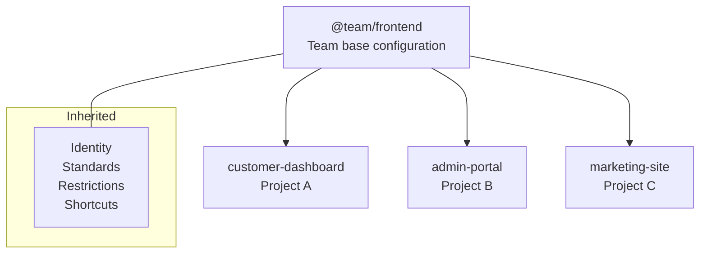

# Team Setup Example

Configuration for multiple projects sharing a team base.

## Project Structure

```
workspace/
├── registry/
│   └── @team/
│       └── frontend.prs          # Shared team config
├── project-a/
│   ├── .promptscript/
│   │   └── project.prs
│   ├── promptscript.yaml
│   └── ...
├── project-b/
│   ├── .promptscript/
│   │   └── project.prs
│   ├── promptscript.yaml
│   └── ...
└── project-c/
    └── ...
```

## Shared Configuration

### registry/@team/frontend.prs

```promptscript
@meta {
  id: "@team/frontend"
  syntax: "1.0.0"
  team: "Frontend"
}

@identity {
  """
  You are a frontend developer on the Frontend team.
  You build modern, accessible web applications.
  """
}

@context {
  """
  ## Tech Stack

  - React 18 with TypeScript
  - Vite for development and building
  - TailwindCSS for styling
  - React Query for server state
  - Vitest + Testing Library for tests

  ## Architecture

  - Feature-based folder structure
  - Shared component library (@company/ui)
  - API client generation from OpenAPI specs
  """
}

@standards {
  code: [
    "Use TypeScript for all code",
    "Prefer functional programming style",
    "Use functional components with hooks",
    "React Query for server state, Zustand for client state"
  ]

  testing: [
    "Use Vitest as test framework",
    "Maintain 80% code coverage",
    "Write unit and integration tests"
  ]

  accessibility: [
    "Follow WCAG 2.1 AA guidelines",
    "Accessibility testing required"
  ]
}

@restrictions {
  - "Never use class components"
  - "Never use any type without justification"
  - "Always handle loading and error states"
  - "Never hardcode API URLs"
}

@shortcuts {
  "/component": "Create a new React component with tests"
  "/hook": "Create a custom React hook"
  "/test": "Write tests using Vitest and Testing Library"
  "/a11y": "Review code for accessibility"
}
```

<!-- playground-link-start -->
<a href="https://getpromptscript.dev/playground/?s=N4IgZglgNgpgziAXAbVABwIYBcAWSQwAeGAtmrAHRoBOCANCAMYD2AdljO-gAIkxYYABMAA6rQYIgATRIJEhuHUgHow1Nh1ZT5YiXACe7DIVnyAjBQAMVneMFKSpkADF17TtpBiAvmLHdpTiwILH1hXTkvKIiATWYAV0EMahgkwTUND0EpGAA3GChmNBhqQTZ7HFTXTK17GFIKWITBACN46ClBEmYc6lY6JMZGeDgIFthBAHcYFqS0cghGbAg2OEa7HWjWX1Z-FndCLHCN6K87AGJzwQAVGEYcQQBlAUYAaz87AFpBACV6xiOZgAHFMQg9rvpio9GNQIGgsBFvgA1EKpMDMUo5fKFNB8dhJWptDoQVgAc0RNww0EmJKkAGFHo90hjBHBQlASeSvr9-kcAIrxEphdGlOAlfKigQcCkojhswQAahu8GCZMEABkxtRksKWXKsHAPhJLoIAILUe6ogHxFJGwTfZz1LA2mCfFoYMWddFQXqsrDUeLW23cx44ZIwTosMhsIKCDktbXUMIACm4UcwrH0ynaAEoKaaAAoASUEjA5sdJnBKy3KGRIggA8sVWIWS3BioxDSdNj4Ptw2RgtMkpHBjhIWDlZMgIhJ5ABVMU3SEwaGw+HM0oYKBQUs9GDyOgzyIFlJgErpeKsAErVhbwQ0Zik7UkEicv36WAHo-zxdgS-Xtg73TGN2FHGlcEEHBmGYV5DRAQ87FnEA-gwAFBAFIUN1ZcVzwHDgBgALXiAdahFUty3xPD9zOCQAF07X1Tkp2-EAF1SWUVSSUd9XSZ8YEmDF3ngliAFkqSMElBCBSwAFJdxyXcJQwSsv0QyIAHVYQ4QRLxCAlOhJDgnxrcR9TgiJ6N2OxUOGOBRhaaAQn0Zi1PkZxmG3ZhJkEdS6VNABxQQACYKDMM1TUEUl2hyDlWHgVSJCQ00hhGMZHNCOo2TfFIAEd2hSTwLN7KzuBSNlYQA1hR1Ebl5AAOTyc9iNSMsPVHYC4tA2wJG+erGtKZqCTCUJilBXAEiOAArYjgkgJZgjYbr7UiU0oEmDB9FHMMtAmQoMCkN9B06Ep1ElbB4po5a+olSDhwnVJW0EOcfnVcztj7OAoOoLBGHiA0x0iZQOqCeQnDpFJzrSOLvJQtDgfxcCHjMpb5GUKCYNByJwadVIhF+tlmHrWGjnRoSIlR-VMfkTTUUy-7iLfDj5SO5UsrVTUEx1FGQGUDAzDMfQqeQvIIH4+S0RZGzUocjlQlsbwQG8WiGCCJN8CIUhyBgKhaHgkAJVGNh8DMRWgA" target="_blank" rel="noopener noreferrer">
  
</a>
<!-- playground-link-end -->

## Project Configurations

### project-a/.promptscript/project.prs

```promptscript
@meta {
  id: "customer-dashboard"
  syntax: "1.0.0"
}

# In a multi-file setup, you would inherit from team:
@inherit @team/frontend

@context {
  project: "Customer Dashboard"
  repository: "github.com/company/customer-dashboard"

  """
  ## About

  Self-service dashboard for customers to manage their accounts,
  view orders, and track shipments.

  ## Key Features

  - Account settings and preferences
  - Order history and tracking
  - Support ticket management
  - Notification preferences
  """
}

@knowledge {
  """
  ## API Endpoints

  Base URL: https://api.company.com/v1

  ### Account
  - GET /account - Get account details
  - PUT /account - Update account

  ### Orders
  - GET /orders - List orders
  - GET /orders/:id - Get order details

  ### Support
  - GET /tickets - List tickets
  - POST /tickets - Create ticket
  """
}

@shortcuts {
  "/order": "Help with order-related functionality"
  "/account": "Help with account management"
}
```

<!-- playground-link-start -->
<a href="https://getpromptscript.dev/playground/?s=N4IgZglgNgpgziAXAbVABwIYBcAWSQwAeGAtmrAHRoBOCANCAMYD2AdljO-gAIkxYYABMAA6rQYIgATRIJFMArnCzM+1ALRSMcHACNmGalPliJcAJ7sMhWfICMFAAxOTrAL5ixAYkEBJcUIkClBYEOqQsIJw-ApodILmzAqCAO5JUFKSrDgw1BBYgmDUqoIcpIjegtwQ2bn5VWUkAPRFbBysmYI+ABTUMADmEMrU5oLqglJDGLqwmWDM1ILkGOb9xQodAJRi3CzsRAWi4kvFAFYwjFi2IADCSipqggAi2noGRq4SfWjMcPkL5mug1wCl0FBYzQhmFY5iajHuqlymle+kMxhAnmOJgxGOOXh8AEF9AosJiJABlGBQMDqaLUABuEEYMAmKPecwWgnhykRtFKzEEJAwrAw-RZuBgEEWGEYLA2WDgdFMgkZMBSggWUlyisEwsyWGoMoA1lEcBA0Hx2HAKGSuj4ANIwUYAMRg2AUfTgtvGBNlSXYUX4oVY-Tguo6JxgYFynGZXuO4wA8kZcoIzTyRuH9YbGEaav1leNybEftQCqFc-xBcLRTBLaSE4IAHLMUKQRjYCBsSPRvqsOPK7GuDysHZG1jMFKzMXCQc4z52wQEgAKvkEAFEOj8agrbQAhbQsgCqACUADKyHBYLBoOCIJpNDBoCDg1TQ8yv5r0uy2-GEv3yoWggAOLrgAKoIj4AQG4zAVWMpygGWoCNA8YSOMy5HhBUGIQU4xHmgWgcLq0ENsqf6CMmWq0EBoHYZq2pjIIZ5DAUDE0Y2dGQexcBNIg0hMXBbEposyEYKhv74oIxZoKWDboSB4GQRWRr8GG4wscopRMqpu6NsuibkthKlqUxNx9Ng4o6fwc5Du4mLcDoCxYPCCqzliIBNOx8jXAAElSaCpPkOAaiJ6h9FAllzBslxdiKUD5OYC7yDh-qkkgcggP5UCBSkwUkbh1YimK9bDiAbgALoMJwBrmPgRCkOQMBULQIAMPS2pxfgdjlUAA" target="_blank" rel="noopener noreferrer">
  
</a>
<!-- playground-link-end -->

### project-a/promptscript.yaml

```yaml
input:
  entry: .promptscript/project.prs

registry:
  path: ../registry

targets:
  github:
    enabled: true
    output: .github/copilot-instructions.md
  claude:
    enabled: true
    output: CLAUDE.md
  cursor:
    enabled: true
    output: .cursorrules

validation:
  strict: true
```

### project-b/.promptscript/project.prs

```promptscript
@meta {
  id: "admin-portal"
  syntax: "1.0.0"
}

# In a multi-file setup, you would inherit from team:
@inherit @team/frontend

@context {
  project: "Admin Portal"
  repository: "github.com/company/admin-portal"

  """
  ## About

  Internal admin portal for managing customers, orders,
  and system configuration.

  ## Key Features

  - Customer management
  - Order processing
  - System configuration
  - Analytics dashboard
  """
}

@extend standards {
  security: {
    authentication: "SSO required"
    authorization: "Role-based (admin, support, viewer)"
    auditLogging: required
  }
}

@restrictions {
  - "Always check user permissions before actions"
  - "Log all admin actions for audit"
}

@shortcuts {
  "/admin": "Help with admin functionality"
  "/report": "Generate reports"
}
```

<!-- playground-link-start -->
<a href="https://getpromptscript.dev/playground/?s=N4IgZglgNgpgziAXAbVABwIYBcAWSQwAeGAtmrAHRoBOCANCAMYD2AdljO-gAIkxYYABMAA6rQYIgATRIJEgMUkhFYBaNM2oCo8sRLgBPdhkKz5ARgoAGa7tYBfMWIDEggJLihJAK5QsEVUhYQTh+bzQ6QQNmb0EAdxioKUlWHBhqCCxBMGpmEkEOUkQXQW4VNIys7kKSAHoctg5WZMFXAApqGABzCDgsagNBVUEpXowAI1hksE1BcgwDLtzvZoBKMW4WdiIs0XE53IArGEYsMxAAQSUVQQAFTW07CU6NOEzNA3Oe3G9xihY6gDMKwDLVFMo1BotBgdCAnPtdHC4ftnK4LuMYlh4RIPBxqKwYYJwTcodpsrMSBgCT1WF1BIxvH08uk4JFNFIWXQ9ETmiEDH0YPktpAut5qNgIGwKNjWq4ANIwQYAMRg2DF8BlwwAwoysMzqIJKdTBZwsfthgB5agcg00ZiMeBvWnc4YAZX5HCFbBFYolbBdgguBKgBn8jDgIwwcBwGIw1u5iLsjlYGx2nGSfSpUjjUgje30JzFmU+wm5Egw3lwpogjD9rHOrtdFsEnQAjt4IJ0pE8JETKzhNBAAF5184AJWYsFU4yjMGSbWJrEicHCpMiADcIDA4ul1sje33RlgADLMLo0rqyNsdrvc5PJjadPoZU6S1h5gPyC5QOILCOMNJGAAa0ERl0jmdJlDgN42AjcYYBmToiVfWCe2GeRTzpGEoCJa5PBQ99yQNCsjyTeFuGjB4GSwD8ERAME8Pkc4AAkYCgNB4kyHBcIhbIVgImFix7eRaheB4mLkEAAHFOHSbAYBbGBSTgJMQHsABdBhTQGfAiFIcgYCoWgQAYdcWTffBzDUoA" target="_blank" rel="noopener noreferrer">
  
</a>
<!-- playground-link-end -->

### project-b/promptscript.yaml

```yaml
input:
  entry: .promptscript/project.prs

registry:
  path: ../registry

targets:
  github:
    enabled: true
  claude:
    enabled: true
  cursor:
    enabled: true
```

## Inheritance Visualization



## Usage

### Compile All Projects

From each project directory:

```bash
cd project-a && prs compile
cd ../project-b && prs compile
```

Or use a script:

```bash
#!/bin/bash
for dir in project-*/; do
  echo "Compiling $dir..."
  (cd "$dir" && prs compile)
done
```

### Validate

```bash
prs validate --strict
```

### Update Team Config

When you update `@team/frontend`:

1. Update version in `@meta`
2. Notify team members
3. Each project recompiles to get updates

## CI/CD Integration

### GitHub Actions

```yaml
# .github/workflows/promptscript.yml
name: PromptScript CI

on:
  push:
    paths:
      - '.promptscript/**'
      - 'promptscript.yaml'

jobs:
  validate:
    runs-on: ubuntu-latest
    steps:
      - uses: actions/checkout@v4

      - name: Checkout registry
        uses: actions/checkout@v4
        with:
          repository: company/promptscript-registry
          path: registry

      - uses: actions/setup-node@v4
        with:
          node-version: '20'

      - name: Install PromptScript
        run: npm install -g @promptscript/cli

      - name: Validate
        run: prs validate --strict

      - name: Check compiled files
        run: |
          prs compile
          git diff --exit-code
```

## Best Practices

### Team Config

1. Keep team config focused on shared patterns
2. Don't include project-specific details
3. Version and changelog team updates
4. Document breaking changes

### Project Config

1. Override only what's needed
2. Add project-specific context
3. Include relevant API documentation
4. Keep shortcuts relevant to the project

### Registry Management

1. Use a separate repository for the registry
2. Review changes before merging
3. Tag releases for version tracking
4. Communicate updates to team

## Next Steps

- [Enterprise Setup](enterprise.md) - Organization-wide deployment
- [Inheritance Guide](../guides/inheritance.md) - Advanced patterns
