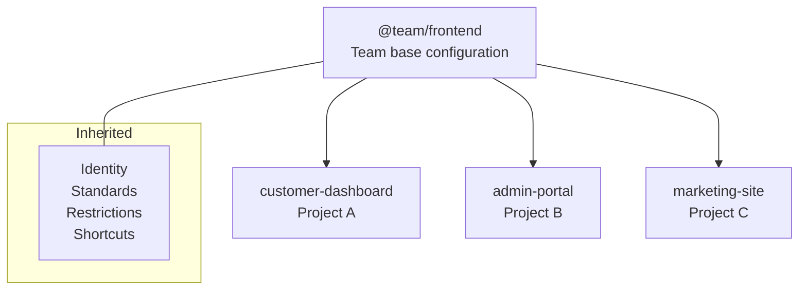

# Team Setup Example

Configuration for multiple projects sharing a team base.

## Project Structure

```
workspace/
├── registry/
│   └── @team/
│       └── frontend.prs          # Shared team config
├── project-a/
│   ├── .promptscript/
│   │   └── project.prs
│   ├── promptscript.yaml
│   └── ...
├── project-b/
│   ├── .promptscript/
│   │   └── project.prs
│   ├── promptscript.yaml
│   └── ...
└── project-c/
    └── ...
```

## Shared Configuration

### registry/@team/frontend.prs

```promptscript
@meta {
  id: "@team/frontend"
  syntax: "1.0.0"
  team: "Frontend"
}

@identity {
  """
  You are a frontend developer on the Frontend team.
  You build modern, accessible web applications.
  """
}

@context {
  """
  ## Tech Stack

  - React 18 with TypeScript
  - Vite for development and building
  - TailwindCSS for styling
  - React Query for server state
  - Vitest + Testing Library for tests

  ## Architecture

  - Feature-based folder structure
  - Shared component library (@company/ui)
  - API client generation from OpenAPI specs
  """
}

@standards {
  code: {
    language: "TypeScript"
    style: "functional"
    components: "functional with hooks"
    stateManagement: "React Query for server, Zustand for client"
  }

  testing: {
    framework: "Vitest"
    coverage: 80
    patterns: ["unit", "integration"]
  }

  accessibility: {
    wcag: "2.1 AA"
    testing: "required"
  }
}

@restrictions {
  - "Never use class components"
  - "Never use any type without justification"
  - "Always handle loading and error states"
  - "Never hardcode API URLs"
}

@shortcuts {
  "/component": "Create a new React component with tests"
  "/hook": "Create a custom React hook"
  "/test": "Write tests using Vitest and Testing Library"
  "/a11y": "Review code for accessibility"
}
```

## Project Configurations

### project-a/.promptscript/project.prs

```promptscript
@meta {
  id: "customer-dashboard"
  syntax: "1.0.0"
}

@inherit @team/frontend

@context {
  project: "Customer Dashboard"
  repository: "github.com/company/customer-dashboard"

  """
  ## About

  Self-service dashboard for customers to manage their accounts,
  view orders, and track shipments.

  ## Key Features

  - Account settings and preferences
  - Order history and tracking
  - Support ticket management
  - Notification preferences
  """
}

@knowledge {
  """
  ## API Endpoints

  Base URL: https://api.company.com/v1

  ### Account
  - GET /account - Get account details
  - PUT /account - Update account

  ### Orders
  - GET /orders - List orders
  - GET /orders/:id - Get order details

  ### Support
  - GET /tickets - List tickets
  - POST /tickets - Create ticket
  """
}

@shortcuts {
  "/order": "Help with order-related functionality"
  "/account": "Help with account management"
}
```

### project-a/promptscript.yaml

```yaml
input:
  entry: .promptscript/project.prs

registry:
  path: ../registry

targets:
  github:
    enabled: true
    output: .github/copilot-instructions.md
  claude:
    enabled: true
    output: CLAUDE.md
  cursor:
    enabled: true
    output: .cursorrules

validation:
  strict: true
```

### project-b/.promptscript/project.prs

```promptscript
@meta {
  id: "admin-portal"
  syntax: "1.0.0"
}

@inherit @team/frontend

@context {
  project: "Admin Portal"
  repository: "github.com/company/admin-portal"

  """
  ## About

  Internal admin portal for managing customers, orders,
  and system configuration.

  ## Key Features

  - Customer management
  - Order processing
  - System configuration
  - Analytics dashboard
  """
}

@extend standards {
  security: {
    authentication: "SSO required"
    authorization: "Role-based (admin, support, viewer)"
    auditLogging: required
  }
}

@restrictions {
  - "Always check user permissions before actions"
  - "Log all admin actions for audit"
}

@shortcuts {
  "/admin": "Help with admin functionality"
  "/report": "Generate reports"
}
```

### project-b/promptscript.yaml

```yaml
input:
  entry: .promptscript/project.prs

registry:
  path: ../registry

targets:
  github:
    enabled: true
  claude:
    enabled: true
  cursor:
    enabled: true
```

## Inheritance Visualization



## Usage

### Compile All Projects

From each project directory:

```bash
cd project-a && prs compile --all
cd ../project-b && prs compile --all
```

Or use a script:

```bash
#!/bin/bash
for dir in project-*/; do
  echo "Compiling $dir..."
  (cd "$dir" && prs compile --all)
done
```

### Validate

```bash
prs validate --strict
```

### Update Team Config

When you update `@team/frontend`:

1. Update version in `@meta`
2. Notify team members
3. Each project recompiles to get updates

## CI/CD Integration

### GitHub Actions

```yaml
# .github/workflows/promptscript.yml
name: PromptScript CI

on:
  push:
    paths:
      - '.promptscript/**'
      - 'promptscript.yaml'

jobs:
  validate:
    runs-on: ubuntu-latest
    steps:
      - uses: actions/checkout@v4

      - name: Checkout registry
        uses: actions/checkout@v4
        with:
          repository: company/promptscript-registry
          path: registry

      - uses: actions/setup-node@v4
        with:
          node-version: '20'

      - name: Install PromptScript
        run: npm install -g @promptscript/cli

      - name: Validate
        run: prs validate --strict

      - name: Check compiled files
        run: |
          prs compile --all
          git diff --exit-code
```

## Best Practices

### Team Config

1. Keep team config focused on shared patterns
2. Don't include project-specific details
3. Version and changelog team updates
4. Document breaking changes

### Project Config

1. Override only what's needed
2. Add project-specific context
3. Include relevant API documentation
4. Keep shortcuts relevant to the project

### Registry Management

1. Use a separate repository for the registry
2. Review changes before merging
3. Tag releases for version tracking
4. Communicate updates to team

## Next Steps

- [Enterprise Setup](enterprise.md) - Organization-wide deployment
- [Inheritance Guide](../guides/inheritance.md) - Advanced patterns
