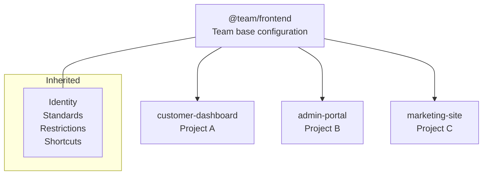

# Team Setup Example

Configuration for multiple projects sharing a team base.

## Project Structure

```
workspace/
├── registry/
│   └── @team/
│       └── frontend.prs          # Shared team config
├── project-a/
│   ├── .promptscript/
│   │   └── project.prs
│   ├── promptscript.yaml
│   └── ...
├── project-b/
│   ├── .promptscript/
│   │   └── project.prs
│   ├── promptscript.yaml
│   └── ...
└── project-c/            # Not yet initialized - no promptscript.yaml
    └── ...
```

## Shared Configuration

### registry/@team/frontend.prs

```promptscript
@meta {
  id: "@team/frontend"
  syntax: "1.0.0"
  team: "Frontend"
}

@identity {
  """
  You are a frontend developer on the Frontend team.
  You build modern, accessible web applications.
  """
}

@context {
  """
  ## Tech Stack

  - React 18 with TypeScript
  - Vite for development and building
  - TailwindCSS for styling
  - React Query for server state
  - Vitest + Testing Library for tests

  ## Architecture

  - Feature-based folder structure
  - Shared component library (@company/ui)
  - API client generation from OpenAPI specs
  """
}

@standards {
  code: [
    "Use TypeScript for all code",
    "Prefer functional programming style",
    "Use functional components with hooks",
    "React Query for server state, Zustand for client state"
  ]

  testing: [
    "Use Vitest as test framework",
    "Maintain 80% code coverage",
    "Write unit and integration tests"
  ]

  accessibility: [
    "Follow WCAG 2.1 AA guidelines",
    "Accessibility testing required"
  ]
}

@restrictions {
  - "Never use class components"
  - "Never use any type without justification"
  - "Always handle loading and error states"
  - "Never hardcode API URLs"
}

@shortcuts {
  "/component": "Create a new React component with tests"
  "/hook": "Create a custom React hook"
  "/test": "Write tests using Vitest and Testing Library"
  "/a11y": "Review code for accessibility"
}
```

<!-- playground-link-start -->
<a href="https://getpromptscript.dev/playground/?s=N4IgZglgNgpgziAXAbVABwIYBcAWSQwAeGAtmrAHRoBOCANCAMYD2AdljO-gAIkxYYABMAA6rQYIgATRIJEhuHUgHow1Nh1ZT5YiXACe7DIVnyAjBQAMVneMFKSpkADF17TtpBiAvmLHdpTiwILH1hXTkvKIiATWYAV0EMahgkwTUND0EpGAA3GChmNBhqQTZ7HFTXTK17GFIKWITBACN46ClBEmYc6lY6JMZGeDgIFthBAHcYFqS0cghGbAg2OEa7HWjWX1Z-FndCLHCN6K87AGJzwQAVGEYcQQBlAUYAaz87AFpBACV6xiOZgAHFMQg9rvpio9GNQIGgsBFvgA1EKpMDMUo5fKFNB8dhJWptDoQVgAc0RNww0EmJKkAGFHo90hjBHBQlASeSvr9-kcAIrxEphdGlOAlfKigQcCkojhswQAahu8GCZMEABkxtRksKWXKsHAPhJLoIAILUe6ogHxFJGwTfZz1LA2mCfFoYMWddFQXqsrDUeLW23cx44ZIwTosMhsIKCDktbXUMIACm4UcwrH0ynaAEoKaaAAoASUEjA5sdJnBKy3KGRIggA8sVWIWS3BioxDSdNj4Ptw2RgtMkpHBjhIWDlZMgIhJ5ABVMU3SEwaGw+HM0oYKBQUs9GDyOgzyIFlJgErpeKsAErVhbwQ0Zik7UkEicv36WAHo-zxdgS-Xtg73TGN2FHGlcEEHBmGYV5DRAQ87FnEA-gwAFBAFIUN1ZcVzwHDgBgALXiAdahFUty3xPD9zOCQAF07X1Tkp2-EAF1SWUVSSUd9XSZ8YEmDF3ngliAFkqSMElBCBSwAFJdxyXcJQwSsv0QyIAHVYQ4QRLxCAlOhJDgnxrcR9TgiJ6N2OxUOGOBRhaaAQn0Zi1PkZxmG3ZhJkEdS6VNABxQQACYKDMM1TUEUl2hyDlWHgVSJCQ00hhGMZHNCOo2TfFIAEd2hSTwLN7KzuBSNlYQA1hR1Ebl5AAOTyc9iNSMsPVHYC4tA2wJG+erGtKZqCTCUJilBXAEiOAArYjgkgJZgjYbr7UiU0oEmDB9FHMMtAmQoMCkN9B06Ep1ElbB4po5a+olSDhwnVJW0EOcfnVcztj7OAoOoLBGHiA0x0iZQOqCeQnDpFJzrSOLvJQtDgfxcCHjMpb5GUKCYNByJwadVIhF+tlmHrWGjnRoSIlR-VMfkTTUUy-7iLfDj5SO5UsrVTUEx1FGQGUDAzDMfQqeQvIIH4+S0RZGzUocjlQlsbwQG8WiGCCJN8CIUhyBgKhaHgkAJVGNh8DMRWgA" target="_blank" rel="noopener noreferrer">
  
</a>
<!-- playground-link-end -->

## Project Configurations

### project-a/.promptscript/project.prs

```promptscript
@meta {
  id: "customer-dashboard"
  syntax: "1.5.0"
}

# In a multi-file setup, you would inherit from team:
@inherit @team/frontend

@context {
  project: "Customer Dashboard"
  repository: "github.com/company/customer-dashboard"

  """
  ## About

  Self-service dashboard for customers to manage their accounts,
  view orders, and track shipments.

  ## Key Features

  - Account settings and preferences
  - Order history and tracking
  - Support ticket management
  - Notification preferences
  """
}

@knowledge {
  """
  ## API Endpoints

  Base URL: https://api.company.com/v1

  ### Account
  - GET /account - Get account details
  - PUT /account - Update account

  ### Orders
  - GET /orders - List orders
  - GET /orders/:id - Get order details

  ### Support
  - GET /tickets - List tickets
  - POST /tickets - Create ticket
  """
}

@shortcuts {
  "/order": "Help with order-related functionality"
  "/account": "Help with account management"
}
```

<!-- playground-link-start -->
<a href="https://getpromptscript.dev/playground/?s=N4IgZglgNgpgziAXAbVABwIYBcAWSQwAeGAtmrAHRoBOCANCAMYD2AdljO-gAIkxYYABMAA6rQYIgATRIJFMArnCzM+1ALRSMcHACNmGalPliJcAJ7sMhWfICMFAKwUADCdYBfMWIDEggJLiQiQKUFgQ6pCwgnD8Cmh0gubMCoIA7ilQUpKsODDUEFiCYNSqghykiL6C3BC5+YU1FSQA9CVsHKzZgn4AFNQwAOYQytTmguqCUiMYurDZYMzUguQY5oOlCl0AlGLcLOxERaLiK6UAVjCMWLYgAMJKKmqCACLaegZG7hIDaMxwhSW5luw1wCl0FBYrShmFY5hajEeqnymne+kMxhA3lOJixWNOPj8AEF9AosNiJABlGBQMDqWLUABuEEYMCmaM+CyWgkRymRtHKzEEJAwrAwgzZuBgEGWGEYLC2WDgdFMgmZMDSgiWUnyysEouyWGocoA1jEcBA0Hx2HAKBSen4ANIwcYAMRg2AUAzg9smRPlKXYMX44VYgzg+q6ZxgYHynFZPtOkwA8kZ8oILXyxpHDcbGCa6oNVZNKfE-tQiuF8-xhaLxTBreSk4IAHLMcKQRjYCBsaOxgasBOq3HuLysPYm1jMNLzCXCYd474OwREgAK-kEAFEun86kr7QAhbRsgCqACUADKyHBYLBoOCIFotDBoCCQ1Sw8zv1qMuz2wnEgGirFoIADim4ACqCM+QFBpMoE1nKCpBjqAjQImEiTKuJ5QTByFFJMJ5oFoHD6rBTaqgBgipjqtAgeBuHarqEyCBeIxFExdHNgx0GcXALSINILEIRxabLKhGDof+hKCKWaDlk2mFgZB0FVia-ARpMbHKOULLqfuzarsmlK4WpGksXcAzYJKen8AuI6eNi3A6EsWCIkq844iALScfItwABI0mg6SFDgWpieoAxQNZCxbNcPZilAhTmEu8h4YG5JIHIICBVAwVpKFZH4bWYoSo2o4gB4AC6DCcEa5j4EQpDkDAVC0CADCMrqCX4HYlVAA" target="_blank" rel="noopener noreferrer">
  
</a>
<!-- playground-link-end -->

### project-a/promptscript.yaml

```yaml
id: customer-dashboard
syntax: '1.5.0'

input:
  entry: .promptscript/project.prs

registry:
  path: ../registry

targets:
  - github:
      output: .github/copilot-instructions.md
  - claude:
      output: CLAUDE.md
  - cursor:
      output: .cursor/rules/project.mdc
```

### project-b/.promptscript/project.prs

```promptscript
@meta {
  id: "admin-portal"
  syntax: "1.5.0"
}

# In a multi-file setup, you would inherit from team:
@inherit @team/frontend

@context {
  project: "Admin Portal"
  repository: "github.com/company/admin-portal"

  """
  ## About

  Internal admin portal for managing customers, orders,
  and system configuration.

  ## Key Features

  - Customer management
  - Order processing
  - System configuration
  - Analytics dashboard
  """
}

@extend standards {
  security: {
    authentication: "SSO required"
    authorization: "Role-based (admin, support, viewer)"
    auditLogging: required
  }
}

@restrictions {
  - "Always check user permissions before actions"
  - "Log all admin actions for audit"
}

@shortcuts {
  "/admin": "Help with admin functionality"
  "/report": "Generate reports"
}
```

<!-- playground-link-start -->
<a href="https://getpromptscript.dev/playground/?s=N4IgZglgNgpgziAXAbVABwIYBcAWSQwAeGAtmrAHRoBOCANCAMYD2AdljO-gAIkxYYABMAA6rQYIgATRIJEgMUkhFYBaNM2oCo8sRLgBPdhkKz5ARgoBWCgAZdrAL5ixAYkEBJcUJIBXKFgQqpCwgnD8vmh0ggbMvoIA7nFQUpKsODDUEFiCYNTMJIIcpIhugtwqGVk53MUkAPR5bBysqYLuABTUMADmEHBY1AaCqoJS-RgARrCpYJqC5BgGPfm+rQCUYtws7EQ5ouIL+QBWMIxYZiAAgkoqggAKmtoOEt0acNmaBpd9uL6TFBYDSBmFYBnqimUag0WgwOhALkOugRCMOrncV0mcSwiIkXg41FYcMEkLuMO0uXmJAwRL6rB6gkYvgGBUycGimikbLoehJrTCBgGMEKO0gPV81GwEDYFFx7XcAGkYMMAGIwbAS+By0YAYWZWFZ1EE1Npws4OMOowA8tQuUaaMxGPAPvTeaMAMqCjgithiiVSthuwRXIlQAyBRhwMYYOA4LEYW285EOZysLZ7TipAY0qQJqRRg76M4S7LfYS8iQYXy4c0QRgB1iXd3uq2CboAR18EG6UheEhJ1ZwmggAC8G5cAErMWCqSYxmCpDqk1jROCRcnRABuEBgCUym1R-YH4ywABlmD06T1ZB2uz3eanU1tugMsudpawC0H5FcoAkllGjAZIwADWgjMpkCyZMocAfGwUaTDAczdCS77wX2ozyOeDJwlAJK3N4aGfpSRpVieKaItwsZPEyWBfkiIAQgR8iXAAEjAUBoIk2Q4PhUK5GsRFwqWfbyPUbxPCxcggAA4pwmTYDAbYwOScApiAjgALoMOaQz4EQpDkDAVC0CADCbmyH74OYGlAA" target="_blank" rel="noopener noreferrer">
  
</a>
<!-- playground-link-end -->

### project-b/promptscript.yaml

```yaml
id: admin-portal
syntax: '1.5.0'

input:
  entry: .promptscript/project.prs

registry:
  path: ../registry

targets:
  - github
  - claude
  - cursor
```

## Inheritance Visualization


```mermaid
flowchart TD
    A["@team/frontend<br/>Team base configuration"] --> B["customer-dashboard<br/>Project A"]
    A --> C["admin-portal<br/>Project B"]
    A --> D["marketing-site<br/>Project C"]

    subgraph "Inherited"
        E["Identity<br/>Standards<br/>Restrictions<br/>Shortcuts"]
    end

    A --- E
```

## Usage

### Compile All Projects

From each project directory:

```bash
cd project-a && prs compile
cd ../project-b && prs compile
```

Or use a script. It skips directories that are not yet initialized, so a new
`project-c/` without a `promptscript.yaml` does not break the loop:

```bash
#!/bin/bash
for dir in project-*/; do
  if [ ! -f "$dir/promptscript.yaml" ]; then
    echo "Skipping $dir (no promptscript.yaml)"
    continue
  fi
  echo "Validating and compiling $dir..."
  (cd "$dir" && prs validate --strict && prs compile)
done
```

### Validate

Validation runs per project, because each project owns its own
`promptscript.yaml` and `promptscript.lock`:

```bash
cd project-a && prs validate --strict
cd ../project-b && prs validate --strict
```

### Update Team Config

When you update `@team/frontend`:

1. Tag the registry change (for example `v1.2.0`) and review it like any other code
2. Notify team members
3. Each project recompiles to get updates

## CI/CD Integration

### GitHub Actions

Each project owns its own `promptscript.yaml`, so CI runs per project. Path filters keep jobs
scoped, and `working-directory` points each job at its project:

```yaml
# .github/workflows/promptscript.yml
name: PromptScript CI

on:
  push:
    paths:
      - 'project-*/.promptscript/**'
      - 'project-*/promptscript.yaml'
      - 'project-*/promptscript.lock'
      - 'registry/**'

jobs:
  validate:
    runs-on: ubuntu-latest
    strategy:
      matrix:
        project: [project-a, project-b]
    steps:
      - uses: actions/checkout@v4

      - name: Checkout registry
        uses: actions/checkout@v4
        with:
          repository: company/promptscript-registry
          path: registry

      - uses: actions/setup-node@v4
        with:
          node-version: '20'

      - name: Install PromptScript
        run: npm install -g @promptscript/cli

      - name: Validate
        working-directory: ${{ matrix.project }}
        run: prs validate --strict

      - name: Check compiled files
        working-directory: ${{ matrix.project }}
        run: |
          prs compile
          git diff --exit-code
```

## Best Practices

### Team Config

1. Keep team config focused on shared patterns
2. Don't include project-specific details
3. Version and changelog team updates
4. Document breaking changes

### Project Config

1. Override only what's needed
2. Add project-specific context
3. Include relevant API documentation
4. Keep shortcuts relevant to the project

### Registry Management

1. Use a separate repository for the registry
2. Review changes before merging
3. Tag releases for version tracking
4. Communicate updates to team

## Next Steps

- [Enterprise Setup](enterprise.md) - Organization-wide deployment
- [Inheritance Guide](../guides/inheritance.md) - Advanced patterns
