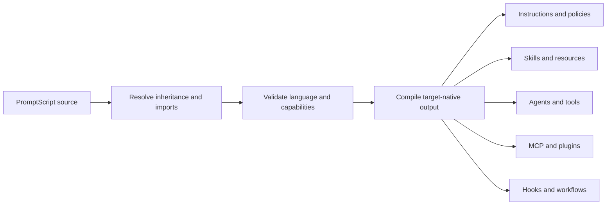

# Agent Platform

PromptScript is an agent platform configuration language. A single `.prs` source defines the
instructions, capabilities, integrations, and automation used by AI coding agents across a
repository or organization.

The compiler translates that source into native files for 48 built-in targets. Each target receives
the formats and capabilities it supports, such as instruction files, native skills, custom agents,
MCP configuration, lifecycle hooks, workflows, and plugins.

## Platform Model



| Platform capability     | PromptScript source                                               | Result                                                   |
| ----------------------- | ----------------------------------------------------------------- | -------------------------------------------------------- |
| Instructions and policy | `@identity`, `@context`, `@standards`, `@restrictions`, `@guards` | Native instruction and scoped rule files                 |
| Reusable capabilities   | `@skills`                                                         | Native skills, bundled resources, scripts, and contracts |
| Delegated specialists   | `@agents`                                                         | Native subagent or custom-agent definitions              |
| User commands           | `@shortcuts`                                                      | Native prompts, commands, or documented shortcuts        |
| Tool integrations       | `@mcpServers`                                                     | Target-native MCP server configuration                   |
| Capability bundles      | `@plugins`                                                        | Target-native plugin manifests where supported           |
| Lifecycle automation    | `@hooks`                                                          | Target-native hook configuration                         |
| Repeatable procedures   | `@workflows`                                                      | Native workflow files where supported                    |
| Multi-package delivery  | `builds` in `promptscript.yaml`                                   | Scoped output for packages and applications              |

## Complete Platform Definition

```promptscript
@meta {
  id: "checkout-service"
  syntax: "1.4.0"
  tags: ["payments", "typescript"]
}

@identity {
  """
  You are working on a payment service.
  Preserve transaction integrity and auditability.
  """
}

@standards {
  code: ["Use strict TypeScript", "Write tests for business rules"]
}

@skills {
  security-review: {
    description: "Review payment changes for security risks"
    allowedTools: ["Read", "Grep", "Bash"]
    content: "Inspect authentication, authorization, secrets, and payment data handling."
  }
}

@mcpServers {
  issue-tracker: {
    transport: "stdio"
    command: ["node", "./tools/issues.mjs"]
  }
}

@agents {
  reviewer: {
    description: "Review changes before merge"
    tools: ["Read", "Grep", "Glob", "Bash"]
    skills: ["security-review"]
    mcpServers: ["issue-tracker"]
    content: "Review changed code, tests, and operational impact."
  }
}

@hooks {
  validate-changes: {
    event: "post-tool-use"
    matcher: "Edit|Write"
    command: ["pnpm", "run", "typecheck"]
  }
}

@workflows {
  release: {
    description: "Validate and prepare a release"
    content: "Run quality gates, summarize changes, and prepare release metadata."
  }
}

@plugins {
  payment-engineering: {
    description: "Payment engineering capability bundle"
    version: "1.0.0"
    skills: ["security-review"]
    hooks: ["validate-changes"]
    mcpServers: ["issue-tracker"]
  }
}
```

Target support varies because each AI platform exposes a different native contract. PromptScript
preserves one source model while formatters map supported capabilities to target-native output.
Use the [target platform matrix](target-platforms.md) to choose versions and capabilities.

## Explore Features

- [Agents](agents.md) - specialized subagents, models, tools, skills, and MCP access
- [Skills and Resources](skills.md) - portable capability packages with references and scripts
- [MCP and Plugins](integrations.md) - tool servers and reusable capability bundles
- [Hooks and Workflows](automation.md) - lifecycle automation and repeatable procedures
- [Target Platforms](target-platforms.md) - 48 built-in targets and output families

## Compile One or Many Projects

Compile configured targets:

```bash
prs compile
```

Use named builds to generate scoped agent configuration for monorepo packages:

```yaml
builds:
  api:
    entry: .promptscript/packages/api.prs
    output: packages/api
    targets:
      - factory
      - codex
  web:
    entry: .promptscript/packages/web.prs
    output: packages/web
    targets:
      - cursor:
          version: full
```

```bash
prs compile --all-builds
```

## Enterprise Control Plane

PromptScript applies the same lifecycle to every agent capability:

1. Store source in Git.
2. Resolve organization, team, and project layers.
3. Validate syntax, references, policies, and target options.
4. Compile deterministic target-native output.
5. Review generated changes in pull requests.
6. Enforce `prs validate --strict` and compilation checks in CI.

See [Enterprise Setup](../guides/enterprise.md), [Security](../guides/security.md), and
[Policy Engine](../guides/policy-engine.md).
