# CI/CD Integration

PromptScript creates infrastructure-as-code for your AI prompts. Like any code, it should be validated and tested in your Continuous Integration (CI) pipeline.

## Overview

Integrating PromptScript into CI/CD provides:

- **Syntax Validation** - Catch `.prs` file errors before merge
- **Drift Detection** - Ensure compiled outputs are up-to-date
- **Registry Sync** - Validate against latest registry standards
- **Change Tracking** - Only run on relevant file changes

```mermaid
flowchart LR
    subgraph CI["CI Pipeline"]
        checkout["Checkout"]
        install["Install CLI"]
        validate["prs validate"]
        compile["prs compile"]
        diff["Check Drift"]
    end

    checkout --> install --> validate --> compile --> diff

    validate -->|"Errors"| fail["❌ Fail"]
    diff -->|"Uncommitted changes"| fail
    diff -->|"All synced"| pass["✅ Pass"]
```



## Key Commands for CI

| Command                      | Purpose                       | Exit Code                                    |
| ---------------------------- | ----------------------------- | -------------------------------------------- |
| `prs validate`               | Validate syntax and structure | 0=pass, 1=error, 2=warning (with `--strict`) |
| `prs validate --strict`      | Treat warnings as errors      | 0=pass, 1=error, 2=warning                   |
| `prs validate --format json` | JSON output for parsing       | Same as above                                |
| `prs compile`                | Compile to all targets        | 0=success, 1=error                           |
| `prs compile --dry-run`      | Preview without writing       | 0=success, 1=error                           |
| `prs check`                  | Check config and dependencies | 0=healthy, 1=issues                          |
| `prs diff --all`             | Show uncommitted changes      | Always 0                                     |

## GitHub Actions

### Basic Validation

Create `.github/workflows/promptscript.yml`:

```yaml
name: PromptScript

on:
  push:
    branches: [main]
  pull_request:
    branches: [main]

jobs:
  validate:
    runs-on: ubuntu-latest
    steps:
      - uses: actions/checkout@v4

      - name: Setup Node.js
        uses: actions/setup-node@v4
        with:
          node-version: '20'

      - name: Install PromptScript CLI
        run: npm install -g @promptscript/cli

      - name: Validate PromptScript files
        run: prs validate --strict

      - name: Compile and verify
        run: prs compile
```

### Drift Detection

Ensure compiled files are always in sync with source `.prs` files:

```yaml
name: PromptScript Drift Detection

on:
  push:
    paths:
      - '.promptscript/**'
      - 'promptscript.yaml'
  pull_request:
    paths:
      - '.promptscript/**'
      - 'promptscript.yaml'

jobs:
  check-drift:
    runs-on: ubuntu-latest
    steps:
      - uses: actions/checkout@v4

      - uses: actions/setup-node@v4
        with:
          node-version: '20'

      - name: Install PromptScript CLI
        run: npm install -g @promptscript/cli

      - name: Validate
        run: prs validate --strict

      - name: Compile
        run: prs compile

      - name: Check for drift
        run: |
          if ! git diff --quiet; then
            echo "::error::Compiled files are out of sync with source."
            echo "::error::Run 'prs compile' locally and commit the changes."
            git diff --stat
            exit 1
          fi
          echo "✅ All compiled files are in sync"
```

### With Private Registry

For projects using a private Git registry:

```yaml
name: PromptScript with Registry

on:
  push:
    branches: [main]
  pull_request:

jobs:
  validate:
    runs-on: ubuntu-latest
    steps:
      - uses: actions/checkout@v4

      - uses: actions/setup-node@v4
        with:
          node-version: '20'

      - name: Install PromptScript CLI
        run: npm install -g @promptscript/cli

      - name: Pull registry
        run: prs pull
        env:
          GITHUB_TOKEN: ${{ secrets.REGISTRY_TOKEN }}

      - name: Validate
        run: prs validate --strict
        env:
          GITHUB_TOKEN: ${{ secrets.REGISTRY_TOKEN }}

      - name: Compile
        run: prs compile
        env:
          GITHUB_TOKEN: ${{ secrets.REGISTRY_TOKEN }}

      - name: Check drift
        run: |
          if ! git diff --quiet; then
            echo "::error::Compiled files are out of date"
            exit 1
          fi
```

### Change Detection with Path Filters

Only run validation when PromptScript files change:

```yaml
name: PromptScript (Optimized)

on:
  push:
    paths:
      - '.promptscript/**/*.prs'
      - 'promptscript.yaml'
      - '.github/workflows/promptscript.yml'
  pull_request:
    paths:
      - '.promptscript/**/*.prs'
      - 'promptscript.yaml'
      - '.github/workflows/promptscript.yml'

jobs:
  validate:
    runs-on: ubuntu-latest
    steps:
      - uses: actions/checkout@v4

      - uses: actions/setup-node@v4
        with:
          node-version: '20'

      - name: Install PromptScript CLI
        run: npm install -g @promptscript/cli

      - name: Validate and compile
        run: |
          prs validate --strict
          prs compile

      - name: Verify no drift
        run: git diff --exit-code
```

### Matrix Build for Multiple Projects

For monorepos with multiple PromptScript projects:

```yaml
name: PromptScript Monorepo

on:
  push:
    branches: [main]
  pull_request:

jobs:
  detect-changes:
    runs-on: ubuntu-latest
    outputs:
      projects: ${{ steps.filter.outputs.changes }}
    steps:
      - uses: actions/checkout@v4
      - uses: dorny/paths-filter@v3
        id: filter
        with:
          filters: |
            frontend:
              - 'apps/frontend/.promptscript/**'
              - 'apps/frontend/promptscript.yaml'
            backend:
              - 'apps/backend/.promptscript/**'
              - 'apps/backend/promptscript.yaml'
            shared:
              - 'packages/shared/.promptscript/**'
              - 'packages/shared/promptscript.yaml'

  validate:
    needs: detect-changes
    if: ${{ needs.detect-changes.outputs.projects != '[]' }}
    runs-on: ubuntu-latest
    strategy:
      matrix:
        project: ${{ fromJson(needs.detect-changes.outputs.projects) }}
    steps:
      - uses: actions/checkout@v4

      - uses: actions/setup-node@v4
        with:
          node-version: '20'

      - name: Install PromptScript CLI
        run: npm install -g @promptscript/cli

      - name: Validate ${{ matrix.project }}
        working-directory: apps/${{ matrix.project }}
        run: |
          prs validate --strict
          prs compile
          git diff --exit-code
```

---

## GitLab CI/CD

### Basic Pipeline

Add to `.gitlab-ci.yml`:

```yaml
stages:
  - validate

promptscript:
  stage: validate
  image: node:20-alpine
  before_script:
    - npm install -g @promptscript/cli
  script:
    - prs validate --strict
    - prs compile
    - |
      if ! git diff --quiet; then
        echo "Error: Compiled files are out of sync"
        git diff --stat
        exit 1
      fi
  rules:
    - changes:
        - .promptscript/**/*
        - promptscript.yaml
```

### With Private Registry

```yaml
stages:
  - validate

promptscript:
  stage: validate
  image: node:20-alpine
  variables:
    GITHUB_TOKEN: $REGISTRY_TOKEN
  before_script:
    - npm install -g @promptscript/cli
  script:
    - prs pull
    - prs validate --strict
    - prs compile
  rules:
    - changes:
        - .promptscript/**/*
        - promptscript.yaml
```

### With Caching

```yaml
stages:
  - validate

promptscript:
  stage: validate
  image: node:20-alpine
  cache:
    key: promptscript-${CI_COMMIT_REF_SLUG}
    paths:
      - .promptscript/.cache/
  before_script:
    - npm install -g @promptscript/cli
  script:
    - prs validate --strict
    - prs compile
    - git diff --exit-code
  rules:
    - changes:
        - .promptscript/**/*
        - promptscript.yaml
```

### Merge Request Validation

```yaml
stages:
  - validate
  - report

promptscript:validate:
  stage: validate
  image: node:20-alpine
  before_script:
    - npm install -g @promptscript/cli
  script:
    - prs validate --strict
    - prs compile
  artifacts:
    paths:
      - .github/copilot-instructions.md
      - CLAUDE.md
    expire_in: 1 week
  rules:
    - if: $CI_PIPELINE_SOURCE == "merge_request_event"
      changes:
        - .promptscript/**/*
        - promptscript.yaml

promptscript:drift:
  stage: report
  image: node:20-alpine
  needs: [promptscript:validate]
  script:
    - |
      if ! git diff --quiet; then
        echo "⚠️ Compiled files differ from source"
        git diff --stat
        exit 1
      fi
      echo "✅ All files in sync"
  rules:
    - if: $CI_PIPELINE_SOURCE == "merge_request_event"
```

---

## Azure DevOps Pipelines

!!! note "PR Triggers for Azure Repos"
YAML `pr:` triggers only work for GitHub and Bitbucket repositories. For Azure Repos,
configure PR validation through branch policies in Project Settings → Repos → Branches.

### Basic Pipeline

Create `azure-pipelines.yml`:

```yaml
trigger:
  branches:
    include:
      - main
  paths:
    include:
      - .promptscript/**
      - promptscript.yaml

pr:
  branches:
    include:
      - main
  paths:
    include:
      - .promptscript/**
      - promptscript.yaml

pool:
  vmImage: 'ubuntu-latest'

steps:
  - task: NodeTool@0
    inputs:
      versionSpec: '20.x'
    displayName: 'Setup Node.js'

  - script: npm install -g @promptscript/cli
    displayName: 'Install PromptScript CLI'

  - script: prs validate --strict
    displayName: 'Validate PromptScript files'

  - script: prs compile
    displayName: 'Compile PromptScript'

  - script: |
      if ! git diff --quiet; then
        echo "##vso[task.logissue type=error]Compiled files are out of sync"
        git diff --stat
        exit 1
      fi
    displayName: 'Check for drift'
```

### With Variable Groups (Private Registry)

```yaml
trigger:
  branches:
    include:
      - main

variables:
  - group: promptscript-secrets

pool:
  vmImage: 'ubuntu-latest'

steps:
  - task: NodeTool@0
    inputs:
      versionSpec: '20.x'
    displayName: 'Setup Node.js'

  - script: npm install -g @promptscript/cli
    displayName: 'Install PromptScript CLI'

  - script: prs pull
    displayName: 'Pull registry updates'
    env:
      GITHUB_TOKEN: $(REGISTRY_TOKEN)

  - script: prs validate --strict
    displayName: 'Validate PromptScript files'
    env:
      GITHUB_TOKEN: $(REGISTRY_TOKEN)

  - script: prs compile
    displayName: 'Compile PromptScript'
    env:
      GITHUB_TOKEN: $(REGISTRY_TOKEN)

  - script: |
      if ! git diff --quiet; then
        echo "##vso[task.logissue type=error]Compiled files are out of sync. Run 'prs compile' locally."
        exit 1
      fi
    displayName: 'Check for drift'
```

### Multi-Stage Pipeline

```yaml
trigger:
  branches:
    include:
      - main
      - develop
  paths:
    include:
      - .promptscript/**
      - promptscript.yaml

stages:
  - stage: Validate
    displayName: 'Validate PromptScript'
    jobs:
      - job: Validate
        pool:
          vmImage: 'ubuntu-latest'
        steps:
          - task: NodeTool@0
            inputs:
              versionSpec: '20.x'

          - script: npm install -g @promptscript/cli
            displayName: 'Install CLI'

          - script: prs validate --strict --format json > $(Build.ArtifactStagingDirectory)/validation.json
            displayName: 'Validate'

          - publish: $(Build.ArtifactStagingDirectory)/validation.json
            artifact: validation-report
            displayName: 'Publish validation report'

  - stage: Compile
    displayName: 'Compile & Check Drift'
    dependsOn: Validate
    jobs:
      - job: Compile
        pool:
          vmImage: 'ubuntu-latest'
        steps:
          - task: NodeTool@0
            inputs:
              versionSpec: '20.x'

          - script: npm install -g @promptscript/cli
            displayName: 'Install CLI'

          - script: prs compile
            displayName: 'Compile'

          - script: |
              if ! git diff --quiet; then
                echo "##vso[task.logissue type=error]Drift detected"
                exit 1
              fi
            displayName: 'Check drift'
```

---

## Jenkins

### Declarative Pipeline

Create `Jenkinsfile`:

```groovy
pipeline {
    agent {
        docker {
            image 'node:20-alpine'
        }
    }

    triggers {
        pollSCM('H/5 * * * *')
    }

    stages {
        stage('Setup') {
            steps {
                sh 'npm install -g @promptscript/cli'
            }
        }

        stage('Validate') {
            steps {
                sh 'prs validate --strict'
            }
        }

        stage('Compile') {
            steps {
                sh 'prs compile'
            }
        }

        stage('Check Drift') {
            steps {
                sh '''
                    if ! git diff --quiet; then
                        echo "ERROR: Compiled files are out of sync"
                        git diff --stat
                        exit 1
                    fi
                '''
            }
        }
    }

    post {
        failure {
            echo 'PromptScript validation failed!'
        }
        success {
            echo 'PromptScript validation passed!'
        }
    }
}
```

### With Credentials (Private Registry)

```groovy
pipeline {
    agent {
        docker {
            image 'node:20-alpine'
        }
    }

    environment {
        GITHUB_TOKEN = credentials('registry-token')
    }

    stages {
        stage('Setup') {
            steps {
                sh 'npm install -g @promptscript/cli'
            }
        }

        stage('Pull Registry') {
            steps {
                sh 'prs pull'
            }
        }

        stage('Validate') {
            steps {
                sh 'prs validate --strict'
            }
        }

        stage('Compile') {
            steps {
                sh 'prs compile'
            }
        }

        stage('Check Drift') {
            steps {
                sh 'git diff --exit-code'
            }
        }
    }
}
```

### Change Detection with changeset

```groovy
pipeline {
    agent {
        docker {
            image 'node:20-alpine'
        }
    }

    stages {
        stage('Check Changes') {
            steps {
                script {
                    def changes = currentBuild.changeSets.collectMany { it.items }
                        .collectMany { it.affectedFiles }
                        .collect { it.path }

                    env.HAS_PRS_CHANGES = changes.any {
                        it.startsWith('.promptscript/') || it == 'promptscript.yaml'
                    }.toString()
                }
            }
        }

        stage('Validate PromptScript') {
            when {
                expression { env.HAS_PRS_CHANGES == 'true' }
            }
            steps {
                sh 'npm install -g @promptscript/cli'
                sh 'prs validate --strict'
                sh 'prs compile'
                sh 'git diff --exit-code'
            }
        }
    }
}
```

---

## CircleCI

### Basic Configuration

Create `.circleci/config.yml`:

```yaml
version: 2.1

jobs:
  promptscript:
    docker:
      - image: cimg/node:20.0
    steps:
      - checkout
      - run:
          name: Install PromptScript CLI
          command: npm install -g @promptscript/cli
      - run:
          name: Validate
          command: prs validate --strict
      - run:
          name: Compile
          command: prs compile
      - run:
          name: Check drift
          command: |
            if ! git diff --quiet; then
              echo "Compiled files are out of sync"
              exit 1
            fi

workflows:
  validate:
    jobs:
      - promptscript:
          filters:
            branches:
              only:
                - main
                - /feature\/.*/
```

### With Path Filtering

```yaml
version: 2.1

setup: true

orbs:
  path-filtering: circleci/path-filtering@1

workflows:
  setup-workflow:
    jobs:
      - path-filtering/filter:
          mapping: |
            .promptscript/.* promptscript true
            promptscript.yaml promptscript true
          base-revision: main
          config-path: .circleci/continue-config.yml
```

Create `.circleci/continue-config.yml`:

```yaml
version: 2.1

parameters:
  promptscript:
    type: boolean
    default: false

jobs:
  validate-promptscript:
    docker:
      - image: cimg/node:20.0
    steps:
      - checkout
      - run: npm install -g @promptscript/cli
      - run: prs validate --strict
      - run: prs compile
      - run: git diff --exit-code

workflows:
  promptscript:
    when: << pipeline.parameters.promptscript >>
    jobs:
      - validate-promptscript
```

---

## Pre-commit Hooks

Catch issues before they reach CI with local pre-commit hooks.

### Using Husky

1. Install dependencies:

   ```bash
   npm install --save-dev husky
   ```

2. Initialize husky:

   ```bash
   npx husky init
   ```

3. Edit `.husky/pre-commit` (created by init):

   ```bash
   # Only run if .prs files are staged
   if git diff --cached --name-only | grep -qE '\.prs$|promptscript\.yaml$'; then
     echo "🔍 Validating PromptScript files..."
     npx prs validate --strict
     npx prs compile

     # Check if compile changed any files
     if ! git diff --quiet; then
       echo "⚠️  Compiled files changed. Please stage the changes."
       git diff --stat
       exit 1
     fi
   fi
   ```

### Using pre-commit Framework

Create `.pre-commit-config.yaml`:

```yaml
repos:
  - repo: local
    hooks:
      - id: promptscript-validate
        name: Validate PromptScript
        entry: npx prs validate --strict
        language: system
        files: '\.prs$|promptscript\.yaml$'
        pass_filenames: false

      - id: promptscript-compile
        name: Compile PromptScript
        entry: bash -c 'npx prs compile && git diff --exit-code'
        language: system
        files: '\.prs$|promptscript\.yaml$'
        pass_filenames: false
```

Install the hooks:

```bash
pip install pre-commit
pre-commit install
```

### Using lint-staged

For projects already using lint-staged:

```json
{
  "lint-staged": {
    "*.prs": ["prs validate --strict"],
    "promptscript.yaml": ["prs validate --strict"]
  }
}
```

---

## Best Practices

### 1. Use Strict Mode in CI

Always use `--strict` flag in CI to catch warnings early:

```bash
prs validate --strict
```

### 2. Implement Drift Detection

Ensure compiled outputs match source files:

```bash
prs compile
git diff --exit-code || exit 1
```

### 3. Use Path Filters

Only run PromptScript validation when relevant files change to save CI time:

```yaml
# GitHub Actions
paths:
  - '.promptscript/**'
  - 'promptscript.yaml'
```

### 4. Cache Registry

For projects with remote registries, cache pulled files:

```yaml
# GitHub Actions
- uses: actions/cache@v4
  with:
    path: ~/.cache/promptscript
    key: promptscript-registry-${{ hashFiles('promptscript.yaml') }}
```

### 5. Fail Fast

Place validation early in your pipeline to fail quickly:

```yaml
jobs:
  promptscript:
    # Run first, other jobs can depend on this
    ...

  build:
    needs: promptscript
    ...
```

### 6. JSON Output for Integration

Use JSON output for programmatic processing:

```bash
prs validate --format json > report.json
```

### 7. Environment Variables

Use environment variables for CI configuration:

| Variable               | Purpose                 |
| ---------------------- | ----------------------- |
| `GITHUB_TOKEN`         | Registry authentication |
| `PROMPTSCRIPT_VERBOSE` | Enable verbose output   |
| `NO_COLOR`             | Disable colored output  |

---

## Troubleshooting

### Common CI Issues

**Error: Config file not found**

```bash
Error: Configuration file not found
```

Ensure `promptscript.yaml` exists in the repository root or specify path with `--config`.

**Error: Registry authentication failed**

```bash
Error: Failed to authenticate with registry
```

Check that `GITHUB_TOKEN` or equivalent secret is set and has read access to the registry repository.

**Error: Drift detected**

```bash
Compiled files are out of sync
```

Run `prs compile` locally and commit the generated files.

**Error: Node.js version mismatch**

```bash
Error: Unsupported Node.js version
```

PromptScript requires Node.js 20+. Update your CI configuration to use `node:20` or higher.

### Debug Mode

Enable verbose output for troubleshooting:

```yaml
- name: Validate (debug)
  run: prs validate --strict --debug
  env:
    PROMPTSCRIPT_DEBUG: '1'
```
