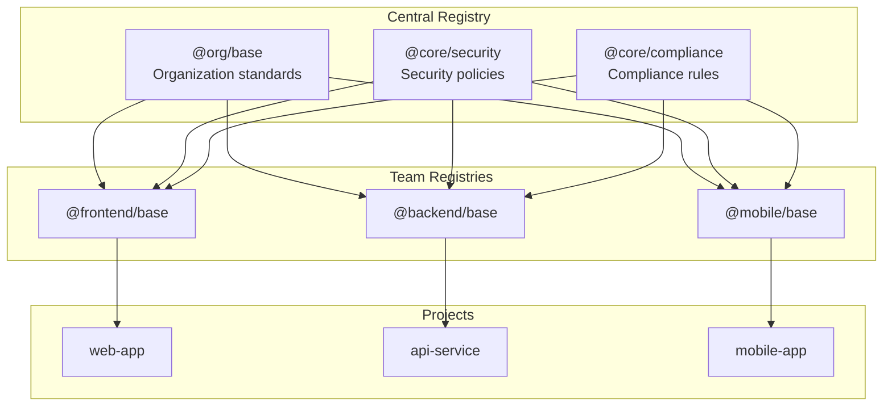

# Enterprise Setup

This guide covers deploying PromptScript across an enterprise organization.

## Architecture Overview



## Central Registry Setup

### Repository Structure

Create a central registry repository:

```
promptscript-registry/
├── README.md
├── CHANGELOG.md
├── @org/
│   ├── base.prs              # Organization base
│   ├── security.prs          # Security standards
│   └── compliance.prs        # Compliance requirements
├── @teams/
│   ├── frontend.prs
│   ├── backend.prs
│   ├── mobile.prs
│   └── data.prs
├── @fragments/
│   ├── testing.prs
│   ├── documentation.prs
│   └── logging.prs
└── @templates/
    ├── web-app.prs
    ├── api-service.prs
    └── library.prs
```

### Organization Base Configuration

```promptscript
# @org/base.prs
@meta {
  id: "@org/base"
  syntax: "1.0.0"
  org: "ACME Corporation"
}

@identity {
  """
  You are an AI assistant at ACME Corporation.

  Core values:
  - Quality over speed
  - Security first
  - User-centric design
  - Collaborative development
  """
}

@standards {
  code: {
    review: required
    documentation: required
    testing: required
  }

  git: {
    conventionalCommits: true
    branchNaming: "feature|bugfix|hotfix/TICKET-description"
    prRequired: true
  }
}

@restrictions {
  - "Never commit secrets or credentials"
  - "Never bypass security reviews"
  - "Always follow data protection policies"
  - "Never use deprecated dependencies with known vulnerabilities"
}

@shortcuts {
  "/security": "Review code for security vulnerabilities"
  "/docs": "Generate or update documentation"
}
```

### Security Configuration

```promptscript
# @org/security.prs
@meta {
  id: "@org/security"
  syntax: "1.0.0"
}

@identity {
  """
  Apply ACME security standards to all code.
  """
}

@standards {
  security: {
    authentication: {
      mfa: required
      sessionTimeout: 3600
    }
    authorization: {
      rbac: true
      leastPrivilege: true
    }
    dataProtection: {
      encryption: "AES-256"
      pii: "masked in logs"
    }
    dependencies: {
      vulnerabilityScan: required
      updatePolicy: "weekly"
    }
  }
}

@restrictions {
  - "Never store passwords in plain text"
  - "Never log sensitive data"
  - "Never disable security features"
  - "Never use eval() or similar unsafe functions"
  - "Always validate and sanitize user input"
  - "Always use parameterized queries"
}

@knowledge {
  """
  ## Security Resources

  - Security guidelines: https://wiki.acme.com/security
  - Vulnerability reporting: security@acme.com
  - Security review checklist: https://wiki.acme.com/security-checklist
  """
}
```

## Team Configuration

### Frontend Team

```promptscript
# @teams/frontend.prs
@meta {
  id: "@teams/frontend"
  syntax: "1.0.0"
  team: "Frontend"
}

@inherit @org/base
@use @org/security

@identity {
  """
  You are a frontend development expert.

  Expertise:
  - React and TypeScript
  - Modern CSS and design systems
  - Performance optimization
  - Accessibility (WCAG 2.1 AA)
  """
}

@context {
  """
  ## Tech Stack

  - Framework: React 18+
  - Language: TypeScript 5+
  - Build: Vite
  - Styling: TailwindCSS
  - Testing: Vitest + Testing Library
  - State: React Query + Zustand

  ## Architecture

  - Component-driven development
  - Feature-based folder structure
  - Shared design system (@acme/ui)
  """
}

@standards {
  code: {
    patterns: ["hooks", "composition", "render props"]
    components: {
      style: "functional"
      props: "TypeScript interfaces"
    }
  }

  accessibility: {
    wcag: "2.1 AA"
    testing: required
  }

  performance: {
    bundleSize: "monitored"
    coreWebVitals: "tracked"
  }
}

@shortcuts {
  "/component": "Create a React component"
  "/hook": "Create a custom hook"
  "/test": "Write tests with Vitest"
  "/a11y": "Review accessibility"
}
```

### Backend Team

```promptscript
# @teams/backend.prs
@meta {
  id: "@teams/backend"
  syntax: "1.0.0"
  team: "Backend"
}

@inherit @org/base
@use @org/security

@identity {
  """
  You are a backend development expert.

  Expertise:
  - Node.js and TypeScript
  - RESTful and GraphQL APIs
  - Database design and optimization
  - Microservices architecture
  """
}

@context {
  """
  ## Tech Stack

  - Runtime: Node.js 20+
  - Language: TypeScript 5+
  - Framework: NestJS
  - Database: PostgreSQL + Redis
  - ORM: Prisma
  - Testing: Jest

  ## Architecture

  - Clean architecture
  - Domain-driven design
  - Event-driven microservices
  """
}

@standards {
  api: {
    versioning: "URL path (/v1, /v2)"
    documentation: "OpenAPI 3.0"
    authentication: "JWT + OAuth2"
  }

  database: {
    migrations: required
    indexing: "reviewed"
    queryOptimization: required
  }
}

@shortcuts {
  "/api": "Design API endpoint"
  "/schema": "Design database schema"
  "/test": "Write tests with Jest"
  "/migrate": "Create database migration"
}
```

## Project Integration

### Project Configuration

```promptscript
# .promptscript/project.prs
@meta {
  id: "customer-portal"
  syntax: "1.0.0"
}

@inherit @teams/frontend

@context {
  project: "Customer Portal"
  repository: "github.com/acme/customer-portal"

  """
  ## Project Overview

  Self-service portal for ACME customers.

  Features:
  - Account management
  - Order history
  - Support tickets
  - Billing information

  ## Key Integrations

  - Auth: Okta SSO
  - Payments: Stripe
  - Analytics: Mixpanel
  """
}

@knowledge {
  """
  ## API Endpoints

  Base URL: https://api.acme.com/v1

  - GET /customers/:id - Get customer
  - GET /orders - List orders
  - POST /tickets - Create support ticket

  ## Design System

  Use @acme/ui components:
  - Button, Input, Select
  - Card, Modal, Drawer
  - DataTable, Pagination
  """
}
```

### Project Config File

```yaml
# promptscript.yaml
input:
  entry: .promptscript/project.prs

registry:
  url: https://github.com/acme/promptscript-registry
  auth:
    token: ${GITHUB_TOKEN}

targets:
  github:
    enabled: true
    output: .github/copilot-instructions.md
  claude:
    enabled: true
    output: CLAUDE.md
  cursor:
    enabled: true
    output: .cursorrules

validation:
  strict: true
```

## CI/CD Integration

### GitHub Actions Workflow

```yaml
# .github/workflows/promptscript.yml
name: PromptScript CI

on:
  push:
    paths:
      - '.promptscript/**'
      - 'promptscript.yaml'
  pull_request:
    paths:
      - '.promptscript/**'
      - 'promptscript.yaml'

jobs:
  validate:
    runs-on: ubuntu-latest
    steps:
      - uses: actions/checkout@v4

      - uses: actions/setup-node@v4
        with:
          node-version: '20'

      - name: Install PromptScript
        run: npm install -g @promptscript/cli

      - name: Validate
        run: prs validate --strict
        env:
          GITHUB_TOKEN: ${{ secrets.REGISTRY_TOKEN }}

      - name: Check compiled files
        run: |
          prs compile --all
          git diff --exit-code || {
            echo "::error::Compiled files are out of date. Run 'prs compile --all' and commit."
            exit 1
          }
        env:
          GITHUB_TOKEN: ${{ secrets.REGISTRY_TOKEN }}
```

### Registry CI/CD

```yaml
# .github/workflows/registry.yml (in registry repo)
name: Registry CI

on:
  push:
    branches: [main]
  pull_request:

jobs:
  validate:
    runs-on: ubuntu-latest
    steps:
      - uses: actions/checkout@v4

      - uses: actions/setup-node@v4
        with:
          node-version: '20'

      - name: Install PromptScript
        run: npm install -g @promptscript/cli

      - name: Validate all files
        run: |
          find . -name "*.prs" -exec prs validate {} \;

      - name: Check for breaking changes
        if: github.event_name == 'pull_request'
        run: |
          # Custom script to detect breaking changes
          ./scripts/check-breaking-changes.sh
```

## Governance

### Versioning Strategy

Follow semantic versioning for registry files:

- **Major** (1.0.0 → 2.0.0): Breaking changes to block structure
- **Minor** (1.0.0 → 1.1.0): New features, non-breaking additions
- **Patch** (1.0.0 → 1.0.1): Bug fixes, documentation updates

### Change Management

1. **Propose changes** via pull request to registry
2. **Review** by relevant stakeholders
3. **Test** with sample projects
4. **Communicate** changes to teams
5. **Deprecate** old versions with migration path

### Access Control

| Role      | Permissions            |
| --------- | ---------------------- |
| Admin     | Full registry access   |
| Team Lead | Team namespace write   |
| Developer | Read-only, PR creation |

## Monitoring and Analytics

### Usage Tracking

Track adoption across projects:

```yaml
# In each project's config
analytics:
  enabled: true
  projectId: 'customer-portal'
  team: 'frontend'
```

### Quality Metrics

Monitor:

- Registry update frequency
- Project adoption rate
- Validation error trends
- Inheritance depth

## Rollout Strategy

### Phase 1: Pilot (2-4 weeks)

1. Select 2-3 pilot teams
2. Set up central registry
3. Migrate existing instructions
4. Gather feedback

### Phase 2: Team Rollout (4-8 weeks)

1. Create team configurations
2. Onboard remaining teams
3. Establish governance
4. Train developers

### Phase 3: Organization-Wide (Ongoing)

1. Mandate for new projects
2. Migration support for existing
3. Continuous improvement
4. Regular reviews

## Best Practices

!!! tip "Registry Organization"
Keep the registry organized with clear namespaces and documentation.

!!! tip "Version Pinning"
Pin versions in production projects to avoid unexpected changes.

!!! tip "Change Communication"
Notify teams before making registry changes.

!!! warning "Security Review"
Review security-related changes carefully before merging.

!!! warning "Breaking Changes"
Use major version bumps and provide migration guides for breaking changes.
