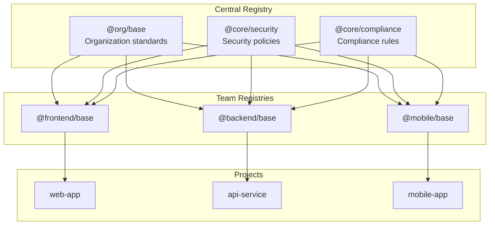

# Enterprise Setup

!!! tip "Need help with enterprise deployment?"
**Questions?** Open a [GitHub Issue](https://github.com/mrwogu/promptscript/issues) or start a conversation in [GitHub Discussions](https://github.com/mrwogu/promptscript/discussions). We're happy to help teams get set up.

This guide covers deploying PromptScript across an enterprise organization.

## Architecture Overview


```mermaid
flowchart TB
    subgraph Central["Central Registry"]
        org["@org/base<br/>Organization standards"]
        sec["@core/security<br/>Security policies"]
        comp["@core/compliance<br/>Compliance rules"]
    end

    subgraph Teams["Team Registries"]
        fe["@frontend/base"]
        be["@backend/base"]
        mobile["@mobile/base"]
    end

    subgraph Projects["Projects"]
        p1["web-app"]
        p2["api-service"]
        p3["mobile-app"]
    end

    org --> fe
    org --> be
    org --> mobile
    sec --> fe
    sec --> be
    sec --> mobile
    comp --> fe
    comp --> be
    comp --> mobile

    fe --> p1
    be --> p2
    mobile --> p3
```

## Central Registry Setup

### Create Your Registry

Use the CLI to scaffold your company registry:

```bash
prs registry init company-registry --name "ACME Registry" --namespaces @org @teams @fragments @templates
```

### Repository Structure

```
promptscript-registry/
├── README.md
├── CHANGELOG.md
├── @org/
│   ├── base.prs              # Organization base
│   ├── security.prs          # Security standards
│   └── compliance.prs        # Compliance requirements
├── @teams/
│   ├── frontend.prs
│   ├── backend.prs
│   ├── mobile.prs
│   └── data.prs
├── @fragments/
│   ├── testing.prs
│   ├── documentation.prs
│   └── logging.prs
└── @templates/
    ├── web-app.prs
    ├── api-service.prs
    └── library.prs
```

### Organization Base Configuration

```promptscript
# @org/base.prs
@meta {
  id: "@org/base"
  syntax: "1.0.0"
  org: "ACME Corporation"
}

@identity {
  """
  You are an AI assistant at ACME Corporation.

  Core values:
  - Quality over speed
  - Security first
  - User-centric design
  - Collaborative development
  """
}

@standards {
  code: [
    "Code review required",
    "Documentation required",
    "Testing required"
  ]

  git: [
    "Use conventional commits format",
    "Branch naming: feature|bugfix|hotfix/TICKET-description",
    "Pull request required"
  ]
}

@restrictions {
  - "Never commit secrets or credentials"
  - "Never bypass security reviews"
  - "Always follow data protection policies"
  - "Never use deprecated dependencies with known vulnerabilities"
}

@shortcuts {
  "/security": "Review code for security vulnerabilities"
  "/docs": "Generate or update documentation"
}
```

<!-- playground-link-start -->
<a href="https://getpromptscript.dev/playground/?s=N4IgZglgNgpgziAXAbVABwIYBcAWSQwAeGAtmrAHRoBOCANCAMYD2AdljO-gMQAEAAs2oBzAPQAjDHBhVaAHVb8SMLBl7AFvXhAAmiXnJCCREqTEObecAJ7sMhfYYCMFAAxuLrLUOGOQAQQBhAFkAUV5AoTQhbAg2TwBfBQV+XU4sCCxrdUsLEE8tAE1mAFdeDGoYcq9-AElyuDgIOFV2cqxeILCIqJiMtgpkrx7K3gA3DCgS+ERLAFpeAEUSyczs5jGYais0GBgded4AZRhGEuo13khaLEOAVWlqOcZ0i8ZeHXgIYVZDyKgoBhxH0IJsPjBNlBmGhlOxcvkEQokr9FC0MKwdBUdHAcsMWJ99MhLFpDJFPrxKmMIDAAO4UmAARxKEEqBxAdGJBhAABFmGdYap+l5KkyWftDBzhiSQAAVeAZVjCemi1kFXgAXSGWmEmUJnMMDyqLFYm3YcVYk14LBIJEyOLAQhI2Al+pAACFqOjGDheBbbYr9GAYNhzjAAD7iErCSCEMM4ZhYGOiGW1QIAaVCMrmnzgjAuaCFLqlXIACiUAcrpi1K2K2ZZNaxkSlKi03kKcRphgtDAA5CFbK3MG2ZKynSpYHFCK2s9IQSZwNXdkB9zbbcTWTCNUdnC5ZelU2kL-Jdrn+KA0jDWe3MAHMOmY1S8GgJ05Cp83iCMalHw69-vbEppHBGhTmwfZgM4T5WC-eBeBpTIfQAa1YO8vDGctWC2IFoEyb9EiGfg4HjagsDOCdcWlURpB3NZDD8AAlCFqTpfEqgdbZqPOS50KgTDPXEHCMngNVDFEHQ+SPPwAHFOCwjheCnEo0AfKpxP5dJYniY8EhABJ1QYV5rHwIhSHIGQaHoEBVyaNh8CcXSgA" target="_blank" rel="noopener noreferrer">
  
</a>
<!-- playground-link-end -->

### Security Configuration

```promptscript
# @org/security.prs
@meta {
  id: "@org/security"
  syntax: "1.0.0"
}

@identity {
  """
  Apply ACME security standards to all code.
  """
}

@standards {
  security: [
    "MFA required",
    "Session timeout: 3600 seconds",
    "RBAC with least privilege principle",
    "Encrypt with AES-256",
    "Mask PII in logs",
    "Weekly vulnerability scanning"
  ]
}

@restrictions {
  - "Never store passwords in plain text"
  - "Never log sensitive data"
  - "Never disable security features"
  - "Never use eval() or similar unsafe functions"
  - "Always validate and sanitize user input"
  - "Always use parameterized queries"
}

@knowledge {
  """
  ## Security Resources

  - Security guidelines: https://wiki.acme.com/security
  - Vulnerability reporting: security@acme.com
  - Security review checklist: https://wiki.acme.com/security-checklist
  """
}
```

<!-- playground-link-start -->
<a href="https://getpromptscript.dev/playground/?s=N4IgZglgNgpgziAXAbVABwIYBcAWSQwAeGAtmrAHRoBOCANCAMYD2AdljO-gMQAEAAs2oBzAPRwYjAK7UIWAJ5VaAHVb8SMLBl7BVvXhAAmiXspCCR4yTLnyze3nHnsMhE2YCMFAAw-7rAF9VVX4jTixbHQd7EH99AEE0cnleeIBhAFkAUUdrWQVHLVZDDGpDOF4sZl4MKCheFkMYCmjYttUg1hC4IpKyit1WfQlpfPkTZAd9MwyAMXjeahgARykIJcMzOinTEABleDgINkqIDWYpLBMAZgA2b29clmK4LZ2zACUAIXTeAHc5DheLAMD1eDQIAA3aAwYQwcGyViMCDkGBvIb6XZZJHUeRoLD-QGpLJ7AC0ACYAKy3dGY3YZUEAa14AAUAJJsgxDKDMYSvEDbDHTEAAdRgMEZUBSkKkUFYMGoGAARtBInBGBhWKwIKxhHFeABdDrBNRLHqyRgRNgDByk3YAORgkIVhSE8MwcDgfyE5S54KgGB1lSIWH1drMjud1GBvNyrCOEWdvBKWjDDqdLsMEDgytgTxsBTAMGwMngaYjGejUgkvCdtQAFABKXhCRxnaClXhSeMYIu8MDdy3HePlkDxKB-DDyCqQ2pGbDwzWGRyauQQABe8OrLp1aEuo-Hk+nXZrmEVGg4sk3y9WCogZdigRN-EZrGYf1ghjhUQxMX13D4A5RkiD54AuahGDLLoMTtICCxSYQ1iaKAdXgEwcCwLA0DgRBRFEAFGQgCgMEYDQKBYEgrGAhRbV4AA1WV5UVFUUIKJY0CECJdRMEZ4P4EiyIo2i4LGRYnXvP4GhwSRJWzK5eAwrCcLwgiiIE5oKKo+DSUYaTGFknpWj-QIQACA0GHCXF8CIUhUSUegQCjI42HwDxTKAA" target="_blank" rel="noopener noreferrer">
  
</a>
<!-- playground-link-end -->

## Team Configuration

### Frontend Team

```promptscript
# @teams/frontend.prs
@meta {
  id: "@teams/frontend"
  syntax: "1.0.0"
  team: "Frontend"
}

@inherit @org/base
@use @org/security

@identity {
  """
  You are a frontend development expert.

  Expertise:
  - React and TypeScript
  - Modern CSS and design systems
  - Performance optimization
  - Accessibility (WCAG 2.1 AA)
  """
}

@context {
  """
  ## Tech Stack

  - Framework: React 18+
  - Language: TypeScript 5+
  - Build: Vite
  - Styling: TailwindCSS
  - Testing: Vitest + Testing Library
  - State: React Query + Zustand

  ## Architecture

  - Component-driven development
  - Feature-based folder structure
  - Shared design system (@acme/ui)
  """
}

@standards {
  code: [
    "Use hooks, composition, and render props patterns",
    "Functional components only",
    "TypeScript interfaces for props"
  ]

  accessibility: [
    "WCAG 2.1 AA compliance",
    "Accessibility testing required"
  ]

  performance: [
    "Monitor bundle size",
    "Track Core Web Vitals"
  ]
}

@shortcuts {
  "/component": "Create a React component"
  "/hook": "Create a custom hook"
  "/test": "Write tests with Vitest"
  "/a11y": "Review accessibility"
}
```

<!-- playground-link-start -->
<a href="https://getpromptscript.dev/playground/?s=N4IgZglgNgpgziAXAbVABwIYBcAWSQwAeGAtmrAHRoBOCANCAMYD2AdljO-gMQAEAAh1JwA9GGpsOrACZVaAHVb8SMLBl7BFvXhGmJe8kIJjCxE9p2mGtvOAE92GQvsMBGCgAZP11tqEkXEAAxcykrEEUAX0VFfghWHBhqCCwBZmoAcxEAIww4GFiAV3y0zJF8xkLkrDsYpV1OLBS7DRtrCIjfXgBNZkLeDGoYAd5xSUteaRgANxgoZjQVdl4iNCSsCjrtAFFCNeom-MQbAFpeACUTRlSMGV4AFTs1gGVGZLQsU94AWWYp6l8AGFns8BncpnAIBlfPY4BwSHAvgAFJJgdIkW6MYYLJokCAAL2wEDYXwAgowsXBIdloM1eAAKADqgNJAHFeAAmCiuXik0kASjaHR80VYsRYFkIqU0XXaPm03D49xgjBwvGeakYAGstrwziFSDAAO7pLX6S4Ya68VwADgA1F8ADK3DKFDAZGD6R4vN4QD68ACsDq6ZwAQoVoHpeAA1FIFEPqmpQeIZL0YaBG+LSYHPL7KuEp-Sxjhw3h2h7wJqsDK8R0QbLUQa1BMa7Cei5XVIARUKSRa5YAWsU1DJdYredRVXHrlV419AcwyGxGidpMlZr4prN5otGl8giYsLOTrl8tJRswoP9bFhqIUZ0Mvs8cIMYOeIVCYXY4TASAz+JaKgiBGgqysKnSirEcK3NIgzSHArRdCwUz6MgNjaIYACqJQ4MwzBanAdC8CwS6Qk0bBETBvBDDISS8DQCwIZgWAcACiIgHQ6EGMEhSsNcxKsBgUDEYuaDLuwCFsFAtQcVxhjejArzvKk8SsWAlrwBe1D0RIaDsTYAC6uqWpS1K0jUqFySAzJspy3K8qSIlkMmmIFLJXQYSA5KmfW5ktCWVY1kMACOEZDOEhm6vsaLUBifHtmhHncb8rApOkvDZLx0iwLYBJuZxSXyY22q8AuQy8IyMDZDGKRCfpXRGawkFKHAuEHJUWAITKnkiCRYmsHuSDcYCQxtiMFpWn14mfJ0PW4fhhiBCNh7DOolRwouvDzTqs3cSIAWLdxjLVMMAUIZmuA1Qdu2GCIGCuK4MmBJc0wQMaAwUvAZnJjUIogJEdDoNgeCIEY6RZKeMByPQTDjFwoN8M8hRoOQb3nnAzC8LgwxEKQ5DDHerAIYkQwULwAByzCpJgBy8MwYBY4kkzMJUSxqORrCUXcrBUyMo3CZg2rulDsQqGoiHaLogT8ODOR5G5Nj2I4zjce4AbeLteKEPE+i3r2URQSOsHUPBEsiShvBoSASJQBpuFXnR0EyHBhiNX4laFpbhg23bl7Xk7xvhI1or8EMcLJPxbBdV83u21i9vXmHt4QJHYoQf9gMgMxINg2UFRVM00McbDFjwyAiPI6jb62Jj2MrMQzkE7xxNJFDFO8zTqT04zwzSCzhRs0SFFguePM3NRJgC5aWrC5sShi+o3U6FGhgy3nKoF79u1K2oKtuBQ6sePKvBazrWN3vGIcB3B0dIX8CWx77DvadfJuuzYAWe1bPvx37jtGy7EAwdYhJwjhzW+2gziP1-s-Ce4cU4cz+pEAyDBGjUDsPgXGjci4MFmLQAS+BXD-SAA" target="_blank" rel="noopener noreferrer">
  
</a>
<!-- playground-link-end -->

### Backend Team

```promptscript
# @teams/backend.prs
@meta {
  id: "@teams/backend"
  syntax: "1.0.0"
  team: "Backend"
}

@inherit @org/base
@use @org/security

@identity {
  """
  You are a backend development expert.

  Expertise:
  - Node.js and TypeScript
  - RESTful and GraphQL APIs
  - Database design and optimization
  - Microservices architecture
  """
}

@context {
  """
  ## Tech Stack

  - Runtime: Node.js 20+
  - Language: TypeScript 5+
  - Framework: NestJS
  - Database: PostgreSQL + Redis
  - ORM: Prisma
  - Testing: Jest

  ## Architecture

  - Clean architecture
  - Domain-driven design
  - Event-driven microservices
  """
}

@standards {
  api: [
    "URL path versioning (/v1, /v2)",
    "Document with OpenAPI 3.0",
    "JWT + OAuth2 authentication"
  ]

  database: [
    "Use migrations for schema changes",
    "Review all indexes",
    "Query optimization required"
  ]
}

@shortcuts {
  "/api": "Design API endpoint"
  "/schema": "Design database schema"
  "/test": "Write tests with Jest"
  "/migrate": "Create database migration"
}
```

<!-- playground-link-start -->
<a href="https://getpromptscript.dev/playground/?s=N4IgZglgNgpgziAXAbVABwIYBcAWSQwAeGAtmrAHRoBOCANCAMYD2AdljO-gMQAEAAh1JwA9ACMMjANacAJlVoAdVvxIwsGXsGW9eEWYl6KQgmMPGSZrWcZ284AT3YZCh4wEYKABm+3WuoRI3EAAhSzk-AF9lZX4IVhwYaggsAWZqAHMLOBhYgFcctMyRHMY85KwHGJV9TiwUhy07WxA-XQBNZjzeDGoYHt4JaTleWRgANxgoZjQ1dl4iNCSsCmrdAFFCJep6nMQ7AFpeADlmMYoAKzge614AFQclgGVGZLQsQ94AJXWnu7A8lAbrJeABxagYNA4ACKABleABBAAKAEk4J8ACLYDASQpjOAQDL+DC3Gb1EgQABe2AgbE+AFkIK9mDlqOMmfAetRGDgUjBGFhyrl-EZWmLlNFWLEWOwiKltCKWm1eNw+Hd+TheE8NNI1rwjl88uwIGpDKdzldeAAmLwAak+sJJGTyGAyMEMD2erwg714AFZ7SKjgAxCFqADu6SkZvgWAAUk9Mdjce7eEiWVgMn0nnDeLbvjBZBB0UHeAB5L70wxI5JwEgYT7quD1VgZQxx2N61WI7m8jgCoV6o4AYVgJK5PL5A76mOY9fiB1kyUm-nxhKlpfWK6wi+XnF4FOZrPZjHgzXFrVYktizZJsl6smuCt0kIghmQdl0xgAql94ZhcF4SZaFpVh4gyXgAAoRHGdw6F4GCrQASmMOhP1FDFmDKOZUnDFJNTLJZWGRFFeAAZl8EA0JFL8QDjAB1O483LBE8lwK0ejYxJjUYGk6UvXQAF09XvDQU3fdCf0KCksz41hrjAdJ7B5GB614HknTPKjJJAL4JggGBwx6KAgXiMZCC06jdFo6E8iSRoyRNKk5N4PoAEc8ggPobAE3hhKvap+DgHB0iwMosCfc8RFfYxggxeB10RVEFmsNBmHiD5fOMEoVPrWKMISolRmTDBCjgXKGyykARA4Zt8uMeiKn6WqIt4PDAI7OqqpEGSIQ4eqQGHPpsH6UScVK-perkqIQEiOh0GwPBEBMdIshTBR6CYNgOC4Za+CePI0HIAyQTgZheFwfoiFIch+moI1rkSPoKBOZhUkwHZeGYMALsSUYsLyHC5Pgu9eFYN6BmGoFMGkV0YFWFQ1A0JoRX0YJ+FW7Jcl8xxnFcUVPD9Si7ApQh4kMLB7uFSUgo0awH0ikUWDGCSQCRKBJBgEKoDGah7Dp+9qB8-yAljcDWfZznud5-m7wfYx-Jpvpm2SAVQMZ3QjmMSXT2lpJXNjVX6n4iVZvmkAAKWlbilKcoGg2qittlXaQH2w7jsLexzsuhZiDIWBXIe3gnvh173t6VJvt+0aAaB43WBB25wdSTQod4GGpDhhHVHUTRnz0AxRQxm3+TtyplVxjR8Y8Cgia8ZVSfJi6qYlG8BYZlHdGZ1MPzZjndeYHn9dvemhYVuwWvF3he51rnB5lkfBeF1uVGVymmXjjX9VFWe9b5tejdAmbIkEhg6moBx8Gu-34ZoTbgIJNh8HcWagA" target="_blank" rel="noopener noreferrer">
  
</a>
<!-- playground-link-end -->

## Project Integration

### Project Configuration

```promptscript
# .promptscript/project.prs
@meta {
  id: "customer-portal"
  syntax: "1.0.0"
}

@inherit @teams/frontend

@context {
  project: "Customer Portal"
  repository: "github.com/acme/customer-portal"

  """
  ## Project Overview

  Self-service portal for ACME customers.

  Features:
  - Account management
  - Order history
  - Support tickets
  - Billing information

  ## Key Integrations

  - Auth: Okta SSO
  - Payments: Stripe
  - Analytics: Mixpanel
  """
}

@knowledge {
  """
  ## API Endpoints

  Base URL: https://api.acme.com/v1

  - GET /customers/:id - Get customer
  - GET /orders - List orders
  - POST /tickets - Create support ticket

  ## Design System

  Use @acme/ui components:
  - Button, Input, Select
  - Card, Modal, Drawer
  - DataTable, Pagination
  """
}
```

<!-- playground-link-start -->
<a href="https://getpromptscript.dev/playground/?s=N4IgZglgNgpgziAXAbVABwIYBcAWSQwAeGAtmrAHRoBOCANCAMYD2AdljO-gMQAEV1ZmSxxG1CGiwB6GswBWMRlgFwAOqwACJGFgy9g63rwgATRL1VMArnCxCY1ALRpm1XVEuHecAJ7sMhOaWAIwUAAzhnqwAvurqGhCsOA4QWLwaHKRwUmCC7JwmcZos+YRpBqxGsgpKQSAAwjZ22tS8AAqu7lFG1DAucKmuPnUA5qk4VgBGFCwkUhiM2lKMTfZOLm4YHiBFRp47O5W83HxtgjVpAPIAbg7XEDAA7ru8AMowUGCOcHcQjDC8DbuXhgVy8ACC9QAsgBRXgrWxrOAUF4AMRg2CsvTgiC8jghjBYVnYvBIGFYGBGMG07DxvEu1BMDl4OAgiOoPjprysaCBvCwfwA1jo1Ed8QAhaBQRIjYysUHUMkCtgvE68ADSMB8vAAkvkRtRsBA2KK6eCrLhzJdBbo3q9LnS2hgfDSROZXlhxGgYGaKVAfALGDjeFCIIRMKwPl59lFYqx4oLWMxHrATFT9NGDt1jnxwW0dbwYawTC5EiIXuKMD9eABVABKABlzDgsFg0DipPM0BAKAttDMhFJrsEXviAOIwgAqvGWqxa2UQpl44508LnDjpE+nUlcTNoy94DbZaV3DlFRnxbUur23geFIgP9V62ABcB5fLvOlVfAAIvAICMlSvD4tjUi8NbVhofYwFIVgQPCQguJG7A4nS4oWnYrB0LqrBoBa2HvLASh0vUGCMthULMCYWzYT+hqPBuYq8D+2AYJOGCTLA2FOmMFLKvGRwxoc0QgNEdDoNgeCICAGQYiQ2S5GwHDFioIAMCUylYDwbzvtKMAmN4zD8skvBEKQ5AAtQxJwCyDgwBQvAAHLMGkmBuLwzBgMZAImMwKyukabDYeSBlJmkejPlAgILIKlL2fE2i2hURimHUslZDkeTKYUhxGL4-iBBYIChAArJEuWkmGiTmJ6Vg+jE8S2CFZEmDZyUIUy5jIJYbRQAsMA4MwUB7t4ujFi1lgALpeBwtgyl1PV9f8g3DcyTXjYyU3qHGGjYp6fz8W1dKLf1K0jXt4hKMa8bCaJk0MJwno+PgZlkJQND0CAty0Nd+DBKJQA" target="_blank" rel="noopener noreferrer">
  
</a>
<!-- playground-link-end -->

### Project Config File

```yaml
# promptscript.yaml
id: enterprise-project
syntax: '1.4.0'

input:
  entry: .promptscript/project.prs

registry:
  git:
    url: https://github.com/acme/promptscript-registry.git
    ref: main
    auth:
      type: token
      tokenEnvVar: GITHUB_TOKEN
  cache:
    enabled: true
    ttl: 3600000

targets:
  - github:
      output: .github/copilot-instructions.md
  - claude:
      output: CLAUDE.md
  - cursor:
      output: .cursor/rules/project.mdc
```

!!! tip "Version Pinning with Git Tags"
For production stability, pin to specific versions using Git tags:

    ```yaml
    registry:
      git:
        url: https://github.com/acme/promptscript-registry.git
        ref: v1.2.0  # Pin to specific release
    ```

    Or pin individual imports in your `.prs` files:

    ```
    @inherit @teams/frontend@2.0.0
    ```

## Developer Configuration

### User-Level Config

Each developer can set their default registry in `~/.promptscript/config.yaml`:

```yaml
version: '1'
registry:
  git:
    url: https://github.com/acme/promptscript-registry.git
    ref: main
    auth:
      type: token
      tokenEnvVar: GITHUB_TOKEN
defaults:
  team: frontend
  targets:
    - github
    - claude
```

This allows `prs init --yes` to automatically connect to the company registry without manual configuration. See [User-Level Configuration](./user-config.md) for details.

### Environment Variables

For CI/CD and developer environments, use environment variables:

```bash
export PROMPTSCRIPT_REGISTRY_GIT_URL=https://github.com/acme/promptscript-registry.git
export PROMPTSCRIPT_REGISTRY_GIT_REF=main
```

## CI/CD Integration

### GitHub Actions Workflow

```yaml
# .github/workflows/promptscript.yml
name: PromptScript CI

on:
  push:
    paths:
      - '.promptscript/**'
      - 'promptscript.yaml'
  pull_request:
    paths:
      - '.promptscript/**'
      - 'promptscript.yaml'

jobs:
  validate:
    runs-on: ubuntu-latest
    steps:
      - uses: actions/checkout@v4

      - uses: actions/setup-node@v4
        with:
          node-version: '20'

      - name: Install PromptScript
        run: npm install -g @promptscript/cli

      - name: Validate
        run: prs validate --strict
        env:
          GITHUB_TOKEN: ${{ secrets.REGISTRY_TOKEN }}

      - name: Check compiled files
        run: |
          prs compile
          git diff --exit-code || {
            echo "::error::Compiled files are out of date. Run 'prs compile' and commit."
            exit 1
          }
        env:
          GITHUB_TOKEN: ${{ secrets.REGISTRY_TOKEN }}
```

### Registry CI/CD

```yaml
# .github/workflows/registry.yml (in registry repo)
name: Registry CI

on:
  push:
    branches: [main]
  pull_request:

jobs:
  validate:
    runs-on: ubuntu-latest
    steps:
      - uses: actions/checkout@v4

      - uses: actions/setup-node@v4
        with:
          node-version: '20'

      - name: Install PromptScript
        run: npm install -g @promptscript/cli

      - name: Validate registry
        run: prs registry validate --strict
```

## Governance

### Versioning Strategy

Follow semantic versioning for registry files using Git tags:

- **Major** (v1.0.0 → v2.0.0): Breaking changes to block structure
- **Minor** (v1.0.0 → v1.1.0): New features, non-breaking additions
- **Patch** (v1.0.0 → v1.0.1): Bug fixes, documentation updates

Create releases with Git tags:

```bash
# Create release tag
git tag -a v1.0.0 -m "Release v1.0.0"
git push origin v1.0.0

# Projects can then pin to this version
# In promptscript.yaml:
#   registry.git.ref: v1.0.0
# Or in .prs files:
#   @inherit @org/base@1.0.0
```

### Change Management

1. **Propose changes** via pull request to registry
2. **Review** by relevant stakeholders
3. **Test** with sample projects
4. **Communicate** changes to teams
5. **Deprecate** old versions with migration path

### Access Control

| Role      | Permissions            |
| --------- | ---------------------- |
| Admin     | Full registry access   |
| Team Lead | Team namespace write   |
| Developer | Read-only, PR creation |

## Rollout Strategy

### Phase 1: Pilot (2-4 weeks)

1. Select 2-3 pilot teams
2. Set up central registry
3. Migrate existing instructions
4. Gather feedback

Advance when all pilot repositories pass `prs validate --strict`, generated
output drift is zero, at least 95% of pilot CI runs pass for five business
days, and every reported P0 or P1 migration issue is closed.

### Phase 2: Team Rollout (4-8 weeks)

1. Create team configurations
2. Onboard remaining teams
3. Establish governance
4. Train developers

Advance when every onboarded team has an owner and rollback contact, at least
90% of in-scope repositories compile from committed sources in CI, and no open
P0 or P1 incident is attributable to generated instructions.

### Phase 3: Organization-Wide (Ongoing)

1. Mandate for new projects
2. Migration support for existing
3. Continuous improvement
4. Regular reviews

Review monthly: validation pass rate, output-drift rate, mean time to resolve
PromptScript incidents, unsupported target warnings, repository adoption, and
rollback exercises. Pause new onboarding when a P0 remains open or the rolling
seven-day validation pass rate drops below 95%.

## Version Support Policy

### Supported Node.js Versions

PromptScript supports the following Node.js versions:

| Node.js Version | Support Status                  |
| --------------- | ------------------------------- |
| 20.x            | :white_check_mark: Full support |
| 22.x (LTS)      | :white_check_mark: Full support |
| 24.x            | :white_check_mark: Full support |
| 25.x (Current)  | :white_check_mark: Full support |
| < 20            | :x: Not supported               |

We follow Node.js's [release schedule](https://nodejs.org/en/about/releases/) and support active LTS and current versions.

### PromptScript Version Support

| Version | Status | Support Window               |
| ------- | ------ | ---------------------------- |
| 1.x     | Active | Until 2.0 release + 6 months |

**Support includes:**

- Security patches
- Bug fixes
- Documentation updates
- Compatibility with new Node.js LTS versions

### Breaking Changes Policy

We follow [Semantic Versioning](https://semver.org/):

- **Major versions** (1.x → 2.x): May contain breaking changes
- **Minor versions** (1.0 → 1.1): New features, backwards compatible
- **Patch versions** (1.0.0 → 1.0.1): Bug fixes only

**Breaking changes will:**

1. Be announced at least 4 weeks in advance
2. Include migration guides in release notes
3. Provide deprecation warnings in the previous minor version
4. Be documented in CHANGELOG.md

### Deprecation Process

1. Feature marked as deprecated with console warning
2. Documented in release notes with migration path
3. Deprecated for at least one minor version
4. Removed in next major version

### Security Updates

Security vulnerabilities are handled according to our [Security Policy](https://github.com/mrwogu/promptscript/blob/main/SECURITY.md):

- **Critical**: Fix within 7 days
- **High**: Fix within 14 days
- **Medium**: Fix within 30 days
- **Low**: Fix in next scheduled release

## Enterprise Registry Resolver

### System-Level Configuration

IT or platform teams can provision organization-wide registry aliases before developers touch the tool. Place a config file at `/etc/promptscript/config.yaml` on all developer machines (via MDM, Ansible, or similar provisioning):

```yaml
# /etc/promptscript/config.yaml - provisioned by IT
version: '1'

registries:
  '@company': github.com/acme/promptscript-base
  '@security': github.com/acme/security-standards

registry:
  git:
    url: https://github.com/acme/promptscript-base.git
    auth:
      type: token
      tokenEnvVar: GITHUB_TOKEN
```

Developers run `prs init` and the `@company` alias resolves automatically - no manual
configuration required.

### Three-Level Config Precedence

Aliases merge from three levels, highest priority first:

| Priority | Location                                 | Who Controls It |
| -------- | ---------------------------------------- | --------------- |
| Highest  | `promptscript.yaml` (project)            | Project team    |
| Middle   | `~/.promptscript/config.yaml` (user)     | Developer       |
| Lowest   | `/etc/promptscript/config.yaml` (system) | IT / Platform   |

This model lets IT enforce company defaults while teams retain flexibility to override specific aliases per project.

### Private Git Registries with SSO

For enterprises using GitHub Enterprise Server, GitLab Self-Managed, or Azure DevOps:

```yaml
# promptscript.yaml
registries:
  '@company':
    url: github.your-company.com/acme/promptscript-base
```

Registry aliases do not carry credentials. For SSO-gated repositories, configure authentication
under `registry.git.auth` for the default registry, or expose the host credential through the Git
credential helper. Store service account tokens or deploy keys in a secrets manager.

### Vendor Mode for Air-Gapped Environments

In environments with no outbound internet access, use vendor mode to pre-download all dependencies and commit them to the repository:

```bash
# Run this once outside the air-gapped network
prs vendor sync

# Commit vendor directory
git add .promptscript/vendor promptscript.lock
git commit -m "chore: vendor PromptScript dependencies"
```

In air-gapped CI:

```yaml
# No network access required
- name: Validate
  run: prs vendor check && prs validate --strict

- name: Compile
  run: prs compile
```

The `prs vendor check` step fails the build if the vendor directory is out of sync with the lockfile, preventing accidental use of stale dependencies.

### Lockfile in Enterprise CI

Commit `promptscript.lock` to every repository that uses remote imports. This ensures:

- **Deterministic builds** — every CI run resolves the exact same commits
- **Change visibility** — lockfile diffs in PRs make dependency updates explicit
- **Security auditing** — commit hashes can be cross-referenced with supply-chain scanning

```yaml
# .github/workflows/promptscript.yml
- name: Regenerate lockfile
  run: prs lock
  env:
    GITHUB_TOKEN: ${{ secrets.REGISTRY_TOKEN }}

- name: Check lockfile is current
  run: |
    git ls-files --error-unmatch promptscript.lock
    git diff --exit-code -- promptscript.lock

- name: Compile
  run: prs compile
  env:
    GITHUB_TOKEN: ${{ secrets.REGISTRY_TOKEN }}
```

## Best Practices

!!! tip "Registry Organization"
Keep the registry organized with clear namespaces and documentation.

!!! tip "Version Pinning"
Pin versions in production projects to avoid unexpected changes.

!!! tip "Change Communication"
Notify teams before making registry changes.

!!! warning "Security Review"
Review security-related changes carefully before merging.

!!! warning "Breaking Changes"
Use major version bumps and provide migration guides for breaking changes.
