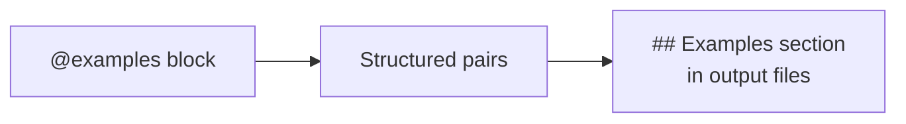

# Examples (Few-Shot Prompting)

The `@examples` block provides structured few-shot examples that teach AI assistants the exact transformation or behavior you expect. Unlike free-text instructions, examples give the model concrete input/output pairs to learn from.

## Overview

Few-shot prompting is one of the most effective ways to guide AI behavior. Instead of describing what you want in abstract terms, you show the model what "good" looks like:



## Basic Syntax

Define examples at the top level using `@examples`:

```promptscript
@meta {
  id: "my-project"
  syntax: "1.2.0"
}

@examples {
  rename-variable: {
    input: "const x = 1"
    output: "const itemCount = 1"
  }
}
```

Each entry is a named example with `input` and `output` fields (both required).

## Example Properties

| Property      | Required | Description                               |
| ------------- | -------- | ----------------------------------------- |
| `input`       | Yes      | The input the AI receives                 |
| `output`      | Yes      | The expected output the AI should produce |
| `description` | No       | Human-readable label for the example      |

## Adding a Description

Use the optional `description` field to label what the example demonstrates:

```promptscript
@meta {
  id: "commit-style"
  syntax: "1.2.0"
}

@examples {
  feat-commit: {
    description: "Feature commit with scope"
    input: "Added user authentication with JWT tokens"
    output: "feat(auth): add JWT-based user authentication"
  }

  fix-commit: {
    description: "Bug fix commit"
    input: "Fixed null pointer in payment service"
    output: "fix(payments): resolve null pointer in charge handler"
  }
}
```

## Multi-Line Content

Use triple-quoted strings (`"""`) for multi-line inputs and outputs:

```promptscript
@meta {
  id: "refactoring-examples"
  syntax: "1.2.0"
}

@examples {
  extract-function: {
    description: "Extract inline logic into a named function"
    input: """
      const result = users
        .filter(u => u.active && u.role === 'admin')
        .map(u => u.email);
    """
    output: """
      function getActiveAdminEmails(users: User[]): string[] {
        return users
          .filter(u => u.active && u.role === 'admin')
          .map(u => u.email);
      }
    """
  }
}
```

Multi-line strings preserve formatting and are ideal for code examples.

## Examples Inside @skills

You can attach examples directly to a skill definition. This keeps the examples co-located with the skill they demonstrate:

```promptscript
@meta {
  id: "project-skills"
  syntax: "1.2.0"
}

@skills {
  commit: {
    description: "Create git commits following conventional format"
    examples: {
      basic: {
        input: "Added dark mode toggle to settings page"
        output: "feat(settings): add dark mode toggle"
      }

      with-breaking-change: {
        description: "Breaking change in API"
        input: "Renamed /users endpoint to /accounts"
        output: "feat(api)!: rename /users endpoint to /accounts"
      }
    }
    content: """
      When creating commits:
      1. Use conventional commit format: type(scope): description
      2. Keep the subject line under 72 characters
      3. Use imperative mood: "add feature" not "added feature"
    """
  }
}
```

Skill-level examples appear in the skill's output file alongside its instructions.

## Multiple Examples

You can define as many named examples as needed. Names must be unique within a block:

```promptscript
@meta {
  id: "code-review-examples"
  syntax: "1.2.0"
}

@examples {
  missing-error-handling: {
    description: "Always wrap async calls in try/catch"
    input: """
      async function fetchUser(id: string) {
        const res = await fetch(`/api/users/${id}`);
        return res.json();
      }
    """
    output: """
      async function fetchUser(id: string) {
        try {
          const res = await fetch(`/api/users/${id}`);
          if (!res.ok) throw new Error(`HTTP ${res.status}`);
          return res.json();
        } catch (err) {
          logger.error('fetchUser failed', { id, err });
          throw err;
        }
      }
    """
  }

  prefer-const: {
    description: "Use const for values that never change"
    input: "let MAX_RETRIES = 3"
    output: "const MAX_RETRIES = 3"
  }

  explicit-return-type: {
    description: "Add return types to public functions"
    input: "function add(a: number, b: number) { return a + b; }"
    output: "function add(a: number, b: number): number { return a + b; }"
  }
}
```

## How It Compiles

The `@examples` block compiles to a dedicated **Examples** section in the output instruction file.

Given this source:

```promptscript
@meta {
  id: "naming-examples"
  syntax: "1.2.0"
}

@examples {
  camel-case: {
    description: "Variable naming convention"
    input: "const user_name = 'Alice'"
    output: "const userName = 'Alice'"
  }
}
```

The compiled output includes:

```markdown
## Examples

### camel-case

Variable naming convention

**Input:**
```

const user_name = 'Alice'

```

**Output:**

```

const userName = 'Alice'

```

```

## Syntax Version

`@examples` requires syntax version `1.2.0` or higher:

```promptscript
@meta {
  id: "my-project"
  syntax: "1.2.0"    # Required for @examples
}
```

If your file uses `syntax: "1.0.0"` or `"1.1.0"`, run:

```bash
prs validate --fix    # Automatically upgrades syntax version
```

## Best Practices

1. **Use descriptive names** — example names appear as section headings in the output.
2. **Add descriptions** — short labels help the AI understand the intent of each example.
3. **Keep inputs realistic** — use actual code or content your project will encounter.
4. **Group related examples in skills** — use skill-level `examples` when the examples apply to a specific skill.
5. **Use multi-line strings for code** — `"""..."""` preserves formatting for code snippets.
