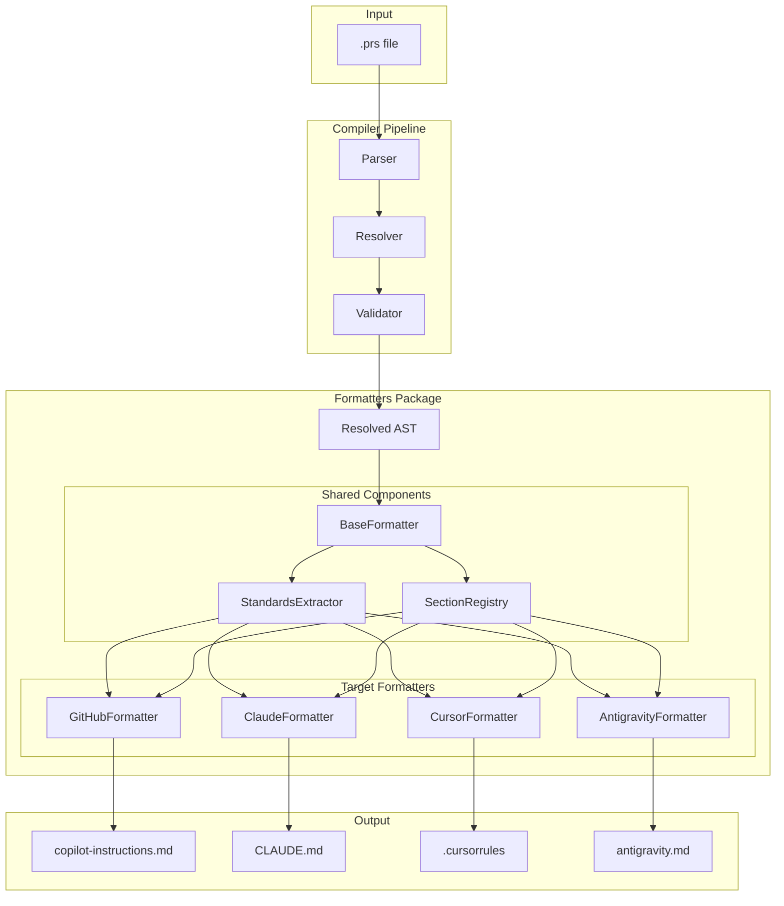
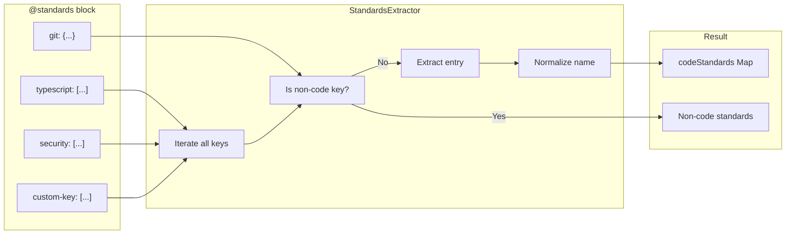

# Formatter Architecture

This guide explains the internal architecture of PromptScript formatters, focusing on how they maintain parity when processing `.prs` files into target-specific outputs.

## Overview

PromptScript compiles to multiple targets (GitHub Copilot, Claude Code, Cursor, etc.). Each formatter must produce semantically equivalent output from the same input. To ensure this parity, formatters share common extraction and rendering logic.



## Core Components

### BaseFormatter

All formatters extend `BaseFormatter`, which provides:

- **Shared utilities**: `dedent()`, `wrapText()`, markdown helpers
- **Shared extractors**: `standardsExtractor` instance
- **Common interface**: `format(ast): FormatterResult`

```typescript
// Simplified structure
abstract class BaseFormatter {
  protected readonly standardsExtractor = new StandardsExtractor();

  abstract format(ast: Program): FormatterResult;

  protected dedent(text: string): string {
    /* ... */
  }
  protected wrapText(text: string, width: number): string {
    /* ... */
  }
}
```

### StandardsExtractor

The `StandardsExtractor` ensures all formatters handle `@standards` blocks identically. It:

1. **Dynamically iterates** over all keys (not hardcoded list)
2. **Separates concerns**: code standards vs. non-code (git, config, docs, diagrams)
3. **Normalizes names**: `errors` → `error-handling` for backwards compatibility
4. **Supports multiple formats**: arrays, objects, strings

```typescript
// Internal extraction result
interface ExtractedStandards {
  codeStandards: Map<string, StandardsEntry>; // typescript, security, etc.
  git?: GitStandards;
  config?: ConfigStandards;
  documentation?: DocumentationStandards;
  diagrams?: DiagramStandards;
}
```

#### Extraction Flow



#### Supported Formats

The extractor handles multiple input formats for flexibility:

```yaml
# Array format (recommended)
@standards {
  typescript: ["Use strict mode", "No any type"]
  security: ["Validate inputs", "Escape output"]
}

# Object format (for boolean flags)
@standards {
  typescript: {
    strictMode: true
    noAny: true
    exports: "named only"
  }
}

# String format (single rule)
@standards {
  typescript: "Always use strict mode"
}

# Legacy format (backwards compatible)
@standards {
  code: {
    style: ["Consistent formatting"]
    patterns: ["Composition over inheritance"]
  }
}
```

### SectionRegistry

Tracks which sections each formatter supports, enabling:

- **Parity validation**: Ensure all formatters handle the same blocks
- **Feature coverage**: Track capabilities across targets
- **Documentation**: Auto-generate feature matrices

## Formatter Parity

### How Parity is Maintained

1. **Shared extraction**: All formatters use `StandardsExtractor`
2. **Common base class**: Shared utilities prevent drift
3. **Parity tests**: `semantic-parity.spec.ts` validates identical handling
4. **Golden file tests**: Snapshot testing catches regressions

### Adding New @standards Keys

When you add a custom key like `@standards { security: [...] }`:

1. **No code changes needed** - extractors handle arbitrary keys
2. All formatters automatically include it in output
3. Parity tests verify consistent handling

### Non-Code Keys

These keys are handled specially (not included in code standards section):

| Key             | Purpose             | Extracted As             |
| --------------- | ------------------- | ------------------------ |
| `git`           | Commit conventions  | `GitStandards`           |
| `config`        | Tool configuration  | `ConfigStandards`        |
| `documentation` | Doc standards       | `DocumentationStandards` |
| `diagrams`      | Diagram preferences | `DiagramStandards`       |

## Testing Architecture

### Test Layers

```
┌─────────────────────────────────────────┐
│         semantic-parity.spec.ts         │  Cross-formatter parity
├─────────────────────────────────────────┤
│         golden-files.spec.ts            │  Snapshot regression
├─────────────────────────────────────────┤
│    claude.spec.ts, github.spec.ts, ...  │  Per-formatter unit tests
├─────────────────────────────────────────┤
│         extractors.spec.ts              │  Extraction unit tests
└─────────────────────────────────────────┘
```

### Parity Matrix

The parity matrix (`parity-matrix.spec.ts`) validates that:

- All formatters handle the same block types
- Output structure is semantically equivalent
- Edge cases are handled consistently

## Adding a New Formatter

To add a new target formatter:

1. **Extend BaseFormatter**:

   ```typescript
   export class MyFormatter extends BaseFormatter {
     format(ast: Program): FormatterResult {
       // Use this.standardsExtractor.extract() for @standards
     }
   }
   ```

2. **Register in FormatterRegistry**:

   ```typescript
   registry.register('my-target', new MyFormatter());
   ```

3. **Add parity tests**: Include in `semantic-parity.spec.ts`

4. **Add golden files**: Create expected output snapshots

## Key Design Decisions

### Why Dynamic Key Iteration?

Previously, formatters had hardcoded keys (`typescript`, `naming`, `errors`, `testing`). This caused:

- **Parity issues**: GitHub iterated dynamically, others didn't
- **Limited extensibility**: Users couldn't add custom keys
- **Maintenance burden**: Each new key required code changes

The `StandardsExtractor` solves this by iterating over all keys dynamically.

### Why Separate Non-Code Keys?

Keys like `git` and `diagrams` have structured output requirements different from code standards. Separating them allows:

- **Type-safe extraction**: Each has its own interface
- **Specialized rendering**: Different output format per formatter
- **Clear semantics**: Users know what to expect

### Why Not Export StandardsExtractor?

The extractor is an internal implementation detail. Keeping it internal allows:

- **API stability**: Can refactor without breaking changes
- **Simpler public API**: Users don't need to understand internals
- **Flexibility**: Can change extraction strategy transparently
