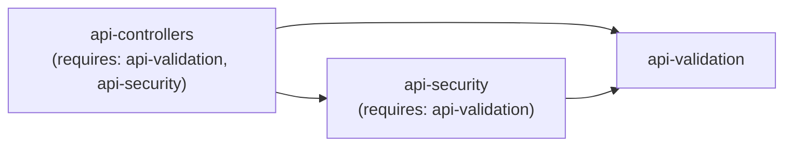

# Guard Dependencies

The `requires` field in `@guards` lets one guard declare that it depends on another. When a guard is applied, all its required guards are automatically injected alongside it — without duplicating configuration across every entry.

## Overview

Large projects often have guards that share common context. For example, an API controller guard might need the same validation rules and security rules that apply to the validator and security guard files respectively. Instead of repeating those rules everywhere, use `requires` to declare the dependency once:



When `api-controllers` is resolved, the compiler automatically includes `api-validation` and `api-security`. Because `api-security` also requires `api-validation`, the final resolved set is deduplicated: each guard appears only once.

## Basic Syntax

Add a `requires` array to any named guard entry:

```promptscript
@meta {
  id: "my-project"
  syntax: "1.2.0"
}

@guards {
  "api-controllers": {
    applyTo: ["**/*.controller.ts"]
    requires: ["api-validation", "api-security"]
    content: """
      Controller coding standards:
      - Use dependency injection for all services
      - Return typed response objects
    """
  }

  "api-validation": {
    applyTo: ["**/*.validator.ts"]
    content: """
      Validation rules:
      - Use class-validator decorators
      - Always return typed validation results
    """
  }

  "api-security": {
    applyTo: ["**/*.guard.ts"]
    requires: ["api-validation"]
    content: """
      Security guard rules:
      - Validate JWT tokens before processing
      - Log all unauthorized access attempts
    """
  }
}
```

The `requires` values must be names of other guards defined in the same (or inherited) `@guards` block.

## Transitive Dependencies

Dependencies are resolved transitively. If guard A requires B, and B requires C, then A automatically gets both B and C injected — no need to explicitly list C in A's requires.

```promptscript
@guards {
  "feature-a": {
    applyTo: ["apps/feature-a/**/*.ts"]
    requires: ["shared-logging"]         # Gets: shared-logging + base-config
    content: "Feature A rules."
  }

  "shared-logging": {
    requires: ["base-config"]            # Gets: base-config
    content: "Always use structured JSON logging."
  }

  "base-config": {
    content: "Follow project-wide coding standards."
  }
}
```

Resolving `feature-a` produces: `feature-a` + `shared-logging` + `base-config`.

## Guards as Context Libraries

A guard without an `applyTo` field is never directly applied to any files — it exists only to be pulled in via `requires`. This pattern is useful for shared context that multiple guards need:

```promptscript
@guards {
  "typescript-rules": {
    applyTo: ["**/*.ts"]
    requires: ["shared-conventions"]
    content: """
      TypeScript-specific rules:
      - No implicit any types
      - Prefer interfaces over type aliases
    """
  }

  "react-rules": {
    applyTo: ["**/*.tsx"]
    requires: ["shared-conventions"]
    content: """
      React-specific rules:
      - Use functional components with hooks
      - Apply OnPush change detection
    """
  }

  "shared-conventions": {
    # No applyTo — used only via requires
    content: """
      Shared project conventions:
      - Use kebab-case for file names
      - Prefer named exports
    """
  }
}
```

`shared-conventions` is a pure context library: it will never be applied on its own, but its content is injected into both `typescript-rules` and `react-rules` whenever they apply.

## Depth Limit

Dependency resolution stops at a maximum depth to prevent runaway chains. The default depth is **3**.

If your dependency chain exceeds the default, configure a higher limit in `promptscript.config.yaml`:

```yaml
validation:
  guardRequiresDepth: 5
```

This sets the maximum depth to 5 levels of transitive dependencies.

## Cycle Detection

Circular dependencies are detected at compile time and produce an error:

```
Error PS022: Circular guard dependency detected: "a" → "b" → "a"
```

To fix a cycle, reorganize the guards so that shared content lives in a dependency-free guard and both cyclic guards require it:

```promptscript
# Before (cycle):
# a requires b, b requires a  ← error

# After (fixed):
@guards {
  "shared": {
    content: "Shared rules."
  }

  "a": {
    applyTo: ["..."]
    requires: ["shared"]
    content: "Rules for a."
  }

  "b": {
    applyTo: ["..."]
    requires: ["shared"]
    content: "Rules for b."
  }
}
```

## Validation

The validator enforces guard dependency rules:

| Rule  | Code  | Description                                            |
| ----- | ----- | ------------------------------------------------------ |
| PS022 | error | Circular guard dependency detected                     |
| PS024 | error | `requires` references a guard name that does not exist |

Run validation to check your guards:

```bash
prs validate
```

## Best Practices

1. **Use context libraries** — extract shared content into guards without `applyTo` and pull them in via `requires`.
2. **Keep chains shallow** — aim for at most 2–3 levels of nesting for readability.
3. **Name clearly** — guard names appear in error messages and output files; prefer `kebab-case` descriptive names.
4. **Avoid cycles** — if you find yourself needing a cycle, it is a signal that shared content should be extracted to a separate guard.
5. **Increase depth deliberately** — only raise `guardRequiresDepth` when you have a genuine need for deep chains, not as a workaround for cycles.
