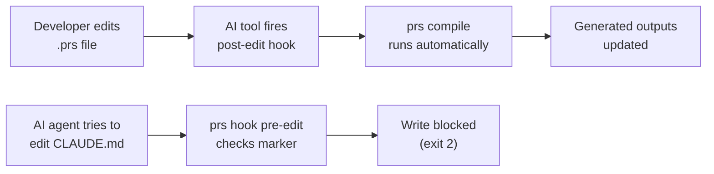
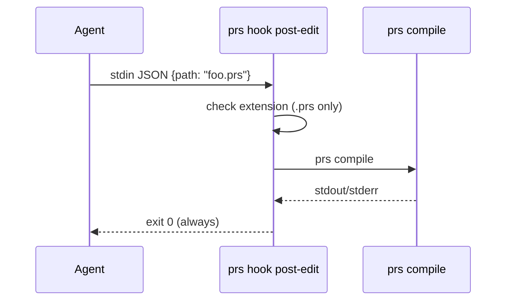

# AI Tool Hooks

PromptScript hooks integrate directly with your AI coding tool's native hook system to keep compiled outputs in sync automatically — no manual `prs compile` required.

There are two complementary behaviours:

- **Auto-compilation** — when you save a `.prs` file, `post-edit` runs `prs compile` so every generated output (CLAUDE.md, `.cursor/rules/project.mdc`, etc.) is immediately up to date.
- **Output protection** — when an AI agent tries to edit a generated file directly, `pre-edit` blocks the write and explains that the file is managed by PromptScript.



## Quick Start

One command scaffolds hook configuration for every AI tool detected in the current project:

```bash
prs hooks install
```

That's it. Open a `.prs` file, make a change, and the compiled outputs refresh automatically.

To target a specific tool:

```bash
prs hooks install claude
```

To install for all supported tools regardless of what is detected:

```bash
prs hooks install --all
```

## Supported Tools

| Tool        | Hook event (pre-edit)       | Hook event (post-edit)       | Config path                  | Timeout unit |
| ----------- | --------------------------- | ---------------------------- | ---------------------------- | ------------ |
| Claude Code | `PreToolUse` (Edit/Write/…) | `PostToolUse` (Edit/Write/…) | `.claude/settings.json`      | seconds      |
| Factory AI  | `pre_edit`                  | `post_edit`                  | `.factory/hooks.yaml`        | seconds      |
| Cursor      | `pre-edit`                  | `post-edit`                  | `.cursor/hooks.json`         | milliseconds |
| Windsurf    | `beforeFileSave`            | `afterFileSave`              | `.windsurf/hooks.json`       | milliseconds |
| Cline       | `preFileWrite`              | `postFileWrite`              | `.cline/hooks.json`          | seconds      |
| Copilot     | `pre-tool-call`             | `post-tool-call`             | `.github/copilot/hooks.json` | seconds      |
| Gemini CLI  | `before_tool_call`          | `after_tool_call`            | `.gemini/hooks.json`         | seconds      |

Tools without a native hook system can use `prs compile --watch` as a fallback — see [Fallback: watch mode](#fallback-watch-mode).

## How It Works

### pre-edit: protecting generated files

When an AI agent attempts to edit any file that contains a PromptScript generation marker, `prs hook pre-edit` reads the attempted path from stdin, checks for the marker, and exits with code 2 if found. The tool interprets exit 2 as "block this action" and shows the message printed to stderr.

Example stderr output:

```
CLAUDE.md is generated by PromptScript. Edit .promptscript/project.prs instead,
then run `prs compile` (or let the post-edit hook do it automatically).
```

Generated files carry a marker comment at the top, written by the compiler:

```
# Generated by PromptScript — do not edit directly.
# Source: .promptscript/project.prs
```

The hook reads the first few lines of the target file to detect this marker. If the file does not exist yet, or has no marker, the edit is allowed through (exit 0).

### post-edit: auto-compilation

When an AI agent (or the developer) saves a `.prs` file, `prs hook post-edit` runs `prs compile` in the background. The hook always exits 0 so the save itself is never blocked regardless of compilation outcome. Errors from compilation are written to stderr for the tool to display.



## Manual Configuration

If `prs hooks install` does not support your tool or you need to customise the generated config, you can wire the hooks manually.

### Claude Code

Add to `.claude/settings.json`:

```json
{
  "hooks": {
    "PreToolUse": [
      {
        "matcher": "Edit|Write|MultiEdit",
        "hooks": [
          {
            "type": "command",
            "command": "prs hook pre-edit"
          }
        ]
      }
    ],
    "PostToolUse": [
      {
        "matcher": "Edit|Write|MultiEdit",
        "hooks": [
          {
            "type": "command",
            "command": "prs hook post-edit"
          }
        ]
      }
    ]
  }
}
```

### Cursor

Add to `.cursor/hooks.json`:

```json
{
  "hooks": [
    {
      "event": "pre-edit",
      "command": "prs hook pre-edit",
      "timeout": 5000
    },
    {
      "event": "post-edit",
      "command": "prs hook post-edit",
      "timeout": 30000
    }
  ]
}
```

### Windsurf

Add to `.windsurf/hooks.json`:

```json
{
  "hooks": [
    {
      "event": "beforeFileSave",
      "command": "prs hook pre-edit",
      "timeout": 5000
    },
    {
      "event": "afterFileSave",
      "command": "prs hook post-edit",
      "timeout": 30000
    }
  ]
}
```

### Factory AI

Add to `.factory/hooks.yaml`:

```yaml
hooks:
  pre_edit:
    - command: prs hook pre-edit
      timeout: 5
  post_edit:
    - command: prs hook post-edit
      timeout: 30
```

### Cline

Add to `.cline/hooks.json`:

```json
{
  "hooks": [
    {
      "event": "preFileWrite",
      "command": "prs hook pre-edit",
      "timeout": 5
    },
    {
      "event": "postFileWrite",
      "command": "prs hook post-edit",
      "timeout": 30
    }
  ]
}
```

### Copilot

Add to `.github/copilot/hooks.json`:

```json
{
  "hooks": [
    {
      "event": "pre-tool-call",
      "command": "prs hook pre-edit",
      "timeout": 5
    },
    {
      "event": "post-tool-call",
      "command": "prs hook post-edit",
      "timeout": 30
    }
  ]
}
```

### Gemini CLI

Add to `.gemini/hooks.json`:

```json
{
  "hooks": [
    {
      "event": "before_tool_call",
      "command": "prs hook pre-edit",
      "timeout": 5
    },
    {
      "event": "after_tool_call",
      "command": "prs hook post-edit",
      "timeout": 30
    }
  ]
}
```

## Fallback: Watch Mode

For AI tools that do not support hooks, run `prs compile --watch` in a terminal alongside your editor session. It watches for changes to any `.prs` file and recompiles immediately.

```bash
prs compile --watch
```

This does not provide the output-protection behaviour of `pre-edit`. To protect generated files without hooks, consider making them read-only:

```bash
chmod 444 CLAUDE.md .cursor/rules/project.mdc
```

See [`prs compile`](../reference/cli.md#prs-compile) for full watch options.

## Troubleshooting

### Hook times out

Increase the timeout in your tool's hook config. A cold `prs compile` run on a large project can take a few seconds. Recommended: 30 s (or 30 000 ms for tools that use milliseconds).

### `prs: command not found`

The hook process may run in a restricted PATH. Use the full path to the binary:

```bash
which prs   # find the path
```

Then update the hook command to e.g. `/usr/local/bin/prs hook pre-edit`.

Alternatively, use `npx`:

```bash
npx prs hook pre-edit
```

### Generated file is still editable

Check that the compiler is writing the marker. Run `prs compile` and inspect the first line of a generated output. If the marker is absent, ensure you are on version 1.5+ of the CLI.

### Stale lock file

If compilation fails with a lock error after the hook fires:

```bash
prs lock
```

This regenerates the lockfile from the current imports. See [`prs lock`](../reference/cli.md#prs-lock) for details.

### Uninstalling hooks

```bash
prs hooks uninstall          # remove all detected tool configs
prs hooks uninstall claude   # remove only Claude Code config
```
