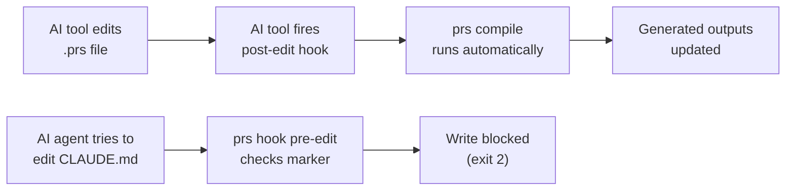
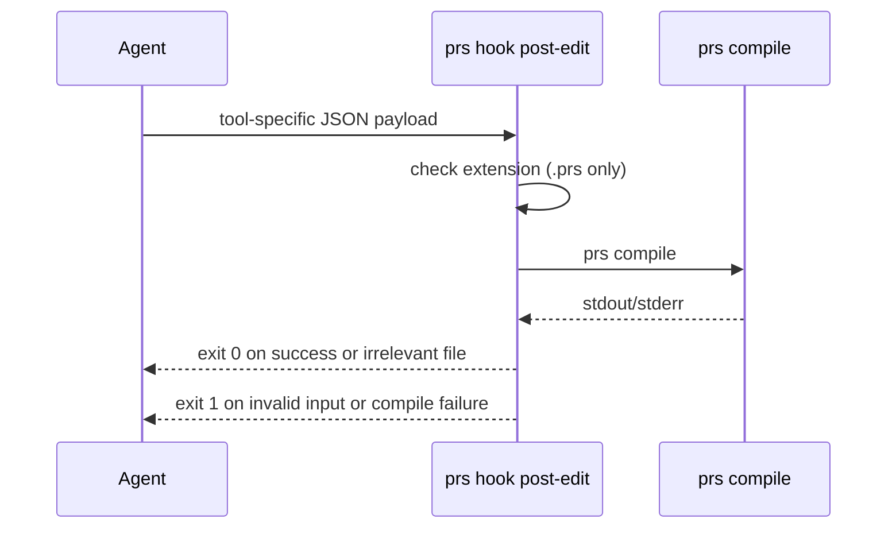

# AI Tool Hooks

PromptScript hooks integrate directly with supported AI coding tool event systems.

There are two complementary behaviours:

- **Auto-compilation** - when the AI tool writes a `.prs` file, `post-edit` runs `prs compile`.
- **Output protection** - when an AI agent tries to edit a generated file directly, `pre-edit` blocks the write and explains that the file is managed by PromptScript.



## Quick Start

One command scaffolds hook configuration for every AI tool detected in the current project:

```bash
prs hooks install
```

Edits performed through a detected AI tool now trigger the generated hooks.

To target a specific tool:

```bash
prs hooks install claude
```

If a tool is not detected, specify its name explicitly.

## Supported Tools

| Tool        | Hook event (pre-edit) | Hook event (post-edit) | Config path                                | Timeout unit |
| ----------- | --------------------- | ---------------------- | ------------------------------------------ | ------------ |
| Claude Code | `PreToolUse`          | `PostToolUse`          | `.claude/settings.json`                    | seconds      |
| Factory AI  | `PreToolUse`          | `PostToolUse`          | `.factory/settings.json`                   | seconds      |
| Cursor      | `beforeFileEdit`      | `afterFileEdit`        | `.cursor/hooks.json`                       | milliseconds |
| Windsurf    | `pre_write_code`      | `post_write_code`      | `.windsurf/hooks.json`                     | milliseconds |
| Cline       | pre-edit script       | post-edit script       | `.clinerules/hooks/prs-{pre,post}-edit.sh` | n/a          |
| Copilot     | `PreToolUse`          | `PostToolUse`          | `.vscode/hooks.json`                       | seconds      |
| Gemini CLI  | `BeforeTool`          | `AfterTool`            | `.gemini/settings.json`                    | milliseconds |

Tools without a native hook system can use `prs compile --watch` as a fallback — see [Fallback: watch mode](#fallback-watch-mode).

## How It Works

### pre-edit: protecting generated files

When an AI agent attempts to edit any file that contains a PromptScript generation marker, `prs hook pre-edit` reads the attempted path from stdin, checks for the marker, and exits with code 2 if found. The tool interprets exit 2 as "block this action" and shows the message printed to stderr.

Example stderr output:

```
CLAUDE.md is generated by PromptScript. Edit .promptscript/project.prs instead,
then run `prs compile` (or let the post-edit hook do it automatically).
```

Generated files carry one of PromptScript's marker formats near the top:

```
<!-- PromptScript | source: .promptscript/project.prs | target: claude -->
# promptscript-generated: project
> Auto-generated by PromptScript
```

The hook scans the first 50 lines. If the file does not exist or has no recognized marker, the edit
is allowed.

### post-edit: auto-compilation

When a supported AI tool writes a `.prs` file, `prs hook post-edit` runs `prs compile`. Compilation
errors are written to stderr.



## Generated Configuration

Use `prs hooks install [tool]` instead of copying hook payloads manually. PromptScript merges the
current tool-specific event names, command shapes, timeout units, and settings paths shown above.
Review the generated configuration before committing it.

## Fallback: Watch Mode

For AI tools that do not support hooks, run `prs compile --watch` in a terminal alongside your editor session. It watches for changes to any `.prs` file and recompiles immediately.

```bash
prs compile --watch
```

This does not provide the output-protection behaviour of `pre-edit`. Keep generated files writable
so watch mode can replace them, and rely on generation markers plus code review to prevent manual
edits.

See [`prs compile`](../reference/cli.md#prs-compile) for full watch options.

## Troubleshooting

### Hook times out

Increase the timeout in your tool's hook config. A cold `prs compile` run on a large project can take a few seconds. Recommended: 30 s (or 30 000 ms for tools that use milliseconds).

### `prs: command not found`

The hook process may run in a restricted PATH. Use the full path to the binary:

```bash
which prs   # find the path
```

Then update the hook command to e.g. `/usr/local/bin/prs hook pre-edit`.

Alternatively, use `npx`:

```bash
npx --package=@promptscript/cli prs hook pre-edit
```

### Generated file is still editable

Check that the compiler is writing the marker. Run `prs compile` and inspect the first line of a generated output. If the marker is absent, ensure you are on version 1.5+ of the CLI.

### Hook compilation is temporarily skipped

Hook-triggered compilation uses a short-lived mutex under `/tmp` to prevent overlapping runs. A
stale mutex expires automatically after 30 seconds. The `prs lock` command manages registry
dependency resolution and does not clear this hook mutex.

### Uninstalling hooks

```bash
prs hooks uninstall          # remove all detected tool configs
prs hooks uninstall claude   # remove only Claude Code config
```
