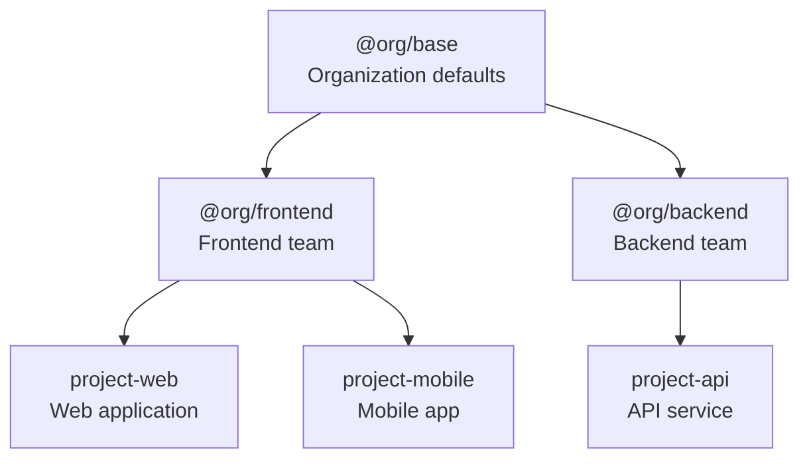
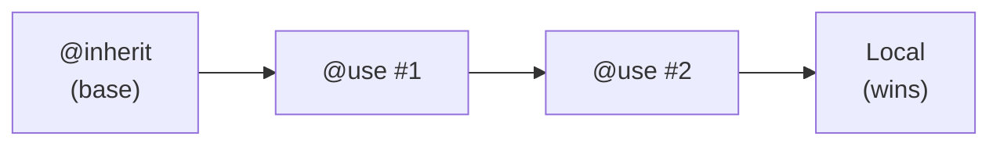
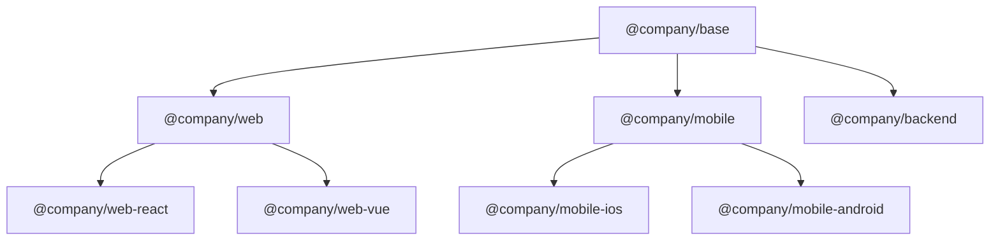

# Inheritance Guide

Learn how to build scalable, maintainable instruction hierarchies using PromptScript's inheritance system.

## Overview

PromptScript uses single inheritance to build hierarchical instruction sets:



## Basic Inheritance

Use `@inherit` to extend another PromptScript file:

```promptscript
@meta {
  id: "my-project"
  syntax: "1.0.0"
}

@inherit @company/frontend-team
```

<!-- playground-link-start -->
<a href="https://getpromptscript.dev/playground/?s=N4IgZglgNgpgziAXAbVABwIYBcAWSQwAeGAtmrAHRoBOCANCAMYD2AdljO-gAIkxYYABMAA6rQYIgATRIJEgSATwC0NZgCsYjLPLES4i9hkKz5ARgoAGK7tYBfMWIDEg7hFY4Y1CFlcsyGKyKAPRg1GwcrFLKHKQSLgAU1DAA5hBwWNSKgsqCUukYAEawUoJgzNSC5BiKKeEArlEAlCB2ALoMnJmK+ESk5DBUtCAMAG5ecBBs+GatQA" target="_blank" rel="noopener noreferrer">
  
</a>
<!-- playground-link-end -->

The child inherits all blocks from the parent, which can then be extended.

## Registry Structure

Organize your registry with namespaces:

```
registry/
├── @company/
│   ├── base.prs           # Organization base
│   ├── frontend.prs       # Frontend team
│   ├── backend.prs        # Backend team
│   └── mobile.prs         # Mobile team
├── @core/
│   ├── security.prs       # Security standards
│   └── compliance.prs     # Compliance rules
└── @fragments/
    ├── testing.prs        # Testing patterns
    └── logging.prs        # Logging standards
```

## Merge Behavior

Different blocks merge differently during inheritance:

### Text Blocks (Concatenate)

`@identity`, `@knowledge`, and text content in other blocks concatenate:

=== "Parent File"

    ```promptscript
    # parent.prs
    @meta {
      id: "parent"
      syntax: "1.0.0"
    }

    @identity {
      """
      You are a helpful assistant.
      """
    }
    ```

<!-- playground-link-start -->
<a href="https://getpromptscript.dev/playground/?s=N4IgZglgNgpgziAXAbVABwIYBcAWSQwAeGAtmrAHRoBOCANCAMYD2AdljO-gMQAEm1Tliq0AOqwACJGFgy9g43rwgATRL1EgBQzYt5wAnuwyF1mgIwUADNd2sAvuPETVQiFgPy9ukHaUBNZgBXXgxBUN4cGCg0MCCoULg4CDhZdgpvXyzxexB7AF0GIWoDfCJSchgRehAANxhaCDZ8czygA" target="_blank" rel="noopener noreferrer">
  
</a>
<!-- playground-link-end -->

=== "Child File"

    ```promptscript
    # child.prs
    @meta {
      id: "child"
      syntax: "1.0.0"
    }

    @inherit ./parent

    @identity {
      """
      You specialize in React development.
      """
    }
    ```

<!-- playground-link-start -->
<a href="https://getpromptscript.dev/playground/?s=N4IgZglgNgpgziAXAbVABwIYBcAWSQwAeGAtmrAHRoBOCANCAMYD2AdljO-gMQAEjOaABMqtADqsAAiRhYMvYBN68IQxLzFNBUIZqW84AT3YZC6zQEYKABht7WAXwkTJEVjhjUIWXhQD0mNScWM5SqsHehgr6eiD2ygCazACuBmgwjBAYUBAAXjAqrLwASjAYjD5CMABuMFDMaDLsFDFxbRIOIA4AugzB1Ib4RKTkMKL0ILW0EGz4Fl1AA" target="_blank" rel="noopener noreferrer">
  
</a>
<!-- playground-link-end -->

=== "Merged Output"

    ```markdown
    ## Identity

    You are a helpful assistant.

    You specialize in React development.
    ```

### Objects (Deep Merge)

`@standards` and object properties deep merge:

=== "Parent File"

    ```promptscript
    # parent.prs
    @meta {
      id: "parent"
      syntax: "1.0.0"
    }

    @standards {
      code: ["Follow clean code principles", "Testing required"]
    }
    ```

<!-- playground-link-start -->
<a href="https://getpromptscript.dev/playground/?s=N4IgZglgNgpgziAXAbVABwIYBcAWSQwAeGAtmrAHRoBOCANCAMYD2AdljO-gMQAEm1Tliq0AOqwACJGFgy9g43rwgATRL1EgBQzYt5wAnuwyF1mgIwUADNd2sAvuPES4s1iozUVceXpYqYdWRNADFmKChmAHdeRlgMVljmAP5qCFZGCHJ4TToNEAAVeCx0gHNeQQBHAFcIQRVNAF1xexB7RoYhagN8IlJskXoQADcYWgg2fHM2oA" target="_blank" rel="noopener noreferrer">
  
</a>
<!-- playground-link-end -->

=== "Child File"

    ```promptscript
    # child.prs
    @meta {
      id: "child"
      syntax: "1.0.0"
    }

    @inherit ./parent

    @standards {
      code: ["Use React framework", "80% test coverage required"]
    }
    ```

<!-- playground-link-start -->
<a href="https://getpromptscript.dev/playground/?s=N4IgZglgNgpgziAXAbVABwIYBcAWSQwAeGAtmrAHRoBOCANCAMYD2AdljO-gMQAEjOaABMqtADqsAAiRhYMvYBN68IQxLzFNBUIZqW84AT3YZC6zQEYKABht7WAXwkTJEVjhjUIWXhQD0mNScWM5ScHKsQhjUQnAK+ixCMOrImgCqcDC8AEowGIw+YNSkMADuzNQA1pp0GiAAHNYApLwc4fzMAG6eGADmWUEAjgCuEEG6IAC6Eg4gDpMMwdSG+ESk5DCi9CDdtBBs+BZzQA" target="_blank" rel="noopener noreferrer">
  
</a>
<!-- playground-link-end -->

=== "Merged Output"

    ```yaml
    code:
      # Arrays are concatenated (parent first, then child)
      - Follow clean code principles
      - Testing required
      - Use React framework
      - 80% test coverage required
    ```

### Arrays (Concatenate)

`@restrictions` and array values concatenate:

=== "Parent File"

    ```promptscript
    # parent.prs
    @meta {
      id: "parent"
      syntax: "1.0.0"
    }

    @restrictions {
      - "Never expose secrets"
    }
    ```

<!-- playground-link-start -->
<a href="https://getpromptscript.dev/playground/?s=N4IgZglgNgpgziAXAbVABwIYBcAWSQwAeGAtmrAHRoBOCANCAMYD2AdljO-gMQAEm1Tliq0AOqwACJGFgy9g43rwgATRL1EgBQzYt5wAnuwyF1mgIwUADNd2sAvuPETBcLNQiMsENnHl6AWg0QADkYADcYal4iNGY4GH0YRkEsODt7EHsAXQYhagN8IlJyGBF6EEjaH1Z8cyygA" target="_blank" rel="noopener noreferrer">
  
</a>
<!-- playground-link-end -->

=== "Child File"

    ```promptscript
    # child.prs
    @meta {
      id: "child"
      syntax: "1.0.0"
    }

    @inherit ./parent

    @restrictions {
      - "Always use TypeScript"
    }
    ```

<!-- playground-link-start -->
<a href="https://getpromptscript.dev/playground/?s=N4IgZglgNgpgziAXAbVABwIYBcAWSQwAeGAtmrAHRoBOCANCAMYD2AdljO-gMQAEjOaABMqtADqsAAiRhYMvYBN68IQxLzFNBUIZqW84AT3YZC6zQEYKABht7WAXwkTJEVjhjUIWXhQD0mNScWM5SQXBYXoxYEGxwCvoAtBogAIJQAO4YhvEArnAwvAAqhmgwAMqMXmghIBIOIA4AugzB1Ib4RKTkMKL0IABunnCxrPgWjUA" target="_blank" rel="noopener noreferrer">
  
</a>
<!-- playground-link-end -->

=== "Merged Output"

    ```markdown
    ## Restrictions

    - Never expose secrets
    - Always use TypeScript
    ```

### Shortcuts (Override)

`@shortcuts` entries override by key:

=== "Parent File"

    ```promptscript
    # parent.prs
    @meta {
      id: "parent"
      syntax: "1.0.0"
    }

    @shortcuts {
      "/test": "Write unit tests"
      "/docs": "Generate documentation"
    }
    ```

<!-- playground-link-start -->
<a href="https://getpromptscript.dev/playground/?s=N4IgZglgNgpgziAXAbVABwIYBcAWSQwAeGAtmrAHRoBOCANCAMYD2AdljO-gMQAEm1Tliq0AOqwACJGFgy9g43rwgATRL1EgBQzYt5wAnuwyF1mgIwUADNd2sAvuPES4OZtSyMArljjy9mgD0HHBYmmYgAOrUEBy8XqyxvCG+dkpBKsyMcOEaIADinDDU2DC8md7SxlgQbHb2IPYAugxC1Ab4RKTkMCL0IABuxXC1rPjmjUA" target="_blank" rel="noopener noreferrer">
  
</a>
<!-- playground-link-end -->

=== "Child File"

    ```promptscript
    # child.prs
    @meta {
      id: "child"
      syntax: "1.0.0"
    }

    @inherit ./parent

    @shortcuts {
      "/test": "Write tests with Vitest"
      "/lint": "Run ESLint"
    }
    ```

<!-- playground-link-start -->
<a href="https://getpromptscript.dev/playground/?s=N4IgZglgNgpgziAXAbVABwIYBcAWSQwAeGAtmrAHRoBOCANCAMYD2AdljO-gMQAEjOaABMqtADqsAAiRhYMvYBN68IQxLzFNBUIZqW84AT3YZC6zQEYKABht7WAXwkTJEVjhjUIWXhQD0mNScWM5ScDjM1FiMAK5YcAr6mn4ccCFIGiAA6l4cvKnxvADu3ji8AGre8OlJIH5QbunmIABKMay8AKIAygAyjfYOIA4AugzB1Ib4RKTkMKL0IABunnAQbPgWw0A" target="_blank" rel="noopener noreferrer">
  
</a>
<!-- playground-link-end -->

=== "Merged Output"

    ```markdown
    ## Shortcuts

    | Command | Description |
    |---------|-------------|
    | /test | Write tests with Vitest |
    | /docs | Generate documentation |
    | /lint | Run ESLint |
    ```

## Using @extend

The `@extend` block modifies specific paths:

### Extending Top-Level Blocks

```promptscript
@inherit @company/base

# Add to identity
@extend identity {
  """
  Additional identity context.
  """
}
```

<!-- playground-link-start -->
<a href="https://getpromptscript.dev/playground/?s=N4IgZglgNgpgziAXAbVABwIYBcAWSQwAeGAtmrAHRoBOCANCAMYD2AdljO-gMQAEAAhFY4Y1CFgEsyGVgE8A9ACMMcGL158AFNRgBzCHCzVZvALS8AJgYyLYF3mGbVe5DLN3VmAV1YWAlAA6rHwAghb2WMy8EBacWOKyQfxEHL7RsewJvMBB6gEg+YWs6mFW8WwYUOlxWSzsKRS5vIUFBawAviDtALoMccb4RKTkMFS0IAwAbqJwEGz4AIxdQA" target="_blank" rel="noopener noreferrer">
  
</a>
<!-- playground-link-end -->

### Extending Nested Paths

```promptscript
@inherit @company/base

# Modify nested structure
@extend standards.code.testing {
  e2e: required
  coverage: 90
}
```

<!-- playground-link-start -->
<a href="https://getpromptscript.dev/playground/?s=N4IgZglgNgpgziAXAbVABwIYBcAWSQwAeGAtmrAHRoBOCANCAMYD2AdljO-gMQAEAAhFY4Y1CFgEsyGVgE8A9ACMMcGL158AFNRgBzCHCzVZvALS8AJgYyLYF3mGbVe5DLN3VmAV1YWAlAA6rHwAssxWYCas8Bz2htRejFheOkH8RBy+vIYyFhjUFnAULBYwFByGQrq8wEHqMABMMIi8OgCOXhA6FnW8LABuohi6zbwAnAAMQQC+INMAugycRrL4RKTkZTT0IIO0EGz4AIxzQA" target="_blank" rel="noopener noreferrer">
  
</a>
<!-- playground-link-end -->

### Multiple Extensions

```promptscript
@inherit @company/base

@extend identity {
  """
  You are a frontend expert.
  """
}

@extend standards.code {
  framework: "react"
}

@extend restrictions {
  - "Use functional components only"
}
```

<!-- playground-link-start -->
<a href="https://getpromptscript.dev/playground/?s=N4IgZglgNgpgziAXAbVABwIYBcAWSQwAeGAtmrAHRoBOCANCAMYD2AdljO-gMQAEAAhFY4Y1CFgEsyGVgE8A9ACMMcGL158AFNRgBzCHCzVZvALS8AJgYyLYF3mGbVe5DLN3VmAV1YWAlAA6rPxEHL68EBacWOImwEHqASBJKazqAJrevBg62Q6e7Jz2RGiiWBQJvCnJyawAvkFBIYRh9oYyFjkWcBQsUbzxafmkMADuTgDWiFUgOhiMWKkNrE2hRbw6hmILEGxwA5XmSQCqqg4+O2wYULxSaGzR+2xQsksgdQC6DNHG+ESk5BgVFoIAYADdRHBdqx8ABGd5AA" target="_blank" rel="noopener noreferrer">
  
</a>
<!-- playground-link-end -->

## Composition with @use

Use `@use` to import and merge fragments (like mixins):

```promptscript
@meta {
  id: "my-project"
  syntax: "1.0.0"
}

@inherit @company/frontend

# Import fragments - blocks are merged into your file
@use @core/security
@use @core/compliance
@use @fragments/testing

# With alias - also available for @extend
@use @fragments/api-standards as api
```

<!-- playground-link-start -->
<a href="https://getpromptscript.dev/playground/?s=N4IgZglgNgpgziAXAbVABwIYBcAWSQwAeGAtmrAHRoBOCANCAMYD2AdljO-gAIkxYYABMAA6rQYIgATRIJEgSATwC0NZgCsYjLPLES4i9hkKz5ARgoAGK7tYBfMWIDEg7hFY4Y1CFlcsyGKyKAPRg1GwcrFISLgAU1DAA5hBwWNSKgsqCUikYAEaw0WDM1ILkGIqJ4QCuUQCUzoIAkmQlvmEYiXzscJmCBcyMANa9GAmCfNSJMNHuWMyCiszVpZCwjdzVcDB+JTDB24wrPhmCcQnJqel9OXD5hYLFpeWVNfUbWzvcLAnB-uQQQKMHZnQTxJIpNIZLK3e4zR4lMpQCpVZbvVguTbbVwdLqcLBwYIcVLuRIxMEXSHXGG5Arwp5IlFvKQNDGCADqPhwggwUEBvSyvLgCwwADcMNA4QjStwiJEpB9sdxcd0CcEMGgIMpUoEpGMpKNRpryeDLlCbrSHgyXqjaiyQHYALoMfHpfBEUjkGBUWggBiirxwCBsfBmB1AA" target="_blank" rel="noopener noreferrer">
  
</a>
<!-- playground-link-end -->

### How @use Differs from @inherit

| Feature              | `@inherit`                                    | `@use`                                        |
| -------------------- | --------------------------------------------- | --------------------------------------------- |
| **Quantity**         | Single parent only                            | Multiple allowed                              |
| **Semantics**        | "IS-A" (this project IS a TypeScript library) | "HAS-A" (this project HAS security standards) |
| **Purpose**          | Define fundamental project type               | Add optional capabilities                     |
| **Merge precedence** | Child overrides parent                        | Later @use overrides earlier                  |
| **@extend support**  | Always available                              | Only with alias                               |

### When to Use Which

**Use `@inherit` for:**

- Defining your project's fundamental type (library, backend, frontend)
- Building organizational hierarchies (base → team → project)
- When you want a single, clear inheritance chain

```promptscript
# This project IS a TypeScript library
@inherit @stacks/typescript-lib
```

<!-- playground-link-start -->
<a href="https://getpromptscript.dev/playground/?s=N4IgZglgNgpgziAXAbVABwIYBcAWSQwAeGAtmrAHRoBOCANCAMYD2AdljO-gMQAEAKjghxeNZgCsYjLLwCSAZV4YBATzQx5jahDQyoEAEbUM1FQB1WfAAIRWOGNplW4WDIwDWcAPRY18LTpYALT6Bry8fAAU1DAA5sJYprxBvAAmwhgGsKm8YMzUolAYKrHUzACurKkAlCAAvgC6DJyJKvhEpOQwVLQgDABuDnAQbPgAjPVAA" target="_blank" rel="noopener noreferrer">
  
</a>
<!-- playground-link-end -->

**Use `@use` for:**

- Adding optional capabilities (security, testing, quality)
- Mixing in reusable fragments
- When you need multiple imports

```promptscript
# This project HAS these capabilities
@use @core/security
@use @core/quality
@use @fragments/testing
```

<!-- playground-link-start -->
<a href="https://getpromptscript.dev/playground/?s=N4IgZglgNgpgziAXAbVABwIYBcAWSQwAeGAtmrAHRoBOCANCAMYD2AdljO-gMQAEAKjghxeNZgCsYjLLwASAQQDKvXPBi9GGTACNoELBHgAdVnwACAVzjqzLajAD01xher6Anr158AFPYDmwljUngC0vAAmwhjasBG8YMzUolAY7v7UzBasEQCUJuZWNnaOAI4WGFAeXr4BQSG84VFwMXEJSSlpGVk5+aa8ltYDYNQY-iScWHAOHHAGrP41vH4wgXMNTdGxMPGJyeRdmdl5IAC+ALoMkyH4RKTkMFS0IAwAbjC0EGz4AIxnQA" target="_blank" rel="noopener noreferrer">
  
</a>
<!-- playground-link-end -->

### Merge Precedence

When the same property exists in multiple sources:

```
@inherit @stacks/typescript-lib    # Base values
@use @core/security                # Overrides @inherit for same keys
@use @core/quality                 # Overrides earlier @use for same keys
@standards { ... }                 # Local values override everything
```

**Rule:** Later sources override earlier sources for the same keys.



### Fragment Files

Create reusable fragments:

```promptscript
# @fragments/testing.prs
@meta {
  id: "@fragments/testing"
  syntax: "1.0.0"
}

@standards {
  testing: ["Use vitest as test framework", "Maintain 80% code coverage", "Write unit and integration tests"]
}

@shortcuts {
  "/test": "Write comprehensive tests"
  "/coverage": "Check test coverage"
}
```

<!-- playground-link-start -->
<a href="https://getpromptscript.dev/playground/?s=N4IgZglgNgpgziAXAbVABwIYBcAWSQwAeGAtmrAHRoBOCANCAMYD2AdljO-gMQAEAAmGoYA5iU5Y4Aeg5wsEViKq0AOq37isGXsDW9eEACaJeKkIOFiJ02fMVm9vOAE92GQibMBGCgAY-DqwAvmpq-HIYrIYY1IZwOo62CiImyGYAqnAwvABuELa8GPEFQqQwAO7M1ADWZnSmIACyGApaCrwAHL4ApLwshtksOTCWMHUNAOrU+dkArqz5hVEG7DAiwvJsvLZwZgC6aiGsYXA4VViMs5IJrPpmMvBYZp4gUzN9zGTUMDiccBDDbaPXYgRz3IYjURjJANADCv0Y1SBcg+w1GgSCICCewYEmoznwRFI5BgynoIDR-zY+C8WKAA" target="_blank" rel="noopener noreferrer">
  
</a>
<!-- playground-link-end -->

When imported with `@use @fragments/testing`, these blocks are merged directly into your file.

## Best Practices

### 1. Keep Base Configurations Minimal

Organization base should include only universal standards:

```promptscript
# @company/base.prs
@meta {
  id: "@company/base"
  syntax: "1.0.0"
}

@identity {
  """
  You are an AI assistant at ACME Corp.
  Follow company guidelines and best practices.
  """
}

@restrictions {
  - "Never expose credentials"
  - "Follow data protection policies"
}
```

<!-- playground-link-start -->
<a href="https://getpromptscript.dev/playground/?s=N4IgZglgNgpgziAXAbVABwIYBcAWSQwAeGAtmrAHRoBOCANCAMYD2AdljO-gMQAEAAizIZWATwD0AIwxwYVWgB1W-EjCwZewJb14QAJol4KQg5sLFSZMY9t5xR7DIUPGAjBQAMnm6wC+SpX59TiwILFFNWxsQHx0ATWYAV14MahgU1l4AQQBJFLg4CDh1dhSsbIBhAFkAUV4K5mo0ClsAMWYoKGYAd14hTDFeAHNE4KgIVngMvV5JeHKaDEZQxngWzKMYraV-VkC04uoIZYg2OEiNgFpNgDkYADcYal4iNGZZPrS9EIgMKDhYrxrsZ2p0erw9NgNDRmBwTmxeG9xowIPAfL4QL4ALoMELUUT4IikchyGj0ECPWinVj4VyYoA" target="_blank" rel="noopener noreferrer">
  
</a>
<!-- playground-link-end -->

### 2. Use Team Configurations for Specialization

```promptscript
# @company/frontend.prs
@meta {
  id: "@company/frontend"
  syntax: "1.0.0"
}

@inherit @company/base

@identity {
  """
  You specialize in frontend development.
  """
}

@context {
  """
  Tech stack: React, TypeScript, Vite
  """
}
```

<!-- playground-link-start -->
<a href="https://getpromptscript.dev/playground/?s=N4IgZglgNgpgziAXAbVABwIYBcAWSQwAeGAtmrAHRoBOCANCAMYD2AdljO-gMQAEAAizIZWATwD0Yamw6sAJlVoAdVvxIwsGXsBW9eEOYl5KQg5sLGTp7TnJO7ecUewyEjJgIwUADD-usAXxUVPn4IVhwYaggsASFMSwAjDDgYPT4ACmoYAHMIOCxqUV4AWl45fIxE2DleMGZqXnIMURzpAFd5AEoVMLlOLBjinVY9exB-PQBNZnbHNBhGCAwoCAAvNPC661la-oA3GChmNHV2Cgdx-yDWXpYbQliRsYnXhwAVRZxHTUYAayMACUYBhGFg6Lx3qIFgBlRjRNDg3gANRiMEubwmgRAAQAugwBkV8ERSOQYIp6CBDrQIGx8B4cUA" target="_blank" rel="noopener noreferrer">
  
</a>
<!-- playground-link-end -->

### 3. Project Configurations for Specifics

```promptscript
# project.prs
@meta {
  id: "checkout-app"
  syntax: "1.0.0"
}

@inherit @company/frontend

@context {
  project: "Checkout Application"

  """
  E-commerce checkout flow with Stripe integration.
  """
}
```

<!-- playground-link-start -->
<a href="https://getpromptscript.dev/playground/?s=N4IgZglgNgpgziAXAbVABwIYBcAWSQwAeGAtmrAHRoBOCANCAMYD2AdljO-gMQAENzAFYxGWKrQA6rAAIkYWDL2BTevCABNEvCUxwiA1swCuWALQY0aHSt5wAnuwyEtOgIwUADJ+usAvlKk+aQhWPWoILF5pFjIMVjsAejBqNg5WdVU+AApqGABzCDgsajteU151QowAI1gMsGZqfigMOzyUo3SASilo1KJI5VZVAWFRFxAAYT1GQxNeAEFLKAhGbAg2HxtrEB9VAFFTGLlqRhheRhm5yLAoZgB3XnuInF4AZWKINHOQjnb1tgUba7EFSXwgXwAXQYnGKdnwRFI5Bg4noIAAbjBaBtWPhXBCgA" target="_blank" rel="noopener noreferrer">
  
</a>
<!-- playground-link-end -->

### 4. Version Your Registry

Use semantic versioning for registry files:

```promptscript
@inherit @company/frontend@1.0.0
```

<!-- playground-link-start -->
<a href="https://getpromptscript.dev/playground/?s=N4IgZglgNgpgziAXAbVABwIYBcAWSQwAeGAtmrAHRoBOCANCAMYD2AdljO-gMQAEAAhFY4Y1CFgEsyGVgE8A9GGpsOrACb8AjBQAMu3rz4AKajADmEOFmqzeAWl5rLGAEaw1vMM2q9yGWWbKAK7qAJQgAL4Augyc1rL4RKTkMFS0IAwAbqJwEGz4mpFAA" target="_blank" rel="noopener noreferrer">
  
</a>
<!-- playground-link-end -->

### 5. Document Inheritance Chains

Include comments explaining the hierarchy:

```promptscript
# Inheritance chain:
# @company/base → @company/frontend → this file
@inherit @company/frontend
```

<!-- playground-link-start -->
<a href="https://getpromptscript.dev/playground/?s=N4IgZglgNgpgziAXAbVABwIYBcAWSQwAeGAtmrAHRoBOCANCAMYD2AdljO-gMQAEAkqxwxqELBlaMYvRjgwRWiADqs+AARZkJATwD0AIwxxpgJMJeG5ltZ6w1Nh1YATXmdwQ4vSLBXqFw0VjmmpjWurb2nM68fAAU1DAA5u5Y1Nq8ALS8ju4Y+rDOYMzUvOQY2gl2AK5OAJQgAL4AugycKdr4RKTkMFS0IAwAbiJwEGz4AIwNQA" target="_blank" rel="noopener noreferrer">
  
</a>
<!-- playground-link-end -->

## Common Patterns

### Platform-Specific Configurations



### Shared Standards with Team Overrides

```promptscript
# Use shared security, override team-specific
@inherit @company/frontend
@use @core/security
@use @core/compliance

@extend standards.security {
  additionalRules: ["CSP headers"]
}
```

<!-- playground-link-start -->
<a href="https://getpromptscript.dev/playground/?s=N4IgZglgNgpgziAXAbVABwIYBcAWSQwAeGAtmrAHRoBOCANCAMYD2AdljO-gMQAEAqnBi84ODNRgATETEYBXahCwBPOr2YA3GNUWThHUgFo4aWREiMAOqz4ABCKxzalvWyzIZWygPRhqbDlZpXj4ACgkAcwg4LGplXkNeSWiMACNYaTBmal5yDGUI-zkggEprOzkhVxYJbyF5RRVeEN5wmCiYuISklPSpXiycvIKi0vLXSuE3bJhvd3IIT0ZhFraO2PjE5Lg0jIHs3Kh8wuZiyTLWWyJA6RjPSXFJOAp6hSV44GtmjElkrAg2BgoAAlOSwOCIXjISwgADCAGUAAq8Jw-bRwGEAXWsAF8QDjMQxOBt8ERSOQYFRaCAGFpaADWPgAIz4oA" target="_blank" rel="noopener noreferrer">
  
</a>
<!-- playground-link-end -->

### Environment-Specific Extensions

```promptscript
@inherit @company/frontend

@context {
  environment: production
}

@extend restrictions {
  - "No console.log statements"
  - "No debug code"
}
```

<!-- playground-link-start -->
<a href="https://getpromptscript.dev/playground/?s=N4IgZglgNgpgziAXAbVABwIYBcAWSQwAeGAtmrAHRoBOCANCAMYD2AdljO-gMQAEAAhFY4Y1CFgEsyGVgE8A9GGpsOrACa9efABTUYAcwhws1WbwC0vNUYwAjWBrDNqvchln7lAV3UBKADqs-CzsRBLAgZqcAG4QyqwknFiIrspqXoxYEGyBAL6BgfxhnBp6xmKZ2axwvBGsmpb+IAByzLwhcMyUUMz6vMbYMInscE2RFrxNrVYwtl59LGowY6y5ILkAugxJpvhEpOQwVLQgDNGicFX4AIzrQA" target="_blank" rel="noopener noreferrer">
  
</a>
<!-- playground-link-end -->

## Debugging Inheritance

### View Resolved Configuration

```bash
prs compile --dry-run --verbose
```

### Validate Inheritance Chain

```bash
prs validate --verbose
```

### Common Issues

**Circular inheritance detected:**

```
Error: Circular inheritance: a → b → a
```

Ensure no circular references in your inheritance chain.

**Parent not found:**

```
Error: Cannot resolve @company/unknown
```

Check registry configuration and file paths.

**Version mismatch:**

```
Warning: Requested @company/base@2.0.0, found 1.5.0
```

Update version constraints or registry.
