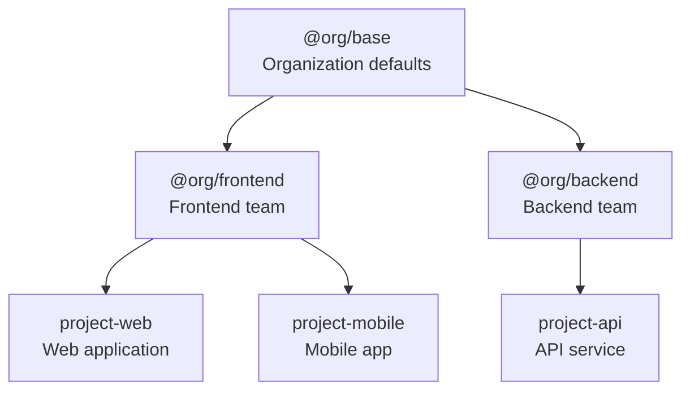
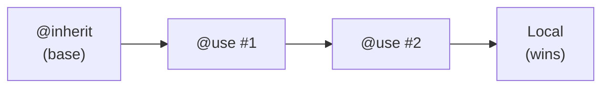
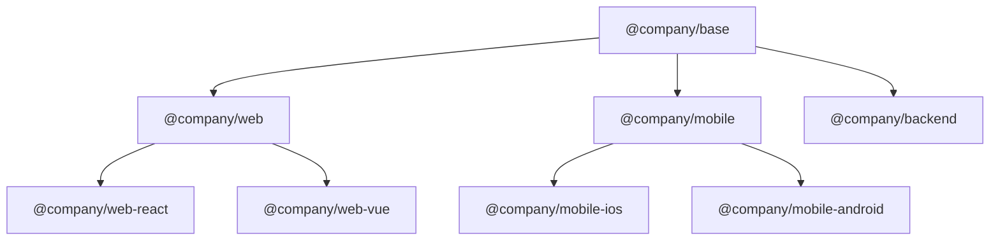

# Inheritance Guide

Learn how to build scalable, maintainable instruction hierarchies using PromptScript's inheritance system.

## Overview

PromptScript uses single inheritance to build hierarchical instruction sets:



## Basic Inheritance

Use `@inherit` to extend another PromptScript file:

```promptscript
@meta {
  id: "my-project"
  syntax: "1.0.0"
}

@inherit @company/frontend-team
```

<!-- playground-link-start -->
<a href="https://getpromptscript.dev/playground/?s=N4IgZglgNgpgziAXAbVABwIYBcAWSQwAeGAtmrAHRoBOCANCAMYD2AdljO-gAIkxYYABMAA6rQYIgATRIJEgSATwC0NZgCsYjLPLES4i9hkKz5ARgoAGK7tYBfMWO4RWOGNQhZB3FmQytFAHowajYOVillDlIQOwBdBk4sakV8IlJyGCpaEAYAN3c4CDZ8M1igA" target="_blank" rel="noopener noreferrer">
  
</a>
<!-- playground-link-end -->

The child inherits all blocks from the parent, which can then be extended.

## Registry Structure

Organize your registry with namespaces:

```
registry/
├── @company/
│   ├── base.prs           # Organization base
│   ├── frontend.prs       # Frontend team
│   ├── backend.prs        # Backend team
│   └── mobile.prs         # Mobile team
├── @core/
│   ├── security.prs       # Security standards
│   └── compliance.prs     # Compliance rules
└── @fragments/
    ├── testing.prs        # Testing patterns
    └── logging.prs        # Logging standards
```

## Merge Behavior

Different blocks merge differently during inheritance:

### Text Blocks (Concatenate)

`@identity`, `@knowledge`, and text content in other blocks concatenate:

=== "Source"

    ```promptscript
    # Parent
    @identity {
      """
      You are a helpful assistant.
      """
    }

    # Child
    @inherit ./parent

    @identity {
      """
      You specialize in React development.
      """
    }
    ```

<!-- playground-link-start -->
<a href="https://getpromptscript.dev/playground/?s=N4IgZglgNgpgziAXAbVABwIYBcAWSQwAeGAtmrAHRoBOCANCAMYD2AdljO-gMQAEAChmqcsAHVYABCABMRELAE9ewcb16iQGrazUBNZgFdeQmMd44YUNGANRjcOBDhYM7CqvWav4gL7jxfADCONDS4lKsFtTyvBQA9JjC7P6SMnKKyh5a3jq8+kZwaDCMEBhQEABephA6AEowGIxYvLIAbpbMaCQi7rnZ2j4gPgC6DCLUCvhEpOQwVLQgDO20EGz4AIxDQA" target="_blank" rel="noopener noreferrer">
  
</a>
<!-- playground-link-end -->

=== "Merged Output"

    ```markdown
    ## Identity

    You are a helpful assistant.

    You specialize in React development.
    ```

### Objects (Deep Merge)

`@standards` and object properties deep merge:

=== "Source"

    ```promptscript
    # Parent
    @standards {
      code: [
        "Follow clean code principles",
        "Testing required"
      ]
    }

    # Child
    @inherit ./parent

    @standards {
      code: [
        "Use React framework",
        "80% test coverage required"
      ]
    }
    ```

<!-- playground-link-start -->
<a href="https://getpromptscript.dev/playground/?s=N4IgZglgNgpgziAXAbVABwIYBcAWSQwAeGAtmrAHRoBOCANCAMYD2AdljO-gMQAEAChmqcsAHVYABOFgysAJkLlxewcb14s5MRL2Rr1vUSABizKFGYB3DbFkbmW3jQitGEcvCN196owBV4LBcAc15hAEcAVwhhOSN9AF1xAF9xcT4AYRxoOMkXHBhqCCxeCgB6TGF2NMlpWQVqJRV9TW1dH0MQAFU4GF4AJRgMRhKwalIYS2ZqAGsvDqMADgAGAFJeDml7ADdCjGC+iOjY+NZ1JNZkkGSEhhFqAE98IlIPKloQBl3aCDZ8AEZrkA" target="_blank" rel="noopener noreferrer">
  
</a>
<!-- playground-link-end -->

=== "Merged Output"

    ```yaml
    code:
      # Arrays are concatenated (parent first, then child)
      - "Follow clean code principles"
      - "Testing required"
      - "Use React framework"
      - "80% test coverage required"
    ```

### Arrays (Concatenate)

`@restrictions` and array values concatenate:

=== "Source"

    ```promptscript
    # Parent
    @restrictions {
      - "Never expose secrets"
    }

    # Child
    @inherit ./parent

    @restrictions {
      - "Always use TypeScript"
    }
    ```

<!-- playground-link-start -->
<a href="https://getpromptscript.dev/playground/?s=N4IgZglgNgpgziAXAbVABwIYBcAWSQwAeGAtmrAHRoBOCANCAMYD2AdljO-gMQAEAChmqcsAHVYABYXCzUIjLBDZxewcb14BaXqJAA5GADcY1XkTTM4MXlcbCscXeIC+48XwDCOaABNxEiFYcEwgsXgoAekxhdjdJaVl5RWVVdS0dEABBKAB3DABPFQBXK14AFXy0GABlOwg0MRAXEGcAXQYRanz8IlJyGCpaEAZjWiVWfABGFqA" target="_blank" rel="noopener noreferrer">
  
</a>
<!-- playground-link-end -->

=== "Merged Output"

    ```markdown
    ## Restrictions

    - Never expose secrets
    - Always use TypeScript
    ```

### Shortcuts (Override)

`@shortcuts` entries override by key:

=== "Source"

    ```promptscript
    # Parent
    @shortcuts {
      "/test": "Write unit tests"
      "/docs": "Generate documentation"
    }

    # Child
    @inherit ./parent

    @shortcuts {
      "/test": "Write tests with Vitest"  # Overrides
      "/lint": "Run ESLint"               # Added
    }
    ```

<!-- playground-link-start -->
<a href="https://getpromptscript.dev/playground/?s=N4IgZglgNgpgziAXAbVABwIYBcAWSQwAeGAtmrAHRoBOCANCAMYD2AdljO-gMQAEAChmqcsAHVYABODmbUsjAK5Y4vYON69RIAPQc4YpJpAB1ahA68Frc7z3Kt6o9oAmzRnC2IjAcU4xq2DC8rookItgQbA6sAL7i4nwAwjjQzuISEKw4-jYU2pjC7PGS0rLySipqrBpauvAGXlqm5kF2KgDu5ji8AGot+loafADyAG7+Zs7wjrVQmQ1GAEpWvACiAMoAMvODGnv7B3wAgs5TabEgMQC6DCLUAJ74RKTkMFS0IAzjtJGs+ACMlyAA" target="_blank" rel="noopener noreferrer">
  
</a>
<!-- playground-link-end -->

=== "Merged Output"

    ```markdown
    ## Shortcuts

    | Command | Description |
    |---------|-------------|
    | /test | Write tests with Vitest |
    | /docs | Generate documentation |
    | /lint | Run ESLint |
    ```

## Using @extend

The `@extend` block modifies specific paths:

### Extending Top-Level Blocks

```promptscript
@inherit @company/base

# Add to identity
@extend identity {
  """
  Additional identity context.
  """
}
```

<!-- playground-link-start -->
<a href="https://getpromptscript.dev/playground/?s=N4IgZglgNgpgziAXAbVABwIYBcAWSQwAeGAtmrAHRoBOCANCAMYD2AdljO-gAISs4xqELAAJuLMhlYBPAPQAjDHBgAdVmoDEIgIIATXSKzMREXZyzDpa7kQ6sDp85ZHA1IkSpCfvrd3t3CEGwYUCZm7M4s7LYUbh5eCWoAviBJALoM5tTS+ESk5DBUtCAMAG6CcEGs+ACMqUA" target="_blank" rel="noopener noreferrer">
  
</a>
<!-- playground-link-end -->

### Extending Nested Paths

```promptscript
@inherit @company/base

# Modify nested structure
@extend standards.code.testing {
  e2e: required
  coverage: 90
}
```

<!-- playground-link-start -->
<a href="https://getpromptscript.dev/playground/?s=N4IgZglgNgpgziAXAbVABwIYBcAWSQwAeGAtmrAHRoBOCANCAMYD2AdljO-gAISs4xqELAAJuLMhlYBPAPQAjDHBgAdVmoDEIgLLMAJhDDSRreBz0i4WagFdGWG9VWtuRDqwtWpejNT1wKFj0YCg4rPgBzEWA1EREYACYYRBEnAEcbCCc9WJEWADdBDAjkkQBOAAY1AF8QaoBdBk5raXwiUnIQmnoQQtoINnwARjqgA" target="_blank" rel="noopener noreferrer">
  
</a>
<!-- playground-link-end -->

### Multiple Extensions

```promptscript
@inherit @company/base

@extend identity {
  """
  You are a frontend expert.
  """
}

@extend standards.code {
  framework: "react"
}

@extend restrictions {
  - "Use functional components only"
}
```

<!-- playground-link-start -->
<a href="https://getpromptscript.dev/playground/?s=N4IgZglgNgpgziAXAbVABwIYBcAWSQwAeGAtmrAHRoBOCANCAMYD2AdljO-gAISs4xqELAAJuLMhlYBPAPQAjDHBgAdVmu5EOrACYiIOzlmHSRwNSJEqQ1260sBNZgFcRGajDciw1Ntr1EaIJYFBZWNhFqAL5qGlqcenBYUjruOnAULIZmYT6kMADuzNQA1ojhHhiMWHYx6qyahP4iHklC1RBscDn2IgC04QCqyt7OrB1sGFAiEmhsRt1sUNK1IFEAugxG1NL4RKTkMFS0IAwAboJwnaz4AIxrQA" target="_blank" rel="noopener noreferrer">
  
</a>
<!-- playground-link-end -->

## Composition with @use

Use `@use` to import and merge fragments (like mixins):

```promptscript
@meta {
  id: "my-project"
  syntax: "1.0.0"
}

@inherit @company/frontend

# Import fragments - blocks are merged into your file
@use @core/security
@use @core/compliance
@use @fragments/testing

# With alias - also available for @extend
@use @fragments/api-standards as api
```

<!-- playground-link-start -->
<a href="https://getpromptscript.dev/playground/?s=N4IgZglgNgpgziAXAbVABwIYBcAWSQwAeGAtmrAHRoBOCANCAMYD2AdljO-gAIkxYYABMAA6rQYIgATRIJEgSATwC0NZgCsYjLPLES4i9hkKz5ARgoAGK7tYBfMWO4RWOGNQhZB3FmQytFAHowajYOVilHVgBiQQBJMmZqLxCMAHM+djhBZUEAIyhmRgBrbIxqGEE+ajSYKUl2ZkFFZgBXakFIWCdWuEqfJJhAvsZ2z0Uevu8WCsDfcgh-RhhJ-tSMziw4QI44LBc0qNiAdU8cQQwoRezcy7gmjAA3DGgMAsqwJO8icMjWbl6a2o6UyW0CGDQEGUe38UnKUjKZUhIDsAF0GJtqIp8ERSOQYFRaCAGI93HAIGx8GYUUA" target="_blank" rel="noopener noreferrer">
  
</a>
<!-- playground-link-end -->

### How @use Differs from @inherit

| Feature              | `@inherit`                                    | `@use`                                        |
| -------------------- | --------------------------------------------- | --------------------------------------------- |
| **Quantity**         | Single parent only                            | Multiple allowed                              |
| **Semantics**        | "IS-A" (this project IS a TypeScript library) | "HAS-A" (this project HAS security standards) |
| **Purpose**          | Define fundamental project type               | Add optional capabilities                     |
| **Merge precedence** | Child overrides parent                        | Later @use overrides earlier                  |
| **@extend support**  | Always available                              | Only with alias                               |

### When to Use Which

**Use `@inherit` for:**

- Defining your project's fundamental type (library, backend, frontend)
- Building organizational hierarchies (base → team → project)
- When you want a single, clear inheritance chain

```promptscript
# This project IS a TypeScript library
@inherit @stacks/typescript-lib
```

<!-- playground-link-start -->
<a href="https://getpromptscript.dev/playground/?s=N4IgZglgNgpgziAXAbVABwIYBcAWSQwAeGAtmrAHRoBOCANCAMYD2AdljO-gMQAEAKjghxeNZgCsYjLLwCSAZV4YBATzQx5jahDQyoEAEbUM1FQB1WAAQiscMbTMtwsGRgGs4Aeixr4WnVgAtPoGIAC+ALoMnFim+ESk5DBUtCAMAG72cBBs+ACM4UA" target="_blank" rel="noopener noreferrer">
  
</a>
<!-- playground-link-end -->

**Use `@use` for:**

- Adding optional capabilities (security, testing, quality)
- Mixing in reusable fragments
- When you need multiple imports

```promptscript
# This project HAS these capabilities
@use @core/security
@use @core/quality
@use @fragments/testing
```

<!-- playground-link-start -->
<a href="https://getpromptscript.dev/playground/?s=N4IgZglgNgpgziAXAbVABwIYBcAWSQwAeGAtmrAHRoBOCANCAMYD2AdljO-gMQAEAKjghxeNZgCsYjLLwASAQQDKvXPBi9GGTACNoELBHgAdVgAEArnHWmW1GAHorjc9X0BPExau8bzO-YBHcwwod09LazBqDABzEk4sOHsOOANWGJAAXwBdBgTqN3wiUnIYKloQBgA3GFoINnwARiygA" target="_blank" rel="noopener noreferrer">
  
</a>
<!-- playground-link-end -->

### Merge Precedence

When the same property exists in multiple sources:

```
@inherit @stacks/typescript-lib    # Base values
@use @core/security                # Overrides @inherit for same keys
@use @core/quality                 # Overrides earlier @use for same keys
@standards { ... }                 # Local values override everything
```

**Rule:** Later sources override earlier sources for the same keys.



### Fragment Files

Create reusable fragments:

```promptscript
# @fragments/testing.prs
@meta {
  id: "@fragments/testing"
  syntax: "1.0.0"
}

@standards {
  testing: [
    "Use vitest as test framework",
    "Maintain 80% code coverage",
    "Write unit and integration tests"
  ]
}

@shortcuts {
  "/test": "Write comprehensive tests"
  "/coverage": "Check test coverage"
}
```

<!-- playground-link-start -->
<a href="https://getpromptscript.dev/playground/?s=N4IgZglgNgpgziAXAbVABwIYBcAWSQwAeGAtmrAHRoBOCANCAMYD2AdljO-gMQAEAAmGoYA5iU5Y4Aeg5wsEViKq0AOq37isGXsDW9eEACaJeKkIOFiJ02fMVm9vOAE92GQibMBGCgAY-DqwAvmpq-HIYrIYY1IZwOo62CiImyI76ZgCqcDC8AG4QtrwY8UVCpDAA7szUANZmdOmmIACyGApaCrwAHL4ApLwshrkseTCWMA1NZgDq1IW5AK6shcVRBuwwIsLybLy2cIH6ALpqIaxhcDg1WIyLkgmsGSAy8FhmniBzC4PMZNQwHCcOAQMb7N6HECOMxSUbjUSTJDNADCQMYtXBcl+YwmgSCICCxwYEmoznwRFI5BgynoIBxILY+C8BKAA" target="_blank" rel="noopener noreferrer">
  
</a>
<!-- playground-link-end -->

When imported with `@use @fragments/testing`, these blocks are merged directly into your file.

## Best Practices

### 1. Keep Base Configurations Minimal

Organization base should include only universal standards:

```promptscript
# @company/base.prs
@meta {
  id: "@company/base"
  syntax: "1.0.0"
}

@identity {
  """
  You are an AI assistant at ACME Corp.
  Follow company guidelines and best practices.
  """
}

@restrictions {
  - "Never expose credentials"
  - "Follow data protection policies"
}
```

<!-- playground-link-start -->
<a href="https://getpromptscript.dev/playground/?s=N4IgZglgNgpgziAXAbVABwIYBcAWSQwAeGAtmrAHRoBOCANCAMYD2AdljO-gMQAEAAizIZWATwD0AIwxwYVWgB1W-EjCwZewJb14QAJol4KQg5sLFSZMY9t5xR7DIUPGAjBQAMnm6wC+SpX59TiwILFFNWxsQHx0ATWYAV14MahgU1l4AQQBJFLg4CDh1dhSsbIBhAFkAUV4K5mo0ClsAMWYoKGYAd14hTDFeAHNE4KgIVngMvV5JeHKaDEZQxngWzKMYraV-VkC04uoIZYg2OEiNgFpNgDkYADcYal4iNGZZPrS9EIgMKDhYrxrsZ2p0erw9NgNDRmBwTmxeG9xowIPAfL4QL4ALoMELUUT4IikchyGj0ECPWinVj4VyYoA" target="_blank" rel="noopener noreferrer">
  
</a>
<!-- playground-link-end -->

### 2. Use Team Configurations for Specialization

```promptscript
# @company/frontend.prs
@meta {
  id: "@company/frontend"
  syntax: "1.0.0"
}

@inherit @company/base

@identity {
  """
  You specialize in frontend development.
  """
}

@context {
  """
  Tech stack: React, TypeScript, Vite
  """
}
```

<!-- playground-link-start -->
<a href="https://getpromptscript.dev/playground/?s=N4IgZglgNgpgziAXAbVABwIYBcAWSQwAeGAtmrAHRoBOCANCAMYD2AdljO-gMQAEAAizIZWATwD0Yamw6sAJlVoAdVvxIwsGXsBW9eEOYl5KQg5sLGTp7TnJO7ecUewyEjJgIwUADD-usAXxUVfghWHBhqCCwBIUxLACMMOBhg1QNOLGjRbQd7EH89AE1mAFdHNBhGCAwoCAAvGH1WXikZW145GAA3GChmNHV2CjyCsZUg1hCWG0IYnRbjcYLFgBUqnEdNRgBrIwAlGAxGLDpeVdFKgGVGKLRT3gA1aNTF-P8AkACAXQZM6lE+CIpHIMEU9BAvVoEDY+A8XyAA" target="_blank" rel="noopener noreferrer">
  
</a>
<!-- playground-link-end -->

### 3. Project Configurations for Specifics

```promptscript
# project.prs
@meta {
  id: "checkout-app"
  syntax: "1.0.0"
}

@inherit @company/frontend

@context {
  project: "Checkout Application"

  """
  E-commerce checkout flow with Stripe integration.
  """
}
```

<!-- playground-link-start -->
<a href="https://getpromptscript.dev/playground/?s=N4IgZglgNgpgziAXAbVABwIYBcAWSQwAeGAtmrAHRoBOCANCAMYD2AdljO-gMQAENzAFYxGWKrQA6rAAIkYWDL2BTevCABNEvCUxwiA1swCuWALQY0aHSt5wAnuwyEtOgIwUADJ+usAvlKlpCFY9aggsXmkWMgxWOwB6MGo2DlZ1AJkWdiII5VZVAWFRFxAAYT1GQxNeAEFLKAhGbAg2HxtrEB9VAFFTaLlqRhheRgqqiLAoZgB3XmnwnF4AZSwwtGHgjgBzama2CnbOo6lfEF8AXQZOVbt8IlJyGHF6EAA3GFoW1nxXM6A" target="_blank" rel="noopener noreferrer">
  
</a>
<!-- playground-link-end -->

### 4. Version Your Registry

Use semantic versioning for registry files:

```promptscript
@inherit @company/frontend@1.0.0
```

<!-- playground-link-start -->
<a href="https://getpromptscript.dev/playground/?s=N4IgZglgNgpgziAXAbVABwIYBcAWSQwAeGAtmrAHRoBOCANCAMYD2AdljO-gAISs4xqELAAJuLMhlYBPAPRhqbDqwAm3AIwUADNpABfALoNOWatPxFS5GFVogGAN0FwIbfOv1A" target="_blank" rel="noopener noreferrer">
  
</a>
<!-- playground-link-end -->

### 5. Document Inheritance Chains

Include comments explaining the hierarchy:

```promptscript
# Inheritance chain:
# @company/base → @company/frontend → this file
@inherit @company/frontend
```

<!-- playground-link-start -->
<a href="https://getpromptscript.dev/playground/?s=N4IgZglgNgpgziAXAbVABwIYBcAWSQwAeGAtmrAHRoBOCANCAMYD2AdljO-gMQAEAkqxwxqELBlaMYvRjgwRWiADqs+AARZkJATwD0AIwxxpgJMJeG5ltZ6w1Nh1YATXmdwQ4vSLBVqFw0VjmmpjWurb2nI4gAL4AugycWNTa+ESk5DBUtCAMAG4icBBs+ACMMUA" target="_blank" rel="noopener noreferrer">
  
</a>
<!-- playground-link-end -->

## Common Patterns

### Platform-Specific Configurations



### Shared Standards with Team Overrides

```promptscript
# Use shared security, override team-specific
@inherit @company/frontend
@use @core/security
@use @core/compliance

@extend standards.security {
  additionalRules: ["CSP headers"]
}
```

<!-- playground-link-start -->
<a href="https://getpromptscript.dev/playground/?s=N4IgZglgNgpgziAXAbVABwIYBcAWSQwAeGAtmrAHRoBOCANCAMYD2AdljO-gMQAEAqnBi84ODNRgATETEYBXahCwBPOr2YA3GNUWThHUgFo4aWREiMAOqwACEVjm1LeNlmQytlAejDU2HVklrGzkhFxYJLyF5RRVg0OFXZki3cggPRhhrYKIA6TgsD0lxSTgKaIUlZV5ga15eDElJJQg2DCgAJTlYOEReZEsQAGEAZQAFXkdG7ThBgF1rAF8QRbmGTixqZXwiUnIYKloQBi1aVtZ8AEYVoA" target="_blank" rel="noopener noreferrer">
  
</a>
<!-- playground-link-end -->

### Environment-Specific Extensions

```promptscript
@inherit @company/frontend

@context {
  environment: production
}

@extend restrictions {
  - "No console.log statements"
  - "No debug code"
}
```

<!-- playground-link-start -->
<a href="https://getpromptscript.dev/playground/?s=N4IgZglgNgpgziAXAbVABwIYBcAWSQwAeGAtmrAHRoBOCANCAMYD2AdljO-gAISs4xqELAAJuLMhlYBPAPRhqbDqwAmAHVYbxSoqOAaRIzgDcIi1iU5ZEImsxUBXRlghsNAXw1bdnFSOrwWELOrqxwIvqshgC0ImogAHLMIixhzJRQzADmInBY2DCW7HDxBiKx8UkiKjAARg45LDWlrO4g7gC6DFbU0vhEpOQwVLQgDMaCcKH4AIztQA" target="_blank" rel="noopener noreferrer">
  
</a>
<!-- playground-link-end -->

## Debugging Inheritance

### View Resolved Configuration

```bash
prs compile --dry-run --verbose
```

### Validate Inheritance Chain

```bash
prs validate --verbose
```

### Common Issues

**Circular inheritance detected:**

```
Error: Circular inheritance: a → b → a
```

Ensure no circular references in your inheritance chain.

**Parent not found:**

```
Error: Cannot resolve @company/unknown
```

Check registry configuration and file paths.

**Version mismatch:**

```
Warning: Requested @company/base@2.0.0, found 1.5.0
```

Update version constraints or registry.
