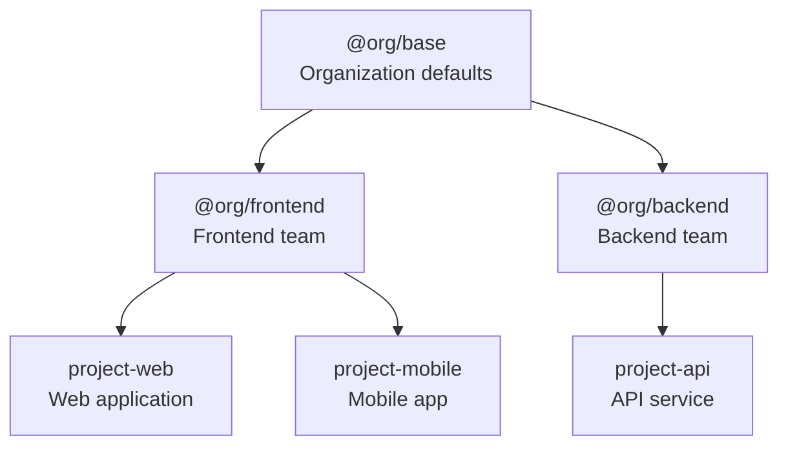
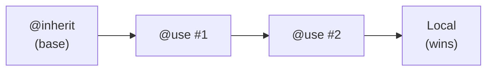
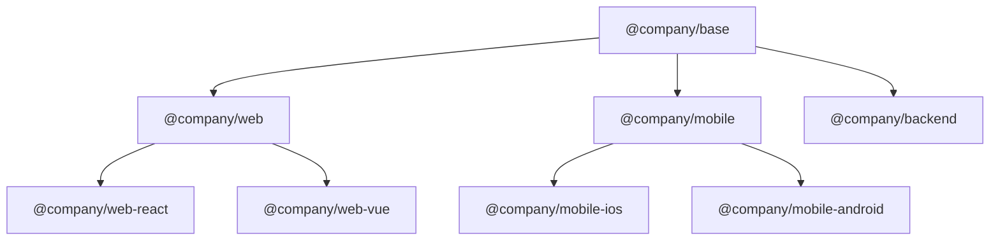

# Inheritance Guide

Learn how to build scalable, maintainable instruction hierarchies using PromptScript's inheritance system.

## Overview

PromptScript uses single inheritance to build hierarchical instruction sets:



## Basic Inheritance

Use `@inherit` to extend another PromptScript file:

```promptscript
@meta {
  id: "my-project"
  syntax: "1.0.0"
}

@inherit @company/frontend-team
```

<!-- playground-link-start -->
<a href="https://getpromptscript.dev/playground/?s=N4IgZglgNgpgziAXAbVABwIYBcAWSQwAeGAtmrAHRoBOCANCAMYD2AdljO-hACaIAEAHRAkAngFoazAFYxGWYYNb9+cUewyEBwgIwUADAcWsAvkqUABCKxwxqELPwssyGVqID0Yamw6se4hykICYAugycWNSi+ESk5DBUtCAMAG52cBBs+DohQA" target="_blank" rel="noopener noreferrer">
  
</a>
<!-- playground-link-end -->

The child inherits all blocks from the parent, which can then be extended.

## Registry Structure

Organize your registry with namespaces:

```
registry/
├── @company/
│   ├── base.prs           # Organization base
│   ├── frontend.prs       # Frontend team
│   ├── backend.prs        # Backend team
│   └── mobile.prs         # Mobile team
├── @core/
│   ├── security.prs       # Security standards
│   └── compliance.prs     # Compliance rules
└── @fragments/
    ├── testing.prs        # Testing patterns
    └── logging.prs        # Logging standards
```

## Merge Behavior

Different blocks merge differently during inheritance:

### Text Blocks (Concatenate)

`@identity`, `@knowledge`, and text content in other blocks concatenate:

=== "Source"

    ```promptscript
    # Parent
    @identity {
      """
      You are a helpful assistant.
      """
    }

    # Child
    @inherit ./parent

    @identity {
      """
      You specialize in React development.
      """
    }
    ```

<!-- playground-link-start -->
<a href="https://getpromptscript.dev/playground/?s=N4IgZglgNgpgziAXAbVABwIYBcAWSQwAeGAtmrAHRoBOCANCAMYD2AdljO-gAIQAmnLBCwBPAATAAOqzGy5kkAqUy5sgJrMArmIzUYOsThhQ0YTVB1w4EOFgzsK01bKWLFK2QF9pTuQGIxAGEcaD5fWV5WI2phMQoAekw9dh8PMV4BdmFxKTSXN2VnMQ1tODQYRggMKAgAL30IGQAlGAxGLDEBADdjZjQSQUc8sVdCuU8QTwBdBkFqEXwiUnIYKloQBh7aCDZ8AEZJoA" target="_blank" rel="noopener noreferrer">
  
</a>
<!-- playground-link-end -->

=== "Merged Output"

    ```markdown
    ## Identity

    You are a helpful assistant.

    You specialize in React development.
    ```

### Objects (Deep Merge)

`@standards` and object properties deep merge:

=== "Source"

    ```promptscript
    # Parent
    @standards {
      code: [
        "Follow clean code principles"
        "Testing required"
      ]
    }

    # Child
    @inherit ./parent

    @standards {
      code: [
        "Use React framework"
        "80% test coverage required"
      ]
    }
    ```

<!-- playground-link-start -->
<a href="https://getpromptscript.dev/playground/?s=N4IgZglgNgpgziAXAbVABwIYBcAWSQwAeGAtmrAHRoBOCANCAMYD2AdljO-gAJxYasAJhmqC4AAmAAdVuLnyWgmInHIZ8jeKkgAYsyhRmAd3GNYA08yXiaEVowjl429ZrnaAKvCx2A5uOoYAEcAVwhAwRdZTQBdVzkAXxl48QBicQBhHGhI6LluOxwYaggscQoAekxA9mS88V5+IRExSRS5RWVVdvltAFU4GHEAJRgMRjKwalIYI2ZqAGsot3cQAA4ABgBScQ4+SwA3YoxfIcDQ8JhIkB64+oSQBJiGTixqAE98IlInKloQBhHWgQNj4ACMjyAA" target="_blank" rel="noopener noreferrer">
  
</a>
<!-- playground-link-end -->

=== "Merged Output"

    ```yaml
    code:
      # Arrays are concatenated (parent first, then child)
      - "Follow clean code principles"
      - "Testing required"
      - "Use React framework"
      - "80% test coverage required"
    ```

### Arrays (Concatenate)

`@restrictions` and array values concatenate:

=== "Source"

    ```promptscript
    # Parent
    @restrictions {
      - "Never expose secrets"
    }

    # Child
    @inherit ./parent

    @restrictions {
      - "Always use TypeScript"
    }
    ```

<!-- playground-link-start -->
<a href="https://getpromptscript.dev/playground/?s=N4IgZglgNgpgziAXAbVABwIYBcAWSQwAeGAtmrAHRoBOCANCAMYD2AdljO-gALXxbUIjLBDZwABMAA6rcXPkBacVJAA5GADcY1cUTTM4McYcZ8scFTPniAvjKvyAxOIDCOaABMHc7hFY5tCCxxCgB6TD52e1l5Xn5BYVFWCWkY6yUVAEEoAHcMAE8JAFdDcQAVfLQYAGVTCDQsSzTbEBsAXQZOAXz8IlJyGCpaEAYtWiT8AEZWoA" target="_blank" rel="noopener noreferrer">
  
</a>
<!-- playground-link-end -->

=== "Merged Output"

    ```markdown
    ## Restrictions

    - Never expose secrets
    - Always use TypeScript
    ```

### Shortcuts (Override)

`@shortcuts` entries override by key:

=== "Source"

    ```promptscript
    # Parent
    @shortcuts {
      "/test": "Write unit tests"
      "/docs": "Generate documentation"
    }

    # Child
    @inherit ./parent

    @shortcuts {
      "/test": "Write tests with Vitest"  # Overrides
      "/lint": "Run ESLint"               # Added
    }
    ```

<!-- playground-link-start -->
<a href="https://getpromptscript.dev/playground/?s=N4IgZglgNgpgziAXAbVABwIYBcAWSQwAeGAtmrAHRoBOCANCAMYD2AdljO-gAJw7PUsjAK5Y4AAmAAdVuLnypIAPQc4WRYnGKA6tQgdxw1vvGqximfIXKAJs0ZwNWkAHFOMathji7IkpyxsCDYLWXkAXxlLeQBicQBhHGgbaLluCFYcDxMKJUxqAKiwtL4BIVEJaWLrFXh1JGddfW8zCQB3fRxxADVmtUU5OIB5ADcPPRt4VJqoDPrNRQAlI3EAUQBlABk5gas9vbiAQRtJlOrwkHCAXQYA6gBPfCJSchgqWhAGMdpg1nwARkuQA" target="_blank" rel="noopener noreferrer">
  
</a>
<!-- playground-link-end -->

=== "Merged Output"

    ```markdown
    ## Shortcuts

    | Command | Description |
    |---------|-------------|
    | /test | Write tests with Vitest |
    | /docs | Generate documentation |
    | /lint | Run ESLint |
    ```

## Using @extend

The `@extend` block modifies specific paths:

### Extending Top-Level Blocks

```promptscript
@inherit @company/base

# Add to identity
@extend identity {
  """
  Additional identity context.
  """
}
```

<!-- playground-link-start -->
<a href="https://getpromptscript.dev/playground/?s=N4IgZglgNgpgziAXAbVABwIYBcAWSQwAeGAtmrAHRoBOCANCAMYD2AdljO-gMQAEAggBNBvLM14RBnLBCwBPADqsAAkQ6sRk6bLm9gS3rwUhjp1oaGDZENhigSp7Hbxbs1FA0ZPelAXxC+ALoM0tRy+ESk5DBUtCAMAG4wtDas+ACMAUA" target="_blank" rel="noopener noreferrer">
  
</a>
<!-- playground-link-end -->

### Extending Nested Paths

```promptscript
@inherit @company/base

# Modify nested structure
@extend standards.code.testing {
  e2e: required
  coverage: 90
}
```

<!-- playground-link-start -->
<a href="https://getpromptscript.dev/playground/?s=N4IgZglgNgpgziAXAbVABwIYBcAWSQwAeGAtmrAHRoBOCANCAMYD2AdljO-gMQAEAsswAmEMAE9ereByG84WagFdGWRdRgAdVgAEiHVrPkYDGakLgUWQmBQ7yIrAOa9gW3rxgAmGIl7qAjooQ6kJuvCwAbjDUGI4+vACcAAxaAL4gqQC6DJwKYvhEpOQ2NPQgUbQQbPgAjBlAA" target="_blank" rel="noopener noreferrer">
  
</a>
<!-- playground-link-end -->

### Multiple Extensions

```promptscript
@inherit @company/base

@extend identity {
  """
  You are a frontend expert.
  """
}

@extend standards.code {
  framework: "react"
}

@extend restrictions {
  - "Use functional components only"
}
```

<!-- playground-link-start -->
<a href="https://getpromptscript.dev/playground/?s=N4IgZglgNgpgziAXAbVABwIYBcAWSQwAeGAtmrAHRoBOCANCAMYD2AdljO-gAJEesATAAQQBnLBCwBPIcAA6rIULkgVaxUICazAK5CM1GPqFhqbfsKJoY1LBQVK1q1awC+Chb0IWhcLBkEDATgKFjFZBxNqUhgAd2ZqAGtEZRBDDEYsdXdWTz5OYUM-aghMiDY4CI0AWlSAVTgjMB1WMrYMKCEWMjZxSrYoKWyQVwBdBnFqKXwiUnIYKloQBgA3Gzhy1nwARhGgA" target="_blank" rel="noopener noreferrer">
  
</a>
<!-- playground-link-end -->

## Composition with @use

Use `@use` to import and merge fragments (like mixins):

```promptscript
@meta {
  id: "my-project"
  syntax: "1.0.0"
}

@inherit @company/frontend

# Import fragments - blocks are merged into your file
@use @core/security
@use @core/compliance
@use @fragments/testing

# With alias - also available for @extend
@use @fragments/api-standards as api
```

<!-- playground-link-start -->
<a href="https://getpromptscript.dev/playground/?s=N4IgZglgNgpgziAXAbVABwIYBcAWSQwAeGAtmrAHRoBOCANCAMYD2AdljO-hACaIAEAHRAkAngFoazAFYxGWYYNb9+cUewyEBwgIwUADAcWsAvkqUABCKxwxqELPwssyGVqID0Yamw6se5qwAxPwAkmTM1I7eGADmJJxYcPzi-ABGUMyMANbJGNQw-AnUsTA8-NZYzPyizACu1PyQsJZ1cIXOkTAe7YwNDqKt7U4sBR4u5BBujDBDHTHxiXAeHHBY1rGBIQDqDjj8GFBTyamHcNUYAG4Y0BgZhWCRTkR+AawWbfPUcQnsyxhoCDiNZuHj5Hh5PKAkAmAC6DES1FE+CIpHIMCotBADEudjgEDY+B0MKAA" target="_blank" rel="noopener noreferrer">
  
</a>
<!-- playground-link-end -->

### How @use Differs from @inherit

| Feature              | `@inherit`                                    | `@use`                                        |
| -------------------- | --------------------------------------------- | --------------------------------------------- |
| **Quantity**         | Single parent only                            | Multiple allowed                              |
| **Semantics**        | "IS-A" (this project IS a TypeScript library) | "HAS-A" (this project HAS security standards) |
| **Purpose**          | Define fundamental project type               | Add optional capabilities                     |
| **Merge precedence** | Child overrides parent                        | Later @use overrides earlier                  |
| **@extend support**  | Always available                              | Only with alias                               |

### When to Use Which

**Use `@inherit` for:**

- Defining your project's fundamental type (library, backend, frontend)
- Building organizational hierarchies (base → team → project)
- When you want a single, clear inheritance chain

```promptscript
# This project IS a TypeScript library
@inherit @stacks/typescript-lib
```

<!-- playground-link-start -->
<a href="https://getpromptscript.dev/playground/?s=N4IgZglgNgpgziAXAbVABwIYBcAWSQwAeGAtmrAHRoBOCANCAMYD2AdljO-gAISs4xqELAAJucLBkYBrOAHosATzTxGQtFgC0UCACMQAXwC6DTlmqL8RUuRhVaIBgDdBcCG3wBGQ0A" target="_blank" rel="noopener noreferrer">
  
</a>
<!-- playground-link-end -->

**Use `@use` for:**

- Adding optional capabilities (security, testing, quality)
- Mixing in reusable fragments
- When you need multiple imports

```promptscript
# This project HAS these capabilities
@use @core/security
@use @core/quality
@use @fragments/testing
```

<!-- playground-link-start -->
<a href="https://getpromptscript.dev/playground/?s=N4IgZglgNgpgziAXAbVABwIYBcAWSQwAeGAtmrAHRoBOCANCAMYD2AdljO-gAICucMAATcW1GAHoBjXtQhYAngB1WfAcNESAjrwxQ5SlfyHcw1DAHMSnLHHEc4WCK3MgAvgF0G16vPxFS5DBUtCAMAG4wtBBs+ACMbkA" target="_blank" rel="noopener noreferrer">
  
</a>
<!-- playground-link-end -->

### Merge Precedence

When the same property exists in multiple sources:

```
@inherit @stacks/typescript-lib    # Base values
@use @core/security                # Overrides @inherit for same keys
@use @core/quality                 # Overrides earlier @use for same keys
@standards { ... }                 # Local values override everything
```

**Rule:** Later sources override earlier sources for the same keys.



### Fragment Files

Create reusable fragments:

```promptscript
# @fragments/testing.prs
@meta {
  id: "@fragments/testing"
  syntax: "1.0.0"
}

@standards {
  testing: [
    "Use vitest as test framework"
    "Maintain 80% code coverage"
    "Write unit and integration tests"
  ]
}

@shortcuts {
  "/test": "Write comprehensive tests"
  "/coverage": "Check test coverage"
}
```

<!-- playground-link-start -->
<a href="https://getpromptscript.dev/playground/?s=N4IgZglgNgpgziAXAbVABwIYBcAWSQwAeGAtmrAHRoBOCANCAMYD2AdljO-gAIkxYYABMAA6rQYIgATRIJEhuYahgDmfdnAD0HOFgisV8sRLgBPdhkKz5ARgoAGB0dYBfMWO66MrKRmpS4YWNBHT0DWWRgiXkAVTgYQQA3CFDBDEDUpVIYAHdmagBrZwlokABZDH0BfUEADnsAUkEWKQSWRJhlFRhikvkAdWoUhIBXVhS0n0l2GBVlPTYQ+Cw4XoBdMTdWDzgcfKxGEZWg8TkQbWX5axBB4ebmMmoYHE44CA6l3VWQYPlNds6qh6SDOAGEXowCp8sPcOl1gZsQC41gxOFhqKZ8ERSOQYFRaCAGHC3mx8DYkUA" target="_blank" rel="noopener noreferrer">
  
</a>
<!-- playground-link-end -->

When imported with `@use @fragments/testing`, these blocks are merged directly into your file.

## Best Practices

### 1. Keep Base Configurations Minimal

Organization base should include only universal standards:

```promptscript
# @company/base.prs
@meta {
  id: "@company/base"
  syntax: "1.0.0"
}

@identity {
  """
  You are an AI assistant at ACME Corp.
  Follow company guidelines and best practices.
  """
}

@restrictions {
  - "Never expose credentials"
  - "Follow data protection policies"
}
```

<!-- playground-link-start -->
<a href="https://getpromptscript.dev/playground/?s=N4IgZglgNgpgziAXAbVABwIYBcAWSQwAeGAtmrAHRoBOCANCAMYD2AdljO-gAIkxYYABMAA6rQYIgATRIJEhuLMhlYBPAPQAjDHBjyxEuKvYZCs+QEYKABhv7WAXzFju0zlghZVwg3JD7-cUEATWYAV0EMahhI8QBBAElIuDgIOAF2SKxBOIBhAFkAUUFc5mo0Cl8AMWYoKGYAd0ElTDVBAHMwtygIVnhYqUFNeGyaDEYPRnhKoID7J1YXaPTqCAmINjgfIIBaPwA5GAA3GGpBIjRmXWboqXcIDCg4ewk9+Rq6xsEpbCEaZg46zYgkuPUYEHg8xADgAugx3NRVPgiKRyDAqLQQAwTrQNqx8BZoUA" target="_blank" rel="noopener noreferrer">
  
</a>
<!-- playground-link-end -->

### 2. Use Team Configurations for Specialization

```promptscript
# @company/frontend.prs
@meta {
  id: "@company/frontend"
  syntax: "1.0.0"
}

@inherit @company/base

@identity {
  """
  You specialize in frontend development.
  """
}

@context {
  """
  Tech stack: React, TypeScript, Vite
  """
}
```

<!-- playground-link-start -->
<a href="https://getpromptscript.dev/playground/?s=N4IgZglgNgpgziAXAbVABwIYBcAWSQwAeGAtmrAHRoBOCANCAMYD2AdljO-gAIkxYYABMAA6rQYIgATRIJEhuLMhlYBPAPRhqbDqynyxEuKvYZCs+QEYKABlsHWAXzFjuEVjhjUIWQYubKauoARhhwMC6sblKcWD6qwoZyIAYp4oIAmswAroJwaDCMEBhQEABeMJLiWjqcUoIxAG4wUMxofOwUSakOzqyuLOxEvqLpPWkSACqFOHkCjADWsgBKMBiMWHSCk6oFAMqM3mibggBqPhFjKddijiCOALoMsdSq+ESk5DBUtCAMzbQIGx8JZ7kA" target="_blank" rel="noopener noreferrer">
  
</a>
<!-- playground-link-end -->

### 3. Project Configurations for Specifics

```promptscript
# project.prs
@meta {
  id: "checkout-app"
  syntax: "1.0.0"
}

@inherit @company/frontend

@context {
  project: "Checkout Application"

  """
  E-commerce checkout flow with Stripe integration.
  """
}
```

<!-- playground-link-start -->
<a href="https://getpromptscript.dev/playground/?s=N4IgZglgNgpgziAXAbVABwIYBcAWSQwAeGAtmrAHRoBOCANCAMYD2AdljO-gAIkxYYABMAA6rQYIgATRIJFMcMRgGtmAVywBaDGjTyxEuAE92GQrPkBGCgAZb+1gF8xY7hFaLqELIO4syGKxGAPRg1GwcrFIurH4RRD6i4oI0zABWSlgWIADCiirqPgCCulAQjNgQbA4GciD69ckAopr+fNSMMIKM+aoagmBQzADugsPeOIIAylheaF3uHADm1JVsFLUNDo4gjgC6DJyzRvhEpOQwVLQgDABuMLRVrPiWu0A" target="_blank" rel="noopener noreferrer">
  
</a>
<!-- playground-link-end -->

### 4. Version Your Registry

Use semantic versioning for registry files:

```promptscript
@inherit @company/frontend@1.0.0
```

### 5. Document Inheritance Chains

Include comments explaining the hierarchy:

```promptscript
# Inheritance chain:
# @company/base → @company/frontend → this file
@inherit @company/frontend
```

<!-- playground-link-start -->
<a href="https://getpromptscript.dev/playground/?s=N4IgZglgNgpgziAXAbVABwIYBcAWSQwAeGAtmrAHRoBOCANCAMYD2AdljO-gMQAEAAizIZWATwD0AIwxwYvQEmEAoZjHiw1Nh1YATBb1wQ4vSLAA6rfhFY4Y1CFiXNhq9Zs7aQAXwC6DTlmpRfCJSchgqWhAGADdbOAg2fABGLyA" target="_blank" rel="noopener noreferrer">
  
</a>
<!-- playground-link-end -->

## Common Patterns

### Platform-Specific Configurations



### Shared Standards with Team Overrides

```promptscript
# Use shared security, override team-specific
@inherit @company/frontend
@use @core/security
@use @core/compliance

@extend standards.security {
  additionalRules: ["CSP headers"]
}
```

<!-- playground-link-start -->
<a href="https://getpromptscript.dev/playground/?s=N4IgZglgNgpgziAXAbVABwIYBcAWSQwAeGAtmrAHRoBOCANCAMYD2AdljO-gAISs4xqELAAJuLMhlYBPAPRhqbDqwAmAHVbcArnBhiW1GLN2MtQrNI3bd+5odkTyEKYxgarRZSpFwsUlRjUKnAUJmbC0iLAGiIiGCoqwhBsGFAASlqwcIgiyGogAMIAygAKIgLxgnD5ALoaAL4g9TUMnFjU0vhEpOQwVLQgDABuVcms+ACMTUA" target="_blank" rel="noopener noreferrer">
  
</a>
<!-- playground-link-end -->

### Environment-Specific Extensions

```promptscript
@inherit @company/frontend

@context {
  environment: production
}

@extend restrictions {
  - "No console.log statements"
  - "No debug code"
}
```

<!-- playground-link-start -->
<a href="https://getpromptscript.dev/playground/?s=N4IgZglgNgpgziAXAbVABwIYBcAWSQwAeGAtmrAHRoBOCANCAMYD2AdljO-gAIvtFYABMAA6rQYM4A3CNTYlOWRIJrMAJgFdGWCGzEBfMWO4DOawdXhZqEbbtZxhYiQFpBIkADlmgvnGaUUMwA5oJwWNgwCuxwHs6Cbh7egmowAEYaoSypcaz6IPoAugyK1ACe+ESk5DBUtCAMUjC09vgAjAVAA" target="_blank" rel="noopener noreferrer">
  
</a>
<!-- playground-link-end -->

## Debugging Inheritance

### View Resolved Configuration

```bash
prs compile --dry-run --verbose
```

### Validate Inheritance Chain

```bash
prs validate --verbose
```

### Common Issues

**Circular inheritance detected:**

```
Error: Circular inheritance: a → b → a
```

Ensure no circular references in your inheritance chain.

**Parent not found:**

```
Error: Cannot resolve @company/unknown
```

Check registry configuration and file paths.

**Version mismatch:**

```
Warning: Requested @company/base@2.0.0, found 1.5.0
```

Update version constraints or registry.
