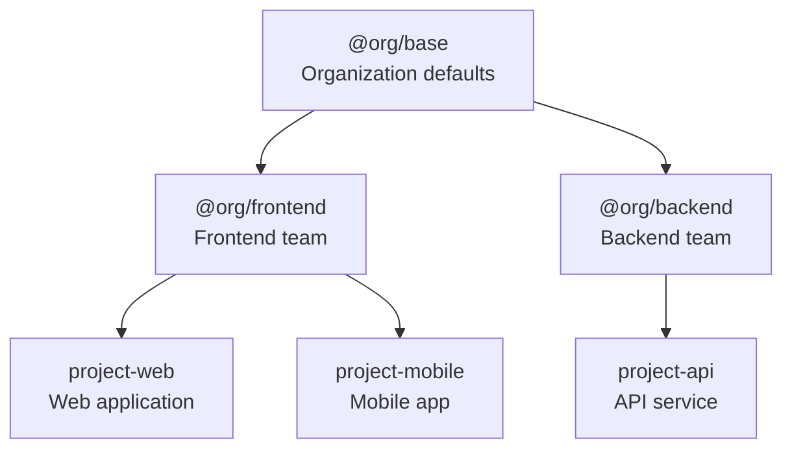
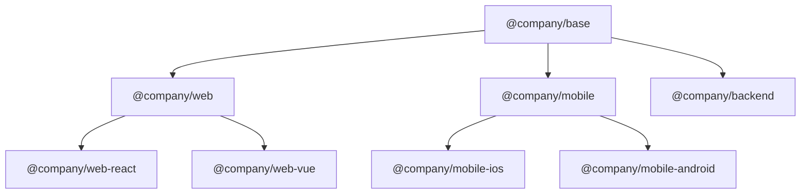

# Inheritance Guide

Learn how to build scalable, maintainable instruction hierarchies using PromptScript's inheritance system.

## Overview

PromptScript uses single inheritance to build hierarchical instruction sets:



## Basic Inheritance

Use `@inherit` to extend another PromptScript file:

```promptscript
@meta {
  id: "my-project"
  version: "1.0.0"
}

@inherit @company/frontend-team
```

The child inherits all blocks from the parent, which can then be extended.

## Registry Structure

Organize your registry with namespaces:

```
registry/
├── @company/
│   ├── base.prs           # Organization base
│   ├── frontend.prs       # Frontend team
│   ├── backend.prs        # Backend team
│   └── mobile.prs         # Mobile team
├── @core/
│   ├── security.prs       # Security standards
│   └── compliance.prs     # Compliance rules
└── @fragments/
    ├── testing.prs        # Testing patterns
    └── logging.prs        # Logging standards
```

## Merge Behavior

Different blocks merge differently during inheritance:

### Text Blocks (Concatenate)

`@identity`, `@knowledge`, and text content in other blocks concatenate:

```promptscript
# Parent
@identity {
  """
  You are a helpful assistant.
  """
}

# Child
@inherit ./parent

@identity {
  """
  You specialize in React development.
  """
}

# Result: Both texts concatenated
```

### Objects (Deep Merge)

`@standards` and object properties deep merge:

```promptscript
# Parent
@standards {
  code: {
    style: "clean"
    testing: required
  }
}

# Child
@inherit ./parent

@standards {
  code: {
    frameworks: [react]  # Added
    testing: {           # Overrides primitive with object
      required: true
      coverage: 80
    }
  }
}

# Result: Deep merged object
```

### Arrays (Concatenate)

`@restrictions` and array values concatenate:

```promptscript
# Parent
@restrictions {
  - "Never expose secrets"
}

# Child
@inherit ./parent

@restrictions {
  - "Always use TypeScript"
}

# Result: Both restrictions included
```

### Shortcuts (Override)

`@shortcuts` entries override by key:

```promptscript
# Parent
@shortcuts {
  "/test": "Write unit tests"
  "/docs": "Generate documentation"
}

# Child
@inherit ./parent

@shortcuts {
  "/test": "Write tests with Vitest"  # Overrides
  "/lint": "Run ESLint"               # Added
}

# Result: /test overridden, /docs inherited, /lint added
```

## Using @extend

The `@extend` block modifies specific paths:

### Extending Top-Level Blocks

```promptscript
@inherit @company/base

# Add to identity
@extend identity {
  """
  Additional identity context.
  """
}
```

### Extending Nested Paths

```promptscript
@inherit @company/base

# Modify nested structure
@extend standards.code.testing {
  e2e: required
  coverage: 90
}
```

### Multiple Extensions

```promptscript
@inherit @company/base

@extend identity {
  """
  You are a frontend expert.
  """
}

@extend standards.code {
  framework: "react"
}

@extend restrictions {
  - "Use functional components only"
}
```

## Composition with @use

Use `@use` to import fragments without full inheritance:

```promptscript
@meta {
  id: "my-project"
  version: "1.0.0"
}

@inherit @company/frontend

# Import additional fragments
@use @core/security
@use @fragments/testing as tests
```

### Fragment Files

Create reusable fragments:

```promptscript
# @fragments/testing.prs
@meta {
  id: "@fragments/testing"
  version: "1.0.0"
}

@standards {
  testing: {
    framework: "vitest"
    coverage: 80
    patterns: ["unit", "integration"]
  }
}

@shortcuts {
  "/test": "Write comprehensive tests"
  "/coverage": "Check test coverage"
}
```

## Best Practices

### 1. Keep Base Configurations Minimal

Organization base should include only universal standards:

```promptscript
# @company/base.prs
@meta {
  id: "@company/base"
  version: "1.0.0"
}

@identity {
  """
  You are an AI assistant at ACME Corp.
  Follow company guidelines and best practices.
  """
}

@restrictions {
  - "Never expose credentials"
  - "Follow data protection policies"
}
```

### 2. Use Team Configurations for Specialization

```promptscript
# @company/frontend.prs
@meta {
  id: "@company/frontend"
  version: "1.0.0"
}

@inherit @company/base

@identity {
  """
  You specialize in frontend development.
  """
}

@context {
  """
  Tech stack: React, TypeScript, Vite
  """
}
```

### 3. Project Configurations for Specifics

```promptscript
# project.prs
@meta {
  id: "checkout-app"
  version: "1.0.0"
}

@inherit @company/frontend

@context {
  project: "Checkout Application"
  
  """
  E-commerce checkout flow with Stripe integration.
  """
}
```

### 4. Version Your Registry

Use semantic versioning for registry files:

```promptscript
@inherit @company/frontend@1.0.0
```

### 5. Document Inheritance Chains

Include comments explaining the hierarchy:

```promptscript
# Inheritance chain:
# @company/base → @company/frontend → this file
@inherit @company/frontend
```

## Common Patterns

### Platform-Specific Configurations



### Shared Standards with Team Overrides

```promptscript
# Use shared security, override team-specific
@inherit @company/frontend
@use @core/security
@use @core/compliance

@extend standards.security {
  additionalRules: ["CSP headers"]
}
```

### Environment-Specific Extensions

```promptscript
@inherit @company/frontend

@context {
  environment: production
}

@extend restrictions {
  - "No console.log statements"
  - "No debug code"
}
```

## Debugging Inheritance

### View Resolved Configuration

```bash
prs compile --dry-run --verbose
```

### Validate Inheritance Chain

```bash
prs validate --verbose
```

### Common Issues

**Circular inheritance detected:**

```
Error: Circular inheritance: a → b → a
```

Ensure no circular references in your inheritance chain.

**Parent not found:**

```
Error: Cannot resolve @company/unknown
```

Check registry configuration and file paths.

**Version mismatch:**

```
Warning: Requested @company/base@2.0.0, found 1.5.0
```

Update version constraints or registry.
