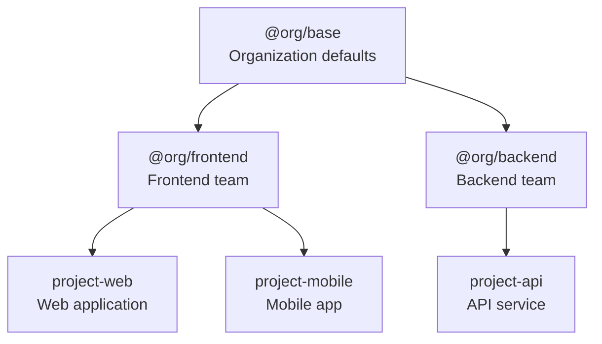
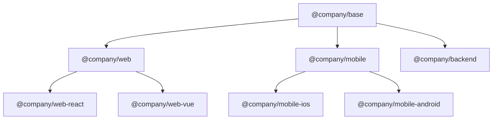

# Inheritance Guide

Learn how to build scalable, maintainable instruction hierarchies using PromptScript's inheritance system.

## Overview

PromptScript uses single inheritance to build hierarchical instruction sets:


```mermaid
flowchart TD
    A["@org/base<br/>Organization defaults"] --> B["@org/frontend<br/>Frontend team"]
    A --> C["@org/backend<br/>Backend team"]
    B --> D["project-web<br/>Web application"]
    B --> E["project-mobile<br/>Mobile app"]
    C --> F["project-api<br/>API service"]
```

## Basic Inheritance

Use `@inherit` to extend another PromptScript file:

```promptscript
@meta {
  id: "my-project"
  syntax: "1.0.0"
}

@inherit @company/frontend-team
```

The child inherits all blocks from the parent, which can then be extended.

## Registry Structure

Organize your registry with namespaces:

```
registry/
├── @company/
│   ├── base.prs           # Organization base
│   ├── frontend.prs       # Frontend team
│   ├── backend.prs        # Backend team
│   └── mobile.prs         # Mobile team
├── @core/
│   ├── security.prs       # Security standards
│   └── compliance.prs     # Compliance rules
└── @fragments/
    ├── testing.prs        # Testing patterns
    └── logging.prs        # Logging standards
```

## Merge Behavior

Different blocks merge differently during inheritance:

### Text Blocks (Concatenate)

`@identity`, `@knowledge`, and text content in other blocks concatenate:

=== "Parent File"

    ```promptscript
    # parent.prs
    @meta {
      id: "parent"
      syntax: "1.0.0"
    }

    @identity {
      """
      You are a helpful assistant.
      """
    }
    ```

<!-- playground-link-start -->
<a href="https://getpromptscript.dev/playground/?s=N4IgZglgNgpgziAXAbVABwIYBcAWSQwAeGAtmrAHRoBOCANCAMYD2AdljO-gMQAEm1Tliq0AOqwACJGFgy9g43rwgATRL1EgBQzYt5wAnuwyF1mgIwUADNd2sAvuPETVQiFgPy9ukHaUBNZgBXXgxBUN4cGCg0MCCoULg4CDhZdgpvXyzxexB7AF0GIWoDfCJSchgRehAANxhaCDZ8czygA" target="_blank" rel="noopener noreferrer">
  
</a>
<!-- playground-link-end -->

=== "Child File"

    ```promptscript
    # child.prs
    @meta {
      id: "child"
      syntax: "1.0.0"
    }

    @inherit ./parent

    @identity {
      """
      You specialize in React development.
      """
    }
    ```

=== "Merged Output"

    ```markdown
    ## Identity

    You are a helpful assistant.

    You specialize in React development.
    ```

### Objects (Deep Merge)

`@standards` and object properties deep merge:

=== "Parent File"

    ```promptscript
    # parent.prs
    @meta {
      id: "parent"
      syntax: "1.0.0"
    }

    @standards {
      code: ["Follow clean code principles", "Testing required"]
    }
    ```

<!-- playground-link-start -->
<a href="https://getpromptscript.dev/playground/?s=N4IgZglgNgpgziAXAbVABwIYBcAWSQwAeGAtmrAHRoBOCANCAMYD2AdljO-gMQAEm1Tliq0AOqwACJGFgy9g43rwgATRL1EgBQzYt5wAnuwyF1mgIwUADNd2sAvuPES4s1iozUVceXpYqYdWRNADFmKChmAHdeRlgMVljmAP5qCFZGCHJ4TToNEAAVeCx0gHNeQQBHAFcIQRVNAF1xexB7RoYhagN8IlJskXoQADcYWgg2fHM2oA" target="_blank" rel="noopener noreferrer">
  
</a>
<!-- playground-link-end -->

=== "Child File"

    ```promptscript
    # child.prs
    @meta {
      id: "child"
      syntax: "1.0.0"
    }

    @inherit ./parent

    @standards {
      code: ["Use React framework", "80% test coverage required"]
    }
    ```

=== "Merged Output"

    ```yaml
    code:
      # Arrays are concatenated (parent first, then child)
      - Follow clean code principles
      - Testing required
      - Use React framework
      - 80% test coverage required
    ```

### Arrays (Concatenate)

`@restrictions` and array values concatenate:

=== "Parent File"

    ```promptscript
    # parent.prs
    @meta {
      id: "parent"
      syntax: "1.0.0"
    }

    @restrictions {
      - "Never expose secrets"
    }
    ```

<!-- playground-link-start -->
<a href="https://getpromptscript.dev/playground/?s=N4IgZglgNgpgziAXAbVABwIYBcAWSQwAeGAtmrAHRoBOCANCAMYD2AdljO-gMQAEm1Tliq0AOqwACJGFgy9g43rwgATRL1EgBQzYt5wAnuwyF1mgIwUADNd2sAvuPETBcLNQiMsENnHl6AWg0QADkYADcYal4iNGY4GH0YRkEsODt7EHsAXQYhagN8IlJyGBF6EEjaH1Z8cyygA" target="_blank" rel="noopener noreferrer">
  
</a>
<!-- playground-link-end -->

=== "Child File"

    ```promptscript
    # child.prs
    @meta {
      id: "child"
      syntax: "1.0.0"
    }

    @inherit ./parent

    @restrictions {
      - "Always use TypeScript"
    }
    ```

=== "Merged Output"

    ```markdown
    ## Restrictions

    - Never expose secrets
    - Always use TypeScript
    ```

### Shortcuts (Override)

`@shortcuts` entries override by key:

=== "Parent File"

    ```promptscript
    # parent.prs
    @meta {
      id: "parent"
      syntax: "1.0.0"
    }

    @shortcuts {
      "/test": "Write unit tests"
      "/docs": "Generate documentation"
    }
    ```

<!-- playground-link-start -->
<a href="https://getpromptscript.dev/playground/?s=N4IgZglgNgpgziAXAbVABwIYBcAWSQwAeGAtmrAHRoBOCANCAMYD2AdljO-gMQAEm1Tliq0AOqwACJGFgy9g43rwgATRL1EgBQzYt5wAnuwyF1mgIwUADNd2sAvuPES4OZtSyMArljjy9mgD0HHBYmmYgAOrUEBy8XqyxvCG+dkpBKsyMcOEaIADinDDU2DC8md7SxlgQbHb2IPYAugxC1Ab4RKTkMCL0IABuxXC1rPjmjUA" target="_blank" rel="noopener noreferrer">
  
</a>
<!-- playground-link-end -->

=== "Child File"

    ```promptscript
    # child.prs
    @meta {
      id: "child"
      syntax: "1.0.0"
    }

    @inherit ./parent

    @shortcuts {
      "/test": "Write tests with Vitest"
      "/lint": "Run ESLint"
    }
    ```

=== "Merged Output"

    ```markdown
    ## Shortcuts

    | Command | Description |
    |---------|-------------|
    | /test | Write tests with Vitest |
    | /docs | Generate documentation |
    | /lint | Run ESLint |
    ```

## Using @extend

The `@extend` block modifies specific paths:

### Extending Top-Level Blocks

```promptscript
@inherit @company/base

# Add to identity
@extend identity {
  """
  Additional identity context.
  """
}
```

<!-- playground-link-start -->
<a href="https://getpromptscript.dev/playground/?s=N4IgZglgNgpgziAXAbVABwIYBcAWSQwAeGAtmrAHRoBOCANCAMYD2AdljO-gMQAEAAiRhYMvDABNxMcbzjNeuCHF5hqGAOZD2vFmWjxebXhCzLmAd1bGruGL3IYAnuurMArq3EAdVoOGjgH15jcUReLwJiMlgIoNlHdgxCMIiARgoAVgoABljWAF8fHz5+CFYcGGoTAV1MVkcAegAjDDg7Xj4ACmoYdSUsakdeAFpecSUMJtgZMGZqeygnF3dPAEoi1j4AQUkFeQgpdhNHH34iDk8Qzixj3kCrcJBYp4ed8Zu2DCgro6whlnY5wocWeeXyIHyAF0GNdBvgiKRyDAqLQQAwAG6VOAQNj4VIQoA" target="_blank" rel="noopener noreferrer">
  
</a>
<!-- playground-link-end -->

### Extending Nested Paths

```promptscript
@inherit @company/base

# Modify nested structure
@extend standards.code.testing {
  e2e: required
  coverage: 90
}
```

<!-- playground-link-start -->
<a href="https://getpromptscript.dev/playground/?s=N4IgZglgNgpgziAXAbVABwIYBcAWSQwAeGAtmrAHRoBOCANCAMYD2AdljO-gMQAEAAiRhYMvDABNxMcbzjNeuCHF5hqGAOZD2vFmWjxebXhCzLmAd1bGruGL3IYAnuurMArq3EAdVoOGjgH15jcUReLwJiMlgIoNlHdgxCMIiARgoAVgoABljWAF8fHz5+CFYcGGoTAV1MVkcAegAjDDg7Xj4ACmoYdSUsakdeAFpecSUMJtgZMGZqeygnF3dPAEoi1j4AWWZxsCHWeA4ZOAG3Riw3Hp9+Ig5PWRFPDGpxOAoWKQoOU7L1XkCVl4MAATDAwj0AI5uCA9bxAlgAN0qGnBvAAnLkCiB8gBdBicAaOfBEUjkGBUWggBjI2gQNj4VI4oA" target="_blank" rel="noopener noreferrer">
  
</a>
<!-- playground-link-end -->

### Multiple Extensions

```promptscript
@inherit @company/base

@extend identity {
  """
  You are a frontend expert.
  """
}

@extend standards.code {
  framework: "react"
}

@extend restrictions {
  - "Use functional components only"
}
```

<!-- playground-link-start -->
<a href="https://getpromptscript.dev/playground/?s=N4IgZglgNgpgziAXAbVABwIYBcAWSQwAeGAtmrAHRoBOCANCAMYD2AdljO-gMQAEAAiRhYMvDABNxMcbzjNeuCHF5hqGAOZD2vFmWjxebXhCzLmAd1bGruGL3IYAnuurMArq3EAdVoOGjgH15jcUReLwJiMlgIoNlHdgxCMIiARgoAVgoABljWAF8fHz5+CFYcGGoTAV1MVkcAegAjDDg7Xj4ACmoYdSUsakdeAFpecSUMJtgZMGZqeygnF3dPAEoi3yIOTxDOLBMhwKtwkFjT44BNdzEesRVXdk4ZIjRKrAo4s7zC1h9+LaeshEngw1HEcAoLCkvCOwVUpBg5jmAGsUiAehhGFhvht-oRtjIenABhAsRA2MpYSMTgBVNoqDxktgYKA6ZhkNh7MysKCOb4gfIAXQYe0G+CIpHIMCotBADAAbpU4OTWPhUgKgA" target="_blank" rel="noopener noreferrer">
  
</a>
<!-- playground-link-end -->

### Skill-Specific Extend Semantics

When `@extend` targets a skill definition, individual skill properties follow dedicated merge
strategies rather than the generic block merge rules:

| Strategy          | Properties                                                                                                                    |
| ----------------- | ----------------------------------------------------------------------------------------------------------------------------- |
| **Replace**       | `content`, `description`, `trigger`, `userInvocable`, `allowedTools`, `disableModelInvocation`, `context`, `agent`, `license` |
| **Append**        | `references`, `examples`, `requires`                                                                                          |
| **Shallow merge** | `params`, `inputs`, `outputs`                                                                                                 |

Example — overlay content and add a reference file without replacing the base skill's references:

```promptscript
@use @company/skills as skills

@extend skills.code-review {
  content: """
  Enhanced review with stricter security checks.
  """
  references: [
    ./extra-context.md
  ]
}
```

The overlay's `references` list is appended to the base skill's list. The `content` field replaces
the base skill's content entirely.

#### Reference Negation

Use the `!` prefix to remove entries added by a lower layer:

```promptscript
@use @company/skills as skills

@extend skills.code-review {
  references: [
    "!references/deprecated-patterns.md"
    "references/new-patterns.md"
  ]
  requires: [
    "!legacy-tool"
    "modern-tool"
  ]
}
```

Negation uses normalized path matching — `"!./references/foo.md"` matches `"references/foo.md"`.
If a negation doesn't match any base entry, a warning is logged during compilation.

Negation applies to append-strategy properties only (`references`, `requires`). The `!` prefix
is only meaningful in `@extend` blocks — using it in a base skill definition triggers a
validator warning (PS028).

#### Sealed Properties

The `sealed` property prevents higher layers from replacing specified skill properties:

```promptscript
@skills {
  code-review: {
    content: """
      Critical review workflow.
    """
    sealed: ["content"]
  }
}
```

<!-- playground-link-start -->
<a href="https://getpromptscript.dev/playground/?s=N4IgZglgNgpgziAXAbVABwIYBcAWSQwAeGAtmrAHRoBOCANCAMYD2AdljO-gMQAEAAiRhYMvDABNxMcbzjNeuCHF5hqGAOZD2vFmWjxebXhCzLmAd1bGruGL3IYAnuurMArq3EAdVoOGjgH15jcUReLwJiMlgIoNlHdgxCMIiARgoAVgoABljWAF8fH344AGtoKGVAqx1mKQBaahgANwgYczDq4OCWdk4sFJBYoZru3gBhahMIRgwoXibW9t5zZmpSsCgLCjjg4byxuBg56TDkCN6OdgiAXTjCgpB8m4Z+6kd8IlJyGCpaEAYzRgtAgbHwqSeQA" target="_blank" rel="noopener noreferrer">
  
</a>
<!-- playground-link-end -->

If an `@extend` block attempts to override a sealed property, compilation fails:

```
ResolveError: Cannot override sealed property 'content' on skill (sealed by base definition)
```

Use `sealed: true` to seal all replace-strategy properties at once. Only the base skill
author can set `sealed` — overlays cannot add or remove it. Append-strategy properties
(`references`, `requires`) remain extendable even when `sealed: true` is set.

## Composition with @use

Use `@use` to import and merge fragments (like mixins):

```promptscript
@meta {
  id: "my-project"
  syntax: "1.0.0"
}

@inherit @company/frontend

# Import fragments - blocks are merged into your file
@use @core/security
@use @core/compliance
@use @fragments/testing

# With alias - also available for @extend
@use @fragments/api-standards as api
```

### How @use Differs from @inherit

| Feature              | `@inherit`                                    | `@use`                                        |
| -------------------- | --------------------------------------------- | --------------------------------------------- |
| **Quantity**         | Single parent only                            | Multiple allowed                              |
| **Semantics**        | "IS-A" (this project IS a TypeScript library) | "HAS-A" (this project HAS security standards) |
| **Purpose**          | Define fundamental project type               | Add optional capabilities                     |
| **Merge precedence** | Child overrides parent                        | Later @use overrides earlier                  |
| **@extend support**  | Always available                              | Only with alias                               |

### When to Use Which

**Use `@inherit` for:**

- Defining your project's fundamental type (library, backend, frontend)
- Building organizational hierarchies (base → team → project)
- When you want a single, clear inheritance chain

```promptscript
# This project IS a TypeScript library
@inherit @stacks/typescript-lib
```

**Use `@use` for:**

- Adding optional capabilities (security, testing, quality)
- Mixing in reusable fragments
- When you need multiple imports

```promptscript
# This project HAS these capabilities
@use @core/security
@use @core/quality
@use @fragments/testing
```

### Merge Precedence

PromptScript 1.6 applies declarations in source order. Import merge policy and
later operations are separate decisions:

```promptscript
@meta { id: "service" syntax: "1.5.0" }

@inherit @stacks/typescript-lib
@use @core/security
@use @core/quality

@standards {
  deployment: ["Require approval"]
}

@override standards.testing {
  ["Use Vitest"]
}
```

Use [Composition and Precedence](../reference/language/composition.md) as the
normative source for conflict rules, declaration order, and resolved examples.
This guide focuses on designing inheritance hierarchies rather than restating
that matrix.

### Fragment Files

Create reusable fragments:

```promptscript
# @fragments/testing.prs
@meta {
  id: "@fragments/testing"
  syntax: "1.5.0"
}

@standards {
  testing: ["Use vitest as test framework", "Maintain 80% code coverage", "Write unit and integration tests"]
}

@shortcuts {
  "/test": {
    description: "Write comprehensive tests"
    content: "Write unit and integration tests for the current change."
  }
  "/coverage": {
    description: "Check test coverage"
    content: "Run coverage and report untested behavior."
  }
}
```

<!-- playground-link-start -->
<a href="https://getpromptscript.dev/playground/?s=N4IgZglgNgpgziAXAbVABwIYBcAWSQwAeGAtmrAHRoBOCANCAMYD2AdljO-gMQAEAAmGoYA5iU5Y4Aeg5wsEViKq0AOq37isGXsDW9eEACaJeKkIOFiJ02fMVm9vOAE92GQibMBGCgFYKAAwOrAC+amr8chishhjUhnA6jrYKIibIZgCqcDC8AG4QtrwYiUVCpDAA7szUANZmdKYgALIYCloKvAAcAQCkvCyGuSx5MJYwDU0A6tSFuQCurIXFMQbsMCLC8my8tnBmALpqYawRcDg1WIzzkkms+mYy8FhmJrr3+rxDcIyzaNusTwgGZzAbMMjUGA4ThwCCjXbPfYgRz6FjrdhAkEcXiLZbRQxrDibbAQHZ7XhgGq7aEDebUSHsAY4aIiGAUYL6E4PEBSEZjUQTJB3T5feC-CD-UmApoAYWhjFqCLkYNG4w5nzRHAxTQASosVfzWSsCZC0Jcces5DACQAjKEYAo1dnIj4nEIgEIHBgSajOfBEUjkNk0eggVWwtj4LweoA" target="_blank" rel="noopener noreferrer">
  
</a>
<!-- playground-link-end -->

When imported with `@use @fragments/testing`, these blocks are merged directly into your file.

## Best Practices

### 1. Keep Base Configurations Minimal

Organization base should include only universal standards:

```promptscript
# @company/base.prs
@meta {
  id: "@company/base"
  syntax: "1.0.0"
}

@identity {
  """
  You are an AI assistant at ACME Corp.
  Follow company guidelines and best practices.
  """
}

@restrictions {
  - "Never expose credentials"
  - "Follow data protection policies"
}
```

<!-- playground-link-start -->
<a href="https://getpromptscript.dev/playground/?s=N4IgZglgNgpgziAXAbVABwIYBcAWSQwAeGAtmrAHRoBOCANCAMYD2AdljO-gMQAEAAizIZWATwD0AIwxwYVWgB1W-EjCwZewJb14QAJol4KQg5sLFSZMY9t5xR7DIUPGAjBQAMnm6wC+SpX59TiwILFFNWxsQHx0ATWYAV14MahgU1l4AQQBJFLg4CDh1dhSsbIBhAFkAUV4K5mo0ClsAMWYoKGYAd14hTDFeAHNE4KgIVngMvV5JeHKaDEZQxngWzKMYraV-VkC04uoIZYg2OEiNgFpNgDkYADcYal4iNGZZPrS9EIgMKDhYrxrsZ2p0erw9NgNDRmBwTmxeG9xowIPAfL4QL4ALoMELUUT4IikchyGj0ECPWinVj4VyYoA" target="_blank" rel="noopener noreferrer">
  
</a>
<!-- playground-link-end -->

### 2. Use Team Configurations for Specialization

```promptscript
# @company/frontend.prs
@meta {
  id: "@company/frontend"
  syntax: "1.0.0"
}

@inherit @company/base

@identity {
  """
  You specialize in frontend development.
  """
}

@context {
  """
  Tech stack: React, TypeScript, Vite
  """
}
```

<!-- playground-link-start -->
<a href="https://getpromptscript.dev/playground/?s=N4IgZglgNgpgziAXAbVABwIYBcAWSQwAeGAtmrAHRoBOCANCAMYD2AdljO-gMQAEAAizIZWATwD0Yamw6sAJlVoAdVvxIwsGXsBW9eEOYl5KQg5sLGTp7TnJO7ecUewyEjJgIwUADD-usAXxUVPn4IVhwYaggsASFMSwAjDDgYPT4ACmoYAHMIOCxqUV4AWl45fIxE2DleMGZqXnIMURzpAFd5AEpg1QNOLBjinVY9exB-PQBNZnbHNBhGCAwoCAAvNPC661lauRgANxgoZjR1dgoHcf8g1hUzG0JYkbGJt4cAFUWcR01GAGsjAAlGAYRhYOi8D6iBYAZUY0TQEN4ADUYjAru8JoEQAEALoMAZFfBEUjkGCKeggI60CBsfAeXFAA" target="_blank" rel="noopener noreferrer">
  
</a>
<!-- playground-link-end -->

### 3. Project Configurations for Specifics

```promptscript
# project.prs
@meta {
  id: "checkout-app"
  syntax: "1.0.0"
}

@inherit @company/frontend

@context {
  project: "Checkout Application"

  """
  E-commerce checkout flow with Stripe integration.
  """
}
```

<!-- playground-link-start -->
<a href="https://getpromptscript.dev/playground/?s=N4IgZglgNgpgziAXAbVABwIYBcAWSQwAeGAtmrAHRoBOCANCAMYD2AdljO-gMQAENzAFYxGWKrQA6rAAIkYWDL2BTevCABNEvCUxwiA1swCuWALQY0aHSt5wAnuwyEtOgIwUADJ+usAvlKk+aQhWPWoILF5pFjIMVjsAejBqNg5WdVU+AApqGABzCDgsajteU151QowAI1gMsGZqfigMOzyUo3SASgCZFnYiSOVWVQFhURcQAGE9RkMTXgBBSygIRmwINh8baxAfVQBRUxi5akYYXkZZ+ciwKGYAd14HiJxeAGViiDQLkI52jZsCg7PagqS+EC+AC6DE4xTs+CIpHIMHE9BAADcYLRNqx8K5IUA" target="_blank" rel="noopener noreferrer">
  
</a>
<!-- playground-link-end -->

### 4. Version Your Registry

Use semantic versioning for registry files:

```promptscript
@inherit @company/frontend@1.0.0
```

### 5. Document Inheritance Chains

Include comments explaining the hierarchy:

```promptscript
# Inheritance chain:
# @company/base → @company/frontend → this file
@inherit @company/frontend
```

## Common Patterns

### Platform-Specific Configurations


```mermaid
flowchart TD
    A["@company/base"] --> B["@company/web"]
    A --> C["@company/mobile"]
    A --> D["@company/backend"]

    B --> E["@company/web-react"]
    B --> F["@company/web-vue"]

    C --> G["@company/mobile-ios"]
    C --> H["@company/mobile-android"]
```

### Shared Standards with Team Overrides

```promptscript
# Use shared security, override team-specific
@inherit @company/frontend
@use @core/security
@use @core/compliance

@extend standards.security {
  additionalRules: ["CSP headers"]
}
```

<!-- playground-link-start -->
<a href="https://getpromptscript.dev/playground/?s=N4IgZglgNgpgziAXAbVABwIYBcAWSQwAeGAtmrAHRoBOCANCAMYD2AdljO-gMQAEAAiRhYMvDABNxMcbzjNeuCHF5hqGAOZD2vFmWjxebXhCzLmAd1bGruGL3IYAnuurMArq3EAdVoOGjgH15jcUReLwJiMlgIoNlHdgxCMIiARgoAVgoABljWAF8fHz4AVTg7OBwMamlZGEY3ahNHOkMANxhqJqkFGFIAWjg0eohIRmKBCFYcTpMBXUxWRwB6VTYOT2C+AAoa9SUsakdeft5xJQwAI1gZMGZqeygnF3dPAEoJ-jdy+fuYZfKDSaWGOvB2ewORxOZwu11qdweDmcrg84g+rD4Xx+-BYNWWCygEAwrEYdjBvF2MH2cEOx1O5zgVxuKnuj2eKPeRV8RA2MhpxPE1XEcAogMazV4gSsYkkJggbAwUAASm5YHAwsgIgBhADKAAVeDMJJ04BEALo+fIgfJmhicWn4IikcgwKi0EAMDq0eWsfCpa1AA" target="_blank" rel="noopener noreferrer">
  
</a>
<!-- playground-link-end -->

### Environment-Specific Extensions

```promptscript
@inherit @company/frontend

@context {
  environment: production
}

@extend restrictions {
  - "No console.log statements"
  - "No debug code"
}
```

<!-- playground-link-start -->
<a href="https://getpromptscript.dev/playground/?s=N4IgZglgNgpgziAXAbVABwIYBcAWSQwAeGAtmrAHRoBOCANCAMYD2AdljO-gMQAEAAiRhYMvDABNxMcbzjNeuCHF5hqGAOZD2vFmWjxebXhCzLmAd1bGruGL3IYAnuurMArq3EAdVoOGjgH15jcUReLwJiMlgIoNlHdgxCMIiARgoAVgoABljWAF8fHz5+CFYcGGoTAV1MVkcAelU2Dk9gvgAKahh1JSxqR14AWl5xJQwAI1gZMGZqeygnF3dPAEoi3xZ2IixeQKteTgA3CFdWLSwwmmZxN0YsCDYfQtYffh3OGW64foh7x9Yyn2wRGEQAcvItnJKFBmOpZCIOBc4HkQeEQBDRjAJm54SwpHl8iB8gBdBicfqOfBEUjkGBUWggBhHSpwAH4VLEoA" target="_blank" rel="noopener noreferrer">
  
</a>
<!-- playground-link-end -->

## Parameterized Inheritance (Templates)

PromptScript supports parameterized inheritance, allowing you to create reusable templates with configurable values. This is similar to generics in programming languages or Handlebars-like templates.

### Defining Parameters

Define parameters in the `@meta` block using the `params` field:

```promptscript
# @stacks/typescript-lib.prs
@meta {
  id: "@stacks/typescript-lib"
  syntax: "1.0.0"
  params: {
    projectName: string
    runtime: string = "node18"
    strict?: boolean
    testFramework: enum("vitest", "jest", "mocha") = "vitest"
  }
}

@project {
  name: {{projectName}}
  runtime: {{runtime}}
}

@standards {
  testing: ["Use {{testFramework}} for all tests"]
}
```

### Parameter Types

| Type      | Syntax                 | Description             |
| --------- | ---------------------- | ----------------------- |
| `string`  | `name: string`         | Text value              |
| `number`  | `count: number`        | Numeric value           |
| `boolean` | `enabled: boolean`     | True or false           |
| `enum`    | `mode: enum("a", "b")` | One of specified values |

### Parameter Modifiers

| Modifier | Syntax                   | Description                         |
| -------- | ------------------------ | ----------------------------------- |
| Required | `name: string`           | Must be provided                    |
| Optional | `name?: string`          | Can be omitted (value is undefined) |
| Default  | `name: string = "value"` | Uses default if not provided        |

### Passing Parameters

Pass parameters when using `@inherit` or `@use`:

```promptscript
# project.prs
@meta {
  id: "my-app"
  syntax: "1.0.0"
}

@inherit @stacks/typescript-lib(projectName: "my-app", runtime: "node20")
```

Or with `@use`:

```promptscript
@use ./fragments/testing(framework: "vitest", coverage: 90)
```

### Template Variables

Use `{{variable}}` syntax to reference parameters in content:

```promptscript
@meta {
  id: "template"
  syntax: "1.0.0"
  params: {
    projectName: string
    author: string = "Team"
  }
}

@identity {
  """
  You are working on {{projectName}}.
  This project is maintained by {{author}}.
  """
}

@project {
  name: {{projectName}}
  maintainer: {{author}}
}
```

<!-- playground-link-start -->
<a href="https://getpromptscript.dev/playground/?s=N4IgZglgNgpgziAXAbVABwIYBcAWSQwAeGAtmrAHRoBOCANCAMYD2AdljO-gAIkxYYABMAA6rQYIgATRIJEgOZKNhjyxEuAE92GQrPkBGCgAYTa8YMzVScWaIsSazAFYxGWAHKkYsuFmoQrADm6hKCGACuuMzUvv6BQYIAvHIgACowpOYSAL5ieaxi3NKcWBBYmsKhaiDZggCazBHh1DCCAO4xANYJgmzCwE6u7l58OTkUoWk4EHCW1C5uWJJzJBiBAoEwUoIARpXAwJHR1OOTFjXmBUVDS1UWrN52gwvDnt7joWsb66wwsQNjjgYp9WDkQDkALoMUrUTT4IikcgwKi0EAMABu-zgEDY+AMEKAA" target="_blank" rel="noopener noreferrer">
  
</a>
<!-- playground-link-end -->

### Complete Example

=== "Template (Parent)"

    ```promptscript
    # @stacks/react-app.prs
    @meta {
      id: "@stacks/react-app"
      syntax: "1.0.0"
      params: {
        projectName: string
        port: number = 3000
        strict: boolean = true
      }
    }

    @identity {
      """
      You are a React developer working on {{projectName}}.
      """
    }

    @context {
      project: {{projectName}}
      devServer: "http://localhost:{{port}}"
      strictMode: {{strict}}
    }

    @standards {
      code: ["TypeScript strict mode enabled"]
    }
    ```

<!-- playground-link-start -->
<a href="https://getpromptscript.dev/playground/?s=N4IgZglgNgpgziAXAbVABwIYBcAWSQwAeGAtmrAHRoBOCANCAMYD2AdljO-gMQAEAAnCwZGAazgB6ajBFYAtBjRoqtADqt+JGMN7B1vXhAAmiXqpCDhYydNkKl5-bzgBPdhkKnzARgoAGf0dWA0xqUjhTPWCDXhpmACsYRiwAOVIYUyFqCFYAcycQ5mosU1YAVxIAIxhqXgBeXgBmPxaC5yxs5NNK5mZYDGCGjrKYJwBfdQnWdX5jTiwILBddJ0cQIIMATWYy3gxpPd4AJRlk3iMYADcYKGY0Gt4AdyLRHNzeNl1gOMTktK0xmMKKt1qDJuoZix2EQsCtoj8kiUvgi-ulAU4LpcAMo1a7ULwgHBYLBoRASCS3RgYKA4ZhCRDAb5FLDo9bRLIQZIAWWYF0iwA5yXRrCmMyEAyM+yMcDhBhYfN4yHMABUXPcsYxsmhYYLYSReTBeJwMJVYEZzABdSYgMYWhjzagufBEUjkGAqeggPFwCBsfDeG1AA" target="_blank" rel="noopener noreferrer">
  
</a>
<!-- playground-link-end -->

=== "Project (Child)"

    ```promptscript
    # project.prs
    @meta {
      id: "checkout-app"
      syntax: "1.0.0"
    }

    @inherit @stacks/react-app(projectName: "Checkout App", port: 8080)

    @identity {
      """
      You specialize in e-commerce checkout flows.
      """
    }
    ```

<!-- playground-link-start -->
<a href="https://getpromptscript.dev/playground/?s=N4IgZglgNgpgziAXAbVABwIYBcAWSQwAeGAtmrAHRoBOCANCAMYD2AdljO-gMQAENzAFYxGWKrQA6rAAIkYWDL2BTevCABNEvCUxwiA1swCuWALQY0aHSt5wAnuwyEtOgIwUADJ+usAvlKk+aQhWPWoILF5pOAVGfTgAemoYDFFzSwAKAWFRADlSGBcQAGE9OONIgEFLHTp+ZmosLQAOD1aASlU+DOSAcwgY6jteU151AYwAI1h1XjAG-igMO17qY1Z1doCZDU4sCOHlVlVrEB9VAE1jWzQRCAwoCAAvGDVjmFMWEjlqRlfGMqGExzKDMADucAoNlOPl8IF8AF0GHshvgiKRyDBxPQQAA3GC0CBsfCueFAA" target="_blank" rel="noopener noreferrer">
  
</a>
<!-- playground-link-end -->

=== "Resolved Output"

    ```markdown
    ## Identity

    You are a React developer working on Checkout App.

    You specialize in e-commerce checkout flows.

    ## Context

    - project: Checkout App
    - devServer: http://localhost:8080
    - strictMode: true

    ## Standards

    ### Code
    - TypeScript strict mode enabled
    ```

### Template Variables vs Environment Variables

PromptScript has two interpolation mechanisms:

| Feature               | Syntax    | Resolved At  | Purpose                       |
| --------------------- | --------- | ------------ | ----------------------------- |
| Environment Variables | `${VAR}`  | Parse time   | System configuration, secrets |
| Template Variables    | `{{var}}` | Resolve time | Parameterized templates       |

```text
@context {
  # Environment variable - resolved during parsing
  apiKey: ${API_KEY}

  # Template variable - resolved during inheritance
  project: {{projectName}}
}
```

### Validation Errors

PromptScript validates parameters at compile time:

**Missing required parameter:**

```
Error: Missing required parameter 'projectName' for template '@stacks/react-app'
```

**Unknown parameter:**

```
Error: Unknown parameter 'unknownParam' for template '@stacks/react-app'.
Available parameters: projectName, port, strict
```

**Type mismatch:**

```
Error: Type mismatch for parameter 'port': expected number, got string
```

**Invalid enum value:**

```
Error: Type mismatch for parameter 'mode': expected enum("dev", "prod"), got "staging"
```

### Best Practices

1. **Use descriptive parameter names** - `projectName` instead of `name`
2. **Provide sensible defaults** - Reduce required parameters
3. **Document parameters** - Add comments explaining each parameter
4. **Validate with enums** - Use enums for constrained choices
5. **Keep templates focused** - One purpose per template

```promptscript
@meta {
  id: "@stacks/api-service"
  syntax: "1.0.0"
  params: {
    # Name of the API service
    serviceName: string

    # HTTP port for the service (default: 3000)
    port: number = 3000

    # Environment mode
    mode: enum("development", "staging", "production") = "development"
  }
}
```

## Debugging Inheritance

### View Resolved Configuration

```bash
prs compile --dry-run --verbose
```

### Validate Inheritance Chain

```bash
prs validate --verbose
```

### Common Issues

**Circular inheritance detected:**

```
Error: Circular inheritance: a → b → a
```

Ensure no circular references in your inheritance chain.

**Parent not found:**

```
Error: Cannot resolve @company/unknown
```

Check registry configuration and file paths.

**Version mismatch:**

```
Warning: Requested @company/base@2.0.0, found 1.5.0
```

Update version constraints or registry.

## Replacing Complete Values

Use `@extend` when inherited content should be merged. Use `@override` with
syntax `1.5.0` when the complete existing value should be replaced:

```text
@meta { id: "project" syntax: "1.5.0" }
@inherit @company/base

@override standards.testing {
  ["Use Vitest"]
}

@extend standards {
  testing: ["Require coverage"]
}
```

The target must exist after preceding declarations are applied. Replacement is
atomic, and later declarations operate on the replacement. `field!` remains
supported for replacing one direct regular field inside `@extend`, but new code
should use `@override` when complete replacement is the intended operation.
Sealed skill properties cannot be replaced or removed.
