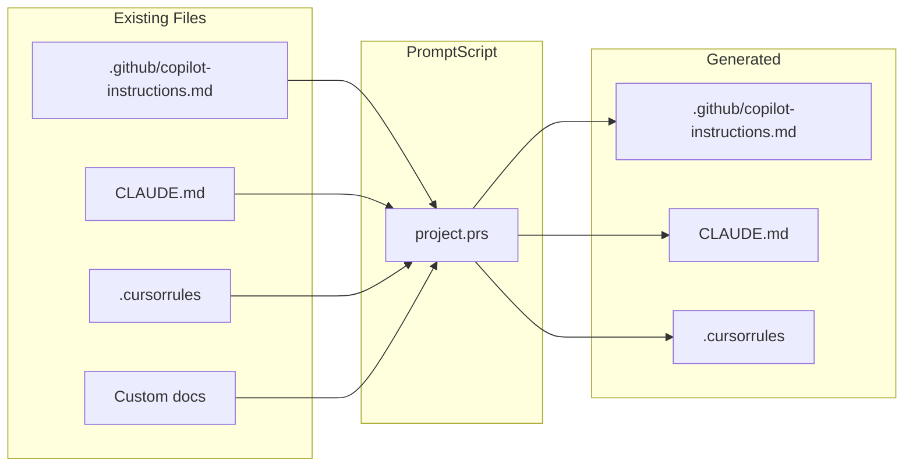

# Migration Guide

This guide helps you migrate existing AI instructions to PromptScript.

## Overview

PromptScript can consolidate instructions from multiple sources:



## Step 1: Analyze Existing Instructions

### Gather Current Files

Collect all existing AI instruction files:

```bash
# Common locations
cat .github/copilot-instructions.md
cat CLAUDE.md
cat .cursorrules
cat AGENTS.md
cat AI_INSTRUCTIONS.md
```

### Identify Content Categories

Map your content to PromptScript blocks:

| Content Type        | PromptScript Block |
| ------------------- | ------------------ |
| Identity/persona    | `@identity`        |
| Project context     | `@context`         |
| Coding standards    | `@standards`       |
| Don'ts/restrictions | `@restrictions`    |
| Custom commands     | `@shortcuts`       |
| Reference docs      | `@knowledge`       |
| Configuration       | `@params`          |

### Example Analysis

**Existing CLAUDE.md:**

```markdown
# Project Instructions

You are a senior developer working on the checkout service.

## Tech Stack

- Node.js 20
- TypeScript
- PostgreSQL

## Standards

- Use functional programming
- Write tests for all code
- Document public APIs

## Don'ts

- Never commit secrets
- Don't use var

## Commands

/test - Run tests
/lint - Run linter
```

**Mapped to:**

- Identity: "You are a senior developer..."
- Context: Tech stack section
- Standards: Standards section
- Restrictions: Don'ts section
- Shortcuts: Commands section

## Step 2: Create PromptScript Structure

### Initialize Project

```bash
prs init
```

### Create Base Structure

```promptscript
# .promptscript/project.prs
@meta {
  id: "checkout-service"
  syntax: "1.0.0"
}

# Content will be added in next steps
```

<!-- playground-link-start -->
<a href="https://getpromptscript.dev/playground/?s=N4IgZglgNgpgziAXAbVABwIYBcAWSQwAeGAtmrAHRoBOCANCAMYD2AdljO-gMQAEV1ZmSxxG1CGiwB6GswBWMRlgFwAOqwACJGFgy9g63rwgATRL1VMcigNbMArlgC0cGNQBuERjEuHecAE92DEJzSwBGCgAGaN9WAF91dT4AYTYOdl4Ad2goXgAjGF4MExMYE2NWXlYiLH8ONAR4gF0GTixqAPwiUnIYFRAGdzc4CDZ8cJB4oA" target="_blank" rel="noopener noreferrer">
  
</a>
<!-- playground-link-end -->

## Step 3: Migrate Content

### Identity Block

=== "Before (Markdown)"

    ```markdown
    You are a senior developer working on the checkout service.
    Focus on clean, maintainable code.
    ```

=== "After (PromptScript)"

    ```promptscript
    @identity {
      """
      You are a senior developer working on the checkout service.
      Focus on clean, maintainable code.
      """
    }
    ```

<!-- playground-link-start -->
<a href="https://getpromptscript.dev/playground/?s=N4IgZglgNgpgziAXAbVABwIYBcAWSQwAeGAtmrAHRoBOCANCAMYD2AdljO-gAIQAmnLBCwBPAATAAOqzFjJIeYpliAmswCuYjNRhaxcThGbUxAgG4wozNDBMB3YwGsIrAOZi2Y3LsY4YjRw0sfVszCEYYCmlZADFmRnU4DxlGWAxWOjESDBcsHNYMACNYMRYBKOVFBQVWAF8QWoBdBkFqEXwiUnJImnoQC1ojVnwARgagA" target="_blank" rel="noopener noreferrer">
  
</a>
<!-- playground-link-end -->

### Context Block

=== "Before (Markdown)"

    ```markdown
    ## Tech Stack

    - Node.js 20
    - TypeScript
    - PostgreSQL
    - Redis for caching
    ```

=== "After (PromptScript)"

    ```promptscript
    @context {
      stack: {
        runtime: "Node.js 20"
        language: "TypeScript"
        database: "PostgreSQL"
        cache: "Redis"
      }

      """
      The checkout service handles payment processing
      and order management for the e-commerce platform.
      """
    }
    ```

<!-- playground-link-start -->
<a href="https://getpromptscript.dev/playground/?s=N4IgZglgNgpgziAXAbVABwIYBcAWSQwAeGAtmrAHRoBOCANCAMYD2AdljO-gAIvtFYABMAA6rQYLhYMjANaJhYiROoBXdhBIwFIkADlmAExgUAVnEEAmAAy6lyqBlYBzVRmfbBugCoBPNDAAyozUEGhYduLKhtgYAEYYcJ66AArMUs7UQQCKADKRyoKMMjjJIABKMIYQcAWCAL5i9nYgdd6lRaVyzKpCSdQAbhCMMII4ToawFpi+WuyCNMwjcHAQLvYTgszUxtSCJE7uMHNCYNuCuKMwALQsJFrUIwuOWGfUJBTNrd9i9SD1AF0GJwsNRfPgiKRyCYaPQQAMYLQIGx8ABGf5AA" target="_blank" rel="noopener noreferrer">
  
</a>
<!-- playground-link-end -->

### Standards Block

=== "Before (Markdown)"

    ```markdown
    ## Coding Standards

    - Use functional programming patterns
    - Write tests for all code (80% coverage)
    - Document public APIs with JSDoc
    - Use ESLint and Prettier
    ```

=== "After (PromptScript)"

    ```promptscript
    @standards {
      code: [
        "Use functional programming style",
        "Write tests for all code (80% coverage)",
        "Document public APIs with JSDoc",
        "Use ESLint and Prettier"
      ]
    }
    ```

<!-- playground-link-start -->
<a href="https://getpromptscript.dev/playground/?s=N4IgZglgNgpgziAXAbVABwIYBcAWSQwAeGAtmrAHRoBOCANCAMYD2AdljO-gAJxYasAJhmqC4AAmAAdVuPEtBMROOQy5cqSACqcGOLABXVoywQ2GKOJrMA5tVIkIrG+L4BPWJrpr1mgOrUEBziHHwSYMzU4haWCnoAFAAcAAwApPLMAG4w9jYwAJRePhogACLMjAYknFhWBgBGUBCM4gCCAAoAkhIA7kE44gBSAMrljEWyvtq64gCiwwAyTrUCguLt1DBYpjmaPgC6MgC+IEf7DDXUbvhEpOQwVLQgDNm0Zqz4AIynQA" target="_blank" rel="noopener noreferrer">
  
</a>
<!-- playground-link-end -->

### Restrictions Block

=== "Before (Markdown)"

    ```markdown
    ## Don'ts

    - Never commit secrets or credentials
    - Don't use `var`, use `const` or `let`
    - Never bypass code review
    ```

=== "After (PromptScript)"

    ```promptscript
    @restrictions {
      - "Never commit secrets or credentials"
      - "Don't use var, use const or let"
      - "Never bypass code review"
    }
    ```

<!-- playground-link-start -->
<a href="https://getpromptscript.dev/playground/?s=N4IgZglgNgpgziAXAbVABwIYBcAWSQwAeGAtmrAHRoBOCANCAMYD2AdljO-gALXxbUIjLBDZwABMAA6rceIC04qSAByMAG4xq4liRIQs4uDEZ8sE5ttMwAJpxEYocZTLmLlAETYByQwFdjcXUMajpxAJgdMUNLcVgsF1kFJVUNLXEAIwBPTDgJFjtxPnUIGAB3RIBfEEqAXQZ7aiz8IlJyGCpaEAZNWlFWfABGGqA" target="_blank" rel="noopener noreferrer">
  
</a>
<!-- playground-link-end -->

### Shortcuts Block

=== "Before (Markdown)"

    ```markdown
    ## Commands

    - /test - Run the test suite
    - /lint - Run ESLint
    - /build - Build for production
    ```

=== "After (PromptScript)"

    ```promptscript
    @shortcuts {
      "/test": "Run the test suite with coverage"
      "/lint": "Run ESLint and fix issues"
      "/build": "Build for production deployment"
    }
    ```

<!-- playground-link-start -->
<a href="https://getpromptscript.dev/playground/?s=N4IgZglgNgpgziAXAbVABwIYBcAWSQwAeGAtmrAHRoBOCANCAMYD2AdljO-gAJw7PUsjAK5Y4AAmAAdVuPFSQAeg5wsCxPJAAlYbNwxxKrOLjCIHcQHdzOcSwBuMahgDmMBTLkLFUCO3WaOrIAogDKADJ+xhisACbikITiEHCm8B6ymooARmZQsQEKAEJ58WAC4jTMscKMWBBs4rEw5MwAniScaiAyAL4gvQC6DF3UbfhEpOQwVLQgDI60Daz4AIwDQA" target="_blank" rel="noopener noreferrer">
  
</a>
<!-- playground-link-end -->

### Knowledge Block

=== "Before (Markdown)"

    ```markdown
    ## API Reference

    ### Authentication

    - POST /auth/login
    - POST /auth/logout

    ### Orders

    - GET /orders
    - POST /orders
    ```

=== "After (PromptScript)"

    ```promptscript
    @knowledge {
      """
      ## API Reference

      ### Authentication
      - POST /auth/login
      - POST /auth/logout

      ### Orders
      - GET /orders - List orders
      - POST /orders - Create order
      """
    }
    ```

<!-- playground-link-start -->
<a href="https://getpromptscript.dev/playground/?s=N4IgZglgNgpgziAXAbVABwIYBcAWSQwAeGAtmrAHRoBOCANCAMYD2AdljO-gAIDWrzAO6wAJgHMYAAmAAdVpMkyQSlfMkBidZICCABQCSkgEowwMap0Yw5chZq3aArrk5YIjbBDa3JAWkm6APIAygAqkgD0GM44EVDMYhCsPv5BYZHRuHEJzM42avaSgdQi5nApkgDiAKLhEcwlZX6SADIQcFiSDaW0FWl13U3+AMIW2FKD1D4qysqsAL4g8wC6DK7UAJ74RKTkMFS0IAwAbmVerPgAjEtAA" target="_blank" rel="noopener noreferrer">
  
</a>
<!-- playground-link-end -->

## Step 4: Complete Migration

### Full Example

=== "Before (CLAUDE.md)"

    ```markdown
    # Checkout Service

    You are a senior developer working on the checkout service.

    ## Tech Stack

    - Node.js 20
    - TypeScript
    - PostgreSQL

    ## Standards

    - Use functional programming
    - Write tests (80% coverage)
    - Document public APIs

    ## Don'ts

    - Never commit secrets
    - Don't use var

    ## Commands

    /test - Run tests
    /lint - Run linter

    ## API Reference

    ### Orders

    - GET /orders
    - POST /orders
    ```

=== "After (project.prs)"

    ```promptscript
    @meta {
      id: "checkout-service"
      syntax: "1.0.0"
    }

    @identity {
      """
      You are a senior developer working on the checkout service.
      """
    }

    @context {
      stack: {
        runtime: "Node.js 20"
        language: "TypeScript"
        database: "PostgreSQL"
      }
    }

    @standards {
      code: [
        "Use functional programming style",
        "Write tests for all code (80% coverage)",
        "Document public APIs with JSDoc"
      ]
    }

    @restrictions {
      - "Never commit secrets"
      - "Don't use var"
    }

    @shortcuts {
      "/test": "Run the test suite"
      "/lint": "Run ESLint"
    }

    @knowledge {
      """
      ## API Reference

      ### Orders
      - GET /orders - List orders
      - POST /orders - Create order
      """
    }
    ```

<!-- playground-link-start -->
<a href="https://getpromptscript.dev/playground/?s=N4IgZglgNgpgziAXAbVABwIYBcAWSQwAeGAtmrAHRoBOCANCAMYD2AdljO-gAIkxYYABMAA6rQYIgATRIJFMcMRgGtmAVywBaODGoA3CIxjyxEuAE92GQrPkBGCgAYnJ1gF8xY7tM5YIWc2FTORATUPFBAE11QQxqGFjBHVYIZmpBKRg9GChmNF1BAHc05QhWAHNBNkFcBMZFFXUsJN0DIwpgsNcPVi8WdiJm0Qi4ARVZYYkJajV2CD5bEAA5ZkyKACs4QQAmR1cpwSgMCrUMcphFgBVzfIBlRmoINCx9qalsDAAjDB1FgAVmKNyvFbgBFAAyrx6PS8o2O72oUi2k0ELEysmQwQk8gAqjpBGBZow-GwMFBBDRmMDSCQypVRuZYPI6FiQgB1R4cGrwLBbMBpWJQclohIACgAHI4AKSo5jZahnGAASmZrPkABFmIw1Hx2BS1J8oIZBABBP4ASS2hX8OEEAClbprGK8ALpiGGsbjxUaPYmpVjI4KaEJLLIFFgkWnNHQPfhwV7BjVsADkzTU+L0cW6nk9cBwaSw2t5QQi8gA9BxRvJFgAlWY1RTc0ZJNT+YzhbEgMtG9jVkJ18QAUVu4LKL3CHu4ylYzEKsCk5xLna6EQAxKvTRbBDWYGBdJwjDmJOuNwB5RG6eMRYMAcUHl0EZbSmVogmDo+bz8vQcEf1PtwfJ8L1fYMAGF4mwBIv2oTpQjg90QDcF0GF8ahzHwIhSHIGAqFoEAGHlOB-XwOxEKAA" target="_blank" rel="noopener noreferrer">
  
</a>
<!-- playground-link-end -->

## Step 5: Configure and Compile

### Update Configuration

```yaml
# promptscript.yaml
input:
  entry: .promptscript/project.prs

targets:
  github:
    enabled: true
    output: .github/copilot-instructions.md
  claude:
    enabled: true
    output: CLAUDE.md
  cursor:
    enabled: true
    output: .cursor/rules/project.mdc

validation:
  strict: true
```

### Compile and Compare

```bash
# Generate new files
prs compile --dry-run

# Review changes
prs diff --all
```

### Validate

```bash
prs validate
```

## Step 6: Update Git

### Remove Old Files from Source Control

```bash
# Keep generated files, but don't edit manually
git rm --cached .github/copilot-instructions.md CLAUDE.md .cursorrules

# Add to .gitignore if you want (optional)
# Or keep them tracked but generated
```

### Commit Migration

```bash
git add .promptscript/ promptscript.yaml
git add .github/copilot-instructions.md CLAUDE.md .cursorrules
git commit -m "chore: migrate AI instructions to PromptScript"
```

## Migration Patterns

### Merging Multiple Sources

If you have different instructions in different files:

```promptscript
@meta {
  id: "my-project"
  syntax: "1.0.0"
}

# From copilot-instructions.md
@identity {
  """
  Content from GitHub Copilot instructions...
  """
}

# From CLAUDE.md
@context {
  """
  Content from Claude instructions...
  """
}

# From .cursorrules
@standards {
  # Rules from Cursor...
}
```

<!-- playground-link-start -->
<a href="https://getpromptscript.dev/playground/?s=N4IgZglgNgpgziAXAbVABwIYBcAWSQwAeGAtmrAHRoBOCANCAMYD2AdljO-gAIkxYYABMAA6rQYIgATRIJEgSATwC0NZgCsYjLPLES4i9hkKz5ARgoAGK7tYBfMWIDEggGLVmJQSzTRmWZQhWOCxqAFdtCDY4ChIpMW5pTiwILEVhPTkQXWzxQQBhNg52QTAPLwBxVIAJMIAjAuZfKH9JYNCIlOiKHsyc2wdWZzdygoAZAEEAVQARAFFY+NZuFnYiLAy8-tyJQrWSss8CqAwwqRg2kPDI7t6t7IexQeH3I4pGMNpmanDYOASQhhWFIMNQpHBNhIXAAlMJ-UqjfKfODfHoUJ4gOwAXQYyWoinwRFI5BgVFoIAYADcYLQoqx8GZMUA" target="_blank" rel="noopener noreferrer">
  
</a>
<!-- playground-link-end -->

### Extracting Common Patterns

If you have similar instructions across projects, extract to registry:

```promptscript
# registry/@company/base.prs
@meta {
  id: "@company/base"
  syntax: "1.0.0"
}

@standards {
  # Common standards...
}

@restrictions {
  # Common restrictions...
}
```

<!-- playground-link-start -->
<a href="https://getpromptscript.dev/playground/?s=N4IgZglgNgpgziAXAbVABwIYBcAWSQwAeGAtmrAHRoBOCANCAMYD2AdljO-gMQAE1MAOYQ4WagE8A9AAEWZDKykAjDHBhVaAHVbSSMLBl7BtvXhAAmiXppCzm8xZJVqbJ3nHHsMhKzYCMFAAMQa6sAL7a2tKiCuYY1OZwRm58AML2JGzuBqxxCXAUhdoRrFECotQQjFgQbEnGrKZpGVnlYlU1dYUUxSBhALoMnGLi+ESk5Oo09CAAbjC0taz4fn1AA" target="_blank" rel="noopener noreferrer">
  
</a>
<!-- playground-link-end -->

Then inherit:

```promptscript
# Project file
@inherit @company/base

@context {
  # Project-specific context
}
```

<!-- playground-link-start -->
<a href="https://getpromptscript.dev/playground/?s=N4IgZglgNgpgziAXAbVABwIYBcAWSQwAeGAtmrAHRoBOCANCAMYD2AdljO-gMQAEACtWYArGIyy9IsADqs+AAQiscMahAnyWZDKwCeAegBGGODF68+ACmowA5hDhZqu3gFpeAEwcZDsD5OZqXnIMXVshAFdWDwBKWU02DkIJYFlzPkERMSxXODQxCEhGXhZ2IixZAF8QSoBdBk4nXXwiUnIYKloQBgA3VTgINnwARhqgA" target="_blank" rel="noopener noreferrer">
  
</a>
<!-- playground-link-end -->

### Handling Tool-Specific Content

Some content may be specific to certain tools:

```promptscript
# Most content is shared
@identity {
  """
  Shared identity...
  """
}

# Tool-specific might need adjustment
# Consider using params for variations
@params {
  tool?: enum("copilot", "claude", "cursor")
}
```

<!-- playground-link-start -->
<a href="https://getpromptscript.dev/playground/?s=N4IgZglgNgpgziAXAbVABwIYBcAWSQwAeGAtmrAHRoBOCANCAMYD2AdljO-gMQAEAsszhZeLdpxEQ4vODgzUYAEwA6rAAIRFEiFgCevYKt69lIU+dbGAynIWLem7XooujJsx9UBfVar4AVZmYoAFo4NBhGCEhGXhIIAHMcEVYYJV4MRQArAFdhEgk-XgBhNjhHal48iFYE3kxqUmkwZkqAN3kIbAgy1TUGpoM3LCCoAH5EXk4ckgAKUxY0aGYsUzp3RigMHK01jZzaVtMASm8QLwBdBglqXXwiUnIYKloQBjaYWh7WfABGc6AA" target="_blank" rel="noopener noreferrer">
  
</a>
<!-- playground-link-end -->

## Advanced Block Migration

### @skills Block

Skills define reusable capabilities for AI agents:

=== "Before (CLAUDE.md)"

    ```markdown
    ## Skills

    ### Code Review

    When reviewing code:

    1. Check for type safety
    2. Verify error handling
    3. Ensure tests exist

    ### Deployment

    Steps to deploy:

    1. Build the project
    2. Run tests
    3. Deploy to staging
    ```

=== "After (PromptScript)"

    ```promptscript
    @skills {
      code-review: {
        description: "Review code for quality and best practices"
        content: """
          When reviewing code:
          1. Check for type safety
          2. Verify error handling
          3. Ensure tests exist
        """
      }

      deployment: {
        description: "Deploy the application"
        content: """
          Deployment process:
          1. Build the project
          2. Run tests
          3. Deploy to staging
        """
      }
    }
    ```

<!-- playground-link-start -->
<a href="https://getpromptscript.dev/playground/?s=N4IgZglgNgpgziAXAbVABwIYBcAWSQwAeGAtmrAHRoBOCANCAMYD2AdljO-gAJwDW0KHAAEwADqthwlgBMYAWmowAbhBgB3RKIlSpcuI2oQ0WCGy1iQAJRVr105nOFhm1YQEcArhigQsAT2EMVhlhACN4LGEaDEZTRnhLHV0Wdk4sCxAkrMldKQB1HE5hJVUNCFYAcwc5RGS8gEYKYQBhIsY+Z1dhALQYYTgMMBgA+t0AJmaANRgjMEDZ6m6cYJlfKrGpAGZmgFFWOE8lHsiRIgg4LDHspNyAXwlkuXJmfxJ0rXFcvXhDY1NzMJLAARGAvQK4foYNDkCCMbBmVi3PKpDjsTI3b66UHg97saJLBJwOB1LFSJrCABCnmgoUhBOYACsYHFNsJJsIrJ5JBxLnA2TthDioK8eswBlgMJUKpVrll5ckHqw7iA7gBdBjpaj+fBEUjkGBUWggBjKWZwRH4BqqoA" target="_blank" rel="noopener noreferrer">
  
</a>
<!-- playground-link-end -->

### @agents Block

Define specialized AI subagents:

=== "Before (AGENTS.md)"

    ```markdown
    # Code Reviewer

    Reviews code for quality.

    Tools: Read, Grep, Bash
    Model: claude-sonnet

    Instructions:
    Review code checking for type safety and error handling.
    ```

=== "After (PromptScript)"

    ```promptscript
    @agents {
      code-reviewer: {
        description: "Reviews code for quality and best practices"
        tools: ["Read", "Grep", "Bash"]
        model: "sonnet"
        content: """
          Review code checking for:
          - Type safety
          - Error handling
          - Test coverage
        """
      }
    }
    ```

<!-- playground-link-start -->
<a href="https://getpromptscript.dev/playground/?s=N4IgZglgNgpgziAXAbVABwIYBcAWSQwAeGAtmrAHRoBOCANCAMYD2AdljO-gAIYDmnLHAAEwADqthwlgBMYAWmowAbhBgB3GNUSiJUqXLiNqENFghsdYkACUVa9SNkxhYZtWEBHAK4YoELABPYQxWGWEAI3gsYRoMRnNGeGs9fSxmZig4HWRrOwwZazphawBxJTQikpAAIQw4HGsAXVSpEmY5KCsQODZWGCwUyX0WdkFulJBW-TtVDWkOl0YcGEYAawhWPld3RGmpeWEAFUC0FzgMMAHA-eFDgFFqandhHFCZfy3bw6PoheUtPwYNNJkMpABfCTgkDgpoMQTUQL4IikcgwKi0EAMAG0CysfAARhhQA" target="_blank" rel="noopener noreferrer">
  
</a>
<!-- playground-link-end -->

### @local Block

Private instructions not committed to version control:

=== "Before (CLAUDE.local.md)"

    ```markdown
    # Local Development

    - API endpoint: http://localhost:8080
    - Debug mode enabled
    - Use staging database
    ```

=== "After (PromptScript)"

    ```promptscript
    @local {
      apiEndpoint: "http://localhost:8080"
      debugMode: true

      """
      Local development notes:
      - Use staging database for testing
      - Mock external services
      """
    }
    ```

<!-- playground-link-start -->
<a href="https://getpromptscript.dev/playground/?s=N4IgZglgNgpgziAXAbVABwIYBcAWSQwAeGAtmrAHRoBOCANCAMYD2AdljO-gAJTOMYoAAmAAdVkKEY0EAKKsAJmmYR2iIaJA4sWNIgD0+vgKg5mcLIgAcABlubxkhTABGAVwDmAWWbP1WajcYcUcNEAdwiSEAGX5BIWcANxg+NBJOLCFWZg44RFCAWiEAVTgYIQsMD1UPBOwMFwwyoTBmaiFcrBrCoR9GAGshIg5qVniy6kSIRnhQiIdWAF8QRYBdBgzqAE98IlJyGCpaEAZk2gg2fABGFaA" target="_blank" rel="noopener noreferrer">
  
</a>
<!-- playground-link-end -->

### @guards Block with Globs

File-specific rules using glob patterns:

=== "Before (.github/instructions/)"

    ```markdown
    ---
    applyTo: src/components/**/*.tsx
    ---

    # Component Guidelines

    Use functional components with TypeScript.
    ```

=== "After (PromptScript)"

    ```promptscript
    @guards {
      globs: ["src/components/**/*.tsx"]

      """
      Component Guidelines:
      - Use functional components
      - Include TypeScript types
      - Add unit tests
      """
    }
    ```

<!-- playground-link-start -->
<a href="https://getpromptscript.dev/playground/?s=N4IgZglgNgpgziAXAbVABwIYBcAWSQwAeGAtmrAHRoBOCANCAMYD2AdljO-gAIDmArhmoATOAAJgAHVZixvKMwBGcRGOSSQcaowD0LMm05Y4OgFSmzFY4Q0BdadNkbnIR2IDCzA6yNiA4vwQwjBQED4qbgC0YgCqcDBiYPysjFgQbBhQYvpohuxwUWIAkilQ-MFiACoAnmgwAMqM1BBoWGJYtfCFAILCwmLJEG0ccMZuLs6sAL4gU7YMRtTV+ESk5DBUtCAMAG4wtOms+ACMs0A" target="_blank" rel="noopener noreferrer">
  
</a>
<!-- playground-link-end -->

### @params Block

Configurable parameters with types:

=== "Before (Markdown)"

    ```markdown
    ## Configuration

    - Verbosity: 1-5 (default: 3)
    - Output format: json | text | markdown
    - Strict mode: on/off
    ```

=== "After (PromptScript)"

    ```promptscript
    @params {
      verbosity: range(1..5) = 3
      format?: enum("json", "text", "markdown") = "text"
      strict: boolean = false
    }
    ```

<!-- playground-link-start -->
<a href="https://getpromptscript.dev/playground/?s=N4IgZglgNgpgziAXAbVABwIYBcAWSQwAeGAtmrAHRoBOCANCAMYD2AdljO-gAKbWlwABMAA6rQYIBuMagCNmcCFgCeiQf1YBzGAAoAjBQoBWAJSCAvIIDMYiWGbUS2APxrOAVxI6RIAFZw2HzpBHw5CLCCQkCdqAGsAE2YAd1YfM0tQogiQW0E4LGoIRiw1eWZYDHFLMAwoOBgxAF8QRoBdBk4C5XwiUnIYKloQBmlaCDZ8PRagA" target="_blank" rel="noopener noreferrer">
  
</a>
<!-- playground-link-end -->

### @extend Block

Modify inherited blocks at specific paths:

```promptscript
@inherit @company/base

# Add to existing identity
@extend identity {
  """
  Additional expertise in React development.
  """
}

# Modify nested standards
@extend standards.code.testing {
  framework: "vitest"
  coverage: 90
}

# Add to restrictions array
@extend restrictions {
  - "Use functional components only"
  - "No class-based components"
}
```

<!-- playground-link-start -->
<a href="https://getpromptscript.dev/playground/?s=N4IgZglgNgpgziAXAbVABwIYBcAWSQwAeGAtmrAHRoBOCANCAMYD2AdljO-gMQAEAAhFY4Y1CFgEsyGVgE8A9ACMMcGL158AFNRgBzCHCzVZvALS8AJgYyLYF3mGbVe5DLN3VmAV1YWAlAA6rHwAghb2WMy8RAZYQrq8EBaccViyQfxEHL6JyeziJsBB6gEgpeWs6mFWcWwYUNGEaKJxqomVAEowGIwSyQBuMFDMaCQpFMW85WVlrAC+QUF8ALLMVmAmrPAc9oYyFhjUFnAZWZy7WPuHxxQsyRQchvG8RZUO1KQwAO5OANaIUxA-XE2wq6hYgw+uhgAIAnAAGIILVhLXjVXiRXg6QxiXoQNhwXiHD7pViZQjZezYowQPEEl6TcylACqbTAPjprHqvCkaDYKUJbCg6Vm6iZIAAclFGFAVHBTMpVPZefz2CdZnMQHMALoMFLGfBEUjkGBUWggBiQuD41j4ACMWqAA" target="_blank" rel="noopener noreferrer">
  
</a>
<!-- playground-link-end -->

## Validation Checklist

After migration, verify:

- [ ] `prs validate` passes without errors
- [ ] `prs compile` generates all targets
- [ ] Generated files match expected content
- [ ] No duplicate or conflicting instructions
- [ ] All custom commands work in each tool
- [ ] Team members can compile locally

## Common Issues

### Missing Metadata

```
Error: @meta block is required
```

Add required `@meta` block with `id` and `syntax`.

### Invalid Syntax

```
Error: Unexpected token at line 15
```

Check PromptScript syntax, especially:

- Colons after property names
- Proper string quoting
- Array/object brackets

### Multiline Strings in Objects

Multiline strings cannot be loose inside objects:

```promptscript
# ❌ Invalid
@standards {
  code: {
    style: "clean"
    """
    Additional notes...
    """
  }
}

# ✅ Valid - assign to a key
@standards {
  code: {
    style: "clean"
    notes: """
      Additional notes...
    """
  }
}
```

<!-- playground-link-start -->
<a href="https://getpromptscript.dev/playground/?s=N4IgZglgNgpgziAXAbVABwIYBcAWSQwAeGAtmrAHRoBOCANCAMYD2AdljO-gMQAEgMuS8AkqwBuGKBAAmAHVYABOFgyspGalLi9gc3rxZSYibbr28lAT1jGZTWCtum9jkI9ZneAQSlSIWCGwSvKzMHHAUEU68Lm56AL5yCaxyfICg5LwAahLSvAC0vBhwcBAA5u5YzAW8ANYwFnKKyqrqmibu+syGxjrtepbW0XYwDq69waHwNq7TUXrevv6BUONhERRRMaPxiSBxALoMnFjUFvhEpOQwVLQgDKIwtAGs+ACMu0A" target="_blank" rel="noopener noreferrer">
  
</a>
<!-- playground-link-end -->

### Content Loss

If compiled output is missing content:

1. Check block names are correct
2. Verify no syntax errors in blocks
3. Use `--verbose` flag for debugging

## AI-Assisted Migration

For automated migration using AI assistants, PromptScript provides a dedicated skill that guides the AI through the migration process.

### Using the Migration Skill

**Claude Code:**

```bash
# Use the migrate skill
/migrate

# Or ask directly
"migrate my existing instructions to PromptScript"
```

**GitHub Copilot:**

Reference the migrate skill in your prompt or use Chat with the migration context.

**Cursor:**

Use Composer with migration context or reference the PromptScript migration documentation.

### What the AI Will Do

1. **Discover** existing instruction files (CLAUDE.md, .cursorrules, copilot-instructions.md)
2. **Analyze** content and classify into PromptScript blocks
3. **Generate** properly structured PromptScript files
4. **Validate** the output with `prs validate`

### Best Practices for AI Migration

For detailed guidelines on AI-assisted migration, including content mapping patterns and common pitfalls, see [AI Migration Best Practices](ai-migration-best-practices.md).

## Next Steps

After migration:

1. [Set up inheritance](inheritance.md) if you have multiple projects
2. [Organize multi-file setup](multi-file.md) for complex projects
3. [Configure CI/CD](enterprise.md#cicd-integration) for validation
4. Train team on PromptScript workflow
