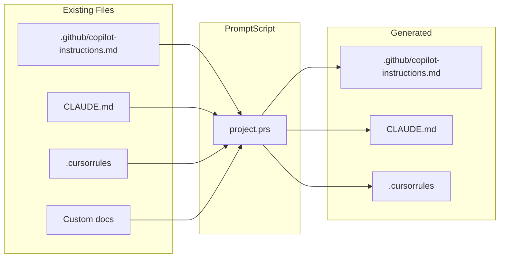

# Migration Guide

This guide helps you migrate existing AI instructions to PromptScript.

## Overview

PromptScript can consolidate instructions from multiple sources:



## Step 1: Analyze Existing Instructions

### Gather Current Files

Collect all existing AI instruction files:

```bash
# Common locations
cat .github/copilot-instructions.md
cat CLAUDE.md
cat .cursorrules
cat AGENTS.md
cat AI_INSTRUCTIONS.md
```

### Identify Content Categories

Map your content to PromptScript blocks:

| Content Type        | PromptScript Block |
| ------------------- | ------------------ |
| Identity/persona    | `@identity`        |
| Project context     | `@context`         |
| Coding standards    | `@standards`       |
| Don'ts/restrictions | `@restrictions`    |
| Custom commands     | `@shortcuts`       |
| Reference docs      | `@knowledge`       |
| Configuration       | `@params`          |

### Example Analysis

**Existing CLAUDE.md:**

```markdown
# Project Instructions

You are a senior developer working on the checkout service.

## Tech Stack

- Node.js 20
- TypeScript
- PostgreSQL

## Standards

- Use functional programming
- Write tests for all code
- Document public APIs

## Don'ts

- Never commit secrets
- Don't use var

## Commands

/test - Run tests
/lint - Run linter
```

**Mapped to:**

- Identity: "You are a senior developer..."
- Context: Tech stack section
- Standards: Standards section
- Restrictions: Don'ts section
- Shortcuts: Commands section

## Step 2: Create PromptScript Structure

### Initialize Project

```bash
prs init
```

### Create Base Structure

```promptscript
# .promptscript/project.prs
@meta {
  id: "checkout-service"
  version: "1.0.0"
}

# Content will be added in next steps
```

## Step 3: Migrate Content

### Identity Block

**Before (Markdown):**

```markdown
You are a senior developer working on the checkout service.
Focus on clean, maintainable code.
```

**After (PromptScript):**

```promptscript
@identity {
  """
  You are a senior developer working on the checkout service.
  Focus on clean, maintainable code.
  """
}
```

### Context Block

**Before (Markdown):**

```markdown
## Tech Stack

- Node.js 20
- TypeScript
- PostgreSQL
- Redis for caching
```

**After (PromptScript):**

```promptscript
@context {
  stack: {
    runtime: "Node.js 20"
    language: "TypeScript"
    database: "PostgreSQL"
    cache: "Redis"
  }

  """
  The checkout service handles payment processing
  and order management for the e-commerce platform.
  """
}
```

### Standards Block

**Before (Markdown):**

```markdown
## Coding Standards

- Use functional programming patterns
- Write tests for all code (80% coverage)
- Document public APIs with JSDoc
- Use ESLint and Prettier
```

**After (PromptScript):**

```promptscript
@standards {
  code: {
    style: "functional"
    testing: {
      required: true
      coverage: 80
    }
    documentation: {
      publicApi: "JSDoc"
    }
    linting: {
      eslint: true
      prettier: true
    }
  }
}
```

### Restrictions Block

**Before (Markdown):**

```markdown
## Don'ts

- Never commit secrets or credentials
- Don't use `var`, use `const` or `let`
- Never bypass code review
```

**After (PromptScript):**

```promptscript
@restrictions {
  - "Never commit secrets or credentials"
  - "Don't use var, use const or let"
  - "Never bypass code review"
}
```

### Shortcuts Block

**Before (Markdown):**

```markdown
## Commands

- /test - Run the test suite
- /lint - Run ESLint
- /build - Build for production
```

**After (PromptScript):**

```promptscript
@shortcuts {
  "/test": "Run the test suite with coverage"
  "/lint": "Run ESLint and fix issues"
  "/build": "Build for production deployment"
}
```

### Knowledge Block

**Before (Markdown):**

```markdown
## API Reference

### Authentication

- POST /auth/login
- POST /auth/logout

### Orders

- GET /orders
- POST /orders
```

**After (PromptScript):**

```promptscript
@knowledge {
  """
  ## API Reference

  ### Authentication
  - POST /auth/login
  - POST /auth/logout

  ### Orders
  - GET /orders - List orders
  - POST /orders - Create order
  """
}
```

## Step 4: Complete Migration

### Full Example

**Before (CLAUDE.md):**

```markdown
# Checkout Service

You are a senior developer working on the checkout service.

## Tech Stack

- Node.js 20
- TypeScript
- PostgreSQL

## Standards

- Use functional programming
- Write tests (80% coverage)
- Document public APIs

## Don'ts

- Never commit secrets
- Don't use var

## Commands

/test - Run tests
/lint - Run linter

## API Reference

### Orders

- GET /orders
- POST /orders
```

**After (project.prs):**

```promptscript
@meta {
  id: "checkout-service"
  version: "1.0.0"
}

@identity {
  """
  You are a senior developer working on the checkout service.
  """
}

@context {
  stack: {
    runtime: "Node.js 20"
    language: "TypeScript"
    database: "PostgreSQL"
  }
}

@standards {
  code: {
    style: "functional"
    testing: {
      required: true
      coverage: 80
    }
    documentation: "JSDoc for public APIs"
  }
}

@restrictions {
  - "Never commit secrets"
  - "Don't use var"
}

@shortcuts {
  "/test": "Run the test suite"
  "/lint": "Run ESLint"
}

@knowledge {
  """
  ## API Reference

  ### Orders
  - GET /orders - List orders
  - POST /orders - Create order
  """
}
```

## Step 5: Configure and Compile

### Update Configuration

```yaml
# promptscript.config.yaml
input:
  entry: .promptscript/project.prs

targets:
  github:
    enabled: true
    output: .github/copilot-instructions.md
  claude:
    enabled: true
    output: CLAUDE.md
  cursor:
    enabled: true
    output: .cursorrules

validation:
  strict: true
```

### Compile and Compare

```bash
# Generate new files
prs compile --all --dry-run

# Review changes
prs diff --all
```

### Validate

```bash
prs validate
```

## Step 6: Update Git

### Remove Old Files from Source Control

```bash
# Keep generated files, but don't edit manually
git rm --cached .github/copilot-instructions.md CLAUDE.md .cursorrules

# Add to .gitignore if you want (optional)
# Or keep them tracked but generated
```

### Commit Migration

```bash
git add .promptscript/ promptscript.config.yaml
git add .github/copilot-instructions.md CLAUDE.md .cursorrules
git commit -m "chore: migrate AI instructions to PromptScript"
```

## Migration Patterns

### Merging Multiple Sources

If you have different instructions in different files:

```promptscript
@meta {
  id: "my-project"
  version: "1.0.0"
}

# From copilot-instructions.md
@identity {
  """
  Content from GitHub Copilot instructions...
  """
}

# From CLAUDE.md
@context {
  """
  Content from Claude instructions...
  """
}

# From .cursorrules
@standards {
  # Rules from Cursor...
}
```

### Extracting Common Patterns

If you have similar instructions across projects, extract to registry:

```promptscript
# registry/@company/base.prs
@meta {
  id: "@company/base"
  version: "1.0.0"
}

@standards {
  # Common standards...
}

@restrictions {
  # Common restrictions...
}
```

Then inherit:

```promptscript
# Project file
@inherit @company/base

@context {
  # Project-specific context
}
```

### Handling Tool-Specific Content

Some content may be specific to certain tools:

```promptscript
# Most content is shared
@identity {
  """
  Shared identity...
  """
}

# Tool-specific might need adjustment
# Consider using params for variations
@params {
  tool?: enum("copilot", "claude", "cursor")
}
```

## Validation Checklist

After migration, verify:

- [ ] `prs validate` passes without errors
- [ ] `prs compile --all` generates all targets
- [ ] Generated files match expected content
- [ ] No duplicate or conflicting instructions
- [ ] All custom commands work in each tool
- [ ] Team members can compile locally

## Common Issues

### Missing Metadata

```
Error: @meta block is required
```

Add required `@meta` block with `id` and `version`.

### Invalid Syntax

```
Error: Unexpected token at line 15
```

Check PromptScript syntax, especially:

- Colons after property names
- Proper string quoting
- Array/object brackets

### Content Loss

If compiled output is missing content:

1. Check block names are correct
2. Verify no syntax errors in blocks
3. Use `--verbose` flag for debugging

## Next Steps

After migration:

1. [Set up inheritance](inheritance.md) if you have multiple projects
2. [Configure CI/CD](enterprise.md#cicd-integration) for validation
3. Train team on PromptScript workflow
