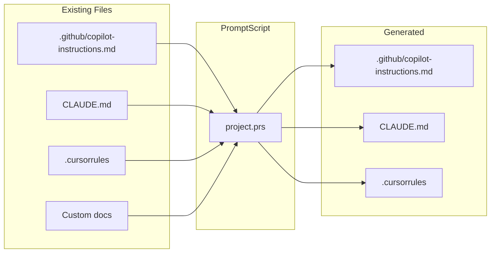

# Migration Guide

This guide helps you migrate existing AI instructions to PromptScript.

!!! note "Upgrading an existing PromptScript project?"

    This guide converts third-party instruction files into PromptScript.
    Existing PromptScript 1.15 projects should use
    [Upgrade 1.15 to 1.16](upgrade-1-15-to-1-16.md).

## Choose a Migration Command

| Need                                      | Command                          |
| ----------------------------------------- | -------------------------------- |
| Convert all detected project instructions | `prs migrate --static --dry-run` |
| Generate an AI-assisted migration prompt  | `prs migrate --llm`              |
| Convert one known file                    | `prs import <file> --dry-run`    |
| Upgrade existing `.prs` syntax            | `prs upgrade --dry-run`          |

Prefer `prs migrate` for project adoption. Use `prs import` as a lower-level
single-file tool.

## Overview

PromptScript can consolidate instructions from multiple sources:


```mermaid
flowchart LR
    subgraph Sources["Existing Files"]
        A[".github/copilot-instructions.md"]
        B["CLAUDE.md"]
        C[".cursorrules"]
        D["Custom docs"]
    end

    subgraph PS["PromptScript"]
        E["project.prs"]
    end

    subgraph Output["Generated"]
        F[".github/copilot-instructions.md"]
        G["CLAUDE.md"]
        H[".cursorrules"]
    end

    A --> E
    B --> E
    C --> E
    D --> E
    E --> F
    E --> G
    E --> H
```

## Step 1: Analyze Existing Instructions

### Gather Current Files

Collect all existing AI instruction files:

```bash
# Common locations
cat .github/copilot-instructions.md
cat CLAUDE.md
cat .cursorrules
cat AGENTS.md
cat AI_INSTRUCTIONS.md
```

### Identify Content Categories

Map your content to PromptScript blocks:

| Content Type        | PromptScript Block |
| ------------------- | ------------------ |
| Identity/persona    | `@identity`        |
| Project context     | `@context`         |
| Coding standards    | `@standards`       |
| Don'ts/restrictions | `@restrictions`    |
| Custom commands     | `@shortcuts`       |
| Reference docs      | `@knowledge`       |
| Configuration       | `@params`          |

### Example Analysis

**Existing CLAUDE.md:**

```markdown
# Project Instructions

You are a senior developer working on the checkout service.

## Tech Stack

- Node.js 20
- TypeScript
- PostgreSQL

## Standards

- Use functional programming
- Write tests for all code
- Document public APIs

## Don'ts

- Never commit secrets
- Don't use var

## Commands

/test - Run tests
/lint - Run linter
```

**Mapped to:**

- Identity: "You are a senior developer..."
- Context: Tech stack section
- Standards: Standards section
- Restrictions: Don'ts section
- Shortcuts: Commands section

## Step 2: Create PromptScript Structure

### Initialize Project

```bash
prs init
```

### Create Base Structure

```promptscript
# .promptscript/project.prs
@meta {
  id: "checkout-service"
  syntax: "1.0.0"
}

# Content will be added in next steps
```

## Step 3: Migrate Content

### Identity Block

=== "Before (Markdown)"

    ```markdown
    You are a senior developer working on the checkout service.
    Focus on clean, maintainable code.
    ```

=== "After (PromptScript)"

    ```promptscript
    @identity {
      """
      You are a senior developer working on the checkout service.
      Focus on clean, maintainable code.
      """
    }
    ```

<!-- playground-link-start -->
<a href="https://getpromptscript.dev/playground/?s=N4IgZglgNgpgziAXAbVABwIYBcAWSQwAeGAtmrAHRoBOCANCAMYD2AdljO-gMQAEAAiRhYMvDABNxMcbzjNeuCHF5hqGAOZD2vFmWjxebXhCzLmAd1bGruGL3IYAnuurMArq3EAdVoOGjgH15jcUReLwJiMlgIoNlHdgxCMIiARgoAVgoABljWAF8fH34IKXYTR15Aq3CQWLqagE13MWo7UThOCGZqXikANxgoZjQYXvMegGsIVnVDGxw7RkXGSfcsWTH+iEYYCjiAMWZGNzMrRlgMVjpeEgwZkRmMACNYHWYpfZr6vPyQfIAugxOFhqI58ERSOQ9jR6CBBrRuqx8Kl-kA" target="_blank" rel="noopener noreferrer">
  
</a>
<!-- playground-link-end -->

### Context Block

=== "Before (Markdown)"

    ```markdown
    ## Tech Stack

    - Node.js 20
    - TypeScript
    - PostgreSQL
    - Redis for caching
    ```

=== "After (PromptScript)"

    ```promptscript
    @context {
      stack: {
        runtime: "Node.js 20"
        language: "TypeScript"
        database: "PostgreSQL"
        cache: "Redis"
      }

      """
      The checkout service handles payment processing
      and order management for the e-commerce platform.
      """
    }
    ```

<!-- playground-link-start -->
<a href="https://getpromptscript.dev/playground/?s=N4IgZglgNgpgziAXAbVABwIYBcAWSQwAeGAtmrAHRoBOCANCAMYD2AdljO-gMQAEAAiRhYMvDABNxMcbzjNeuCHF5hqGAOZD2vFmWjxebXhCzLmAd1bGruGL3IYAnuurMArq3EAdVoOGjgH15jcUReLwJiMlgIoNlHdgxCMIiARgoAVgoABljWAF8fH34WdiIsXkCrWRFGAGswquDg6g8sCCEUkAA5ZikKACtlACZckDjgqAxWdTcNGC6AFUc0GABlRmoINCw85t5xbAwAIww4BfCQAAVmOCwXdYBFABk95sYMRhwLiIAlaSUb0KrDisXG42qi2+Om+9XcFXO1AAbhBGHYcNNxLBlJhHFoKjRmGi4HAIDM4pjDNQpNReCRpvN8SpmLTbLwYABaXRCaho+xTLBgFkkCig8F5fIgfIAXQYnCw1Ec+CIpHIMCotBADCRMFoEDY+FSUqAA" target="_blank" rel="noopener noreferrer">
  
</a>
<!-- playground-link-end -->

### Standards Block

=== "Before (Markdown)"

    ```markdown
    ## Coding Standards

    - Use functional programming patterns
    - Write tests for all code (80% coverage)
    - Document public APIs with JSDoc
    - Use ESLint and Prettier
    ```

=== "After (PromptScript)"

    ```promptscript
    @standards {
      code: [
        "Use functional programming style",
        "Write tests for all code (80% coverage)",
        "Document public APIs with JSDoc",
        "Use ESLint and Prettier"
      ]
    }
    ```

<!-- playground-link-start -->
<a href="https://getpromptscript.dev/playground/?s=N4IgZglgNgpgziAXAbVABwIYBcAWSQwAeGAtmrAHRoBOCANCAMYD2AdljO-gMQAEAAiRhYMvDABNxMcbzjNeuCHF5hqGAOZD2vFmWjxebXhCzLmAd1bGruGL3IYAnuurMArq3EAdVoOGjgH15jcUReLwJiMlgIoNlHdgxCMIiARgoAVgoABljWAF8fH344EU8ManFlQKsdZikw5DjgiIBVODswD0YsCDYMKHtXF1ISCFZ1WSxHGJA6ZvCQAHVqEzsOUuUwZmoxKEGWKV4ACgAObIBSOoA3GDV1GABKCPnalpAAEWZGNy0sezcACMoBBGLwAIIABQAkspzCYcLwAFIAZS+jBeCzaHV4AFEUQAZcb-DCeXiQ6jCXp3PLBAC6PnyIHydIYnCw1Ec+CIpHIMCotDmIFutD6rHwqWZQA" target="_blank" rel="noopener noreferrer">
  
</a>
<!-- playground-link-end -->

### Restrictions Block

=== "Before (Markdown)"

    ```markdown
    ## Don'ts

    - Never commit secrets or credentials
    - Don't use `var`, use `const` or `let`
    - Never bypass code review
    ```

=== "After (PromptScript)"

    ```promptscript
    @restrictions {
      - "Never commit secrets or credentials"
      - "Don't use var, use const or let"
      - "Never bypass code review"
    }
    ```

<!-- playground-link-start -->
<a href="https://getpromptscript.dev/playground/?s=N4IgZglgNgpgziAXAbVABwIYBcAWSQwAeGAtmrAHRoBOCANCAMYD2AdljO-gMQAEAAiRhYMvDABNxMcbzjNeuCHF5hqGAOZD2vFmWjxebXhCzLmAd1bGruGL3IYAnuurMArq3EAdVoOGjgH15jcUReLwJiMlgIoNlHdgxCMIiARgoAVgoABljWAF8fH35qeCxqCEYsCDZlQKteAFpwkAA5GAA3GGodZhISE1kYRlLTQx6R6U5qjCg4PODmiIARNgByLF43ODsOjGo6LZ3e1jhN5h7YLAWmlvaunoAjR0w4ZRYpXlKOiBhzPPyIHyAF0GNNqI58ERSOQYFRaCAGA84DVWPhUkCgA" target="_blank" rel="noopener noreferrer">
  
</a>
<!-- playground-link-end -->

### Shortcuts Block

=== "Before (Markdown)"

    ```markdown
    ## Commands

    - /test - Run the test suite
    - /lint - Run ESLint
    - /build - Build for production
    ```

=== "After (PromptScript)"

    ```promptscript
    @shortcuts {
      "/test": "Run the test suite with coverage"
      "/lint": "Run ESLint and fix issues"
      "/build": "Build for production deployment"
    }
    ```

<!-- playground-link-start -->
<a href="https://getpromptscript.dev/playground/?s=N4IgZglgNgpgziAXAbVABwIYBcAWSQwAeGAtmrAHRoBOCANCAMYD2AdljO-gMQAEAAiRhYMvDABNxMcbzjNeuCHF5hqGAOZD2vFmWjxebXhCzLmAd1bGruGL3IYAnuurMArq3EAdVoOGjgH15jcUReLwJiMlgIoNlHdgxCMIiARgoAVgoABljWAF8fH344HGZqLEY3U15Aq3CQAHoOOCwIlJAAJQ8FHDsWrFk3EztzExwdZgA3GDV1GDzgiMaoCHZ2hu6rAFEAZQAZNcGMTxUIQmM4ODd4RYbGgCNhqG8kBoAhZ5kwcvtXcTcjCwECMUnIzEcWjaIB8+RA+QAugxOFhqI58ERSOQYFRaCAGDNaCDWPhUvCgA" target="_blank" rel="noopener noreferrer">
  
</a>
<!-- playground-link-end -->

### Knowledge Block

=== "Before (Markdown)"

    ```markdown
    ## API Reference

    ### Authentication

    - POST /auth/login
    - POST /auth/logout

    ### Orders

    - GET /orders
    - POST /orders
    ```

=== "After (PromptScript)"

    ```promptscript
    @knowledge {
      """
      ## API Reference

      ### Authentication
      - POST /auth/login
      - POST /auth/logout

      ### Orders
      - GET /orders - List orders
      - POST /orders - Create order
      """
    }
    ```

<!-- playground-link-start -->
<a href="https://getpromptscript.dev/playground/?s=N4IgZglgNgpgziAXAbVABwIYBcAWSQwAeGAtmrAHRoBOCANCAMYD2AdljO-gMQAEAAiRhYMvDABNxMcbzjNeuCHF5hqGAOZD2vFmWjxebXhCzLmAd1bGruGL3IYAnuurMArq3EAdVoOGjgH15jcUReLwJiMlgIoNlHdgxCMIiARgoAVgoABljWAF8fH34Aa1YLWHF1O0CrcJBYhrruPgBBAAUASV4AJRgwGGpORhgi5pbeVrdbdghGbAg2OIBaXnaAeQBlABVeAHoMaZw9qGZ1CFYVta3dg6OTs-csMeCWvnXqKVorgHEAUVuzE+g2UqwAMkosIZgd86qsNjt9kCvqDeABhIbYOzIwZxRp5fIgfIAXQYnCw1Ec+CIpHIMCotBADAAbiDFqx8KkiUA" target="_blank" rel="noopener noreferrer">
  
</a>
<!-- playground-link-end -->

## Step 4: Complete Migration

### Full Example

=== "Before (CLAUDE.md)"

    ```markdown
    # Checkout Service

    You are a senior developer working on the checkout service.

    ## Tech Stack

    - Node.js 20
    - TypeScript
    - PostgreSQL

    ## Standards

    - Use functional programming
    - Write tests (80% coverage)
    - Document public APIs

    ## Don'ts

    - Never commit secrets
    - Don't use var

    ## Commands

    /test - Run tests
    /lint - Run linter

    ## API Reference

    ### Orders

    - GET /orders
    - POST /orders
    ```

=== "After (project.prs)"

    ```promptscript
    @meta {
      id: "checkout-service"
      syntax: "1.0.0"
    }

    @identity {
      """
      You are a senior developer working on the checkout service.
      """
    }

    @context {
      stack: {
        runtime: "Node.js 20"
        language: "TypeScript"
        database: "PostgreSQL"
      }
    }

    @standards {
      code: [
        "Use functional programming style",
        "Write tests for all code (80% coverage)",
        "Document public APIs with JSDoc"
      ]
    }

    @restrictions {
      - "Never commit secrets"
      - "Don't use var"
    }

    @shortcuts {
      "/test": "Run the test suite"
      "/lint": "Run ESLint"
    }

    @knowledge {
      """
      ## API Reference

      ### Orders
      - GET /orders - List orders
      - POST /orders - Create order
      """
    }
    ```

<!-- playground-link-start -->
<a href="https://getpromptscript.dev/playground/?s=N4IgZglgNgpgziAXAbVABwIYBcAWSQwAeGAtmrAHRoBOCANCAMYD2AdljO-gAIkxYYABMAA6rQYIgATRIJFMcMRgGtmAVywBaODGoA3CIxjyxEuAE92GQrPkBGCgAYnJ1gF8xY7tM5YIWc2FTORATUPFBAE11QQxqGFjBHVYIZmpBKRg9GChmNF1BAHc05QhWAHNBNkFcBMZFFXUsJN0DIwpgsNcPVi8WdiJm0Qi4ARVZYYkJajV2CD5bEAA5ZkyKACs4QQAmR1cpwSgMCrUMcphFgBVzfIBlRmoINCx9qalsDAAjDB1FgAVmKNyvFbgBFAAyrx6PS8o2O72oUi2k0ELEysmQwQk8gAqjpBGBZow-GwMFBBDRmMDSCQypVRuZYPI6FiQgB1R4cGrwLBbMBpWJQclohIACgAHI4AKSo5jZahnGAASmZrPkABFmIw1Hx2BS1J8oIZBABBP4ASS2hX8OEEAClbprGK8ALpiGGsbjxUaPYmpVjI4KaEJLLIFFgkWnNHQPfhwV7BjVsADkzTU+L0cW6nk9cBwaSw2t5QQi8gA9BxRvJFgAlWY1RTc0ZJNT+YzhbEgMtG9jVkJ18QAUVu4LKL3CHu4ylYzEKsCk5xLna6EQAxKvTRbBDWYGBdJwjDmJOuNwB5RG6eMRYMAcUHl0EZbSmVogmDo+bz8vQcEf1PtwfJ8L1fYMAGF4mwBIv2oTpQjg90QDcF0GF8ahzHwIhSHIGAqFoEAGHlOB-XwOxEKAA" target="_blank" rel="noopener noreferrer">
  
</a>
<!-- playground-link-end -->

## Step 5: Configure and Compile

### Update Configuration

```yaml
# promptscript.yaml
id: my-project
syntax: '1.4.0'

input:
  entry: .promptscript/project.prs

targets:
  - github:
      output: .github/copilot-instructions.md
  - claude:
      output: CLAUDE.md
  - cursor:
      output: .cursor/rules/project.mdc
```

### Compile and Compare

Before PromptScript takes ownership of existing instruction files, create a
recoverable baseline. Tracked files are recoverable from the migration branch.
Back up any untracked or ignored instruction files outside configured output
paths, or copy them into a local migration-backup directory that will not be
committed.

```bash
# Confirm every planned output and ownership conflict.
prs compile --dry-run

# Compare complete planned output with existing files.
prs diff --all --full
```

Review source parity, target-specific omissions, file modes, and every conflict
path. Do not delete an existing configured target merely to bypass ownership
protection. When all planned outputs and backups are approved, perform one
controlled takeover:

```bash
prs validate --strict
prs compile --force
git diff -- .
prs diff --all --full
```

The final PromptScript diff must be empty. The Git diff must contain only
approved generated replacements and migration source or configuration. Restore
from version control or backup if the result loses user-owned content.

## Step 6: Update Git

### Keep Generated Files Tracked

```bash
git add .promptscript/ promptscript.yaml
git add .github/copilot-instructions.md CLAUDE.md .cursor/rules/project.mdc
git commit -m "chore: migrate AI instructions to PromptScript"
```

This lets CI detect drift between PromptScript sources and generated outputs. If your team prefers
to generate outputs locally, adopt one consistent ignored-output workflow only
after the controlled compile above has created and verified every configured
target:

```bash
printf '%s\n' \
  '.github/copilot-instructions.md' \
  'CLAUDE.md' \
  '.cursor/rules/project.mdc' >> .gitignore
git rm --cached .github/copilot-instructions.md CLAUDE.md .cursor/rules/project.mdc
git add .gitignore .promptscript/ promptscript.yaml
git commit -m "chore: migrate AI instructions to PromptScript"
```

`git rm --cached` stops tracking these files but keeps the verified working-tree
copies. It is not a workaround for overwrite conflicts and must not run before
the takeover review.

## Migration Patterns

### Merging Multiple Sources

If you have different instructions in different files:

```promptscript
@meta {
  id: "my-project"
  syntax: "1.0.0"
}

# From copilot-instructions.md
@identity {
  """
  Content from GitHub Copilot instructions...
  """
}

# From CLAUDE.md
@context {
  """
  Content from Claude instructions...
  """
}

# From .cursorrules
@standards {
  # Rules from Cursor...
}
```

<!-- playground-link-start -->
<a href="https://getpromptscript.dev/playground/?s=N4IgZglgNgpgziAXAbVABwIYBcAWSQwAeGAtmrAHRoBOCANCAMYD2AdljO-gAIkxYYABMAA6rQYIgATRIJEgSATwC0NZgCsYjLPLES4i9hkKz5ARgoAGK7tYBfMWIDEggGLVmJQSzTRmWZQhWOCxqAFdtCDY4ChIpMW5pTiwILEVhPTkQXWzxQQBhNg52QTAPLwBxVIAJMIAjAuZfKH9JYNCIlOiKHsyc2wdWZzdygoAZAEEAVQARAFFY+NZuFnYiLAy8-tyJQrWSss8CqAwwqRg2kPDI7t6t7IexQeH3I4pGMNpmanDYOASQhhWFIMNQpHBNhIXAAlMJ-UqjfKfODfHoUJ4gOwAXQYyWoinwRFI5BgVFoIAYADcYLQoqx8GZMUA" target="_blank" rel="noopener noreferrer">
  
</a>
<!-- playground-link-end -->

### Extracting Common Patterns

If you have similar instructions across projects, extract to registry:

```promptscript
# registry/@company/base.prs
@meta {
  id: "@company/base"
  syntax: "1.0.0"
}

@standards {
  # Common standards...
}

@restrictions {
  # Common restrictions...
}
```

<!-- playground-link-start -->
<a href="https://getpromptscript.dev/playground/?s=N4IgZglgNgpgziAXAbVABwIYBcAWSQwAeGAtmrAHRoBOCANCAMYD2AdljO-gMQAE1MAOYQ4WagE8A9AAEWZDKykAjDHBhVaAHVbSSMLBl7BtvXhAAmiXppCzm8xZJVqbJ3nHHsMhKzYCMFAAMQa6sAL7a2tKiCuYY1OZwRm58AML2JGzuBqxxCXAUhdoRrFECotQQjFgQbEnGrKZpGVnlYlU1dYUUxSBhALoMnGLi+ESk5Oo09CAAbjC0taz4fn1AA" target="_blank" rel="noopener noreferrer">
  
</a>
<!-- playground-link-end -->

Then inherit:

```promptscript
# Project file
@inherit @company/base

@context {
  # Project-specific context
}
```

<!-- playground-link-start -->
<a href="https://getpromptscript.dev/playground/?s=N4IgZglgNgpgziAXAbVABwIYBcAWSQwAeGAtmrAHRoBOCANCAMYD2AdljO-gMQAEAAiRhYMvDABNxMcbzjNeuCHF5hqGAOZD2vFmWjxebXhCzLmAd1bGruGL3IYAnuurMArq3EAdVoOGjgH15jcUReLwJiMlgIoNlHdgxCMIiARgoAVgoABljWAF8fHz4ABVcAKxhGLBV9H34IVhwYahMBXUxWRwB6ACMMOBgi3xZ2IhrAq15SiqqsAFo4NCqISEYdNg5CLB98kHy6dGw8RBB+DowuvoGYKloQBlGOLlO+AGU3NHIIaVl5W14RFI5Ds1A8yma1FuvAAcswaphqDVmGAFM1eOJmIw3FoRFgIGw6GJPLxWPCxLwoRgoPYMIwANYaW71IQiXiTYIQULhM4XK79QZ5YJwBIiZI89JZXIgOIkCCERphLBgoYFepwESeDDUcTKDkbKRhZAREpQOkwHDMKBSaiyTXibXeEAAXTiHA1jXURpNZsYFqtNrtlwdOoirrVvihGta1QJrD1cXmPNN5st1palPgyogsbYeT2+WdDE4ysc+CB0VuNHoIAAbi04HH8Kl9kA" target="_blank" rel="noopener noreferrer">
  
</a>
<!-- playground-link-end -->

### Handling Tool-Specific Content

Some content may be specific to certain tools:

```promptscript
# Most content is shared
@identity {
  """
  Shared identity...
  """
}

# Tool-specific might need adjustment
# Consider using params for variations
@params {
  tool?: enum("copilot", "claude", "cursor")
}
```

<!-- playground-link-start -->
<a href="https://getpromptscript.dev/playground/?s=N4IgZglgNgpgziAXAbVABwIYBcAWSQwAeGAtmrAHRoBOCANCAMYD2AdljO-gMQAEAAiRhYMvDABNxMcbzjNeuCHF5hqGAOZD2vFmWjxebXhCzLmAd1bGruGL3IYAnuurMArq3EAdVoOGjgH15jcUReLwJiMlgIoNlHdgxCMIiARgoAVgoABljWAF8fHz4AWWY4LB02Dm0lWRwMamkffggpdhNHXkCrcJBY-t6AZQammTbOLE6KGbiBvMLWYt4AFWZmKABaODQYRghIRl4SCHUcStYYaTFxACs3Cq0sZYBhNjgJ6l4HiFZ1e0apGUYGYXwAbo0INgIO8Wpg1CRlD1glh1lAAPxhThuEgACgiLDQ0GYzxAdD6jCgGDcUgi5IJblooIiAEofPkQPkALoMSbURz4IikcgwKi0MkgMEwWgw1j4VKcoA" target="_blank" rel="noopener noreferrer">
  
</a>
<!-- playground-link-end -->

## Advanced Block Migration

### @skills Block

Skills define reusable capabilities for AI agents:

=== "Before (CLAUDE.md)"

    ```markdown
    ## Skills

    ### Code Review

    When reviewing code:

    1. Check for type safety
    2. Verify error handling
    3. Ensure tests exist

    ### Deployment

    Steps to deploy:

    1. Build the project
    2. Run tests
    3. Deploy to staging
    ```

=== "After (PromptScript)"

    ```promptscript
    @skills {
      code-review: {
        description: "Review code for quality and best practices"
        content: """
          When reviewing code:
          1. Check for type safety
          2. Verify error handling
          3. Ensure tests exist
        """
      }

      deployment: {
        description: "Deploy the application"
        content: """
          Deployment process:
          1. Build the project
          2. Run tests
          3. Deploy to staging
        """
      }
    }
    ```

<!-- playground-link-start -->
<a href="https://getpromptscript.dev/playground/?s=N4IgZglgNgpgziAXAbVABwIYBcAWSQwAeGAtmrAHRoBOCANCAMYD2AdljO-gMQAEAAiRhYMvDABNxMcbzjNeuCHF5hqGAOZD2vFmWjxebXhCzLmAd1bGruGL3IYAnuurMArq3EAdVoOGjgH15jcUReLwJiMlgIoNlHdgxCMIiARgoAVgoABljWAF8fH344AGtoKGVAqx1mKQBaahgANwgYczDq4OCpOEZqCDQsCDYUkAAlFrbzWqkVZmpeAEc3DCgTRzFPXgAjeCx7NUZhxng87tr2Tiwx2JA4i4B1HE5eJtb2iFZ1WZhEB+66V4AGEXoxSvNFlhHGg7HAMGBhI4AcEAEwUXgANRgAzAmxxrkWOAwnnW3xRvAAzBiAKKsOBuJoKfbKIhKLAAu7nXiFVhxKTkZiOLQ3Xhdbq9fqDYajcIgAAiMEFm1sYjQ5AgjGwIz59xqwRYV3Yt3ueouwUVypFh2YpzgcH++sBGIAQm5oDJVTRmAArGDHCno3jjDzMuCmCnU3iWqBChTycMaL7qTmm7m8-IgfIAXQY12ojnwRFI5BgVFoIAYzRxcB1+FSWaAA" target="_blank" rel="noopener noreferrer">
  
</a>
<!-- playground-link-end -->

### @agents Block

Define specialized AI subagents:

=== "Before (AGENTS.md)"

    ```markdown
    # Code Reviewer

    Reviews code for quality.

    Tools: Read, Grep, Bash
    Model: claude-sonnet

    Instructions:
    Review code checking for type safety and error handling.
    ```

=== "After (PromptScript)"

    ```promptscript
    @agents {
      code-reviewer: {
        description: "Reviews code for quality and best practices"
        tools: ["Read", "Grep", "Bash"]
        model: "sonnet"
        content: """
          Review code checking for:
          - Type safety
          - Error handling
          - Test coverage
        """
      }
    }
    ```

<!-- playground-link-start -->
<a href="https://getpromptscript.dev/playground/?s=N4IgZglgNgpgziAXAbVABwIYBcAWSQwAeGAtmrAHRoBOCANCAMYD2AdljO-gMQAEAAiRhYMvDABNxMcbzjNeuCHF5hqGAOZD2vFmWjxebXhCzLmAd1bGruGL3IYAnuurMArq3EAdVoOGjgH15jcUReLwJiMlgIoNlHdgxCMIiARgoAVgoABljWAF8fH34NTlNeQKsdZikAWmoYADcIGHMYajDK4OCpOEZqCDQsCDYUkAAlJpbzZRYpFWZqXgBHNwwoE0cxT14AI3gsezVGYcZ4PO6FZmYoODDkCMmJCLpwkABxBrQXt4AhDDgOAiAF04sESDUYFAxnJWKxhBduix2GUxrEQGDupNmq1qvNGDgYIwANYQVjqBYdTHBWq8AAqjjQdjgGDAwkc1N4tIAotRXEscBhPBtyZzaXSDtVGu1Spj0YjCgUQPlgQwytRHPgiKRyDAqLQQAxpbQRqx8KllUA" target="_blank" rel="noopener noreferrer">
  
</a>
<!-- playground-link-end -->

### @local Block

Private instructions not committed to version control:

=== "Before (CLAUDE.local.md)"

    ```markdown
    # Local Development

    - API endpoint: http://localhost:8080
    - Debug mode enabled
    - Use staging database
    ```

=== "After (PromptScript)"

    ```promptscript
    @local {
      apiEndpoint: "http://localhost:8080"
      debugMode: true

      """
      Local development notes:
      - Use staging database for testing
      - Mock external services
      """
    }
    ```

<!-- playground-link-start -->
<a href="https://getpromptscript.dev/playground/?s=N4IgZglgNgpgziAXAbVABwIYBcAWSQwAeGAtmrAHRoBOCANCAMYD2AdljO-gMQAEAAiRhYMvDABNxMcbzjNeuCHF5hqGAOZD2vFmWjxebXhCzLmAd1bGruGL3IYAnuurMArq3EAdVoOGjgH15jcUReLwJiMlgIoNlHdgxCMIiARgoAVgoABljWAF8fH34oZkYMKF5AqzE0CABRTzRmCHYUkBwsLDREAHpe0vKoHGY4LEQADmypvOCpACM3dQBZZikwrGo3GCKa2JBZ3gAZMoreKQA3GFK0LSxeVmYOOEQ4gFpeAFU4OzGNVvU52wGHmGB+KmY1AU8CwAPevFWjAA1rwiBxqKwzj9qBcIIx4HF9nl8iB8gBdBicTaOfBEUjkGBUWggBhXWgQNj4VKkoA" target="_blank" rel="noopener noreferrer">
  
</a>
<!-- playground-link-end -->

### @guards Block with Globs

File-specific rules using glob patterns:

=== "Before (.github/instructions/)"

    ```markdown
    ---
    applyTo: src/components/**/*.tsx
    ---

    # Component Guidelines

    Use functional components with TypeScript.
    ```

=== "After (PromptScript)"

    ```promptscript
    @guards {
      globs: ["src/components/**/*.tsx"]

      """
      Component Guidelines:
      - Use functional components
      - Include TypeScript types
      - Add unit tests
      """
    }
    ```

<!-- playground-link-start -->
<a href="https://getpromptscript.dev/playground/?s=N4IgZglgNgpgziAXAbVABwIYBcAWSQwAeGAtmrAHRoBOCANCAMYD2AdljO-gMQAEAAiRhYMvDABNxMcbzjNeuCHF5hqGAOZD2vFmWjxebXhCzLmAd1bGruGL3IYAnuurMArq3EAdVoOGjgH15jcUReLwJiMlgIoNlHdgxCMIiARgoAVgoABljWAF8fH351NwxqcWVAq151KGYAIzgw5Ai4akYAel00Nk5TToAqQaGKU0IIgF0imtiQPOCAYWYyPu0AcTcIKSgIVnhEOIBaXgBVODswD0YsCDYMKB0V3v32OGPeAElWRig3KV4ABVHGgYABlRjUCBoLAKEHwD4AQUkvA8JgU8FMcTmeXyIHykwY-WojnwRFI5BgVFoIAYADcYLQ7qx8Kl8UA" target="_blank" rel="noopener noreferrer">
  
</a>
<!-- playground-link-end -->

### @guards Named Entries

For projects with multiple `.github/instructions/*.instructions.md` files — each with different `applyTo` patterns — use named entries in `@guards` to preserve the one-file-per-rule-set structure:

=== "Before (.github/instructions/)"

    ```markdown
    ---
    applyTo: apps/admin/**/*.ts
    ---

    # Angular Component Standards

    Use OnPush change detection for all components.
    Always implement OnDestroy for cleanup.
    ```

=== "After (PromptScript)"

    ```promptscript
    @meta { id: "named-guards-migration" syntax: "1.0.0" }

    @guards {
      angular-components: {
        applyTo: ["apps/admin/**/*.ts"]
        description: "Angular component coding standards"
        content: """
        Use OnPush change detection for all components.
        Always implement OnDestroy for cleanup.
        """
      }
    }
    ```

<!-- playground-link-start -->
<a href="https://getpromptscript.dev/playground/?s=N4IgZglgNgpgziAXAbVABwIYBcAWSQwAeGAtmrAHRoBOCANCAMYD2AdljO-gAIkxYYABMEEQAJokEAdEK1IwxAWgDmAVwzUxcRSQjLq2CGxmC4AT3YZCkmQEYKABkcmAvlNbvuajVuHvBghisalAaiixkbJxYcJLA-gGBaORmACrMksgyGMlwAPQYYrqseQBUpWUUMTIAugkBYvCM1BBoWEasNiAAgsGqodSCEWhR7EPMYhDBpgKsYj5wMvXj7NFdSyDLAKpwMIIA8qwACqpwOEM4Qcp7jRyM7WyCYMyDGFBQ45Gs0XAUy91QADuGDMcFEZFgfDGhwAIvAsNRmGYni8hrAgqo0H9WIlpJt8Qk3KwXCAXDUGNFqGZ8ERSOQYFRaCAGAA3GC0Dr4WykoA" target="_blank" rel="noopener noreferrer">
  
</a>
<!-- playground-link-end -->

Each named entry generates a separate `.github/instructions/<name>.instructions.md` file with the corresponding `applyTo` frontmatter. This is the recommended approach when migrating multiple instruction files — `prs import` can detect and convert these files automatically.

### @params Block

Configurable parameters with types:

=== "Before (Markdown)"

    ```markdown
    ## Configuration

    - Verbosity: 1-5 (default: 3)
    - Output format: json | text | markdown
    - Strict mode: on/off
    ```

=== "After (PromptScript)"

    ```promptscript
    @params {
      verbosity: range(1..5) = 3
      format?: enum("json", "text", "markdown") = "text"
      strict: boolean = false
    }
    ```

<!-- playground-link-start -->
<a href="https://getpromptscript.dev/playground/?s=N4IgZglgNgpgziAXAbVABwIYBcAWSQwAeGAtmrAHRoBOCANCAMYD2AdljO-gMQAEAAiRhYMvDABNxMcbzjNeuCHF5hqGAOZD2vFmWjxebXhCzLmAd1bGruGL3IYAnuurMArq3EAdVoOGjgH15jcUReLwJiMlgIoNlHdgxCMIiARgoAVgoABljWAF8fH35MNRJlQKteADcYagAjZjgTRzC1VnUYAAp0zIBKXgBeXgBmOLBmahJsAH4wzjcSLoiAKzlWCLpwkA5CLE3t6eoAa3ELDZAB4Yjd-ZA4uCxqCEYsMMbmWAwrYbAMKDgMB8+RA+QAugxOE9HPgiKRyDAqLQQAxarQIGx8KlQUA" target="_blank" rel="noopener noreferrer">
  
</a>
<!-- playground-link-end -->

### @extend Block

Modify inherited blocks at specific paths:

```promptscript
@inherit @company/base

# Add to existing identity
@extend identity {
  """
  Additional expertise in React development.
  """
}

# Modify nested standards
@extend standards.code.testing {
  framework: "vitest"
  coverage: 90
}

# Add to restrictions array
@extend restrictions {
  - "Use functional components only"
  - "No class-based components"
}
```

<!-- playground-link-start -->
<a href="https://getpromptscript.dev/playground/?s=N4IgZglgNgpgziAXAbVABwIYBcAWSQwAeGAtmrAHRoBOCANCAMYD2AdljO-gMQAEAAiRhYMvDABNxMcbzjNeuCHF5hqGAOZD2vFmWjxebXhCzLmAd1bGruGL3IYAnuurMArq3EAdVoOGjgH15jcUReLwJiMlgIoNlHdgxCMIiARgoAVgoABljWAF8fH34IVhwYahMBXUxWRwB6ACMMOBgi1j4AQUkFeSIlLFL1EM5BrEdiog5PEfYTR15Aq3CQWNXl7vETCDYMKF4iNArB1uteACUYDEYsXikANxgoZjQtLAo4tbzC1h8+AFlmFswAtWPAODI4CJPBhqOI4JNCNNIdDxLD4RQWFIKBwoUNFnFVKQYOZmNQANYpED3EzgvLBFiPNTqGBhACcuQK7S6PSw8mo4MqNx2rGUsLUE18U04MgFUKFgzYyiWwQAtCsAKqnMAeYW7fY1NijMysKATdZqlYAOXkjCgLTgquarRkhrB7AR63yIHydHQ2DwiBA-BqGDqTRaMCotBADBY7FGPF4AGU3GhyBBpLJ5LYDlFyHZqB5lOUBRReDbbphqLdmGAFOU7sxGG43tgRXQxDNWMxbqIBXt7NdyRoo8UhCICcsIKEViHmGQww1nW0LfFEskVuksrk1yQIIRSmEsEW2lzfFCw2i4cq4ljWbxkBEAAr2xgwHDMKBSaiyVHoiIAF04lxQZWHUMInxAV9rg-L8fz-K8AJAYDz34OUTwgPVRSnS0XzfODvwqXgMIVEVvh9QCGFGahHHwIhSALaN6GpCo4BFfBUh9IA" target="_blank" rel="noopener noreferrer">
  
</a>
<!-- playground-link-end -->

Choose modification syntax by migration intent:

- Keep `@extend` when old and new values should merge or append.
- Keep `field!` as a compatibility form for replacing one direct regular
  field inside `@extend`.
- Use `@override` with syntax `1.5.0` when one complete existing block or
  nested value must replace the previous value.

```promptscript
@meta { id: "migrated-project" syntax: "1.5.0" }

@standards {
  testing: ["Use Jest", "Use Mocha"]
}

@override standards.testing {
  ["Use Vitest"]
}
```

<!-- playground-link-start -->
<a href="https://getpromptscript.dev/playground/?s=N4IgZglgNgpgziAXAbVABwIYBcAWSQwAeGAtmrAHRoBOCANCAMYD2AdljO-gAIkxYYABMEEQAJokEAdECQgBzathhiAtDWYArGIywzBcAJ7sMhSTICMFAKwUADPoC+U1i+5wBrMRmpi4wl0FBDg8IVnlJZBkAVTgYQQApeD0QOmkQWPiAWWZGHAwZAF0XZ1dWbmYANxhqanF4jwwvHz8KEKww+QDWIKiMuMEANQh2opKQR0KGTixqQ3wiUnIYKlpUkGraCDZ8CwmgA" target="_blank" rel="noopener noreferrer">
  
</a>
<!-- playground-link-end -->

Unlike `field!`, `@override` requires the complete target path to exist. It
cannot bypass sealed skill properties.

## Validation Checklist

After migration, verify:

- [ ] `prs validate` passes without errors
- [ ] `prs compile` generates all targets
- [ ] Generated files match expected content
- [ ] No duplicate or conflicting instructions
- [ ] All custom commands work in each tool
- [ ] Team members can compile locally

## Common Issues

### Missing Metadata

```
Error: @meta block is required
```

Add required `@meta` block with `id` and `syntax`.

### Invalid Syntax

```
Error: Unexpected token at line 15
```

Check PromptScript syntax, especially:

- Colons after property names
- Proper string quoting
- Array/object brackets

### Multiline Strings in Objects

Multiline strings cannot be loose inside objects:

```promptscript
# ❌ Invalid
@standards {
  code: {
    style: "clean"
    """
    Additional notes...
    """
  }
}

# ✅ Valid - assign to a key
@standards {
  code: {
    style: "clean"
    notes: """
      Additional notes...
    """
  }
}
```

### Content Loss

If compiled output is missing content:

1. Check block names are correct
2. Verify no syntax errors in blocks
3. Use `--verbose` flag for debugging

## AI-Assisted Migration

For automated migration using AI assistants, PromptScript installs its bundled `promptscript`
skill, which includes migration guidance.

### Using the PromptScript Skill

**Claude Code:**

```bash
# Use the PromptScript skill
/promptscript

# Or ask directly
"migrate my existing instructions to PromptScript"
```

**GitHub Copilot:**

Ask Chat to use the `promptscript` skill and migrate the existing instruction files.

**Cursor:**

Use Composer with migration context or reference the PromptScript migration documentation.

### What the AI Will Do

1. **Discover** existing instruction files (CLAUDE.md, .cursorrules, copilot-instructions.md)
2. **Analyze** content and classify into PromptScript blocks
3. **Generate** properly structured PromptScript files
4. **Validate** the output with `prs validate`

### Best Practices for AI Migration

For detailed guidelines on AI-assisted migration, including content mapping patterns and common pitfalls, see [AI Migration Best Practices](ai-migration-best-practices.md).

## Next Steps

After migration:

1. [Set up inheritance](inheritance.md) if you have multiple projects
2. [Organize multi-file setup](multi-file.md) for complex projects
3. [Configure CI/CD](enterprise.md#cicd-integration) for validation
4. Train team on PromptScript workflow
