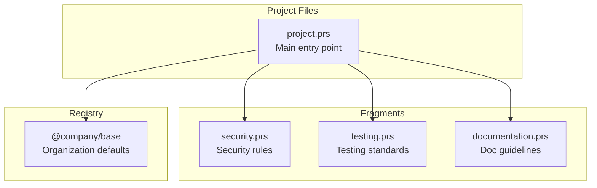

# Multi-File Organization

Learn how to split PromptScript files across multiple files for better organization and maintainability.

## Overview

As projects grow, a single `.prs` file can become unwieldy. PromptScript supports splitting your configuration across multiple files using `@use` imports and a registry structure.



## File Organization Patterns

### Pattern 1: Responsibility-Based Split

Split by type of concern:

```
.promptscript/
├── project.prs           # Main entry, imports fragments
├── fragments/
│   ├── security.prs      # Security restrictions
│   ├── testing.prs       # Testing standards
│   ├── documentation.prs # Doc guidelines
│   └── code-style.prs    # Coding conventions
└── skills/
    ├── review.prs        # Code review skill
    └── deploy.prs        # Deployment skill
```

**Main entry file:**

```promptscript
# .promptscript/project.prs
@meta {
  id: "my-project"
  syntax: "1.0.0"
}

@inherit @company/frontend

# Import responsibility fragments
@use ./fragments/security
@use ./fragments/testing
@use ./fragments/documentation
@use ./fragments/code-style

@identity {
  """
  You are a senior developer on the Customer Portal team.
  """
}

@context {
  project: "Customer Portal"
  repository: "github.com/company/customer-portal"
}
```

**Security fragment:**

```promptscript
# .promptscript/fragments/security.prs
@meta {
  id: "security-fragment"
  syntax: "1.0.0"
}

@restrictions {
  - "Never expose API keys or secrets in code"
  - "Never commit credentials to version control"
  - "Always validate and sanitize user input"
  - "Never disable security features"
  - "Use parameterized queries for database access"
}

@standards {
  security: [
    "Authentication required"
    "Use RBAC for authorization"
    "Input validation required"
    "Output encoding required"
  ]
}
```

**Testing fragment:**

```promptscript
# .promptscript/fragments/testing.prs
@meta {
  id: "testing-fragment"
  syntax: "1.0.0"
}

@standards {
  testing: [
    "Use vitest as test framework"
    "Maintain 80% code coverage"
    "Write unit, integration, and e2e tests"
    "Use MSW for API mocking"
  ]
}

@shortcuts {
  "/test": """
    Write tests using:
    - Vitest as the test runner
    - Testing Library for DOM testing
    - MSW for API mocking
  """
  "/coverage": "Check test coverage and identify gaps"
}
```

### Pattern 2: Feature-Based Split

For large projects, split by feature area:

```
.promptscript/
├── project.prs           # Main entry
├── features/
│   ├── auth.prs          # Authentication module
│   ├── payments.prs      # Payment processing
│   ├── notifications.prs # Notification system
│   └── analytics.prs     # Analytics features
└── shared/
    ├── api.prs           # API conventions
    └── database.prs      # Database patterns
```

**Auth feature:**

```promptscript
# .promptscript/features/auth.prs
@meta {
  id: "auth-feature"
  syntax: "1.0.0"
}

@context {
  """
  ## Authentication Module

  - OAuth 2.0 with PKCE
  - JWT tokens with refresh rotation
  - SSO via SAML 2.0
  """
}

@standards {
  auth: [
    "Store tokens in httpOnly cookies"
    "Session timeout: 3600 seconds"
    "Enable refresh token rotation"
  ]
}

@knowledge {
  """
  ## Auth API Endpoints

  - POST /auth/login - User login
  - POST /auth/logout - User logout
  - POST /auth/refresh - Refresh token
  - GET /auth/me - Current user info
  """
}
```

### Pattern 3: Environment-Based Split

Different configurations for different environments:

```
.promptscript/
├── project.prs           # Main entry
├── environments/
│   ├── development.prs   # Dev-specific settings
│   ├── staging.prs       # Staging settings
│   └── production.prs    # Production settings
└── fragments/
    └── ...               # Shared fragments
```

**Development environment:**

```promptscript
# .promptscript/environments/development.prs
@meta {
  id: "dev-environment"
  syntax: "1.0.0"
}

@context {
  environment: development

  """
  ## Development Environment

  - Hot reloading enabled
  - Debug logging on
  - Mock services available
  """
}

@local {
  """
  Local development setup:
  - API: http://localhost:8080
  - Database: local PostgreSQL
  - Redis: local instance
  """
}
```

## Using @use for Composition

The `@use` directive imports and merges content from other files - like CSS imports or mixins.

### Basic Import

```promptscript
# Import fragment - blocks are merged into your file
@use ./fragments/security

# Import from registry
@use @company/standards/testing

# Import with alias - for @extend access
@use @core/guards/security as sec
```

### How @use Merges Content

When you `@use` a file, all blocks from the source are merged into your file:

| Content Type   | Merge Behavior                                                 |
| -------------- | -------------------------------------------------------------- |
| Text content   | Concatenated (source + target), identical content deduplicated |
| Object content | Deep merged (target wins on key conflicts)                     |
| Array content  | Unique concatenation (preserves order, dedupes)                |
| Mixed content  | Text concatenated, properties deep merged                      |

**Example:**

```promptscript
# security.prs
@restrictions {
  - "Never expose API keys"
}

# project.prs
@use ./security

@restrictions {
  - "Follow OWASP guidelines"
}

# Result: @restrictions contains both items
```

### Alias for Selective Extension

When you need to modify imported content rather than just merge it, use an alias:

```promptscript
@use @core/typescript as ts

# Extend specific imported blocks
@extend ts.standards {
  testing: { coverage: 95 }
}
```

Without alias, blocks are simply merged. With alias, you get both:

- Blocks merged into your file
- Prefixed blocks available for `@extend` access

### Import Order Matters

Imports are processed in order. For same-name blocks, content is merged:

```promptscript
@use ./fragments/base         # @shortcuts has /test -> "Run unit tests"
@use ./fragments/advanced     # @shortcuts has /test -> "Run full suite"
# Result: /test -> "Run unit tests\n\nRun full suite" (concatenated)
```

For object properties, later imports override:

```promptscript
@use ./base     # @standards.coverage = 80
@use ./strict   # @standards.coverage = 95
# Result: coverage = 95 (target wins)
```

## Registry vs Local Fragments

### When to Use Registry

- **Shared across projects**: Company-wide standards
- **Versioned**: Need version pinning
- **Team-wide**: Team conventions
- **Reusable**: Generic patterns

```promptscript
@inherit @company/frontend@1.0.0
@use @core/security
@use @fragments/testing
```

### When to Use Local Fragments

- **Project-specific**: Only relevant to this project
- **Frequently changing**: Rapid iteration needed
- **Experimental**: Testing new patterns

```promptscript
@use ./fragments/project-specific
@use ./features/checkout
```

## Best Practices

### 1. Keep Fragments Focused

Each fragment should have a single responsibility:

```promptscript
# ✅ Good: Single responsibility
# security.prs - Only security rules
# testing.prs - Only testing standards

# ❌ Bad: Mixed concerns
# everything.prs - Security, testing, docs, etc.
```

### 2. Use Meaningful Names

```promptscript
# ✅ Good
@use ./fragments/api-conventions
@use ./fragments/error-handling

# ❌ Bad
@use ./fragments/stuff
@use ./fragments/misc
```

### 3. Document Dependencies

Add comments explaining why fragments are needed:

```promptscript
# Security compliance required for all ACME projects
@use @core/security

# Frontend testing patterns from design system
@use @acme-ui/testing

# Project-specific payment integrations
@use ./features/stripe-integration
```

### 4. Keep Import Lists Organized

```promptscript
# Organization/team base
@inherit @company/frontend

# Core standards (alphabetical)
@use @core/compliance
@use @core/security

# Team fragments
@use @frontend/accessibility
@use @frontend/performance

# Project fragments
@use ./fragments/api
@use ./fragments/testing
```

### 5. Avoid Deep Nesting

```promptscript
# ✅ Good: Flat structure
@use ./fragments/security
@use ./fragments/testing

# ❌ Bad: Deep nesting
@use ./fragments/standards/code/security/v2/latest
```

## Example: Complete Multi-File Setup

### Directory Structure

```
my-project/
├── .promptscript/
│   ├── project.prs
│   └── fragments/
│       ├── security.prs
│       ├── testing.prs
│       ├── api-standards.prs
│       └── documentation.prs
├── registry/               # Local registry (optional)
│   └── @team/
│       └── base.prs
└── promptscript.yaml
```

### Main Entry (project.prs)

```promptscript
@meta {
  id: "my-project"
  syntax: "1.0.0"
}

# Inherit team base configuration
@inherit @team/base

# Import project fragments
@use ./fragments/security
@use ./fragments/testing
@use ./fragments/api-standards
@use ./fragments/documentation

@identity {
  """
  You are a senior full-stack developer working on My Project.
  You follow team conventions and project-specific patterns.
  """
}

@context {
  project: "My Project"
  team: "Platform"

  """
  A microservices-based platform for data processing.

  Tech Stack:
  - Backend: Node.js, TypeScript, NestJS
  - Frontend: React, TypeScript, Vite
  - Database: PostgreSQL, Redis
  - Infrastructure: Kubernetes, AWS
  """
}

@shortcuts {
  "/start": "Initialize development environment"
  "/deploy": "Deploy to staging environment"
}
```

### Configuration (promptscript.yaml)

```yaml
version: '1'

project:
  id: my-project
  team: platform

input:
  entry: .promptscript/project.prs
  include:
    - '.promptscript/**/*.prs'

registry:
  path: ./registry

targets:
  - github
  - claude
  - cursor
```

## Compiled Output

When you run `prs compile`, all fragments are merged into a single output per target. The multi-file organization is a source-level concern only.

```bash
prs compile
# Output:
# ✓ .github/copilot-instructions.md
# ✓ CLAUDE.md
# ✓ .cursor/rules/project.mdc
```

## Debugging Multi-File Setup

### View Resolved Configuration

```bash
prs compile --dry-run --verbose
```

This shows how all fragments merge together.

### Validate All Files

```bash
prs validate
```

Validates main file and all imported fragments.

### Check Import Resolution

If imports fail:

1. Check file paths are correct
2. Verify registry path in `promptscript.yaml`
3. Ensure `@meta.id` matches expected paths

## Next Steps

- [Inheritance Guide](inheritance.md) - Deep dive into inheritance patterns
- [Enterprise Setup](enterprise.md) - Organization-wide registries
- [Configuration Reference](../reference/config.md) - Full config options
