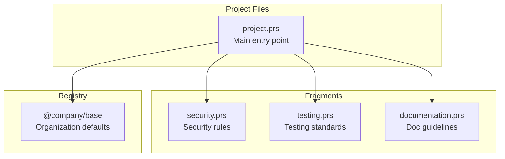

# Multi-File Organization

Learn how to split PromptScript files across multiple files for better organization and maintainability.

## Overview

As projects grow, a single `.prs` file can become unwieldy. PromptScript supports splitting your configuration across multiple files using `@use` imports and a registry structure.



## File Organization Patterns

### Pattern 1: Responsibility-Based Split

Split by type of concern:

```
.promptscript/
├── project.prs           # Main entry, imports fragments
├── fragments/
│   ├── security.prs      # Security restrictions
│   ├── testing.prs       # Testing standards
│   ├── documentation.prs # Doc guidelines
│   └── code-style.prs    # Coding conventions
└── skills/
    ├── review.prs        # Code review skill
    └── deploy.prs        # Deployment skill
```

**Main entry file:**

```promptscript
# .promptscript/project.prs
@meta {
  id: "my-project"
  syntax: "1.0.0"
}

@inherit @company/frontend

# Import responsibility fragments
@use ./fragments/security
@use ./fragments/testing
@use ./fragments/documentation
@use ./fragments/code-style

@identity {
  """
  You are a senior developer on the Customer Portal team.
  """
}

@context {
  project: "Customer Portal"
  repository: "github.com/company/customer-portal"
}
```

<!-- playground-link-start -->
<a href="https://getpromptscript.dev/playground/?s=N4IgZglgNgpgziAXAbVABwIYBcAWSQwAeGAtmrAHRoBOCANCAMYD2AdljO-gMQAEV1ZmSxxG1CGiwB6GswBWMRlgFwAOqwACJGFgy9g63rwgATRL1UgSATwC0shUsuHeca+wyFzlgIwUADAHOrAC+6uoaEKw4MOJYvBosZBis1lJgguycJuGsfACSZMzU8dTwaGxwEABG0BBY1rwZGADm2uxqmgCucDD86dSt7SJSvYxdcdYRPX0UA0OcIxxwWFEt0739zW2LcFImzOPD2BBsG7PzOx1SLCYwtivWsLmRd+z1jQasRs4gwUYATWYXV4GDKoNcnFO1F4dwAbjAoMw0LFeGxeLg+gBhHpYISogAKxV0UAxMFIFBcv2CYVYERYWUI8S+Rgciiw3hAOJW+JhRJKGCg-14ZQqVTx1GsnJa9RwXWqFCSNyEmFSN1xvPsxMFNJAIQAugxFpL8ERSOQYCoQAwEbRTqx8D49UA" target="_blank" rel="noopener noreferrer">
  
</a>
<!-- playground-link-end -->

**Security fragment:**

```promptscript
# .promptscript/fragments/security.prs
@meta {
  id: "security-fragment"
  syntax: "1.0.0"
}

@restrictions {
  - "Never expose API keys or secrets in code"
  - "Never commit credentials to version control"
  - "Always validate and sanitize user input"
  - "Never disable security features"
  - "Use parameterized queries for database access"
}

@standards {
  security: [
    "Authentication required",
    "Use RBAC for authorization",
    "Input validation required",
    "Output encoding required"
  ]
}
```

<!-- playground-link-start -->
<a href="https://getpromptscript.dev/playground/?s=N4IgZglgNgpgziAXAbVABwIYBcAWSQwAeGAtmrAHRoBOCANCAMYD2AdljO-gMQAEV1ZmSxxG1CGiwB6MNQwBzEpxFS4MRgFdxWAJ4C4AHVYABJVgy9gR3rwgATRLwMg1m7ToC0shUvbPrvHA67BiEjs4AjBQADDH+rAC+RkbG1PBY4oxYEGxwlgEeTiAAcjAAbjDUvERozGq8AIIACgCSvADWMDp5zFWuaSK2rLwsdjDxNoXOpRVVLCQkEFgjaWPsEBhQeVjMvLNwOcMs7IJQE7xTIA1QAO4Y3Xub9tgwvBisdoHvSxAAXq8aNRVCCsNAaLDnS4zSq8OwQOAYABGsEC6i0Sx0vDAMGwWngkKKAFV6pg5GZKn8YJ8AI4aCnwLG9WHYJEYeoYRiMeCGEBGJKsFJwcwfDDUOx5KzDVFuDGOZABGzOBrgnDKCCMbCHXhpWkQVbOOgKon1ABKACEGgBhRlVDAq3p-TVsA1G5wtUHgx5QZ7ZNjamC6-UgQ1SxUgADy4LBy04oxB8n9gap5wAunyQAkUwxlNQdPgiKRyDB9MGQPtDvgIhmgA" target="_blank" rel="noopener noreferrer">
  
</a>
<!-- playground-link-end -->

**Testing fragment:**

```promptscript
# .promptscript/fragments/testing.prs
@meta {
  id: "testing-fragment"
  syntax: "1.0.0"
}

@standards {
  testing: [
    "Use vitest as test framework",
    "Maintain 80% code coverage",
    "Write unit, integration, and e2e tests",
    "Use MSW for API mocking"
  ]
}

@shortcuts {
  "/test": """
    Write tests using:
    - Vitest as the test runner
    - Testing Library for DOM testing
    - MSW for API mocking
  """
  "/coverage": "Check test coverage and identify gaps"
}
```

<!-- playground-link-start -->
<a href="https://getpromptscript.dev/playground/?s=N4IgZglgNgpgziAXAbVABwIYBcAWSQwAeGAtmrAHRoBOCANCAMYD2AdljO-gMQAEV1ZmSxxG1CGiwB6MNQwBzEpxFSOcLBFbyBcADqsAAkqwZewfb14QAJol66QajVoC0shUvYOLvOAE92DEI7BwBGCgAGSO9WAF99fQN1DFZrDGprODMfJ015O2QfSwcAVTgYXgA3CCdeDCza9yUAd2ZqAGsHOiL7EABZDE0TTV4ADgiAUl4WawqWSpg5eRgunocAdXEOXgBXVhq6K3YYeTkNNkOU614YACYKpz0QbtZLYpAyir6AZXXeMDavAAggAFACSvBIzEY7TyMUsAF19PFWIk4Dg2lhGDsRNlXr1VPAsA4QiBvGT8ZZNjUHkSsjs4HlED0XLwAGo09R1Bo4Wlc6h7ViLFm8AAqRLyvAAMhAAEZyah+f6AgAiAHk+rxcloRT8-gDqMDwZDobCdfjyfCCfNFgoVkhegBhXkwrVE6bMBZLCpXKyzdgQMBK+QYNBPZEgWIIhjKRX4IikcgwHTPEBexlsfChSNAA" target="_blank" rel="noopener noreferrer">
  
</a>
<!-- playground-link-end -->

### Pattern 2: Feature-Based Split

For large projects, split by feature area:

```
.promptscript/
├── project.prs           # Main entry
├── features/
│   ├── auth.prs          # Authentication module
│   ├── payments.prs      # Payment processing
│   ├── notifications.prs # Notification system
│   └── analytics.prs     # Analytics features
└── shared/
    ├── api.prs           # API conventions
    └── database.prs      # Database patterns
```

**Auth feature:**

```promptscript
# .promptscript/features/auth.prs
@meta {
  id: "auth-feature"
  syntax: "1.0.0"
}

@context {
  """
  ## Authentication Module

  - OAuth 2.0 with PKCE
  - JWT tokens with refresh rotation
  - SSO via SAML 2.0
  """
}

@standards {
  auth: [
    "Store tokens in httpOnly cookies",
    "Session timeout: 3600 seconds",
    "Enable refresh token rotation"
  ]
}

@knowledge {
  """
  ## Auth API Endpoints

  - POST /auth/login - User login
  - POST /auth/logout - User logout
  - POST /auth/refresh - Refresh token
  - GET /auth/me - Current user info
  """
}
```

<!-- playground-link-start -->
<a href="https://getpromptscript.dev/playground/?s=N4IgZglgNgpgziAXAbVABwIYBcAWSQwAeGAtmrAHRoBOCANCAMYD2AdljO-gMQAEV1ZmSxxG1CGiwB6MDGwBXavCkZ5uAXAA6rAAIkYWDL2DbevCABNEvTSFW4AtLIVLbp3nACe7DIWu2ARgoABhC3VgBfbW0dFnYiLGN3NxBws24+AEE1HE4sCEZsCDZeAFlmC3lYaNYzB14AeWzcXgAmEN4AdwgWgAUAaQBhAFF3eoApAHUAFV4sZgBrTjgunpxeJTAlOHXBQ3y2Md4AZWOG3gA3CCNjzNKAGTaw2ptUt+0o1hi4Q1YLDGoFhWJhe9hw1mQ7jMtmO8yUc0Wy3MtRwWCwaAarCgnl4LEWEHgtjoUNex3gcGKtXy+mYamsAGYAGzBYIeGBxIFEkm2YasDAAI1gGxgW3g63mS1qeyKh1SLwAuh8ajoFqxmJ1YBYAOYwJIvFJpXgZXjNdaZXoASV4vIsaGYEHYWi+L3qvQax1mKhyUigzC1Dt49QAqnAYNReL7-c66rw3R7eF7cD6-bTEsHQ+HI6mjnHPWCpJttut6gAlEVFhGSo4AcWGee9+kDvEGiiU7F48gzyLAzGS7zlERAEXlDDy1E8+CIpHIMA0IAYFzDFLY+ACQ6AA" target="_blank" rel="noopener noreferrer">
  
</a>
<!-- playground-link-end -->

### Pattern 3: Environment-Based Split

Different configurations for different environments:

```
.promptscript/
├── project.prs           # Main entry
├── environments/
│   ├── development.prs   # Dev-specific settings
│   ├── staging.prs       # Staging settings
│   └── production.prs    # Production settings
└── fragments/
    └── ...               # Shared fragments
```

**Development environment:**

```promptscript
# .promptscript/environments/development.prs
@meta {
  id: "dev-environment"
  syntax: "1.0.0"
}

@context {
  environment: development

  """
  ## Development Environment

  - Hot reloading enabled
  - Debug logging on
  - Mock services available
  """
}

@local {
  """
  Local development setup:
  - API: http://localhost:8080
  - Database: local PostgreSQL
  - Redis: local instance
  """
}
```

<!-- playground-link-start -->
<a href="https://getpromptscript.dev/playground/?s=N4IgZglgNgpgziAXAbVABwIYBcAWSQwAeGAtmrAHRoBOCANCAMYD2AdljO-gMQAEV1ZmSxxG1CGiwB6TgDcIg1iU4ipAExiyYUZmmXsBcADqsAAsqwZewE714Q1iXkZAbZAWjkK2+rC9u8cACe7BiETi4AjBQADLH+rAC+JiamLOxEWNYBXoq+Tm7aur4prHb+IAl23HwAIppFeiq8AKKs8nkqpXbuvAASzFnURRhqEKwA5rycGABGsGoBvfWzAK5TOhMT41NsS7wAssyMANaBMNTyjPC8GLIY0HOwARUJyaypOowYUNllzpVAQEADLHH68Qo6Jrsc5YVZoRD7ACCAAUAJJOHBYLAIqRSL4-HDMOBYRAADhiFP2tWwcwwcBgTgJvxRxKwE2GAGUAIrA-YAJRgYzgTLBv3GJIwrGuLyBlSSIESAF0GCpqEF8ERSOQYIYQAwtLQIGx8JFFUA" target="_blank" rel="noopener noreferrer">
  
</a>
<!-- playground-link-end -->

## Using @use for Composition

The `@use` directive imports and merges content from other files - like CSS imports or mixins.

### Basic Import

```promptscript
# Import fragment - blocks are merged into your file
@use ./fragments/security

# Import from registry
@use @company/standards/testing

# Import with alias - for @extend access
@use @core/guards/security as sec
```

<!-- playground-link-start -->
<a href="https://getpromptscript.dev/playground/?s=N4IgZglgNgpgziAXAbVABwIYBcAWSQwAeGAtmrAHRoBOCANCAMYD2AdljO-gMQAEAkmWbUsvMNQwBzEp1EBaXgCMozRgGs4vDNRi8Z1STAAmvCO2a8AnswCu1MdBgAdVgAEbcXRQD04qTPY4b09GOwgsSxcXPkE0YVFxZhJeHUkIOCxqSLcPXVcWMgxWS2CsIqNtIyCODLNJKNYYoRFeAHdwnC0oCAxNBTBhXlciDlYTDEZGeDgXd08hlh1vSRtKoJCwiK1NEJAAXwBdBlks-CJSchgqWhAGADcYWgg2fABGfaA" target="_blank" rel="noopener noreferrer">
  
</a>
<!-- playground-link-end -->

### How @use Merges Content

When you `@use` a file, all blocks from the source are merged into your file:

| Content Type   | Merge Behavior                                                 |
| -------------- | -------------------------------------------------------------- |
| Text content   | Concatenated (source + target), identical content deduplicated |
| Object content | Deep merged (target wins on key conflicts)                     |
| Array content  | Unique concatenation (preserves order, dedupes)                |
| Mixed content  | Text concatenated, properties deep merged                      |

**Example:**

```promptscript
# security.prs
@restrictions {
  - "Never expose API keys"
}

# project.prs
@use ./security

@restrictions {
  - "Follow OWASP guidelines"
}

# Result: @restrictions contains both items
```

<!-- playground-link-start -->
<a href="https://getpromptscript.dev/playground/?s=N4IgZglgNgpgziAXAbVABwIYBcAWSQwAeGAtmrAHRoBOCANCAMYD2AdljO-gMQAEcMRgFdqELAE8qtADqsAAtXhZRjLBDZxewWb14BaXtJAA5GADcY1XkTTMBvAIIAFAJK8A1jHFwjsgL6ysnw0zABWglhSPvJC9hQA9ALCohKB8opwyhCq6qya2qy6BkYAYsxQUMwA7rwA8gDqDgDKTrwA5kIQACYwUBCs8L6sAaxBvABK8EJQWIi8Ckoqahq8LOwY-ZoARsy4vGIwJAh+ALoMnMri+ESk5DBRIAwWtLn4AIwgfkA" target="_blank" rel="noopener noreferrer">
  
</a>
<!-- playground-link-end -->

### Alias for Selective Extension

When you need to modify imported content rather than just merge it, use an alias:

```promptscript
@use @core/typescript as ts

# Extend specific imported blocks
@extend ts.standards {
  testing: { coverage: 95 }
}
```

<!-- playground-link-start -->
<a href="https://getpromptscript.dev/playground/?s=N4IgZglgNgpgziAXAbVABwIYBcAWSQwAeGAtmrAHRoBOCANCAMYD2AdljO-gAICucMAATcW1GAHosATzTxG1CGiyCMcQVjgAdVtoDEggKKEOrACaC4sxhEiNBEMs2odzAIyjNGAay2tuRE3MNCjgsDDMMalM1YG1BdXgsCFYAc0RBYEEWADcYagwUmHSATgBWQQBfbQqQCoBdBk4sail8IlJyGCpaEAZc2gg2fABGWqA" target="_blank" rel="noopener noreferrer">
  
</a>
<!-- playground-link-end -->

Without alias, blocks are simply merged. With alias, you get both:

- Blocks merged into your file
- Prefixed blocks available for `@extend` access

### Import Order Matters

Imports are processed in order. For same-name blocks, content is merged:

```promptscript
@use ./fragments/base         # @shortcuts has /test -> "Run unit tests"
@use ./fragments/advanced     # @shortcuts has /test -> "Run full suite"
# Result: /test -> "Run unit tests\n\nRun full suite" (concatenated)
```

<!-- playground-link-start -->
<a href="https://getpromptscript.dev/playground/?s=N4IgZglgNgpgziAXAbVABwIYBcAWSQwAeGAtmrAHRoBOCANCAMYD2AdljO-gAICucMAAQUA9GGoYA5iU5Y4IgEYYBg1WrUBiQdzg5m1LI15zBOZYJEc4WQQFoAfIIA6IAEq9WgjxBtW5Lp1Y+FVFxKRl2eQwAEwA3DFZGGGj1QS0dPQMjEzM4Cz87Rxd3TzBeKChBOF4fGADWLVd4cqxEfPgbB2c3Dy9WH0E-OCdAkdYSwTKKqpqOF0EAChZE7E5V6IBKEABfAF0GWWoAT3wiUnIYKloQBliYWgg2fABGHaA" target="_blank" rel="noopener noreferrer">
  
</a>
<!-- playground-link-end -->

For object properties, later imports override:

```promptscript
@use ./base     # @standards.coverage = 80
@use ./strict   # @standards.coverage = 95
# Result: coverage = 95 (target wins)
```

<!-- playground-link-start -->
<a href="https://getpromptscript.dev/playground/?s=N4IgZglgNgpgziAXAbVABwIYBcAWSQwAeGAtmrAHRoBOCANCAMYD2AdljO-gAICucMAAQUA9ACMMAwdOkBiQdzhYMrACYZqquBRYA3GNQwBzIQF5BADgAMAHVZ8popdQiMsM+YuVqNWnc31DE0FzAE4AVjt5ACV4XigsREE9A2MzQQjBAAplahN3AHcIVjgAShAAXwBdBk4sagBPfCJSchgqWhAGQLgINnwARkqgA" target="_blank" rel="noopener noreferrer">
  
</a>
<!-- playground-link-end -->

## Registry vs Local Fragments

### When to Use Registry

- **Shared across projects**: Company-wide standards
- **Versioned**: Need version pinning
- **Team-wide**: Team conventions
- **Reusable**: Generic patterns

```promptscript
@inherit @company/frontend@1.0.0
@use @core/security
@use @fragments/testing
```

<!-- playground-link-start -->
<a href="https://getpromptscript.dev/playground/?s=N4IgZglgNgpgziAXAbVABwIYBcAWSQwAeGAtmrAHRoBOCANCAMYD2AdljO-gAISs4xqELAAJuLMhlYBPAPRhqbDqwAm3AIwUADNoA6rbgFc4MMS2oxZJxoaFZp+oybEKMAcxKcscWRzhY+NxAAXwBdBi9qaXwiUnIYKloQBgA3QTgINnx1EKA" target="_blank" rel="noopener noreferrer">
  
</a>
<!-- playground-link-end -->

### When to Use Local Fragments

- **Project-specific**: Only relevant to this project
- **Frequently changing**: Rapid iteration needed
- **Experimental**: Testing new patterns

```promptscript
@use ./fragments/project-specific
@use ./features/checkout
```

<!-- playground-link-start -->
<a href="https://getpromptscript.dev/playground/?s=N4IgZglgNgpgziAXAbVABwIYBcAWSQwAeGAtmrAHRoBOCANCAMYD2AdljO-gAICucMAAQUA9GGoYA5iU5Y4ImswBWMRlgC0cNKoiRGAHVZ8BwsTGy9q8EYxyqA1s15YQAXwC6DWdQCe+IqTkMFS0IAwAbjC0EGz4AIxuQA" target="_blank" rel="noopener noreferrer">
  
</a>
<!-- playground-link-end -->

## Best Practices

### 1. Keep Fragments Focused

Each fragment should have a single responsibility:

```promptscript
# ✅ Good: Single responsibility
# security.prs - Only security rules
# testing.prs - Only testing standards

# ❌ Bad: Mixed concerns
# everything.prs - Security, testing, docs, etc.
```

<!-- playground-link-start -->
<a href="https://getpromptscript.dev/playground/?s=N4IgZglgNgpgziAXAbVABwIYBcAWSQwAeGAtmrAHRoBOCANCAMYD2AdljO-gMQAEgoOS8A4s2YATRLwDKEVgHNYvavDRs4EAEbQIWAJ4AdVnzgxGAV2o7dVWrwC0vAPKsou3ifOW9Ss7DiG+DjgsWTkbOHsnFzcgkPl3LAxWMQxqMX9WAN5AGXJeACEMCV4AWQhCGDFeFlZGGGpWDL4YADc63VxQ8MipUwsrOl5Y0IGxZkY4AZgsRgoQAF8AXQZOLGpdfCJSchhwkAZW2gg2fABGeaA" target="_blank" rel="noopener noreferrer">
  
</a>
<!-- playground-link-end -->

### 2. Use Meaningful Names

```promptscript
# ✅ Good
@use ./fragments/api-conventions
@use ./fragments/error-handling

# ❌ Bad
@use ./fragments/stuff
@use ./fragments/misc
```

<!-- playground-link-start -->
<a href="https://getpromptscript.dev/playground/?s=N4IgZglgNgpgziAXAbVABwIYBcAWSQwAeGAtmrAHRoBOCANCAMYD2AdljO-gMQAEgoOS8A4s2YATADqsAAgFc4MXhQD0YahgDmJTljjKMaCAFoWrAG46IbOFLkKlq9Vp16Y1as2pGcGVmKgQrBpSUnyAMuS8AEIYkjLyiipqmtrsenBYsmBgtvEOSc6pyiQQcIwgAL4Augw61ACe+ESk5DBUtCAMFrRWrPgAjBVAA" target="_blank" rel="noopener noreferrer">
  
</a>
<!-- playground-link-end -->

### 3. Document Dependencies

Add comments explaining why fragments are needed:

```promptscript
# Security compliance required for all ACME projects
@use @core/security

# Frontend testing patterns from design system
@use @acme-ui/testing

# Project-specific payment integrations
@use ./features/stripe-integration
```

<!-- playground-link-start -->
<a href="https://getpromptscript.dev/playground/?s=N4IgZglgNgpgziAXAbVABwIYBcAWSQwAeGAtmrAHRoBOCANCAMYD2AdljO-gMQAEAyjEYBXahCwBPXizJQIGVoxi9qMAI7CIqgCa8wzarwxQovAIIBhALIBRXjWYArIVjgAdVgAFhcZZ5aqAPS+ImKSHh58AGLUbBysuhxwWBCsAOb22BzUrHB6sSS82vAQaay8cBLJMCQe3r68nhiMJDAAtJqBSSnpEax8AAqxzoxYbXBoQhCQjJkSrey8qRxp1NgQbO5ePsoUgWAw2KLwwVhik23LMKvrbCAAvgC6DJxnEvhEpOQwVLQgDAA3GC0DasfAARgeQA" target="_blank" rel="noopener noreferrer">
  
</a>
<!-- playground-link-end -->

### 4. Keep Import Lists Organized

```promptscript
# Organization/team base
@inherit @company/frontend

# Core standards (alphabetical)
@use @core/compliance
@use @core/security

# Team fragments
@use @frontend/accessibility
@use @frontend/performance

# Project fragments
@use ./fragments/api
@use ./fragments/testing
```

<!-- playground-link-start -->
<a href="https://getpromptscript.dev/playground/?s=N4IgZglgNgpgziAXAbVABwIYBcAWSQwAeGAtmrAHRoBOCANCAMYD2AdljO-gMQAEA8tQDmGVhABe2CGwD0HUrwBGGODAA6rAAIRWOGNQhZemlmVEBPGWGpsOrACYaNfAMLNqMXnCyj7GavZwvAAUGFBoOBiKMFgQjGEAlBqaAK6qxiweMqbkEKKM6lppnibuMDKqjCkGWOZOrHwAKjAK1hhCJJxYcMnFxta2nPYyGIwFcHAQitCGdUXpmgPsQzJo+mDuJPmFzrwACjYAVjCMRm0dXT3znhRW1O2d7HAjaBC96bfnj91y8LGsQhAAF8ALoMLrUcz4IikcgwKi0EAMABu+kmbHwAEZgUA" target="_blank" rel="noopener noreferrer">
  
</a>
<!-- playground-link-end -->

### 5. Avoid Deep Nesting

```promptscript
# ✅ Good: Flat structure
@use ./fragments/security
@use ./fragments/testing

# ❌ Bad: Deep nesting
@use ./fragments/standards/code/security/v2/latest
```

<!-- playground-link-start -->
<a href="https://getpromptscript.dev/playground/?s=N4IgZglgNgpgziAXAbVABwIYBcAWSQwAeGAtmrAHRoBOCANCAMYD2AdljO-gMQAEgoOS8A4s2YATRLwBiUbLzhZqAV0ZYl1GAB1WAASVwYvCgHow1DAHMSnLHGMHG6iFgCe2vQaOnzVm3Y4KEKwW2tp8gDLkvABCGBK8ACIwMGi8rPBYQSG6+oYmZpbW7HYKGKxiGNRidixiMPYwjtTOLsYAbgBMxrIBWCAAvgC6DDbULvhEpOQwVLQgDK0wtBBs+ACM-UA" target="_blank" rel="noopener noreferrer">
  
</a>
<!-- playground-link-end -->

## Example: Complete Multi-File Setup

### Directory Structure

```
my-project/
├── .promptscript/
│   ├── project.prs
│   └── fragments/
│       ├── security.prs
│       ├── testing.prs
│       ├── api-standards.prs
│       └── documentation.prs
├── registry/               # Local registry (optional)
│   └── @team/
│       └── base.prs
└── promptscript.yaml
```

### Main Entry (project.prs)

```promptscript
@meta {
  id: "my-project"
  syntax: "1.0.0"
}

# Inherit team base configuration
@inherit @team/base

# Import project fragments
@use ./fragments/security
@use ./fragments/testing
@use ./fragments/api-standards
@use ./fragments/documentation

@identity {
  """
  You are a senior full-stack developer working on My Project.
  You follow team conventions and project-specific patterns.
  """
}

@context {
  project: "My Project"
  team: "Platform"

  """
  A microservices-based platform for data processing.

  Tech Stack:
  - Backend: Node.js, TypeScript, NestJS
  - Frontend: React, TypeScript, Vite
  - Database: PostgreSQL, Redis
  - Infrastructure: Kubernetes, AWS
  """
}

@shortcuts {
  "/start": "Initialize development environment"
  "/deploy": "Deploy to staging environment"
}
```

<!-- playground-link-start -->
<a href="https://getpromptscript.dev/playground/?s=N4IgZglgNgpgziAXAbVABwIYBcAWSQwAeGAtmrAHRoBOCANCAMYD2AdljO-gAIkxYYABMAA6rQYIgATRIJEgSATwC0NZgCsYjLPLES4i9hkKz5ARgoAGK7tYBfMWIDEggJKscMahCyCOpQQAjDDgYQRZWSABzAFdqbAg2MW4IDy8fQW5-EgB6YNDHVhdXMmZqXzVNbUEweKi+djhkmNDBChzajHrOLDgc0MY4n0Vm1vbO7sacjjgsVKjRsPG6ht6cjDQIZVmMVikMaikm1m4WpY6Vnr6pZkHVhKTWZOke4eE9ORBdL-FBAE1mDFBAcwkJQqxEtQajEoFBtgJGABrQRSGAANxgUGYaC8ggA7mVEfNBGxBABZRSCAAK1A0WiwFA+AKBYGYsOYeL8MACEQx7ESrDgwL2gkq9O2OMYEEgjFF2A41EFjN+31sDieJwiHEIvlEvzF2lMIAp1NpVR0Pwk2SNVKg2FZ1BItg+qstggAgoISBBGLTQtQ0T74Mp8jApKK7VgHSQamUUdghGpGPA4PNlR8ACpaHCCADKCMRiA+ykEACEMEjODJBAA5ZioijqOB0QQZxQ43O+iBoLAtmvwLAAKVzxcEADFaewq7IAErc7Qttsdrs9lsANR8MFHABEE6HZFTmLMotQYLmAIoAGRbc6kEGOEhL7k6s2oMW0cRgsgA0jFAl5WH4eAW3dAB1EcVS+KCxHVZI4BwMosEGXp3kg-oBHKeQjXcHwIAwKAIAALzCVEMSxNBVkEThA0nVZbAkeQclRchmBGJBPm3GAWMpLBmEEHYomJaiIFono1RAOwAF0GB6ahFHwIhSHIGAqFoEAGAxWgBXwMwJKAA" target="_blank" rel="noopener noreferrer">
  
</a>
<!-- playground-link-end -->

### Configuration (promptscript.yaml)

```yaml
version: '1'

project:
  id: my-project
  team: platform

input:
  entry: .promptscript/project.prs
  include:
    - '.promptscript/**/*.prs'

registry:
  path: ./registry

targets:
  - github
  - claude
  - cursor
```

## Compiled Output

When you run `prs compile`, all fragments are merged into a single output per target. The multi-file organization is a source-level concern only.

```bash
prs compile
# Output:
# ✓ .github/copilot-instructions.md
# ✓ CLAUDE.md
# ✓ .cursor/rules/project.mdc
```

## Debugging Multi-File Setup

### View Resolved Configuration

```bash
prs compile --dry-run --verbose
```

This shows how all fragments merge together.

### Validate All Files

```bash
prs validate
```

Validates main file and all imported fragments.

### Check Import Resolution

If imports fail:

1. Check file paths are correct
2. Verify registry path in `promptscript.yaml`
3. Ensure `@meta.id` matches expected paths

## Next Steps

- [Inheritance Guide](inheritance.md) - Deep dive into inheritance patterns
- [Enterprise Setup](enterprise.md) - Organization-wide registries
- [Configuration Reference](../reference/config.md) - Full config options
