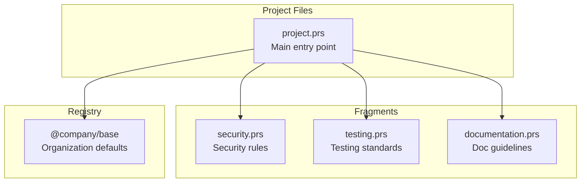

# Multi-File Organization

Learn how to split PromptScript files across multiple files for better organization and maintainability.

## Overview

As projects grow, a single `.prs` file can become unwieldy. PromptScript supports splitting your configuration across multiple files using `@use` imports and a registry structure.


```mermaid
flowchart TB
    subgraph Project["Project Files"]
        main["project.prs<br/>Main entry point"]
    end

    subgraph Fragments["Fragments"]
        security["security.prs<br/>Security rules"]
        testing["testing.prs<br/>Testing standards"]
        docs["documentation.prs<br/>Doc guidelines"]
    end

    subgraph Registry["Registry"]
        base["@company/base<br/>Organization defaults"]
    end

    main --> security
    main --> testing
    main --> docs
    main --> base
```

## File Organization Patterns

### Pattern 1: Responsibility-Based Split

Split by type of concern:

```
.promptscript/
├── project.prs           # Main entry, imports fragments
├── fragments/
│   ├── security.prs      # Security restrictions
│   ├── testing.prs       # Testing standards
│   ├── documentation.prs # Doc guidelines
│   └── code-style.prs    # Coding conventions
└── skills/
    ├── review.prs        # Code review skill
    └── deploy.prs        # Deployment skill
```

**Main entry file:**

```promptscript
# .promptscript/project.prs
@meta {
  id: "my-project"
  syntax: "1.0.0"
}

@inherit @company/frontend

# Import responsibility fragments
@use ./fragments/security
@use ./fragments/testing
@use ./fragments/documentation
@use ./fragments/code-style

@identity {
  """
  You are a senior developer on the Customer Portal team.
  """
}

@context {
  project: "Customer Portal"
  repository: "github.com/company/customer-portal"
}
```

<!-- playground-link-start -->
<a href="https://getpromptscript.dev/playground/?s=N4IgZglgNgpgziAXAbVABwIYBcAWSQwAeGAtmrAHRoBOCANCAMYD2AdljO-gMQAEV1ZmSxxG1CGiwB6GswBWMRlgFwAOqwACJGFgy9g63rwgATRL1UgSATwC0shUsuHeca+wyFzlgIwUADAHOrAC+6uoaEKw4MOJYvBosZBis1lJgguycJuGsfACSZMzU8dTwaGxwEABG0BBY1rwZGADm2uxqmgCucDD86dSt7SJSvYxdcdYRPX0UA0OcIxxwWFEt0739zW2LcFImzOPD2BBsG7PzOx1SLCYwtivWsLmRd+z1jQasRs4gwUYATWYXV4GDKoNcnFO1F4dwAbjAoMw0LFeGxeLg+gBhHpYISogAKxV0UAxMFIFBcv2CYVYERYWUI8S+Rgciiw3hAOJW+JhRJKGCg-14ZQqVTx1GsnJa9RwXWqFCSNyEmFSN1xvPsxMFNJAITo6GweEQIESKpSaQybA4rBMKhADAZNqwPF4AGUumhyBAYCZXMwMTFeERSOQ+tQuqw4LwYmUKLwAHLMeKYEposCBvoHI6LE5sOig228VjJiFlQW8TCMADWrRglM02l0+hcpk5ZuSaqtWVtwrcHi8FhAfgArEE-t9eCQIIQouYsBGYOpaRoVikTGCTNGWbxbjBzMhLASoBhGDAcMwoHcYWvbZvLABdFzLVasFoHo8ns8Xq+o28b6gchAJ9QgiMoVnEJRTijFtJ1sIdj1Pc9L2vEV4AXCAoLOCcQj1A0QEwXB8G2YY9jGCYPntR1rUWV0PS9KAfT9OAA0xYNiDIWARUjaNY3rRNS1TeJmAzNjsy6Y5VnzQs-RLeI9HLUkq1rFp6wiJs9B3NshxI3ZRkUCiGj7dxdEHXwKDHfxhWnWdWHnRdlwif9N23Fw9w-EBEO-FC-10O9AMfZ90LWDyvOQ38bz8gCgJAldwIwrCYJ3eDPyQn9UPiyCpLpHC8MNIiTV064XzWKimBorgTT4ejvV9f1M3Y0MuIjGC+PjJMUzBYTRKDcTJOggt12LUsFPJJTTxUtTGx0TTWzMHTBiuJZgrfYyB05UdxxcGy5wxBzQM0ZzANcyd3N4Q9PK-cLUKOmKgpWELztS7yItcKL72AxzNEyzDspOowUsutKfJhH7Et1fV8uNcBFtI-ZDgk3NsrKp1aKq91PVq5jWKDENOPDHiY1ifiOsrLr0wavqkYGmThvktCK2UusGy0GbYKMbTLCKkYqY8bK1tMjaLK2ycdrsvauiXA7V3e472d3Zg7lCq70t89cPpAowSrfZXgde27AulsG-vlwGwtV0H0Ky6CIfwwjoe5vY9weBpKBoehyp7F10Zqxi6pYhq8bDbjWuJ9rBPJkTKYR-rpKGuSyzGsma2Z9S2a0+audhvTnceZ4JyMftBaHTarILqcZ12hdJa+mX1blnczou82Qbe+u7snbX3yeoGXpu2WO7iq3fug-7eDNlXW+Nm3cpCB8GEWSV8CDt3aAdEAEVoaD8B8PUgA" target="_blank" rel="noopener noreferrer">
  
</a>
<!-- playground-link-end -->

**Security fragment:**

```promptscript
# .promptscript/fragments/security.prs
@meta {
  id: "security-fragment"
  syntax: "1.0.0"
}

@restrictions {
  - "Never expose API keys or secrets in code"
  - "Never commit credentials to version control"
  - "Always validate and sanitize user input"
  - "Never disable security features"
  - "Use parameterized queries for database access"
}

@standards {
  security: [
    "Authentication required",
    "Use RBAC for authorization",
    "Input validation required",
    "Output encoding required"
  ]
}
```

<!-- playground-link-start -->
<a href="https://getpromptscript.dev/playground/?s=N4IgZglgNgpgziAXAbVABwIYBcAWSQwAeGAtmrAHRoBOCANCAMYD2AdljO-gMQAEV1ZmSxxG1CGiwB6MNQwBzEpxFS4MRgFdxWAJ4C4AHVYABJVgy9gR3rwgATRLwMg1m7ToC0shUvbPrvHA67BiEjs4AjBQADDH+rAC+RkbG1PBY4oxYEGxwlgEeTiAAcjAAbjDUvERozGq8AIIACgCSvADWMDp5zFWuaSK2rLwsdjDxNoXOpRVVLCQkEFgjaWPsEBhQeVjMvLNwOcMs7IJQE7xTIA1QAO4Y3Xub9tgwvBisdoHvSxAAXq8aNRVCCsNAaLDnS4zSq8OwQOAYABGsEC6i0Sx0vDAMGwWngkKKAFV6pg5GZKn8YJ8AI4aCnwLG9WHYJEYeoYRiMeCGEBGJKsFJwcwfDDUOx5KzDVFuDGOZABGzOBrgnDKCCMbCHXhpWkQVbOOgKon1ABKACEGgBhRlVDAq3p-TVsA1G5wtUHgx5QZ7ZNjamC6-UgQ1SxUgADy4LBy04oxB8n9gap5wAunyQAkUwxlNQdPgiKRyDB9MGQPtDvgIhmgA" target="_blank" rel="noopener noreferrer">
  
</a>
<!-- playground-link-end -->

**Testing fragment:**

```promptscript
# .promptscript/fragments/testing.prs
@meta {
  id: "testing-fragment"
  syntax: "1.5.0"
}

@standards {
  testing: [
    "Use vitest as test framework",
    "Maintain 80% code coverage",
    "Write unit, integration, and e2e tests",
    "Use MSW for API mocking"
  ]
}

@shortcuts {
  "/test": {
    description: "Write project tests"
    content: """
      Use Vitest, Testing Library for DOM behavior, and MSW for API mocking.
    """
  }
  "/coverage": {
    description: "Check test coverage"
    content: "Report coverage gaps and recommend missing behavioral tests."
  }
}
```

<!-- playground-link-start -->
<a href="https://getpromptscript.dev/playground/?s=N4IgZglgNgpgziAXAbVABwIYBcAWSQwAeGAtmrAHRoBOCANCAMYD2AdljO-gMQAEV1ZmSxxG1CGiwB6MNQwBzEpxFSOcLBFbyBcADqsAAkqwZewfb14QAJol66QajVoC0shUvYOLvOAE92DEI7BwBGCgBWCgAGb1YAX319A3UMVmsMams4Mx8nTXk7ZB9LBwBVOBheADcIJ14MHPr3JQB3ZmoAawc6EvsQAFkMTRNNXgAOaIBSXhZrKpZqmDl5GB6+hwB1cQ5eAFdWOrordhh5OQ02Y7TrXhgAJiqnPRBe1ktSkAqqgYBlTd4YA6vAAggAFACSvBIzEYnQKcUsAF19IlWMk4DgOlhGHsRLl3v1VPAsA47OZCZZ5qJxJIIGwQiBtnUqjRmAArGCMLC8Z6Ij4sU7sRneEB9SzfXgANRZ6mOABUSQVeAAZCAAIzk1D8gOBABEAPIDXjqmA4DC1DrXdK8P4AoHUUGQ6Gw+FaCgbMVenxoz5SRbLBRrJAEj68aliCSXViMgDCOC5nV5JNmzCWK2DfUFHGF-QASjA0NjU+mg7x5Bg0DkbrxqFyhJ5biQIHA4MrTebLXIoMn1HAPWLCWj4iB4kiGMptfgiKRyDAdK8QOm22x8KFR0A" target="_blank" rel="noopener noreferrer">
  
</a>
<!-- playground-link-end -->

### Pattern 2: Feature-Based Split

For large projects, split by feature area:

```
.promptscript/
├── project.prs           # Main entry
├── features/
│   ├── auth.prs          # Authentication module
│   ├── payments.prs      # Payment processing
│   ├── notifications.prs # Notification system
│   └── analytics.prs     # Analytics features
└── shared/
    ├── api.prs           # API conventions
    └── database.prs      # Database patterns
```

**Auth feature:**

```promptscript
# .promptscript/features/auth.prs
@meta {
  id: "auth-feature"
  syntax: "1.0.0"
}

@context {
  """
  ## Authentication Module

  - OAuth 2.0 with PKCE
  - JWT tokens with refresh rotation
  - SSO via SAML 2.0
  """
}

@standards {
  auth: [
    "Store tokens in httpOnly cookies",
    "Session timeout: 3600 seconds",
    "Enable refresh token rotation"
  ]
}

@knowledge {
  """
  ## Auth API Endpoints

  - POST /auth/login - User login
  - POST /auth/logout - User logout
  - POST /auth/refresh - Refresh token
  - GET /auth/me - Current user info
  """
}
```

<!-- playground-link-start -->
<a href="https://getpromptscript.dev/playground/?s=N4IgZglgNgpgziAXAbVABwIYBcAWSQwAeGAtmrAHRoBOCANCAMYD2AdljO-gMQAEV1ZmSxxG1CGiwB6MDGwBXavCkZ5uAXAA6rAAIkYWDL2DbevCABNEvTSFW4AtLIVLbp3nACe7DIWu2ARgoABhC3VgBfbW0dFnYiLGN3NxBws24+AEE1HE4sCEZsCDZeAFlmC3lYaNYzB14AeWzcXgAmEN4AdwgWgAUAaQBhAFF3eoApAHUAFV4sZgBrTjgunpxeJTAlOHXBQ3y2Md4AZWOG3gA3CCNjzNKAGTaw2ptUt+0o1hi4Q1YLDGoFhWJhe9hw1mQ7jMtmO8yUc0Wy3MtRwWCwaAarCgnl4LEWEHgtjoUNex3gcGKtXy+mYamsAGYAGzBYIeGBxIFEkm2YasDAAI1gGxgW3g63mS1qeyKh1SLwAuh8ajoFqxmJ1YBYAOYwJIvFJpXgZXjNdaZXoASV4vIsaGYEHYWi+L3qvQax1mKhyUigzC1Dt49QAqnAYNReL7-c66rw3R7eF7cD6-bTEsHQ+HI6mjnHPWCpJttut6gAlEVFhGSo4AcWGee9+kDvEGiiU7F48gzyLAzGS7zlERAEXlDDy1E8+CIpHIMA0IAYFzDFLY+ACQ6AA" target="_blank" rel="noopener noreferrer">
  
</a>
<!-- playground-link-end -->

### Pattern 3: Environment-Based Split

Different configurations for different environments:

```
.promptscript/
├── project.prs           # Main entry
├── environments/
│   ├── development.prs   # Dev-specific settings
│   ├── staging.prs       # Staging settings
│   └── production.prs    # Production settings
└── fragments/
    └── ...               # Shared fragments
```

**Development environment:**

```promptscript
# .promptscript/environments/development.prs
@meta {
  id: "dev-environment"
  syntax: "1.0.0"
}

@context {
  environment: development

  """
  ## Development Environment

  - Hot reloading enabled
  - Debug logging on
  - Mock services available
  """
}

@local {
  """
  Local development setup:
  - API: http://localhost:8080
  - Database: local PostgreSQL
  - Redis: local instance
  """
}
```

<!-- playground-link-start -->
<a href="https://getpromptscript.dev/playground/?s=N4IgZglgNgpgziAXAbVABwIYBcAWSQwAeGAtmrAHRoBOCANCAMYD2AdljO-gMQAEV1ZmSxxG1CGiwB6TgDcIg1iU4ipAExiyYUZmmXsBcADqsAAsqwZewE714Q1iXkZAbZAWjkK2+rC9u8cACe7BiETi4AjBQADLH+rAC+JiamLOxEWNYBXoq+Tm7aur4prHb+IAl23HwAIppFeiq8AKKs8nkqpXbuvAASzFnURRhqEKwA5rycGABGsGoBvfWzAK5TOhMT41NsS7wAssyMANaBMNTyjPC8GLIY0HOwARUJyaypOowYUNllzpVAQEADLHH68Qo6Jrsc5YVZoRD7ACCAAUAJJOHBYLAIqRSL4-HDMOBYRAADhiFP2tWwcwwcBgTgJvxRxKwE2GAGUAIrA-YAJRgYzgTLBv3GJIwrGuLyBlSSIESAF0GCpqEF8ERSOQYIYQAwtLQIGx8JFFUA" target="_blank" rel="noopener noreferrer">
  
</a>
<!-- playground-link-end -->

## Using @use for Composition

The `@use` directive imports and merges content from other files - like CSS imports or mixins.

### Basic Import

```promptscript
# Import fragment - blocks are merged into your file
@use ./fragments/security

# Import from registry
@use @company/standards/testing

# Import with alias - for @extend access
@use @core/guards/security as sec
```

<!-- playground-link-start -->
<a href="https://getpromptscript.dev/playground/?s=N4IgZglgNgpgziAXAbVABwIYBcAWSQwAeGAtmrAHRoBOCANCAMYD2AdljO-gMQAEAAiRhYMvDABNxMcbzjNeuCHF5hqGAOZD2vFmWjxebXhCzLmAd1bGruGL3IYAnuurMArq3EAdVoOGjgH15jcUReLwJiMlgIoNlHdgxCMIiARgoAVgoABljWAF8fHz4ASTJmaiwVNU1OKoBaXgAjKGZGAGtlDGo7IWp1aWsseUd3ahV9H343ODsKAHpVDS1TednGN2oTRyLWUvLK6uYSXh71JSxqHd8Zu35dTFZHNZFPbvE4eY44LAhWdV2+zQFSq5hMODEUAgGGUjTAFQERA4njEjEY8DgU1uAhYPXm6jc70+6022zEynWIHydHQ2DwiHANRWxJgGy2WEcVFoIAYLHYdR4vAAym40OQIIM5AocHYiKRyHZqB5lDKehReAA5ZhVTCHZhgaV2cRtNwrbAQNh0MQo1jasSnGAYKD2DAdDQwChTIQiXiBKwhFKM5Z1Fls7Z5YJwBIiZLhEDpLK5EBxEgQQh-MKXNwwHyFXw-DBvagfX1xFhSMLICIABSgrpgOGYUCk4wLRe8IAAunFvr9-pWa3X0Y3mzBW69xO8It2ClMej8toxfmxlH7go1B-WRy2HQuIEuLaw8vkqTSQJhcPh7sdHs825Pi59e391Fz6Ew2MisIKRWKoZL5FsXg5WiRVlV4VUPU1O1dSqfVDV4Y0NjNZdWCtQsZFtKpRB6J0XTdAZPV8b0AjiCBQjja8yELO8JyJL54D7AFk39KNEljNJMhyCNeFTdNWEzJUc1nfM6MfUt-XLGABxAWstybHd7ynLse0Yl8ZLk4cFLHWQxI7Gc834edLn3VDVziDdZKHBttPGYzF1Q49T1pS8GWvPECXokl2U5Gh3z5L8f1FcUAIQkCFVOcDIPVLUdW6OCDSApDTTqc1LWtTC7Rwx1nUwAiPS9fwJOCcjA3cmB8UJR81lZUkOR4tiY0DBNuJY4I+IzBQhNzKYlPEtcdGYCteCrKz5NHccMOUmdgmffsRs3LSJt0qbi2nHrfHs0zD3M-1LM0mzlq2g82Cc-JOwYOornwcLKD8nkQAANzHOBD3wVIqSAA" target="_blank" rel="noopener noreferrer">
  
</a>
<!-- playground-link-end -->

### How @use Merges Content

When you `@use` a file, all blocks from the source are merged into your file:

| Content Type   | Merge Behavior                                                 |
| -------------- | -------------------------------------------------------------- |
| Text content   | Concatenated (source + target), identical content deduplicated |
| Object content | Deep merged (imported source wins same-shape key conflicts)    |
| Array content  | Unique concatenation (preserves order, dedupes)                |
| Mixed content  | Text concatenated, properties deep merged                      |

When block shapes conflict, existing target body wins. Under syntax `1.5.0`,
later local blocks and modification operations apply after an earlier import.

**Example:**

```promptscript
# security.prs
@restrictions {
  - "Never expose API keys"
}

# project.prs
@use ./security

@restrictions {
  - "Follow OWASP guidelines"
}

# Result: @restrictions contains both items
```

<!-- playground-link-start -->
<a href="https://getpromptscript.dev/playground/?s=N4IgZglgNgpgziAXAbVABwIYBcAWSQwAeGAtmrAHRoBOCANCAMYD2AdljO-gMQAEAAiRhYMvDABNxMcbzjNeuCHF5hqGAOZD2vFmWjxebXhCzLmAd1bGruGL3IYAnuurMArq3EAdVoOGjgH15jcUReLwJiMlgIoNlHdgxCMIiARgoAVgoABljWAF8fHz44GEY3ahNHKloffmp4LErGLAg2ZUCrXgBacJAAORgANxhqXiI0ZlLeAEEABQBJXgBrGEc4PMLWYvtXACsyrBqN3zdpigB6UvLKrEci3wa4JogWttYOuN6IgDFmKCgFl4AHkAOozADKc146jcECkUAgrHgmwefAASvA3FAsGF6o1mq12jo2CIkcoAEbMXDGDgkBD5OjobB4RAga4VKrHEAMFjsThYHi8CFuNDkCDSWTyWzjKLkOzUDzKHCjGAUXj9an2DDULCGMAKFW8cTMcpaERE1h0MSeXisLWiBoYKDaxjLDRqupCES8TrBeEpdllTl3PLBOAJETJPrpLK5EBxEgQQhIsJNNwwHxbfjPDCeHXiT5dFhSMLICJzKAYRgwHD-KRjXP56jeEAAXTiHGeSPUZYrVZrdagDdkImbrY7BTqTxeb2Jfp6fUr1dr9dGvBnhPemxA+TbDAF1Ec+CIpHl3IYI1o73wqV3QA" target="_blank" rel="noopener noreferrer">
  
</a>
<!-- playground-link-end -->

### Alias for Selective Extension

When you need to modify imported content rather than just merge it, use an alias:

```promptscript
@use @core/typescript as ts

# Extend specific imported blocks
@extend ts.standards {
  testing: { coverage: 95 }
}
```

<!-- playground-link-start -->
<a href="https://getpromptscript.dev/playground/?s=N4IgZglgNgpgziAXAbVABwIYBcAWSQwAeGAtmrAHRoBOCANCAMYD2AdljO-gMQAEAAiRhYMvDABNxMcbzjNeuCHF5hqGAOZD2vFmWjxebXhCzLmAd1bGruGL3IYAnuurMArq3EAdVoOGjgH15jcUReLwJiMlgIoNlHdgxCMIiARgoAVgoABljWAF8fH343ODt+FmoYAHosRzR4RmoINCwxZVMi1j4AUUIOT1kGxghIRmMyZmoOGQAjKGZGAGs4YqIBmVMKOBFPDGpxZUCrBXgsCFZ1MOAdZgA3GDV1GDCATgzeQoKQfLp0bDwiBAFSmNTqDTgTRaWCotBADBY7E4WB4vAAym40OQINJZPJbLwiKRyHZqB5lDhHjAKLwAHLMNqYaaGMAKSm8cSLNxaETnNh0MSDVgMsS8KoYKD2DDLDTU4pCES8Y7BCChcLAypg+qNZqtPLBOAJETJdXpLK5EBxEgQQgXMJYMkwHxffg7DB7A5HOIsKRhZARAAKUGlMBwzCgUmosl24n23hAAF04hwdhcrrx-SAgyGwxHHtH3bGDhEkwVilUds1GHzWF6TgBadXZxih8ORsVnKs1vL5H4JhjI6iOfBE6LUmj0EAPWgQNj4VI-IA" target="_blank" rel="noopener noreferrer">
  
</a>
<!-- playground-link-end -->

Without alias, blocks are simply merged. With alias, you get both:

- Blocks merged into your file
- Prefixed blocks available for `@extend` access

### Import Order Matters

Imports are processed in order. For same-name object fields, each later
imported source wins:

```promptscript
@use ./fragments/base         # @shortcuts has /test -> "Run unit tests"
@use ./fragments/advanced     # @shortcuts has /test -> "Run full suite"
# Result: /test -> "Run full suite"
```

<!-- playground-link-start -->
<a href="https://getpromptscript.dev/playground/?s=N4IgZglgNgpgziAXAbVABwIYBcAWSQwAeGAtmrAHRoBOCANCAMYD2AdljO-gMQAEAAiRhYMvDABNxMcbzjNeuCHF5hqGAOZD2vFmWjxebXhCzLmAd1bGruGL3IYAnuurMArq3EAdVoOGjgH15jcUReLwJiMlgIoNlHdgxCMIiARgoAVgoABljWAF8fH343ODsKAHpVDS1TCoAjDDLglta+fjgcZmosRjdTXhwm3gqOOCxeAFoAPnCQACUPXg8TBXhTPJLmyurNTjqJADcMVkZpVt52zu7e-uUh5VH1qdmIxaswNygoWTcTGDyfHm8C+WDCT3GLzm7xUXx+cD+HAiIHydHQ2DwiHAaj27DgDSaMCotBADBY7H2PF4AGU3GhyBBznIFDg7ERSOQ7NQPPcYNQibwAHLMCaYHqGMAsuziZh9WrYCBsOhiTy8VgisS8fkYH6YRgAaw0ROKQhEvECVhCKWxNX2+MaZTywTgCREyTm6SyuRAcRIEEIEFYYSw3IBBWK4xO4gw1HEygtwRYUjCyAiAAUoBgzl0oFJqLIRJ4Y94QABdOJjLCB9Qp9OZ7PMXN8gtR4sRcvh3z88bUCCMKtseNxSZzDNZmA5vNa9a9-uK1h5fIotEgTC4fC7Wr4o4nM7iYn0JhsDhcLF8Wn0qCMmTM2y8dnRLk8wZ8gXC0UxibMSV3mVy-YKkqKoyOqEyiNqupZoa6jGr4poBHEEChHMm52hUO6nNITrxIk7ppJkOTYX6AZBgooY+IUviRkWsZDpaSYwLWIBjg2Tb5tR0axu2FbrNWTEsROjZThxbZlhRxTdiGfYDqwdHBCOdbjpOzaSbOMmLiipYMPs1COPgD6cgepIgIcfJwPO+CpCiQA" target="_blank" rel="noopener noreferrer">
  
</a>
<!-- playground-link-end -->

For object properties, later imports override:

```promptscript
@use ./base     # @standards.coverage = 80
@use ./strict   # @standards.coverage = 95
# Result: coverage = 95 (later imported source wins)
```

<!-- playground-link-start -->
<a href="https://getpromptscript.dev/playground/?s=N4IgZglgNgpgziAXAbVABwIYBcAWSQwAeGAtmrAHRoBOCANCAMYD2AdljO-gMQAEAAiRhYMvDABNxMcbzjNeuCHF5hqGAOZD2vFmWjxebXhCzLmAd1bGruGL3IYAnuurMArq3EAdVoOGjgH15jcUReLwJiMlgIoNlHdgxCMIiARgoAVgoABljWAF8fH343ODsKAHoAIwwy4Pq+fjgRTwxqcTgKFgA3GDV1OwBeXgAOXN9S8orm6ghGLAaBZoxW9s6evo0h3gBODJ8+ACV4NygsMI3+7b3eAAoobD7jMmZqDhk5N2pGO3MIVjgAEoQPk6OhsHhECAamUqLQQAwWOxOFgeLwAMpuNDkCDSWTyWy8Iikch2ageZQ4PowCi8AByzAWmDehjACipvHEzEYbi0IiwEDYdDEnl4rEZYl41BgGCg9gwjAA1lsKMUhCJeIErCEUtDajA8sE4AkRMlwiB0llciA4iQIIR-mEsOSDQVistVh1NXEWFIwsgIgAFB4-HDMKBSaiyFriNreEAAXTiHGa-3U-qDIZgYYjTw9sfaESTbt80pmcwFbGUWuCAFpzcGFdnw5GpfBnRXBaw8vkQWCQJhcPhy-M4fQmGwOFwoXxMdioLiPgSOcTomSKbwqdLaQymW0Fsw2YSuTy+dgu8KVjJxQtRNLZfKlSq1f5vdqIKFzSOsIb4okzWkmQ5L+doOqwTouj4hS+PmcbVj6zB+rwAYgI2oYtnmMZxkWybtmmGaoVmOatrBhaJlBxRlh28xdvB2r1pmTbEU8VGzDRbA9iCCYMCi1COPgq6kmOCIgL0tBdvgqQgkAA" target="_blank" rel="noopener noreferrer">
  
</a>
<!-- playground-link-end -->

See [Composition and Precedence](../reference/language/composition.md) for the
normative matrix and resolved declaration-order examples.

## Registry vs Local Fragments

### When to Use Registry

- **Shared across projects**: Company-wide standards
- **Versioned**: Need version pinning
- **Team-wide**: Team conventions
- **Reusable**: Generic patterns

```promptscript
@inherit @company/frontend@1.0.0
@use @core/security
@use @fragments/testing
```

### When to Use Local Fragments

- **Project-specific**: Only relevant to this project
- **Frequently changing**: Rapid iteration needed
- **Experimental**: Testing new patterns

```promptscript
@use ./fragments/project-specific
@use ./features/checkout
```

<!-- playground-link-start -->
<a href="https://getpromptscript.dev/playground/?s=N4IgZglgNgpgziAXAbVABwIYBcAWSQwAeGAtmrAHRoBOCANCAMYD2AdljO-gMQAEAAiRhYMvDABNxMcbzjNeuCHF5hqGAOZD2vFmWjxebXhCzLmAd1bGruGL3IYAnuurMArq3EAdVoOGjgH15jcUReLwJiMlgIoNlHdgxCMIiARgoAVgoABljWAF8fH343ODsKAHpVDS1TCppmACsYRiwAWjg0FohIRmLS8qqYbDdqeArGHBaAa3csEHy6dGw8RHA1TU46hubWjq7GHohGKloQBhZ2LZ5eAGU3NHIIaVl5W14iUnI7ag9lKbGFF4ADlmFh7BhqODmGAFFNeOJmIw3LVsBA2HQxJ5eKwwWJeGMMFAIYxphoYBRikIRLxAlYQil1jUtnB6q5du1Ot1enlgnAEiJkuEQOksrkQHESBBCBBWGEsL8YD5Cr44CJPJDxMo6cEWFIwsgIgAFKAYRgwHDMKBSaiydXiTURAC6cQ4atl6gNxtN5st1pgtrVGA11G8IBdBWKYzV1GOWHRrG1cTawpNZotVptBPgCrjCby+QWSxAmFw+DAwywo3Gkxmc1O9CYbA4XDWfHujygzxkcjhdk+0R+f14AIpILxmChhlh70RyNR8YxWJkuPBokJxMwpPJlN81ICcQgoWFFZG0YmU1Jc158USQrSmRyN6lMrlCkVyuKQZDWtpcT1MBeiAaa+pmAZ2sGDqhs6ro5h6QEgRm-qBvajrhp+vjRrmrQJkm9Ipt66Z+lmWGxjhbAFgsToMFs1COPgA7fA25wgAAbgGcAJvgqQLEAA" target="_blank" rel="noopener noreferrer">
  
</a>
<!-- playground-link-end -->

## Best Practices

### 1. Keep Fragments Focused

Each fragment should have a single responsibility:

```promptscript
# ✅ Good: Single responsibility
# security.prs - Only security rules
# testing.prs - Only testing standards

# ❌ Bad: Mixed concerns
# everything.prs - Security, testing, docs, etc.
```

### 2. Use Meaningful Names

```promptscript
# ✅ Good
@use ./fragments/api-conventions
@use ./fragments/error-handling

# ❌ Bad
@use ./fragments/stuff
@use ./fragments/misc
```

<!-- playground-link-start -->
<a href="https://getpromptscript.dev/playground/?s=N4IgZglgNgpgziAXAbVABwIYBcAWSQwAeGAtmrAHRoBOCANCAMYD2AdljO-gMQAEAAiRhYMvDABNxMcbzjNeuCHF5hqGAOZD2vFmWjxebXhCzLmAd1bGruGL3IYAnuurMArq3EAdVoOGjgH15jcUReLwJiMlgIoNlHdgxCMIiARgoAVgoABljWAF8fHz5AUHJeAHFmZm9fNzg7CgB6VQ0tU0aMNAgAWhZWADdOLAg2OB9+OobmtU0huEaYaldqbpwMTygIVnUi1j5AGXJeACEJccneJpbZ9nm4LDcwMDP6i+nWucaSJUYQfLp0bB4RDgGZteadHp9QbsEasOBUWggBh9DhcYF8ADKbjQ5Ag0lk8lsvCIpHIdmoHmUOEWMAovAAcswsPYMNRmcwwApqbxxMxGG42thYXQxJ5eKwmWJeNQYBgoCzGABrDS08ZCES8QJWEIpEHvG4dLq9NjQ4ajPLBOAJETJcIgdJZXIgOJfQhbMJYCkwHyFXx3dbiVniZRa4IsKRhZARAAKUAwjBgOGYUCk1FkIk8QYiAF04hw7lt1JGY3GE0mU4t0wGsyBcwVxjK7tQIIwzXDNXFunbY-HE8nU9L4J6W228vlfv8QJhcPgrmCFktmCs1htCwj6Ew2KisDxeFicZt8XIuXYSdFyZTeNSZXTGczMGzDJyibz+YK2yKA+LJaIZXKFcq6iqr46oBHEEChHac4fIsyyrAGmzbBa8SJLaaSZDkyGuu6Chej64z+pm1DBh22rhjAxYgD2Zb9pWhGBsROZ5kOhaUdRfYVmm9E1nWvr8I2w6trCIadt2pYcQOAnNkJbBjhOAIzsC0EGncDxgOuSKbuwQy7vuuJHoS3JnmS0qXtetIMpKD7ss+3KvgKQxCmwn5ihKzK-rK8qYEqKoUGq-ikcEEG6sp7SqY8yFWqhuoOphzrathrAenh9Z+hmDEkaGOjVBRvBRlR4nlgO3GMbWzEFtsbGFbRXHpTx+G+FJI7CYFvBdiWvZFZWTUyawcl-ApQJ6tc7RfHAjAaciW46eie7YvpMjHkSxmwKZ7bmbeVmsjZJ48nyDmJB+ooyG5Up-l58aAcBfgallwVQaCHxjYwkXWkkMUYU6LoQG6SW4W43qpfwJWZXE5FVZ1NVVkR3hldq+bDJVeUdTRnHQxlTFAz1bYidq7UFZDaPY7C-XZgwQzUI4+ArbSNAboMtCwvgqS-EAA" target="_blank" rel="noopener noreferrer">
  
</a>
<!-- playground-link-end -->

### 3. Document Dependencies

Add comments explaining why fragments are needed:

```promptscript
# Security compliance required for all ACME projects
@use @core/security

# Frontend testing patterns from design system
@use @acme-ui/testing

# Project-specific payment integrations
@use ./features/stripe-integration
```

<!-- playground-link-start -->
<a href="https://getpromptscript.dev/playground/?s=N4IgZglgNgpgziAXAbVABwIYBcAWSQwAeGAtmrAHRoBOCANCAMYD2AdljO-gMQAEAAiRhYMvDABNxMcbzjNeuCHF5hqGAOZD2vFmWjxebXhCzLmAd1bGruGL3IYAnuurMArq3EAdVoOGjgH15jcUReLwJiMlgIoNlHdgxCMIiARgoAVgoABljWAF8fHz4AZRhGN2oTRx1maIgMVkY7ahgARzcIVpkwZmoxKCheAEEAYQBZAFF7VwArctMffjc4O34WVoB6VYqqrEci1j4AMVd2ThkOOCwIVnV7bA5qVmVVOt4pOAh1KzhHa5gJCWKzWGEYQgAtJ1NlcbndDnwAApzBYQuBocoQSCMB6OLRYawcFzYCBsODA1a8CibMAwbCVeDbLBVDEQ25EtQ3NggfJ0dDYPCIED8MGQ6Gw27qKi0EAMFjnLhC0puNDkCDSWTyWy8IikcgtDzKHAwVoUXgAOWYBMw1AJzDACmNH2YFXxJLYdDEnl4rCtYl4rQwQ0wjAA1hoYBQlkIRLxAlYQilhaKYFCIDD4HD1Hlgn9EslwiB0llciA4iQIIRbmFmW4YD5Cr5ro1xBhqOJlPHgiwpGFkBFEVAwTAcMwoFJ+s3PG3vCAALpxCV3PsDofNUfjk2yETT9sRBcFJata5VRhcl5xuIQwuD4cbicBzOn895fI8vkgTC4fC0+nHpksqm7IwMS57SvQTBsBwiogMqqpQOqMhyI6di6tEBoXsapoWn6Np2g62riC6bhuuenotj6fqiIGwZguG6iRtG-iXgmEChIWv5YAycAARArLAaBpKsDm8T5kmxY5CJFZVqwNbUHWDZLFOrbtp2cQ9jAK4gLe65jg+ykzvui6ZpKWk6SOelbgZe7zopvjHsyEBnkJakJteq53pZ-QOc+Qmvjyc4MJwzKOPgaH6uBsogAAbiaXzckKqQ8kAA" target="_blank" rel="noopener noreferrer">
  
</a>
<!-- playground-link-end -->

### 4. Keep Import Lists Organized

```promptscript
# Organization/team base
@inherit @company/frontend

# Core standards (alphabetical)
@use @core/compliance
@use @core/security

# Team fragments
@use @frontend/accessibility
@use @frontend/performance

# Project fragments
@use ./fragments/api
@use ./fragments/testing
```

<!-- playground-link-start -->
<a href="https://getpromptscript.dev/playground/?s=N4IgZglgNgpgziAXAbVABwIYBcAWSQwAeGAtmrAHRoBOCANCAMYD2AdljO-gMQAEAAiRhYMvDABNxMcbzjNeuCHF5hqGAOZD2vFmWjxebXhCzLmAd1bGruGL3IYAnuurMArq3EAdVoOGjgH15jcUReLwJiMlgIoNlHdgxCMIiARgoAVgoABljWAF8fHz4AeWp1DFYIAC9sCDYAeg5SXgAjDDgYH34IVhwYahMBXUxWRwbVNg5PItY+AGFmajs4EU8ManFlAAoMKDQcDFbhCEY9gEput07hpZgGkagISsYu32u7fhZlhs7GN0GWEcsz4ABUYC1VBotKYrjd+JN2JxxA0MIxXnA4BBWtATMD3vDEdMUWgBmAliQXm9irwAAquABWMEYWBUak0nFhBLsFAm7JhcFRaAgcJ5fOhnMFHFWvXUIHydHQ2DwiBAX2YZEq4yJyKotBADBYSK4qr4AGU3GhyBBpLJ5LZeERSOQ7NQPMp+ssKLwAHLMVmYais5hgBT9XjiZj-GF1Nh0MSeXisf1iXjLPb2NEAaw0MAo3SEIl4gSsIRSapGWr5U2ReWCcASImS4RA6SyuRAcRIEEIvTCWDdb0KvlWlXEGy2xbiLCkYWQEVpUDRMBwzCgUmosjW482EQAunFpVhZXOF0vXqv1wMt2OJ-ufMP+MtVoMWfVWMoS8EALQtxfLy8NzTeAB1OY82DyfJ5UVEBMFwfB1R+R5nlYV49XoJgaxNEBzUta1bTkMM7CdaJXXdXhPTzX0U0DYNQwdSNo05WNWHjMckxTUR0ygTNGBzdQ8wLfwp1LCBQhbRD7mQqk63iRJmzSTIclk7te1YftBwfbpR3WTZP2nZhZ14ecQH-C81yAnSd28EAD1LI8T2Ms8AIs68rLvWytN8Z9QLfNh9NLX9nPMq9Nx819wNYSDoKVeDVQRVxjRRNEMSxHEniBdCDUw40sB4XgLStJ4CPtcMSJdNNyMo70-QDDY6KIiMozcGNIrYxNk1ZLiIR4zA+NzfNfELAI4jE8sEqw5L0XgNLcSBWSG3k8s22UztS1UvsFE0gptO3CcAuCGcYFPUzzxXVzN3c3dPPskDHJMszztCm9dJsuzH3CsD3wO3ggtOlzns+vyorWqCFVilU1R1TwGlJahyWoSlULzGgMKNaY8tNAq8OKmRCIdcrYEqj8KIGKjaszINDHo8NGJa5i2oTGROtTbjeP4wShuEr8ywk6GSTJCkZLW+tGySZalI7Lse02gc3CHXbbz0kTDsM46nP+kLLL2667OCBzWHUE7HsAtydberynxAiLvpV36-zO02wutr6INBmLYOVfAoQ5dhBQwYUssNLDMZw7GiptPHSuIqIKrdEnquouqqZDRq6da992uZzjgIzPqOcGvwix5saWx9gUhRFEW5KbCX2xUmX1K2+XLauyceaO43HYul7rPvW6ZUNruAe1pWLZ27yXeBn6-pNnugci6Lwc9uLwH5SUmjuw2g5yjH8sK-Co8awmyITsmapo+rqbT5qM7jJmOK63PeuzAahOL0bxIicuN4N9QFrFgpVsksG5qQ0i3Ce-A24-U7hrOez027931lvI2cDu4IPNv3D6U9IozwdiPa8C93xLz3AwTk1BHD4BPjvAAbgMLEbB8CpHlEAA" target="_blank" rel="noopener noreferrer">
  
</a>
<!-- playground-link-end -->

### 5. Avoid Deep Nesting

```promptscript
# ✅ Good: Flat structure
@use ./fragments/security
@use ./fragments/testing

# ❌ Bad: Deep nesting
@use ./fragments/standards/code/security/v2/latest
```

<!-- playground-link-start -->
<a href="https://getpromptscript.dev/playground/?s=N4IgZglgNgpgziAXAbVABwIYBcAWSQwAeGAtmrAHRoBOCANCAMYD2AdljO-gMQAEAAiRhYMvDABNxMcbzjNeuCHF5hqGAOZD2vFmWjxebXhCzLmAd1bGruGL3IYAnuurMArq3EAdVoOGjgH15jcUReLwJiMlgIoNlHdgxCMIiARgoAVgoABljWAF8fHz5AUHJeAHFmZlDeADEobFksajdGLDdqGB9+Nzg7CgB6VQ0tUwG+xg6TR27e-qG1TU4xjjgsCFZ1ItY+QBlyXgAhCTCAERgYNF5WeHXN2b7eQeGl9jhxkU8ManE3lilxmCTajTAYANwATAMGqssCB8nR0Ng8IhwItRm8JlMsI4qLQQAwWOxljxeABlNxocgQaSyeS2XhEUjkOwtVjKHAwToUXgAOWYWHsXwFzDACg5vHEzEmo2wEDYdDEniu-LEvE6GCggsYAGsNDAKN0hCJeIErCEUqiRssMYCsTMQHE4AkRMlwiB0llcg6zSQIIQNmFmm4ugVumsMJ9vspTcE-jAwsgIgAFBqMGA4ZhQKTUJoR8RfbwgAC6cRhG3UCeTqfTmezucjhZLod8nTWwLacrZJriAFo3SmMGmM1nOWqbu31mw8vk4QiQJhcPhnuiBmXNrj6Ew2BwuCi+OTKVBqTI5GK7IzoiyPOzOfreSrMNRhaL6ZLpctZfLFTJWCrROrNUwHU9QNXwjQCOIIBqCJl2tVcbnLPJgidRJXTSTIciQ3hfX9VhAxaENCl8cMG2jOI40rEAByHWtRxI-NvgiJtgjXCteETKjq2HOt6ILJifCI-hW2aCAOzYMizT7KtBxrEcc2EidO2nWdEUXFFYNed48wLX5qhgAEgRBCEoWwG4N3xLciV3EB9wpKkaVPekL2ZNVr14DkuXvAVH2fM8JSlNwZUnVgFTzZUBX-GANS1XV1H1Q1-G7M0oItDSxl4qMBjjAy7TBSFoRuLCUJdC0PUw71ghwgMFAIgSww+BifiS2M9Mo6jZJ4hq+OLUsEM2NquNonMMsbOqW3HUTgok4IpM4mTuNHBTJqU70Z3yIsGGWahHHwZzKBoTdQU5OBO3wVI4SAA" target="_blank" rel="noopener noreferrer">
  
</a>
<!-- playground-link-end -->

## Example: Complete Multi-File Setup

### Directory Structure

```
my-project/
├── .promptscript/
│   ├── project.prs
│   └── fragments/
│       ├── security.prs
│       ├── testing.prs
│       ├── api-standards.prs
│       └── documentation.prs
├── registry/               # Local registry (optional)
│   └── @team/
│       └── base.prs
└── promptscript.yaml
```

### Main Entry (project.prs)

```promptscript
@meta {
  id: "my-project"
  syntax: "1.0.0"
}

# Inherit team base configuration
@inherit @team/base

# Import project fragments
@use ./fragments/security
@use ./fragments/testing
@use ./fragments/api-standards
@use ./fragments/documentation

@identity {
  """
  You are a senior full-stack developer working on My Project.
  You follow team conventions and project-specific patterns.
  """
}

@context {
  project: "My Project"
  team: "Platform"

  """
  A microservices-based platform for data processing.

  Tech Stack:
  - Backend: Node.js, TypeScript, NestJS
  - Frontend: React, TypeScript, Vite
  - Database: PostgreSQL, Redis
  - Infrastructure: Kubernetes, AWS
  """
}

@shortcuts {
  "/start": "Initialize development environment"
  "/deploy": "Deploy to staging environment"
}
```

<!-- playground-link-start -->
<a href="https://getpromptscript.dev/playground/?s=N4IgZglgNgpgziAXAbVABwIYBcAWSQwAeGAtmrAHRoBOCANCAMYD2AdljO-gAIkxYYABMAA6rQYIgATRIJEgSATwC0NZgCsYjLPLES4i9hkKz5ARgoAGK7tYBfMWIDEggJKscMahCyCOpQQAjDDgYQRZWSABzAFdqbAg2MW4IDy8fQW5-EgB6YNDHVhdXMmZqXzVNbUEweKi+djhkmNDBChzajHrOLDgc0MY4n0Vm1vbO7sacjjgsVKjRsPG6ht6cjDQIZVmMVikMaikm1m4WpY6Vnr6pZkHVhKTWZOke4eE9ORBdL-FBAE1mDFBAcwkJQqxEtQajEoFBtgJGABrQRSGAANxgUGYaC8ggA7mVEfNBGxBABZRSCAAK1A0WiwFA+AKBYGYsOYeL8MACEQx7ESrDgwL2gkq9O2OMYEEgjFF2A41EFjN+31sDieJwiHEIvlEvzF2lMIAp1NpVR0Pwk2SNVKg2FZ1BItg+qstggAgoISBBGLTQtQ0T74Mp8jApKK7VgHSQamUUdghGpGPA4PNlR8ACpaHCCADKCMRiA+ykEACEMEjODJBAA5ZioijqOB0QQZxQ43O+iBoLAtmvwLAAKVzxcEADFaewq7IAErc7Qttsdrs9lsANR8MFHABEE6HZFTmLMotQYLmAIoAGRbc6kEGOEhL7k6s2oMW0cRgsgA0jFAl5WH4eAW3dAB1EcVS+KCxHVZI4BwMosEGXp3kg-oBHKeQjXcHwIAwKAIAALzCVEMSxNBVkEThA0nVZbAkeQclRchmBGJBPm3GAWMpLBmEEHYomJaiIFono1RAOw6HQbA8EQEAsm5XJQyoWgQAYLUenwFxcxiNByAgMN+L43AwiIUhyDCN9BUETxTwoWtmAqA5fGYMA-E8FFbhie45jYFtdnDVhHOBQRT3wuUkS6GBlV4fghD1CRpCNBTSDyEItzdAwjBMT4LAAVhsN1vUIVJZCwN8t3sOCBD2A4jlQiQWFRWRkHkW0KxgBCoFRKEdlqw55AAXQ+GY5lYKIWrau1ky6nr+Jq-YBpAYaqpOU9Xx9XzrISwQSymjrZtxdbys2gVxMk6TcHwCZVj6AYhiwRQVPoJg2A4Lg5O03T9MMuBjI8syyFgUKYms2zoocpzyhJNyTM8u4egeVh-JFILfCEMKoAixEopivgBAayRq3kG6rn6LQHrYj4soEHLzAoArLHor0IBK1gyoqmDqoCuqhR2pqv0EVqQHama2TmvrFqkIaRoHeZJpF6bOvF3FJbqmXVu4Y7vG0AU+dHfaxe6o6Bx1rbzqkkBMCuuTSamUa0xoF6NI+kAvr0gjfv+0ziCByzQaFcH7LrKGXNhjybgRowtpRwLgox7kscwSKomi5J8fij4ks+O21gd8bmZp4wjXywqPmK0q-E5zW1cOfXfgFhXReV43eoW9Xltl2Z5aFw2W4l9ulpW9UtdN062Hrx9Pmbw6oW18enh+OwJMt63ZPAS4pg2LZa6OZ61NeqdXfdn7wz+9yffM4GrMDrwIZDuVodci-4e8xGY+FOP0dCxPsdx9O4qE2ziTTeaxt7wh5nXQuhhaYlwZmXX4Fd2ZVxiJVEeu9J7hHrILYWM8VZt0gdLTuvx84TV7orA6+D5qEI1iPeeusJ6Ez2hQo2c16HmyXivS669c7XC8j5AU+91JvU0p9PM31PZn29lRX2FkQZgzvsHYKmAn7hxIvw9+ApY6CDRiFTGf9U540ATtYBG8ui3SYho6OZ1MowOLrleBTMiqs0ruVVBXMTgYMJo3cheDW7UP6kQlaVo5bjSbkrWeASpa0OSOwvWTDp4RKoXEpInC7CDQYD0agih8CAwskIkAGJaACnwGYCSQA" target="_blank" rel="noopener noreferrer">
  
</a>
<!-- playground-link-end -->

### Configuration (promptscript.yaml)

```yaml
id: my-project
syntax: '1.4.0'

input:
  entry: .promptscript/project.prs
  include:
    - '.promptscript/**/*.prs'

registry:
  path: ./registry

targets:
  - github
  - claude
  - cursor
```

## Compiled Output

When you run `prs compile`, all fragments are merged into a single output per target. The multi-file organization is a source-level concern only.

```bash
prs compile
# Output:
# ✓ .github/copilot-instructions.md
# ✓ CLAUDE.md
# ✓ .cursor/rules/project.mdc
```

## Debugging Multi-File Setup

### View Resolved Configuration

```bash
prs compile --dry-run --verbose
```

This shows how all fragments merge together.

### Validate All Files

```bash
prs validate
```

Validates main file and all imported fragments.

### Check Import Resolution

If imports fail:

1. Check file paths are correct
2. Verify registry path in `promptscript.yaml`
3. Ensure `@meta.id` matches expected paths

## Next Steps

- [Local Skills](local-skills.md) - Install third-party skills with resource files
- [Inheritance Guide](inheritance.md) - Deep dive into inheritance patterns
- [Enterprise Setup](enterprise.md) - Organization-wide registries
- [Configuration Reference](../reference/config.md) - Full config options
