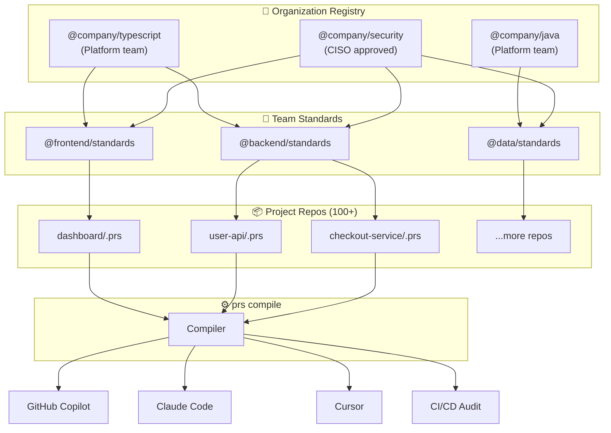

<div class="hero" markdown>

# PromptScript

**The Infrastructure-as-Code for AI Context**

_Standardize, Audit, and Deploy AI Instructions across your entire Engineering Organization._

[:material-rocket-launch: Get Started](getting-started.md){ .md-button .md-button--primary }
[:material-github: View on GitHub](https://github.com/mrwogu/promptscript){ .md-button }

</div>

<div class="feature-grid" markdown>

<div class="feature-card feature-card--highlight" markdown>
### :material-package-variant: Registry & Sharing
Publish and share instruction packages across your organization. Teams inherit from `@company/standards` — update once, propagate everywhere.
</div>

<div class="feature-card" markdown>
### :material-gavel: Enterprise Governance
Enforce non-negotiable standards globally. Define policies once, apply them everywhere (e.g., "No `any` in TS", "Use parameterized SQL Queries").
</div>

<div class="feature-card" markdown>
### :material-lock-off: Vendor Independence
Don't lock your organization's IP into one tool. Write logic in PromptScript, deploy to GitHub Copilot, Claude, or Cursor.
</div>

<div class="feature-card" markdown>
### :material-file-tree: Hierarchical Inheritance
Structure instructions like code. Inherit from `@company/backend-security` or `@team/checkout-service`.
</div>

<div class="feature-card" markdown>
### :material-shield-check: Validation & Linting
Catch syntax errors, missing fields, and policy violations before they reach production.
</div>

<div class="feature-card" markdown>
### :material-cog-play: Skills & Agents
Define reusable commands, skills, and AI agents with specific tools and permissions.
</div>

</div>

## The Business Problem: "Prompt Drift"

Modern engineering organizations face a critical challenge: **AI Context Fragmentation**.

As you scale to 50+ repositories and deploy multiple AI tools (GitHub Copilot, Claude, Cursor), maintaining coherent AI instructions becomes impossible manually.

- **The Scale Problem:** Updating a security policy across 100 microservices takes weeks of manual PRs.
- **The Model Volatility:** New models (e.g., Claude Sonnet 4 vs 3.5) require different prompting strategies. You shouldn't have to rewrite 1000 instruction files when a model upgrades.
- **The Governance Void:** Developers use local, unvetted instructions. Junior devs miss critical security context. There is no audit trail for what constraints your AI is operating under.

Result: **Inconsistent code quality, security risks, and operational chaos.**

## The Solution: PromptOps

**PromptScript turns AI context into managed infrastructure.** It treats your prompts as code—compiled, validated, and deployed.



## Quick Example

=== "PromptScript (.prs)"

    ```promptscript
    @meta { id: "checkout-service" syntax: "1.0.0" }

    # In real projects, you'd inherit company standards:
    @inherit @company/backend-standards

    @identity {
      """
      You are an expert Backend Engineer working on the Checkout Service.
      This service handles payments using hexagonal architecture.
      """
    }

    @standards {
      typescript: [
        "Strict mode enabled",
        "Never use any type"
      ]
      testing: [
        "Use vitest as test framework",
        "Maintain 90% code coverage"
      ]
    }

    @restrictions {
      - "Never expose API keys in code"
      - "Never skip input validation"
    }

    @shortcuts {
      "/review": "Security-focused code review"
      "/test": "Write unit tests with Vitest"
    }

    @skills {
      security-audit: {
        description: "Audit code for vulnerabilities"
        content: "Check for: SQL injection, XSS, IDOR, PII leaks."
      }
    }
    ```

<!-- playground-link-start -->
<a href="https://getpromptscript.dev/playground/?s=N4IgZglgNgpgziAXAbVABwIYBcAWSQwAeGAtmrAHRoBOCANCAMYD2AdljO-gAIkxYYABMEEQAJokEAdJjhiMA1swCuWALRwY1AG4RGMGYLgBPdhkKSZARgoAGO4YC+U1i4DEggJKtB1GBihBGmYAK3ksODpBYxUAcjFRVjlqCCxBFjIMVmMjAVYxDGoxOER3QW4IJK1U8ozMbIB6ACMMRU4xDTyCorhBQQ8ACj8Acwg4LGoctUExMYwm2ASwZmogqAxjYeoVfIBKFwqxTixUnOAXPpkrkAvBAE0VQUKYJ58iNC00gCFWhXbBACirFGrBgWkEAHcVgpKsNBGxBLgXgBhOSKFRpADKWl0+gotwAKjgxkYcXoXjgsmJYL1MMY+Oxeso4LDBHJiMM2AEntRGMSOIwsMo-PifNIbhKXM5XKxuOMqYVisJblhjB84IwUmgsJJkLdLiBMRM9GkSMwjoJOPNFjI6PrxQA5GDacHMl5ZHKqj5XMUAXRV8BOwN19pkAFVNIJdBxxk9ejG0mBqKQYFDqApbaGQABZDCVASVQQATlsAFJ0uaXiwXcnhgYbn6pS4Dn5xilBRA2L1zmLpjInTXLYQ0MxIwBBAAKnkEf2MvULLCOPr6fZAA-BcBhaESaFUUYC4mwndcDelBzgOBWWEYqm7txkDT8ulTMkshvkwtOamWN80CUXLxPhAL4NgaDQJq+4oAOopBwgjKKwNQJr0EKpDgggAGqpIGPpnrKm7QFAd5ipoN6wcYagYMosw6sqYp9EcGpaicbBvmO1E1ABgjLKs2jKFAoLJk00CpMBcDLn0FbsMcb6ovICjcSskiYgAigAMokYQdmwUQABqYpiUSeAAIgA8gASlEU7TrAGAKHA+KgYI0qOCAji+gwxyTPgRCkOQMBULQIAMDWLJsPgVhuUAA" target="_blank" rel="noopener noreferrer">
  
</a>
<!-- playground-link-end -->

=== "GitHub Copilot"

    **Generated file tree:**
    ```
    .github/
    ├── copilot-instructions.md
    ├── prompts/
    │   ├── review.prompt.md
    │   └── test.prompt.md
    └── copilot-skills/
        └── security-audit.md
    ```

    ---

    **`.github/copilot-instructions.md`**
    ```markdown
    # GitHub Copilot Instructions

    > Auto-generated from checkout-service.prs

    ## Project
    You are an expert Backend Engineer working on the Checkout Service.
    This service handles payments using hexagonal architecture.

    ## Code Standards
    - TypeScript: strict mode, no `any` types
    - Testing: vitest, 90% coverage

    ## Restrictions
    - Never expose API keys in code
    - Never skip input validation

    <!-- Inherited from @company/backend-standards -->
    ```

    **`.github/prompts/review.prompt.md`**
    ```markdown
    ---
    mode: agent
    description: Security-focused code review
    ---

    Perform a security-focused code review on the selected code.
    Check for: SQL injection, XSS, IDOR, PII leaks.
    ```

    **`.github/prompts/test.prompt.md`**
    ```markdown
    ---
    mode: agent
    description: Write unit tests with Vitest
    ---

    Write comprehensive unit tests for the selected code using Vitest.
    Target coverage: 90%.
    ```

    **`.github/copilot-skills/security-audit.md`**
    ```markdown
    ---
    name: security-audit
    description: Audit code for vulnerabilities
    ---

    # Security Audit Skill

    Check for: SQL injection, XSS, IDOR, PII leaks.
    ```

=== "Claude Code"

    **Generated file tree:**
    ```
    CLAUDE.md
    .claude/
    └── skills/
        ├── review.md
        ├── test.md
        └── security-audit.md
    ```

    ---

    **`CLAUDE.md`**
    ```markdown
    # CLAUDE.md

    ## Project
    You are an expert Backend Engineer working on the Checkout Service.
    This service handles payments using hexagonal architecture.

    ## Code Style
    - Strict TypeScript, no `any`
    - Testing: vitest, >90% coverage

    ## Don'ts
    - Don't expose API keys in code
    - Don't skip input validation

    ## Commands
    /review - Security-focused code review
    /test - Write unit tests with Vitest
    ```

    **`.claude/skills/review.md`**
    ```markdown
    ---
    name: review
    description: Security-focused code review
    ---

    Perform a security-focused code review.
    Check for: SQL injection, XSS, IDOR, PII leaks.
    ```

    **`.claude/skills/test.md`**
    ```markdown
    ---
    name: test
    description: Write unit tests with Vitest
    ---

    Write comprehensive unit tests using Vitest.
    Target coverage: 90%.
    ```

    **`.claude/skills/security-audit.md`**
    ```markdown
    ---
    name: security-audit
    description: Audit code for vulnerabilities
    ---

    Check for: SQL injection, XSS, IDOR, PII leaks.
    ```

=== "Cursor"

    **Generated file tree:**
    ```
    .cursor/
    └── rules/
        ├── checkout-service.mdc
        └── security-audit.mdc
    ```

    ---

    **`.cursor/rules/checkout-service.mdc`**
    ```markdown
    ---
    description: Checkout Service standards
    globs: ["src/**/*.ts"]
    alwaysApply: true
    ---

    You are working on the Checkout Service.
    This service handles payments using hexagonal architecture.

    ## Code Style
    - TypeScript: strict mode, no `any`
    - Testing: vitest, 90% coverage

    ## Never
    - Expose API keys in code
    - Skip input validation
    ```

    **`.cursor/rules/security-audit.mdc`**
    ```markdown
    ---
    description: Security audit skill
    globs: ["src/**/*.ts"]
    ---

    # Security Audit

    Check for: SQL injection, XSS, IDOR, PII leaks.
    ```

## Ready to standardize?

[Get Started with PromptScript](getting-started.md){ .md-button .md-button--primary .md-button--large }
