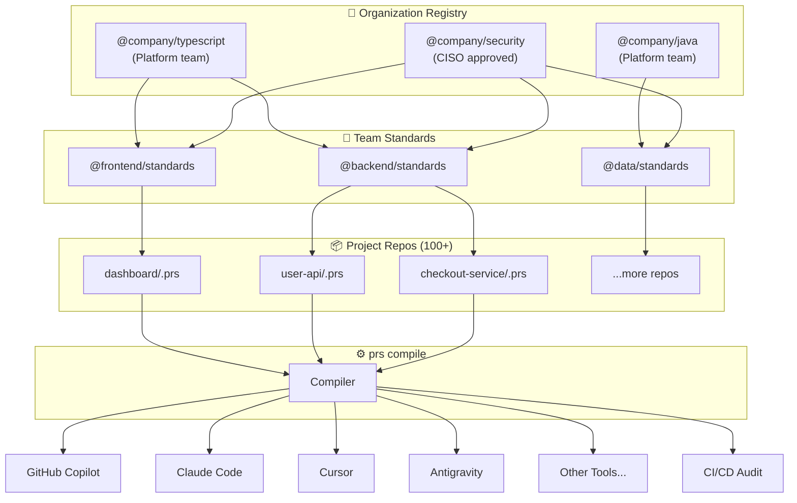

<!-- SEO Meta Tags -->
<meta name="keywords" content="PromptScript, AI instructions, GitHub Copilot, Claude Code, Cursor, AI context, prompt engineering, enterprise AI, developer tools, code generation, AI standardization">
<meta name="robots" content="index, follow">
<meta property="og:title" content="PromptScript - Prompt-as-Code for AI Instructions">
<meta property="og:description" content="Prompt-as-Code for Enterprise AI. Standardize, audit, and deploy instructions across any AI coding assistant.">
<meta property="og:type" content="website">
<meta name="twitter:card" content="summary_large_image">
<meta name="twitter:title" content="PromptScript - Prompt-as-Code for AI Instructions">

<div class="hero" markdown>

# PromptScript

**The Prompt-as-Code for AI Instructions**

_Standardize, audit, and deploy instructions across any AI coding assistant._

[:material-rocket-launch: Get Started](getting-started.md){ .md-button .md-button--primary }
[:material-play-circle: Try Playground](/playground/){ .md-button .md-button--secondary }
[:material-github: GitHub](https://github.com/mrwogu/promptscript){ .md-button }

</div>

<div class="compile-demo" id="compile-demo">
  <div class="compile-demo__source">
    <div class="compile-demo__header">
      <span class="compile-demo__dot compile-demo__dot--red"></span>
      <span class="compile-demo__dot compile-demo__dot--yellow"></span>
      <span class="compile-demo__dot compile-demo__dot--green"></span>
      <span class="compile-demo__filename">project.prs</span>
    </div>
    <pre class="compile-demo__code"><code id="typewriter-target"></code></pre>
    <div class="compile-demo__cursor" id="typing-cursor"></div>
    <div class="compile-demo__badge">Just 4 lines!</div>
  </div>

  <div class="compile-demo__arrow">
    <div class="compile-demo__arrow-icon" id="compile-button">
      <svg viewBox="0 0 24 24" fill="currentColor"><path d="M12 4l-1.41 1.41L16.17 11H4v2h12.17l-5.58 5.59L12 20l8-8z"/></svg>
    </div>
    <span class="compile-demo__command">prs compile</span>
  </div>

  <div class="compile-demo__output" id="output-panel">
    <div class="compile-demo__placeholder" id="compile-placeholder">
      <div class="compile-demo__placeholder-icons">
        <span class="compile-demo__placeholder-icon compile-demo__placeholder-icon--copilot" title="GitHub Copilot">
          <svg viewBox="0 0 24 24" fill="none" stroke="currentColor" stroke-width="2" stroke-linecap="round" stroke-linejoin="round"><path d="M4 18v-5.5c0-.667.167-1.333.5-2"/><path d="M12 7.5c0-1-.01-4.07-4-3.5c-3.5.5-4 2.5-4 3.5c0 1.5 0 4 3 4c4 0 5-2.5 5-4zM4 12c-1.333.667-2 1.333-2 2c0 1 0 3 1.5 4c3 2 6.5 3 8.5 3s5.499-1 8.5-3c1.5-1 1.5-3 1.5-4c0-.667-.667-1.333-2-2"/><path d="M20 18v-5.5c0-.667-.167-1.333-.5-2"/><path d="M12 7.5c0-1 .01-4.07 4-3.5c3.5.5 4 2.5 4 3.5c0 1.5 0 4-3 4c-4 0-5-2.5-5-4zM10 15v2m4-2v2"/></svg>
        </span>
        <span class="compile-demo__placeholder-icon compile-demo__placeholder-icon--claude" title="Claude Code">
          <svg viewBox="0 0 16 16" fill="currentColor"><path d="m3.127 10.604 3.135-1.76.053-.153-.053-.085H6.11l-.525-.032-1.791-.048-1.554-.065-1.505-.08-.38-.081L0 7.832l.036-.234.32-.214.455.04 1.009.069 1.513.105 1.097.064 1.626.17h.259l.036-.105-.089-.065-.068-.064-1.566-1.062-1.695-1.121-.887-.646-.48-.327-.243-.306-.104-.67.435-.48.585.04.15.04.593.456 1.267.981 1.654 1.218.242.202.097-.068.012-.049-.109-.181-.9-1.626-.96-1.655-.428-.686-.113-.411a2 2 0 0 1-.068-.484l.496-.674L4.446 0l.662.089.279.242.411.94.666 1.48 1.033 2.014.302.597.162.553.06.17h.105v-.097l.085-1.134.157-1.392.154-1.792.052-.504.25-.605.497-.327.387.186.319.456-.045.294-.19 1.23-.37 1.93-.243 1.29h.142l.161-.16.654-.868 1.097-1.372.484-.545.565-.601.363-.287h.686l.505.751-.226.775-.707.895-.585.759-.839 1.13-.524.904.048.072.125-.012 1.897-.403 1.024-.186 1.223-.21.553.258.06.263-.218.536-1.307.323-1.533.307-2.284.54-.028.02.032.04 1.029.098.44.024h1.077l2.005.15.525.346.315.424-.053.323-.807.411-3.631-.863-.872-.218h-.12v.073l.726.71 1.331 1.202 1.667 1.55.084.383-.214.302-.226-.032-1.464-1.101-.565-.497-1.28-1.077h-.084v.113l.295.432 1.557 2.34.08.718-.112.234-.404.141-.444-.08-.911-1.28-.94-1.44-.759-1.291-.093.053-.448 4.821-.21.246-.484.186-.403-.307-.214-.496.214-.98.258-1.28.21-1.016.19-1.263.112-.42-.008-.028-.092.012-.953 1.307-1.448 1.957-1.146 1.227-.274.109-.477-.247.045-.44.266-.39 1.586-2.018.956-1.25.617-.723-.004-.105h-.036l-4.212 2.736-.75.096-.324-.302.04-.496.154-.162 1.267-.871z"/></svg>
        </span>
        <span class="compile-demo__placeholder-icon compile-demo__placeholder-icon--cursor" title="Cursor">
          <svg viewBox="0 0 24 24" fill="currentColor"><path d="M12 2L4 7v10l8 5 8-5V7l-8-5zm0 2.5L18 8l-6 3.5L6 8l6-3.5zM5 9.5l6 3.5v7l-6-3.5v-7zm14 0v7l-6 3.5v-7l6-3.5z"/></svg>
        </span>
      </div>
      <div class="compile-demo__placeholder-text">Awaiting compilation...</div>
    </div>
    <div class="compile-demo__tabs">
      <span class="compile-demo__tab compile-demo__tab--active" data-target="copilot">
        <span class="compile-demo__tab-icon compile-demo__tab-icon--copilot">
          <svg viewBox="0 0 24 24" fill="none" stroke="currentColor" stroke-width="2" stroke-linecap="round" stroke-linejoin="round"><path d="M4 18v-5.5c0-.667.167-1.333.5-2"/><path d="M12 7.5c0-1-.01-4.07-4-3.5c-3.5.5-4 2.5-4 3.5c0 1.5 0 4 3 4c4 0 5-2.5 5-4zM4 12c-1.333.667-2 1.333-2 2c0 1 0 3 1.5 4c3 2 6.5 3 8.5 3s5.499-1 8.5-3c1.5-1 1.5-3 1.5-4c0-.667-.667-1.333-2-2"/><path d="M20 18v-5.5c0-.667-.167-1.333-.5-2"/><path d="M12 7.5c0-1 .01-4.07 4-3.5c3.5.5 4 2.5 4 3.5c0 1.5 0 4-3 4c-4 0-5-2.5-5-4zM10 15v2m4-2v2"/></svg>
        </span> Copilot <span class="compile-demo__tab-count">4 files</span>
      </span>
      <span class="compile-demo__tab" data-target="claude">
        <span class="compile-demo__tab-icon compile-demo__tab-icon--claude">
          <svg viewBox="0 0 16 16" fill="currentColor"><path d="m3.127 10.604 3.135-1.76.053-.153-.053-.085H6.11l-.525-.032-1.791-.048-1.554-.065-1.505-.08-.38-.081L0 7.832l.036-.234.32-.214.455.04 1.009.069 1.513.105 1.097.064 1.626.17h.259l.036-.105-.089-.065-.068-.064-1.566-1.062-1.695-1.121-.887-.646-.48-.327-.243-.306-.104-.67.435-.48.585.04.15.04.593.456 1.267.981 1.654 1.218.242.202.097-.068.012-.049-.109-.181-.9-1.626-.96-1.655-.428-.686-.113-.411a2 2 0 0 1-.068-.484l.496-.674L4.446 0l.662.089.279.242.411.94.666 1.48 1.033 2.014.302.597.162.553.06.17h.105v-.097l.085-1.134.157-1.392.154-1.792.052-.504.25-.605.497-.327.387.186.319.456-.045.294-.19 1.23-.37 1.93-.243 1.29h.142l.161-.16.654-.868 1.097-1.372.484-.545.565-.601.363-.287h.686l.505.751-.226.775-.707.895-.585.759-.839 1.13-.524.904.048.072.125-.012 1.897-.403 1.024-.186 1.223-.21.553.258.06.263-.218.536-1.307.323-1.533.307-2.284.54-.028.02.032.04 1.029.098.44.024h1.077l2.005.15.525.346.315.424-.053.323-.807.411-3.631-.863-.872-.218h-.12v.073l.726.71 1.331 1.202 1.667 1.55.084.383-.214.302-.226-.032-1.464-1.101-.565-.497-1.28-1.077h-.084v.113l.295.432 1.557 2.34.08.718-.112.234-.404.141-.444-.08-.911-1.28-.94-1.44-.759-1.291-.093.053-.448 4.821-.21.246-.484.186-.403-.307-.214-.496.214-.98.258-1.28.21-1.016.19-1.263.112-.42-.008-.028-.092.012-.953 1.307-1.448 1.957-1.146 1.227-.274.109-.477-.247.045-.44.266-.39 1.586-2.018.956-1.25.617-.723-.004-.105h-.036l-4.212 2.736-.75.096-.324-.302.04-.496.154-.162 1.267-.871z"/></svg>
        </span> Claude <span class="compile-demo__tab-count">3 files</span>
      </span>
      <span class="compile-demo__tab" data-target="cursor">
        <span class="compile-demo__tab-icon compile-demo__tab-icon--cursor">
          <svg viewBox="0 0 24 24" fill="currentColor"><path d="M12 2L4 7v10l8 5 8-5V7l-8-5zm0 2.5L18 8l-6 3.5L6 8l6-3.5zM5 9.5l6 3.5v7l-6-3.5v-7zm14 0v7l-6 3.5v-7l6-3.5z"/></svg>
        </span> Cursor <span class="compile-demo__tab-count">2 files</span>
      </span>
    </div>

    <div class="compile-demo__panel compile-demo__panel--active" data-panel="copilot">
      <div class="compile-demo__subfiles">
        <span class="compile-demo__subfile compile-demo__subfile--active" data-file="0">instructions.md</span>
        <span class="compile-demo__subfile" data-file="1">review.prompt</span>
        <span class="compile-demo__subfile" data-file="2">migrate.prompt</span>
        <span class="compile-demo__subfile" data-file="3">security.skill</span>
      </div>
      <div class="compile-demo__file compile-demo__file--active" data-file="0">
        <div class="compile-demo__header compile-demo__header--copilot">
          <span class="compile-demo__filename">.github/copilot-instructions.md</span>
        </div>
        <pre class="compile-demo__code"><code><span class="cm"># Checkout Service</span>

<span class="inherited">← inherited from @acme/platform-standards</span>

<span class="hl">## Project</span>
Expert Fullstack Engineer.

<span class="hl">## Tech Stack</span>
TypeScript 5.x · Node 20+ · PostgreSQL

<span class="hl">## Standards</span>
<span class="rule">✓</span> Strict mode, no <span class="str">`any`</span>
<span class="rule">✓</span> Zod for validation
<span class="rule">✓</span> 90% test coverage

<span class="hl">## Security</span>
<span class="warn">⛔</span> Never log PII/card data
<span class="warn">⛔</span> Parameterized SQL only</code></pre>

</div>
<div class="compile-demo__file" data-file="1">
<div class="compile-demo__header compile-demo__header--copilot">
<span class="compile-demo__filename">.github/prompts/review.prompt.md</span>
</div>
<pre class="compile-demo__code"><code><span class="key">---</span>
<span class="key">mode:</span> <span class="str">agent</span>
<span class="key">tools:</span> <span class="str">[codebase, terminal]</span>
<span class="key">description:</span> <span class="str">Security code review</span>
<span class="key">---</span>

Perform security-focused code review.

<span class="hl">Check for:</span>
• SQL injection vulnerabilities
• XSS attack vectors
• Exposed secrets/API keys
• Input validation gaps</code></pre>

</div>
<div class="compile-demo__file" data-file="2">
<div class="compile-demo__header compile-demo__header--copilot">
<span class="compile-demo__filename">.github/prompts/migrate.prompt.md</span>
</div>
<pre class="compile-demo__code"><code><span class="key">---</span>
<span class="key">mode:</span> <span class="str">agent</span>
<span class="key">tools:</span> <span class="str">[terminal, codebase]</span>
<span class="key">description:</span> <span class="str">Database migration</span>
<span class="key">---</span>

Generate Prisma migration safely.

<span class="hl">Steps:</span>
<span class="rule">1.</span> Analyze schema changes
<span class="rule">2.</span> Generate migration file
<span class="rule">3.</span> Review for data loss
<span class="rule">4.</span> Create rollback plan</code></pre>

</div>
<div class="compile-demo__file" data-file="3">
<div class="compile-demo__header compile-demo__header--copilot">
<span class="compile-demo__filename">.github/copilot-skills/security.md</span>
</div>
<pre class="compile-demo__code"><code><span class="key">---</span>
<span class="key">name:</span> <span class="str">security-audit</span>
<span class="key">description:</span> <span class="str">Audit for vulnerabilities</span>
<span class="key">---</span>

<span class="cm"># Security Audit Skill</span>

<span class="hl">Scan for:</span>
• OWASP Top 10 issues
• Hardcoded credentials
• Insecure dependencies
• Missing input sanitization</code></pre>

</div>
</div>

    <div class="compile-demo__panel" data-panel="claude">
      <div class="compile-demo__subfiles">
        <span class="compile-demo__subfile compile-demo__subfile--active" data-file="0">CLAUDE.md</span>
        <span class="compile-demo__subfile" data-file="1">review.skill</span>
        <span class="compile-demo__subfile" data-file="2">migrate.skill</span>
      </div>
      <div class="compile-demo__file compile-demo__file--active" data-file="0">
        <div class="compile-demo__header compile-demo__header--claude">
          <span class="compile-demo__filename">CLAUDE.md</span>
        </div>
        <pre class="compile-demo__code"><code><span class="cm"># Checkout Service</span>

<span class="inherited">← @acme/platform-standards</span>

<span class="hl">## Project</span>
Expert Fullstack Engineer.

<span class="hl">## Tech</span> TypeScript · Hexagonal · DDD

<span class="hl">## Commands</span>
<span class="str">/review</span> Security code review
<span class="str">/test</span> Write vitest tests
<span class="str">/migrate</span> DB migration helper

<span class="hl">## Don'ts</span>
<span class="warn">✗</span> Don't use <span class="str">`any`</span> - use Zod
<span class="warn">✗</span> Don't log payment data
<span class="warn">✗</span> Don't skip validation</code></pre>

</div>
<div class="compile-demo__file" data-file="1">
<div class="compile-demo__header compile-demo__header--claude">
<span class="compile-demo__filename">.claude/skills/review.md</span>
</div>
<pre class="compile-demo__code"><code><span class="key">---</span>
<span class="key">name:</span> <span class="str">review</span>
<span class="key">description:</span> <span class="str">Security code review</span>
<span class="key">---</span>

Perform security-focused review.

<span class="hl">Focus areas:</span>
• Authentication flows
• Data validation
• Error handling
• Secrets management</code></pre>

</div>
<div class="compile-demo__file" data-file="2">
<div class="compile-demo__header compile-demo__header--claude">
<span class="compile-demo__filename">.claude/skills/migrate.md</span>
</div>
<pre class="compile-demo__code"><code><span class="key">---</span>
<span class="key">name:</span> <span class="str">migrate</span>
<span class="key">description:</span> <span class="str">Database migration</span>
<span class="key">---</span>

Help with Prisma migrations.

<span class="hl">Capabilities:</span>
• Schema diff analysis
• Migration generation
• Rollback scripts
• Data preservation</code></pre>

</div>
</div>

    <div class="compile-demo__panel" data-panel="cursor">
      <div class="compile-demo__subfiles">
        <span class="compile-demo__subfile compile-demo__subfile--active" data-file="0">checkout.mdc</span>
        <span class="compile-demo__subfile" data-file="1">security.mdc</span>
      </div>
      <div class="compile-demo__file compile-demo__file--active" data-file="0">
        <div class="compile-demo__header compile-demo__header--cursor">
          <span class="compile-demo__filename">.cursor/rules/checkout.mdc</span>
        </div>
        <pre class="compile-demo__code"><code><span class="key">---</span>

<span class="key">description:</span> <span class="str">Checkout Service</span>
<span class="key">globs:</span> <span class="str">["src/**/*.ts"]</span>
<span class="key">alwaysApply:</span> <span class="bool">true</span>
<span class="key">---</span>

<span class="cm"># Checkout Service</span>
<span class="inherited">← @acme/platform-standards</span>

<span class="hl">## Project</span>
Expert Fullstack Engineer.

<span class="hl">## Stack</span>
TypeScript 5.x · Node 20+ · Prisma

<span class="hl">## Rules</span>
<span class="rule">✓</span> Strict mode, no <span class="str">`any`</span>
<span class="rule">✓</span> Zod validation on inputs
<span class="rule">✓</span> 90% test coverage

<span class="hl">## Security</span>
<span class="warn">⛔</span> Never log PII or card data
<span class="warn">⛔</span> Parameterized queries only</code></pre>

</div>
<div class="compile-demo__file" data-file="1">
<div class="compile-demo__header compile-demo__header--cursor">
<span class="compile-demo__filename">.cursor/rules/security.mdc</span>
</div>
<pre class="compile-demo__code"><code><span class="key">---</span>
<span class="key">description:</span> <span class="str">Security audit skill</span>
<span class="key">globs:</span> <span class="str">["src/**/*.ts"]</span>
<span class="key">---</span>

<span class="cm"># Security Audit</span>

<span class="hl">Scan for vulnerabilities:</span>

• SQL injection risks
• XSS attack vectors
• Hardcoded secrets
• Missing input validation
• Insecure dependencies
• IDOR vulnerabilities</code></pre>

</div>
</div>

  </div>
</div>

<!-- Section Separator -->
<div class="section-divider">
  <div class="section-divider__line"></div>
  <div class="section-divider__icon">
    <svg viewBox="0 0 24 24" fill="currentColor"><path d="M12 2L2 7l10 5 10-5-10-5zM2 17l10 5 10-5M2 12l10 5 10-5"/></svg>
  </div>
  <div class="section-divider__line"></div>
</div>

<h2 class="section-title">Why PromptScript?</h2>
<p class="section-subtitle">Enterprise-grade features for managing AI instructions at scale</p>

<div class="feature-grid">

<div class="feature-card">
  <div class="feature-card__icon feature-card__icon--purple">
    <svg xmlns="http://www.w3.org/2000/svg" viewBox="0 0 24 24"><path fill="currentColor" d="M2 10.96a.985.985 0 0 1-.37-1.37L3.13 7c.11-.2.28-.34.47-.42l7.83-4.4c.16-.12.36-.18.57-.18s.41.06.57.18l7.9 4.44c.19.1.35.26.44.46l1.45 2.52c.28.48.11 1.09-.36 1.36l-1 .58v4.96c0 .38-.21.71-.53.88l-7.9 4.44c-.16.12-.36.18-.57.18s-.41-.06-.57-.18l-7.9-4.44A.99.99 0 0 1 3 16.5v-5.54c-.3.17-.68.18-1 0M12 4.15L5 8.09l7 3.94l7-3.94zM5 15.91l6 3.38v-6.71L5 9.21zm14 0v-6.7l-6 3.37v6.71z"/></svg>
  </div>
  <h3>Registry & Sharing</h3>
  <p>Publish and share instruction packages across your organization. Teams inherit from <code>@company/standards</code> — update once, propagate everywhere.</p>
</div>

<div class="feature-card">
  <div class="feature-card__icon feature-card__icon--blue">
    <svg xmlns="http://www.w3.org/2000/svg" viewBox="0 0 24 24"><path fill="currentColor" d="M3 3h6v4H3zm0 18h6v-4H3zm8 0h6v-4h-6zm8-18h2v18h-2v-4h-4v-2h4V9h-4V7h4zm-8 4h6V3h-6zm0 6h6v-4h-6z"/></svg>
  </div>
  <h3>Hierarchical Inheritance</h3>
  <p>Structure instructions like code. Inherit from <code>@company/backend-security</code> or <code>@team/checkout-service</code>.</p>
</div>

<div class="feature-card">
  <div class="feature-card__icon feature-card__icon--amber">
    <svg xmlns="http://www.w3.org/2000/svg" viewBox="0 0 24 24"><path fill="currentColor" d="m1 22l1-2h20l1 2zm7.5-4a.5.5 0 0 1-.5-.5V14h.08L5.04 9.14l.96-.84l3 3.4V4.5a.5.5 0 0 1 .5-.5a.5.5 0 0 1 .5.5v7h.06l3-3.4l.94.84L10.96 14h.04v3.5a.5.5 0 0 1-.5.5zm6-6.5a.5.5 0 0 1-.5-.5V5.5a.5.5 0 0 1 .5-.5a.5.5 0 0 1 .5.5V8h.06l3-3.4l.94.84L16.46 10h.04v1a.5.5 0 0 1-.5.5a.5.5 0 0 1-.5-.5"/></svg>
  </div>
  <h3>Enterprise Governance</h3>
  <p>Enforce non-negotiable standards globally. Define policies once, apply them everywhere.</p>
</div>

<div class="feature-card">
  <div class="feature-card__icon feature-card__icon--cyan">
    <svg xmlns="http://www.w3.org/2000/svg" viewBox="0 0 24 24"><path fill="currentColor" d="M6.99 11L3 15l3.99 4v-3H14v-2H6.99zM21 9l-3.99-4v3H10v2h7.01v3z"/></svg>
  </div>
  <h3>One Source, Many Tools</h3>
  <p>Write instructions once in PromptScript. Compile to GitHub Copilot, Claude Code, Cursor, and more.</p>
</div>

<div class="feature-card">
  <div class="feature-card__icon feature-card__icon--green">
    <svg xmlns="http://www.w3.org/2000/svg" viewBox="0 0 24 24"><path fill="currentColor" d="m10 17l-4-4l1.41-1.41L10 14.17l7.59-7.59L19 8m0-5H5c-1.11 0-2 .89-2 2v14a2 2 0 0 0 2 2h14a2 2 0 0 0 2-2V5a2 2 0 0 0-2-2"/></svg>
  </div>
  <h3>Validation & Linting</h3>
  <p>Catch syntax errors, missing fields, and policy violations before they reach production.</p>
</div>

<div class="feature-card">
  <div class="feature-card__icon feature-card__icon--orange">
    <svg xmlns="http://www.w3.org/2000/svg" viewBox="0 0 24 24"><path fill="currentColor" d="M12 2C6.48 2 2 6.48 2 12s4.48 10 10 10s10-4.48 10-10S17.52 2 12 2m-1 17.93c-3.95-.49-7-3.85-7-7.93c0-.62.08-1.21.21-1.79L9 15v1c0 1.1.9 2 2 2zm6.9-2.54c-.26-.81-1-1.39-1.9-1.39h-1v-3c0-.55-.45-1-1-1H8v-2h2c.55 0 1-.45 1-1V7h2c1.1 0 2-.9 2-2v-.41c2.93 1.19 5 4.06 5 7.41c0 2.08-.8 3.97-2.1 5.39"/></svg>
  </div>
  <h3>Environment Variables</h3>
  <p>Dynamic configuration with <code>${VAR:-default}</code> syntax. Customize per environment, team, or project folder.</p>
</div>

</div>

<!-- Problem Section -->
<div class="section-divider">
  <div class="section-divider__line"></div>
  <div class="section-divider__icon">
    <svg xmlns="http://www.w3.org/2000/svg" viewBox="0 0 24 24"><path fill="none" stroke="currentColor" stroke-linecap="round" stroke-linejoin="round" stroke-width="1.5" d="M12 9v4m0 4h.01M5.313 20h13.374c1.505 0 2.471-1.6 1.77-2.931L13.77 4.363c-.75-1.425-2.79-1.425-3.54 0L3.543 17.068C2.842 18.4 3.808 20 5.313 20"/></svg>
  </div>
  <div class="section-divider__line"></div>
</div>

<h2 class="section-title">The Problem: Prompt Drift</h2>
<p class="section-subtitle">As you scale AI tools across your organization, chaos emerges</p>

<div class="problem-grid">

<div class="problem-card">
  <div class="problem-card__icon">
    <svg xmlns="http://www.w3.org/2000/svg" viewBox="0 0 24 24"><path fill="currentColor" d="M4 4h4v4H4zm6 0h4v4h-4zm6 0h4v4h-4zM4 10h4v4H4zm6 0h4v4h-4zm6 0h4v4h-4zM4 16h4v4H4zm6 0h4v4h-4zm6 0h4v4h-4z"/></svg>
  </div>
  <h3>Scale Problem</h3>
  <p>Updating a security policy across <strong>100 microservices</strong> takes weeks of manual PRs. One change = 100 commits.</p>
</div>

<div class="problem-card">
  <div class="problem-card__icon">
    <svg xmlns="http://www.w3.org/2000/svg" viewBox="0 0 24 24"><path fill="currentColor" d="M12 2C6.48 2 2 6.48 2 12s4.48 10 10 10s10-4.48 10-10S17.52 2 12 2m1 17h-2v-2h2zm2.07-7.75l-.9.92C13.45 12.9 13 13.5 13 15h-2v-.5c0-1.1.45-2.1 1.17-2.83l1.24-1.26c.37-.36.59-.86.59-1.41c0-1.1-.9-2-2-2s-2 .9-2 2H8c0-2.21 1.79-4 4-4s4 1.79 4 4c0 .88-.36 1.68-.93 2.25"/></svg>
  </div>
  <h3>Model Volatility</h3>
  <p>New models require different prompting strategies. You shouldn't rewrite <strong>1000 files</strong> when a model upgrades.</p>
</div>

<div class="problem-card">
  <div class="problem-card__icon">
    <svg xmlns="http://www.w3.org/2000/svg" viewBox="0 0 24 24"><path fill="currentColor" d="M12 1L3 5v6c0 5.55 3.84 10.74 9 12c5.16-1.26 9-6.45 9-12V5zm0 10.99h7c-.53 4.12-3.28 7.79-7 8.94V12H5V6.3l7-3.11v8.8z"/></svg>
  </div>
  <h3>Governance Void</h3>
  <p>No audit trail. Junior devs miss critical security context. <strong>Unvetted instructions</strong> everywhere.</p>
</div>

</div>

<div class="problem-result">
  <span class="problem-result__icon">⚠️</span>
  <span class="problem-result__text">Result: <strong>Inconsistent code quality, security risks, and operational chaos.</strong></span>
</div>

<!-- Solution Section -->
<div class="section-divider">
  <div class="section-divider__line"></div>
  <div class="section-divider__icon">
    <svg xmlns="http://www.w3.org/2000/svg" viewBox="0 0 24 24"><path fill="none" stroke="currentColor" stroke-linecap="round" stroke-linejoin="round" stroke-width="1.5" d="m9 12l2 2l4-4m5.618-4.016A11.955 11.955 0 0 1 12 2.944a11.955 11.955 0 0 1-8.618 3.04A12.02 12.02 0 0 0 3 9c0 5.591 3.824 10.29 9 11.622c5.176-1.332 9-6.03 9-11.622c0-1.042-.133-2.052-.382-3.016"/></svg>
  </div>
  <div class="section-divider__line"></div>
</div>

<h2 class="section-title">The Solution: PromptOps</h2>
<p class="section-subtitle">Treat your AI instructions as managed infrastructure — compiled, validated, and deployed</p>



<!-- Example Section -->
<div class="section-divider">
  <div class="section-divider__line"></div>
  <div class="section-divider__icon">
    <svg xmlns="http://www.w3.org/2000/svg" viewBox="0 0 24 24"><path fill="none" stroke="currentColor" stroke-linecap="round" stroke-linejoin="round" stroke-width="1.5" d="M17.25 6.75L22.5 12l-5.25 5.25m-10.5 0L1.5 12l5.25-5.25m7.5-3l-4.5 16.5"/></svg>
  </div>
  <div class="section-divider__line"></div>
</div>

<h2 class="section-title">See It In Action</h2>
<p class="section-subtitle">Write once, compile to all major AI tools</p>

=== "PromptScript (.prs)"

    ```promptscript
    @meta { id: "checkout-service" syntax: "1.0.0" }

    @inherit @company/backend-standards

    @identity {
      """
      You are an expert Fullstack Engineer working on the Checkout Service.
      This service handles payments using hexagonal architecture.
      """
    }

    @standards {
      typescript: [
        "Strict mode enabled",
        "Never use any type"
      ]
      testing: [
        "Use vitest as test framework",
        "Maintain 90% code coverage"
      ]
    }

    @restrictions {
      - "Never expose API keys in code"
      - "Never skip input validation"
    }

    @shortcuts {
      "/review": "Security-focused code review"
      "/test": "Write unit tests with Vitest"
    }

    @skills {
      security-audit: {
        description: "Audit code for vulnerabilities"
        content: "Check for: SQL injection, XSS, IDOR, PII leaks."
      }
    }
    ```

<!-- playground-link-start -->
<a href="https://getpromptscript.dev/playground/?s=N4IgZglgNgpgziAXAbVABwIYBcAWSQwAeGAtmrAHRoBOCANCAMYD2AdljO-gAIkxYYABMEEQAJokEAdJjhiMA1swCuWALRwY1AG4RGMGYLgBPdhkKSZARgoAGO4YC+U1i4DEggJKtB1GBihBGmYAK3ksODpBYxUAcjFRVjlqCCxBFjIMVmMjAVYxDGoxOER3QW4IJK1U8ozMbIB6ACMMRU4xDTyCorhBQQ8ACj8Acwg4LGoctUExMYwm2ASwZmogqAxjYeoVfIBKFwqxTixUnOAXPpkrkAvBAE0VQUKYJ58iNC00gCFWhXbBACirFGrBgWkEAHcVgpKsNBGxBLgXgBhOSKFRpADKWl0+gotwAKjgxkYcXoXjgsmJYL1MMY+Oxeso4LDBHJiMM2AEntRGMSOIwsMo-PifNIbhKXM5XKxuOMqYVisJblhjB84IwUmgsJJkLdLiBMRM9GkSMwjoJOPNFjI6PrxQA5GDacHMl5ZHKqj5XMUAXRV8BOwN19pkAFVNIJdBxxk9ejG0mBqKQYFDqApbaGQABZDCVASVQQATlsAFJ0uaXiwXcnhgYbn6pS4Dn5xilBRA2L1zmLpjInTXLYQ0MxIwBBAAKnkEf2MvULLCOPr6fZAA-BcBhaESaFUUYC4mwndcDelBzgOBWWEYqm7txkDT8ulTMkshvkwtOamWN80CUXLxPhAL4NgaDQJq+4oAOopBwgjKKwNQJr0EKpDgggAGqpIGPpnrKm7QFAd5ipoN6wcYagYMosw6sqYp9EcGpaicbBvmO1E1ABgjLKs2jKFAoLJk00CpMBcDLn0FbsMcb6ovICjcSskiYgAigAMokYQdmwUQABqYpiUSeAAIgA8gASlEU7TrAGAKHA+KgYI0qOCAji+gwxyTPgRCkOQMBULQIAMDWLJsPgVhuUAA" target="_blank" rel="noopener noreferrer">
  
</a>
<!-- playground-link-end -->

=== "GitHub Copilot"

    **Generated file tree:**
    ```
    .github/
    ├── copilot-instructions.md
    ├── prompts/
    │   ├── review.prompt.md
    │   └── test.prompt.md
    └── copilot-skills/
        └── security-audit.md
    ```

    ---

    **`.github/copilot-instructions.md`**
    ```markdown
    # GitHub Copilot Instructions

    > Auto-generated from project.prs

    ## Project
    You are an expert Fullstack Engineer working on the Checkout Service.
    This service handles payments using hexagonal architecture.

    ## Code Standards
    - TypeScript: strict mode, no `any` types
    - Testing: vitest, 90% coverage

    ## Restrictions
    - Never expose API keys in code
    - Never skip input validation

    <!-- Inherited from @company/backend-standards -->
    ```

    **`.github/prompts/review.prompt.md`**
    ```markdown
    ---
    mode: agent
    description: Security-focused code review
    ---

    Perform a security-focused code review on the selected code.
    Check for: SQL injection, XSS, IDOR, PII leaks.
    ```

    **`.github/prompts/test.prompt.md`**
    ```markdown
    ---
    mode: agent
    description: Write unit tests with Vitest
    ---

    Write comprehensive unit tests for the selected code using Vitest.
    Target coverage: 90%.
    ```

    **`.github/copilot-skills/security-audit.md`**
    ```markdown
    ---
    name: security-audit
    description: Audit code for vulnerabilities
    ---

    # Security Audit Skill

    Check for: SQL injection, XSS, IDOR, PII leaks.
    ```

=== "Claude Code"

    **Generated file tree:**
    ```
    CLAUDE.md
    .claude/
    └── skills/
        ├── review.md
        ├── test.md
        └── security-audit.md
    ```

    ---

    **`CLAUDE.md`**
    ```markdown
    # CLAUDE.md

    ## Project
    You are an expert Fullstack Engineer working on the Checkout Service.
    This service handles payments using hexagonal architecture.

    ## Code Style
    - Strict TypeScript, no `any`
    - Testing: vitest, >90% coverage

    ## Don'ts
    - Don't expose API keys in code
    - Don't skip input validation

    ## Commands
    /review - Security-focused code review
    /test - Write unit tests with Vitest
    ```

    **`.claude/skills/review.md`**
    ```markdown
    ---
    name: review
    description: Security-focused code review
    ---

    Perform a security-focused code review.
    Check for: SQL injection, XSS, IDOR, PII leaks.
    ```

    **`.claude/skills/test.md`**
    ```markdown
    ---
    name: test
    description: Write unit tests with Vitest
    ---

    Write comprehensive unit tests using Vitest.
    Target coverage: 90%.
    ```

    **`.claude/skills/security-audit.md`**
    ```markdown
    ---
    name: security-audit
    description: Audit code for vulnerabilities
    ---

    Check for: SQL injection, XSS, IDOR, PII leaks.
    ```

=== "Cursor"

    **Generated file tree:**
    ```
    .cursor/
    └── rules/
        ├── checkout-service.mdc
        └── security-audit.mdc
    ```

    ---

    **`.cursor/rules/checkout-service.mdc`**
    ```markdown
    ---
    description: Checkout Service standards
    globs: ["src/**/*.ts"]
    alwaysApply: true
    ---

    You are working on the Checkout Service.
    This service handles payments using hexagonal architecture.

    ## Code Style
    - TypeScript: strict mode, no `any`
    - Testing: vitest, 90% coverage

    ## Never
    - Expose API keys in code
    - Skip input validation
    ```

    **`.cursor/rules/security-audit.mdc`**
    ```markdown
    ---
    description: Security audit skill
    globs: ["src/**/*.ts"]
    ---

    # Security Audit

    Check for: SQL injection, XSS, IDOR, PII leaks.
    ```

=== "Antigravity"

    **Generated file tree:**
    ```
    .agent/
    └── rules/
        ├── checkout-service.md
        └── security-audit.md
    ```

    ---

    **`.agent/rules/checkout-service.md`**
    ```markdown
    ---
    description: Checkout Service standards
    activation: always
    ---

    You are working on the Checkout Service.
    This service handles payments using hexagonal architecture.

    ## Code Style
    - TypeScript: strict mode, no `any`
    - Testing: vitest, 90% coverage

    ## Never
    - Expose API keys in code
    - Skip input validation
    ```

    **`.agent/rules/security-audit.md`**
    ```markdown
    ---
    description: Security audit skill
    activation: manual
    ---

    # Security Audit

    Check for: SQL injection, XSS, IDOR, PII leaks.
    ```

<!-- CTA Section -->
<div class="cta-section">
  <h2 class="cta-section__title">Ready to Standardize Your AI Instructions?</h2>
  <p class="cta-section__subtitle">Join engineering teams using PromptScript to manage AI context at scale</p>
  <a href="getting-started/" class="md-button md-button--primary">Get Started</a>
  <a href="/playground/" class="md-button md-button--secondary">Try Playground</a>
  <a href="https://github.com/mrwogu/promptscript" class="md-button">View on GitHub</a>
</div>
