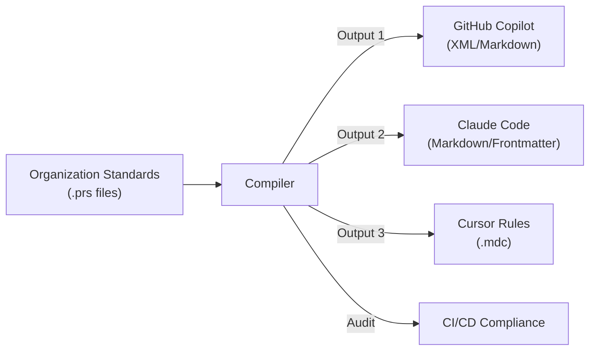

<div class="hero" markdown>

# PromptScript

**The Infrastructure-as-Code for AI Context**

_Standardize, Audit, and Deploy AI Instructions across your entire Engineering Organization._

[:material-rocket-launch: Get Started](getting-started.md){ .md-button .md-button--primary }
[:material-github: View on GitHub](https://github.com/mrwogu/promptscript){ .md-button }

</div>

<div class="feature-grid" markdown>

<div class="feature-card" markdown>
### :material-gavel: Enterprise Governance
Enforce non-negotiable standards globally. Define policies once, apply them everywhere (e.g., "No `any` in TS", "Use parameterized SQL Queries").
</div>

<div class="feature-card" markdown>
### :material-lock-off: Vendor Independence
Don't lock your organization's intellectual property into one tool. Write logic in PromptScript, deploy to GitHub Copilot, Claude, or Cursor.
</div>

<div class="feature-card" markdown>
### :material-file-tree: Hierarchical Inheritance
Structure instructions like code. Inherit from `@company/backend-security` or `@team/checkout-service`.
</div>

<div class="feature-card" markdown>
### :material-refresh: Managed Lifecyle
Update a central policy and propagate changes to 100+ repositories automatically. No more manual copy-pasting.
</div>

</div>

## The Business Problem: "Prompt Drift"

Modern engineering organizations face a critical challenge: **AI Context Fragmentation**.

As you scale to 50+ repositories and deploy multiple AI tools (GitHub Copilot, Claude, Cursor), maintaining coherent AI instructions becomes impossible manually.

- **The Scale Problem:** Updating a security policy across 100 microservices takes weeks of manual PRs.
- **The Model Volatility:** New models (e.g., Claude Sonnet 4 vs 3.5) require different prompting strategies.
- **The Governance Void:** Developers use local, unvetted instructions. Junior devs miss critical security context.

Result: **Inconsistent code quality, security risks, and operational chaos.**

## The Solution: PromptOps

**PromptScript turns AI context into managed infrastructure.** It treats your prompts as code—compiled, validated, and deployed.



## Quick Example

=== "PromptScript (.prs)"

    ```promptscript
    @meta { id: "checkout-service", syntax: "1.0.0" }

    // Inherit approved company standards
    @inherit @company/backend-security
    @inherit @company/typescript-standards

    // Project-specific identity
    @identity {
      """
      You are an expert Backend Engineer working on the Checkout Service.
      This service handles payments and utilizes a hexagonal architecture.
      """
    }

    @standards {
      typescript: {
        strictMode: true
        noAny: true
      }
    }

    // Define reusable tools/skills
    @skills {
      review: {
        description: "Security-focused code review"
        content: "Check for: IDOR, SQL Injection, and PII leaks."
      }
    }
    ```

=== "Outputs"

    **GitHub Copilot** (`.github/copilot-instructions.md`)
    ```xml
    <context>
      You are an expert Backend Engineer working on the Checkout Service...
    </context>
    <rules>
       ...inherited security rules...
    </rules>
    ```

    **Claude Code** (`CLAUDE.md`)
    ```markdown
    # Identity
    You are an expert Backend Engineer...

    # Security Rules
    ...
    ```

## Ready to standardize?

[Get Started with PromptScript](getting-started.md){ .md-button .md-button--primary .md-button--large }
