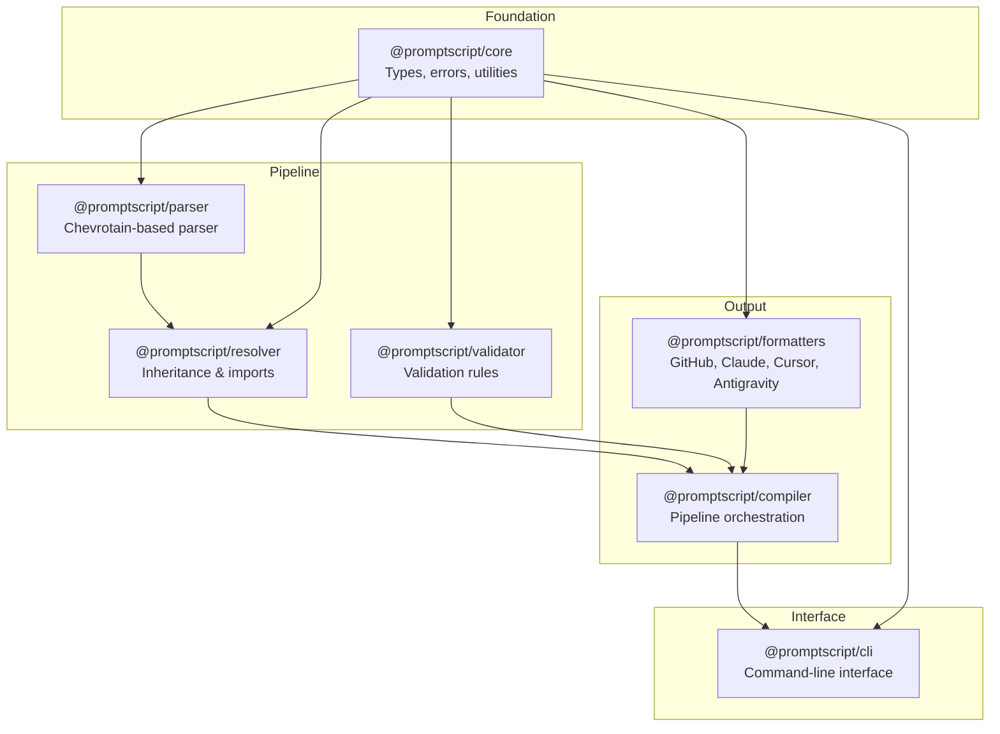

<div class="hero" markdown>

# PromptScript

**A language for standardizing AI instructions across enterprise organizations**

[:material-rocket-launch: Get Started](getting-started.md){ .md-button .md-button--primary }
[:material-github: View on GitHub](https://github.com/mrwogu/promptscript){ .md-button }

</div>

<div class="feature-grid" markdown>

<div class="feature-card" markdown>
### :material-code-braces: Single Source of Truth
Write AI instructions once in `.prs` files, compile to all target formats automatically.
</div>

<div class="feature-card" markdown>
### :material-family-tree: Inheritance System
Build hierarchical instruction sets with org → team → project inheritance.
</div>

<div class="feature-card" markdown>
### :material-format-list-checks: Validation
Comprehensive validation with actionable error messages and auto-fix suggestions.
</div>

<div class="feature-card" markdown>
### :material-target: Multi-Target Output
Native support for GitHub Copilot, Claude Code, Cursor, Google Antigravity, and more.
</div>

<div class="feature-card" markdown>
### :material-rocket-launch: Future-Proof
Formatter updates automatically adapt your prompts to new AI features and models—agent skills, tool use, and more—without changing your `.prs` files.
</div>

</div>

## The Problem at Scale

As organizations grow to dozens or hundreds of projects, AI instruction management becomes chaotic:

- **No single source of truth** – Every project maintains different AI instructions
- **No sharing mechanism** – Common patterns are copy-pasted across repos and drift apart over time
- **No inheritance** – Teams can't build upon organization-wide standards
- **No synchronization** – Updating guidelines means manually touching every repository
- **No governance** – No way to enforce compliance or audit what's actually deployed

PromptScript solves this by providing a **centralized, hierarchical system** where instructions can be shared, inherited, extended, and synchronized across your entire organization.

## Quick Example

=== "PromptScript (.prs)"

    ```promptscript
    @meta {
      id: "my-project"
      syntax: "1.0.0"
    }

    @identity {
      """
      You are an expert TypeScript developer.
      Focus on clean, maintainable code.
      """
    }

    @standards {
      code: {
        style: "functional"
        testing: required
      }
    }

    @shortcuts {
      "/review": "Review code for quality issues"
      "/test": "Write comprehensive tests"
    }
    ```

=== "Output: GitHub Copilot"

    ```markdown
    # AI Instructions

    ## Identity

    You are an expert TypeScript developer.
    Focus on clean, maintainable code.

    ## Standards

    - Code style: functional
    - Testing: required

    ## Commands

    - `/review` - Review code for quality issues
    - `/test` - Write comprehensive tests
    ```

=== "Output: Claude Code"

    ```markdown
    # CLAUDE.md

    You are an expert TypeScript developer.
    Focus on clean, maintainable code.

    ## Standards

    Code style: functional
    Testing: required

    ## Shortcuts

    /review - Review code for quality issues
    /test - Write comprehensive tests
    ```

## Architecture

PromptScript is organized as a modular monorepo:



## Installation

```bash
npm install -g @promptscript/cli
```

## Next Steps

- **[Getting Started](getting-started.md)** - Quick setup guide
- **[Tutorial](tutorial.md)** - Complete walkthrough
- **[Language Reference](reference/language.md)** - Full syntax documentation
- **[Examples](examples/index.md)** - Real-world configurations
