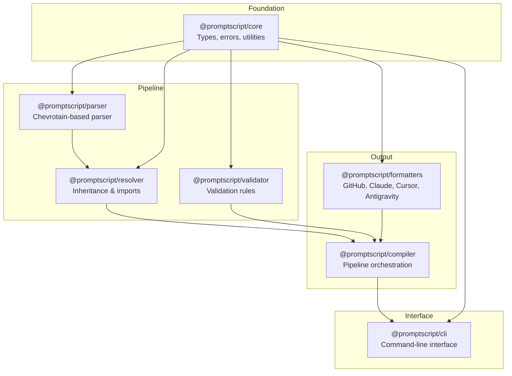

<div class="hero" markdown>

# PromptScript

**A language for standardizing AI instructions across enterprise organizations**

[:material-rocket-launch: Get Started](getting-started.md){ .md-button .md-button--primary }
[:material-github: View on GitHub](https://github.com/mrwogu/promptscript){ .md-button }

</div>

<div class="feature-grid" markdown>

<div class="feature-card" markdown>
### :material-code-braces: Single Source of Truth
Write AI instructions once in `.prs` files, compile to all target formats automatically.
</div>

<div class="feature-card" markdown>
### :material-family-tree: Inheritance System
Build hierarchical instruction sets with org → team → project inheritance.
</div>

<div class="feature-card" markdown>
### :material-format-list-checks: Validation
Comprehensive validation with actionable error messages and auto-fix suggestions.
</div>

<div class="feature-card" markdown>
### :material-target: Multi-Target Output
Native support for GitHub Copilot, Claude Code, Cursor, Google Antigravity, and more.
</div>

<div class="feature-card" markdown>
### :material-rocket-launch: Future-Proof
Formatter updates automatically adapt your prompts to new AI features and models—agent skills, tool use, and more—without changing your `.prs` files.
</div>

</div>

## The Problem at Scale

As organizations grow to dozens or hundreds of projects, AI instruction management becomes chaotic:

- **No single source of truth** – Every project maintains different AI instructions
- **No sharing mechanism** – Common patterns are copy-pasted across repos and drift apart over time
- **No inheritance** – Teams can't build upon organization-wide standards
- **No synchronization** – Updating guidelines means manually touching every repository
- **No governance** – No way to enforce compliance or audit what's actually deployed

PromptScript solves this by providing a **centralized, hierarchical system** where instructions can be shared, inherited, extended, and synchronized across your entire organization.

## Quick Example

=== "PromptScript (.prs)"

    ```promptscript
    @meta {
      id: "ecommerce-api"
      syntax: "1.0.0"
    }

    @inherit @company/backend-standards

    @identity {
      """
      You are a senior backend engineer specializing in
      high-performance e-commerce APIs.
      """
    }

    @tech-stack {
      language: "TypeScript"
      runtime: "Node.js 22"
      framework: "Fastify"
      database: "PostgreSQL + Redis"
    }

    @restrictions {
      - "Never expose internal IDs in public APIs"
      - "Always validate request payloads"
    }

    @skills {
      deploy: {
        description: "Deploy service to production"
        allowedTools: ["Bash", "Read"]
        content: """
          1. Run tests: pnpm test
          2. Build: pnpm build
          3. Deploy: kubectl apply -f k8s/
        """
      }
    }

    @agents {
      db-optimizer: {
        description: "Analyze and optimize SQL queries"
        tools: ["Read", "Bash", "Grep"]
        model: "sonnet"
        content: """
          You are a database performance expert.
          Analyze queries for N+1 problems, missing
          indexes, and optimization opportunities.
        """
      }
    }
    ```

=== "GitHub Copilot"

    ```markdown
    <!-- .github/copilot-instructions.md -->

    ## project
    You are a senior backend engineer specializing in
    high-performance e-commerce APIs.

    ## tech-stack
    - **Language:** TypeScript
    - **Runtime:** Node.js 22
    - **Framework:** Fastify
    - **Database:** PostgreSQL + Redis

    ## donts
    - Don't expose internal IDs in public APIs
    - Always validate request payloads
    ```

    ```markdown
    <!-- .github/skills/deploy/SKILL.md -->
    ---
    name: "deploy"
    description: "Deploy service to production"
    ---

    1. Run tests: pnpm test
    2. Build: pnpm build
    3. Deploy: kubectl apply -f k8s/
    ```

    ```markdown
    <!-- .github/agents/db-optimizer.md -->
    ---
    name: db-optimizer
    description: Analyze and optimize SQL queries
    tools: [Read, Bash, Grep]
    model: gpt-4o
    ---

    You are a database performance expert.
    Analyze queries for N+1 problems...
    ```

=== "Claude Code"

    ```markdown
    <!-- CLAUDE.md -->

    # CLAUDE.md

    You are a senior backend engineer specializing in
    high-performance e-commerce APIs.

    ## Tech Stack

    | Technology | Value |
    |------------|-------|
    | Language | TypeScript |
    | Runtime | Node.js 22 |
    | Framework | Fastify |
    | Database | PostgreSQL + Redis |

    ## Restrictions

    - Never expose internal IDs in public APIs
    - Always validate request payloads
    ```

    ```markdown
    <!-- .claude/skills/deploy/SKILL.md -->
    ---
    name: "deploy"
    description: "Deploy service to production"
    allowed-tools:
      - Bash
      - Read
    ---

    1. Run tests: pnpm test
    2. Build: pnpm build
    3. Deploy: kubectl apply -f k8s/
    ```

    ```markdown
    <!-- .claude/agents/db-optimizer.md -->
    ---
    name: db-optimizer
    description: Analyze and optimize SQL queries
    tools: Read, Bash, Grep
    model: sonnet
    ---

    You are a database performance expert.
    Analyze queries for N+1 problems...
    ```

=== "Cursor"

    ```yaml
    # .cursor/rules/project.mdc
    ---
    description: E-commerce API development rules
    globs: ["**/*.ts"]
    alwaysApply: true
    ---

    # E-commerce API Rules

    Senior backend engineer for high-performance
    e-commerce APIs.

    ## Stack
    TypeScript • Node.js 22 • Fastify • PostgreSQL

    ## Critical Rules
    ⛔ Never expose internal IDs in public APIs
    ⛔ Always validate request payloads

    ## Deploy Workflow
    1. `pnpm test` → Run tests
    2. `pnpm build` → Build service
    3. `kubectl apply` → Deploy to k8s
    ```

    !!! note "Cursor Limitations"
        Cursor doesn't support agents or skills natively.
        All instructions are inlined into .mdc rules.

=== "Antigravity"

    ```markdown
    <!-- .agent/rules/project.md -->
    ---
    trigger: always
    description: E-commerce API coding rules
    ---

    # E-commerce API Assistant

    Backend engineer for high-performance e-commerce APIs.

    ## Technology
    TypeScript on Node.js 22 with Fastify and PostgreSQL.

    ## Forbidden Actions
    1. Exposing internal IDs in APIs
    2. Skipping request validation

    ## Deploy Procedure
    Run tests → Build → Deploy to Kubernetes
    ```

## Architecture

PromptScript is organized as a modular monorepo:



## Installation

```bash
npm install -g @promptscript/cli
```

## Next Steps

- **[Getting Started](getting-started.md)** - Quick setup guide
- **[Tutorial](tutorial.md)** - Complete walkthrough
- **[Language Reference](reference/language.md)** - Full syntax documentation
- **[Examples](examples/index.md)** - Real-world configurations
