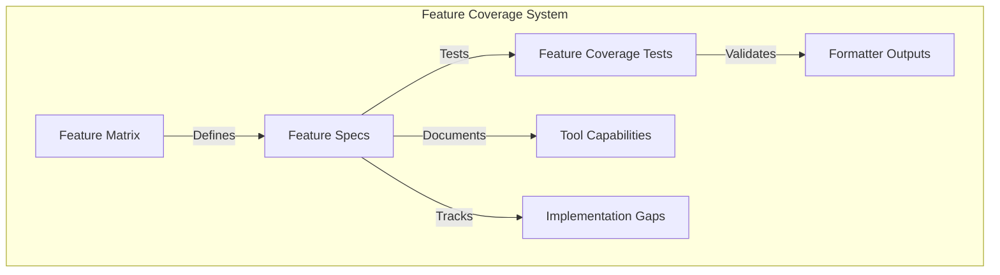

# Feature Coverage Testing

This document describes the Feature Coverage Matrix and testing mechanism for PromptScript formatters.

## Overview

The Feature Coverage Matrix is a specification that tracks:

1. **Tool Capabilities** - What features each AI tool (GitHub Copilot, Cursor, Claude, Antigravity) supports
2. **Formatter Implementation** - Which features our formatters implement
3. **Coverage Gaps** - Features supported by tools but not yet implemented



## Feature Matrix

The Feature Matrix is defined in `packages/formatters/src/feature-matrix.ts`.

### Structure

```typescript
interface FeatureSpec {
  id: string; // Unique identifier
  name: string; // Human-readable name
  description: string; // Feature description
  category: FeatureCategory; // Grouping category
  tools: Record<ToolName, FeatureStatus>; // Support per tool
  testStrategy?: string; // How to test
  docsUrl?: Record<ToolName, string>; // Documentation links
}

type FeatureStatus =
  | 'supported' // Tool supports, formatter implements
  | 'not-supported' // Tool doesn't support
  | 'planned' // Tool supports, not yet implemented
  | 'partial'; // Partially implemented
```

### Categories

| Category         | Description                          |
| ---------------- | ------------------------------------ |
| `output-format`  | Markdown, MDC, code blocks, diagrams |
| `file-structure` | Single/multi-file output, workflows  |
| `metadata`       | YAML frontmatter, descriptions       |
| `targeting`      | Glob patterns, activation types      |
| `content`        | Character limits, section splitting  |
| `advanced`       | Context inclusion, @-mentions        |

## Using the Matrix

### Get Features for a Tool

```typescript
import { getToolFeatures } from '@promptscript/formatters';

const features = getToolFeatures('cursor');
// Returns all features where cursor status is 'supported' or 'partial'
```

### Check Specific Feature Support

```typescript
import { toolSupportsFeature } from '@promptscript/formatters';

if (toolSupportsFeature('cursor', 'yaml-frontmatter')) {
  // Generate with frontmatter
}
```

### Get Coverage Summary

```typescript
import { getFeatureCoverage } from '@promptscript/formatters';

const coverage = getFeatureCoverage('cursor');
// {
//   tool: 'cursor',
//   supported: 15,
//   partial: 1,
//   planned: 0,
//   notSupported: 4,
//   total: 20,
//   coveragePercent: 78
// }
```

### Generate Report

```typescript
import { generateFeatureMatrixReport } from '@promptscript/formatters';

const markdown = generateFeatureMatrixReport();
console.log(markdown);
// Outputs markdown table with all features and their status per tool
```

## Running Tests

```bash
# Run feature coverage tests
pnpm nx test formatters --testNamePattern="Feature Coverage"

# Run all formatter tests
pnpm nx test formatters
```

## Test Structure

Feature coverage tests verify that formatters correctly implement the features defined in the matrix:

```
packages/formatters/src/__tests__/feature-coverage.spec.ts
```

### Test Categories

1. **Matrix Integrity** - Validates the matrix structure
   - Unique feature IDs
   - Required fields present
   - Valid status values

2. **Coverage Summary** - Tests coverage calculation
   - Valid coverage for each tool
   - Coverage percentages are accurate

3. **Feature Implementation** - Tests actual formatter output
   - `markdown-output` - Valid markdown produced
   - `code-blocks` - Fenced code blocks preserved
   - `mermaid-diagrams` - Mermaid diagrams preserved
   - `yaml-frontmatter` - Correct frontmatter generated
   - `glob-patterns` - Glob patterns in output
   - `workflows` - Workflow files generated
   - `character-limit` - Warning on limit exceeded

## Adding a New Feature

When adding a new feature to the matrix:

1. **Define in Matrix**

   ```typescript
   // feature-matrix.ts
   {
     id: 'new-feature',
     name: 'New Feature',
     description: 'Description of the feature',
     category: 'output-format',
     tools: {
       github: 'not-supported',
       cursor: 'supported',
       claude: 'not-supported',
       antigravity: 'planned',
     },
     testStrategy: 'How to verify this feature',
   }
   ```

2. **Add Test**

   ```typescript
   // feature-coverage.spec.ts
   describe('new-feature', () => {
     it.each(['github', 'cursor', 'claude', 'antigravity'] as ToolName[])(
       '%s should handle new feature correctly',
       (tool) => {
         if (!toolSupportsFeature(tool, 'new-feature')) return;

         const formatter = formatters.get(tool)!;
         const result = formatter.format(createTestAST());

         // Verify feature is correctly implemented
         expect(result.content).toContain('expected content');
       }
     );
   });
   ```

3. **Implement Feature**

   Add implementation to the relevant formatter(s).

4. **Update Status**

   Change status from `'planned'` to `'supported'` once implemented.

## Best Practices

1. **Keep Matrix Updated** - When implementing new features, update the matrix
2. **Test All Statuses** - Tests should handle all feature statuses appropriately
3. **Document Gaps** - Use `'planned'` status to track intended features
4. **Add Test Strategies** - Help future developers understand how to verify features
5. **Include Docs URLs** - Link to official tool documentation for reference

## API Reference

### Functions

| Function                        | Description                            |
| ------------------------------- | -------------------------------------- |
| `getToolFeatures(tool)`         | Get all supported features for a tool  |
| `getPlannedFeatures(tool)`      | Get features planned for a tool        |
| `getFeaturesByCategory(cat)`    | Get features by category               |
| `toolSupportsFeature(t, f)`     | Check if tool supports feature         |
| `getFeatureCoverage(tool)`      | Get coverage summary                   |
| `getToolComparison()`           | Get comparison matrix                  |
| `identifyFeatureGaps(tool)`     | Get planned but unimplemented features |
| `generateFeatureMatrixReport()` | Generate markdown report               |

### Types

| Type                     | Description                   |
| ------------------------ | ----------------------------- |
| `ToolName`               | Union of tool names           |
| `FeatureStatus`          | Feature implementation status |
| `FeatureSpec`            | Feature specification         |
| `FeatureCategory`        | Feature category              |
| `FeatureCoverageSummary` | Coverage summary object       |
