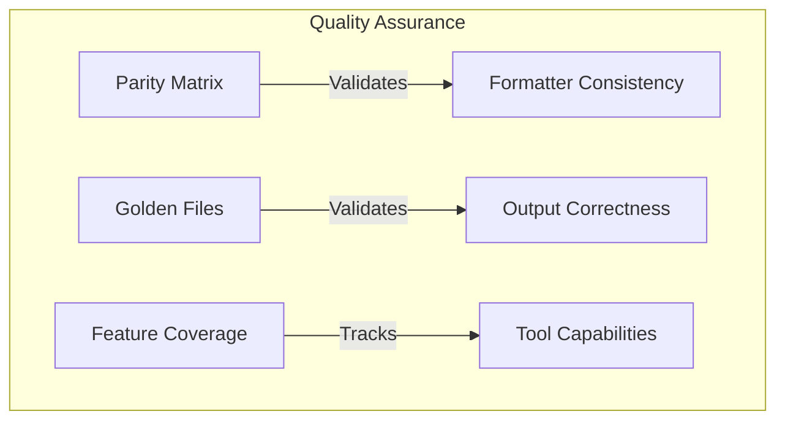

# Testing Documentation

This section covers the testing mechanisms and quality assurance tools for PromptScript formatters.

## Overview

PromptScript provides comprehensive testing to ensure formatter quality and consistency:



## Testing Mechanisms

<div class="feature-grid" markdown>

<div class="feature-card" markdown>
### Parity Testing
Ensures consistent output across all formatters using specification-based and reference-based testing.

[Parity Testing →](parity-testing.md)

</div>

<div class="feature-card" markdown>
### Feature Coverage
Tracks which features each AI tool supports and which our formatters implement.

[Feature Coverage →](feature-coverage.md)

</div>

</div>

## Quick Reference

### Running Tests

```bash
# Run all formatter tests
pnpm nx test formatters

# Run parity tests only
pnpm nx test formatters --testNamePattern="Parity"

# Run golden file tests
pnpm nx test formatters --testNamePattern="Golden Files"

# Run feature coverage tests
pnpm nx test formatters --testNamePattern="Feature Coverage"

# Update golden files after intentional changes
UPDATE_GOLDEN=true pnpm nx test formatters
```

### Test Files

| Test File                  | Purpose                              |
| -------------------------- | ------------------------------------ |
| `parity-matrix.spec.ts`    | Section coverage validation          |
| `golden-files.spec.ts`     | Output comparison against references |
| `feature-coverage.spec.ts` | Feature implementation verification  |
| `parity.spec.ts`           | Cross-formatter consistency          |

### Key Exports

```typescript
import {
  // Parity Matrix
  PARITY_MATRIX,
  getRequiredSections,
  analyzeFormatterOutput,

  // Feature Coverage
  FEATURE_MATRIX,
  getToolFeatures,
  toolSupportsFeature,
  getFeatureCoverage,
} from '@promptscript/formatters';
```

## CI/CD Integration

Testing is integrated into the CI pipeline:

1. **Unit Tests** - All formatter tests run on every push
2. **Golden Files Check** - Detects drift in formatter output
3. **Coverage Reports** - Tracks test coverage metrics

See [Parity Testing - CI/CD Integration](parity-testing.md#cicd-integration) for details.
