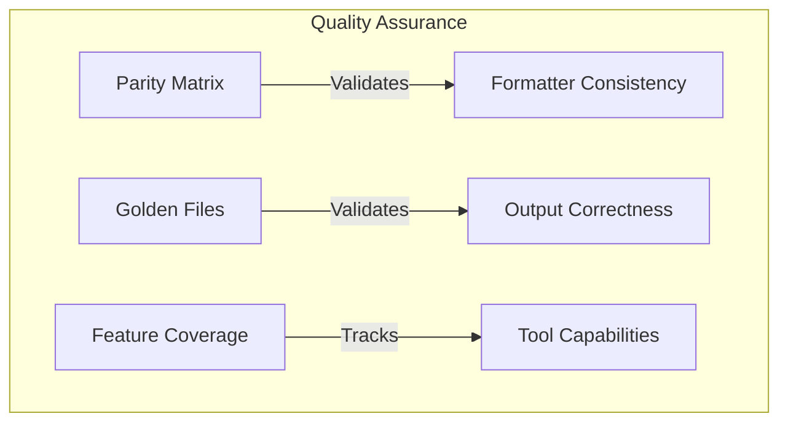

# Testing Documentation

This section covers the testing mechanisms and quality assurance tools for PromptScript formatters.

## Overview

PromptScript provides comprehensive testing to ensure formatter quality and consistency:



## Testing Mechanisms

<div class="ref-list">

<a href="parity-testing/" class="ref-item">
  <div class="ref-item__icon ref-item__icon--blue">
    <svg xmlns="http://www.w3.org/2000/svg" viewBox="0 0 24 24"><path fill="currentColor" d="M12 3a1 1 0 0 1 .707.293l7 7a1 1 0 0 1 0 1.414l-7 7a1 1 0 0 1-1.414 0l-7-7a1 1 0 0 1 0-1.414l7-7A1 1 0 0 1 12 3m0 2.414L5.414 12L12 18.586L18.586 12z"/></svg>
  </div>
  <div class="ref-item__content">
    <h3>Parity Testing</h3>
    <p>Ensures consistent output across all formatters using specification-based and reference-based testing.</p>
  </div>
  <div class="ref-item__arrow">→</div>
</a>

<a href="feature-coverage/" class="ref-item">
  <div class="ref-item__icon ref-item__icon--green">
    <svg xmlns="http://www.w3.org/2000/svg" viewBox="0 0 24 24"><path fill="currentColor" d="M21 7L9 19l-5.5-5.5l1.41-1.41L9 16.17L19.59 5.59z"/></svg>
  </div>
  <div class="ref-item__content">
    <h3>Feature Coverage</h3>
    <p>Tracks which features each AI tool supports and which our formatters implement.</p>
  </div>
  <div class="ref-item__arrow">→</div>
</a>

</div>

## Quick Reference

### Running Tests

```bash
# Run all formatter tests
pnpm nx test formatters

# Run parity tests only
pnpm nx test formatters --testNamePattern="Parity"

# Run golden file tests
pnpm nx test formatters --testNamePattern="Golden Files"

# Run feature coverage tests
pnpm nx test formatters --testNamePattern="Feature Coverage"

# Update golden files after intentional changes
UPDATE_GOLDEN=true pnpm nx test formatters
```

### Test Files

| Test File                  | Purpose                              |
| -------------------------- | ------------------------------------ |
| `parity-matrix.spec.ts`    | Section coverage validation          |
| `golden-files.spec.ts`     | Output comparison against references |
| `feature-coverage.spec.ts` | Feature implementation verification  |
| `parity.spec.ts`           | Cross-formatter consistency          |

### Key Exports

```typescript
import {
  // Parity Matrix
  PARITY_MATRIX,
  getRequiredSections,
  analyzeFormatterOutput,

  // Feature Coverage
  FEATURE_MATRIX,
  getToolFeatures,
  toolSupportsFeature,
  getFeatureCoverage,
} from '@promptscript/formatters';
```

## CI/CD Integration

Testing is integrated into the CI pipeline:

1. **Unit Tests** - All formatter tests run on every push
2. **Golden Files Check** - Detects drift in formatter output
3. **Coverage Reports** - Tracks test coverage metrics

See [Parity Testing - CI/CD Integration](parity-testing.md#cicd-integration) for details.
