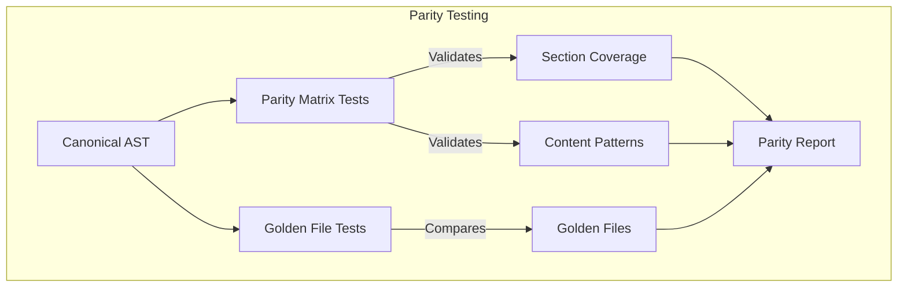
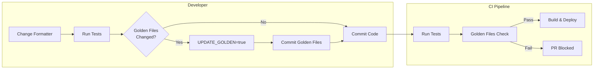

# Parity Testing

This document describes the parity testing mechanism for PromptScript formatters.
The goal is to ensure consistent output across all formatters and detect anomalies.

## Overview

PromptScript provides two complementary testing mechanisms:

1. **Parity Matrix** - Specification-based testing that defines expected behavior
2. **Golden Files** - Reference-based testing that compares against known-good output



## Parity Matrix

The Parity Matrix is a specification that defines:

- Which AST blocks should produce which sections
- Which formatters must implement each section
- Expected content patterns for validation
- Header variations across formatters

### Location

```
packages/formatters/src/parity-matrix.ts
```

### Structure

```typescript
interface SectionSpec {
  id: string; // Unique section identifier
  name: string; // Human-readable name
  description: string; // Section purpose
  sources: SourceBlockConfig[]; // AST blocks that provide data
  requiredBy: FormatterName[]; // Formatters that MUST implement
  optionalFor: FormatterName[]; // Formatters that MAY implement
  contentPatterns?: RegExp[]; // Expected content patterns
  headerVariations: Record<FormatterName, string | string[]>;
}
```

### Example

```typescript
{
  id: 'restrictions',
  name: 'Restrictions',
  description: "Don'ts and forbidden practices",
  sources: [{ block: 'restrictions' }],
  requiredBy: ['github', 'cursor', 'claude', 'antigravity'],
  optionalFor: [],
  contentPatterns: [/never|don't|do not|avoid|forbidden/i],
  headerVariations: {
    github: "## Don'ts",
    cursor: 'Never:',
    claude: "## Don'ts",
    antigravity: "## Don'ts",
  },
}
```

### Using the Matrix

```typescript
import {
  PARITY_MATRIX,
  getRequiredSections,
  validateSectionContent,
} from '@promptscript/formatters';

// Get required sections for a formatter
const sections = getRequiredSections('github');

// Validate content matches expected patterns
const isValid = validateSectionContent(content, 'restrictions');
```

## Golden Files

Golden files are reference outputs that formatters should match.

### Location

```
packages/formatters/src/__tests__/__golden__/
├── github.md           # Expected GitHub Copilot output
├── cursor.mdc          # Expected Cursor output
├── claude.md           # Expected Claude Code output
├── antigravity.md      # Expected Antigravity output
└── README.md           # Documentation
```

### Updating Golden Files

When you intentionally change formatter output:

```bash
# Update all golden files
UPDATE_GOLDEN=true pnpm nx test formatters

# Review changes
git diff packages/formatters/src/__tests__/__golden__/

# Commit updated golden files with your changes
git add packages/formatters/src/__tests__/__golden__/
git commit -m "test: update golden files for new formatter output"
```

### How It Works

1. Tests generate output from a canonical AST
2. Output is normalized (timestamps removed, whitespace standardized)
3. Normalized output is compared against golden files
4. Differences indicate regression or intentional change

## Running Tests

```bash
# Run all parity tests
pnpm nx test formatters

# Run only parity matrix tests
pnpm nx test formatters --testNamePattern="Parity Matrix"

# Run only golden file tests
pnpm nx test formatters --testNamePattern="Golden Files"

# Update golden files after intentional changes
UPDATE_GOLDEN=true pnpm nx test formatters
```

## Adding a New Formatter

When adding a new formatter:

1. **Add to Parity Matrix**

   Update `parity-matrix.ts` to include your formatter in `requiredBy` or `optionalFor` arrays:

   ```typescript
   {
     id: 'restrictions',
     requiredBy: ['github', 'cursor', 'claude', 'antigravity', 'newformatter'],
     // ...
   }
   ```

2. **Add Header Variations**

   Add your formatter's header style to each section:

   ```typescript
   headerVariations: {
     github: "## Don'ts",
     newformatter: "## Never Do",  // Your formatter's style
   }
   ```

3. **Generate Golden File**

   Add configuration in `golden-files.spec.ts`:

   ```typescript
   {
     name: 'newformatter',
     formatter: new NewFormatter(),
     goldenFile: 'newformatter.md',
     extension: 'md',
   }
   ```

4. **Run Tests**

   ```bash
   pnpm nx test formatters
   ```

   Golden file will be created automatically on first run.

## Detecting Anomalies

### Missing Sections

The parity matrix tests will fail if a formatter doesn't produce required sections:

```
github should produce required content types

Expected: content matching restrictions patterns
Received: no match found
```

### Content Drift

Golden file tests will fail if output differs from reference:

```
github formatter output differs from golden file.
Run with UPDATE_GOLDEN=true to update.

Diff:
Line 15:
  - ## Don'ts
  + ## Restrictions
```

### Cross-Formatter Inconsistency

Parity tests verify all formatters produce similar content:

```
all markdown formatters should produce content with multiple sections
Expected: > 3 sections
Received: 2 sections for claude
```

## CI/CD Integration

Parity tests are automatically run in the CI pipeline on every push and pull request.

### Golden Files Drift Check

The CI workflow includes a dedicated step that detects when golden files are out of date:

```yaml
- name: Golden Files Drift Check
  run: |
    pnpm nx test formatters --testNamePattern="Golden Files"
    if [ -n "$(git status --porcelain packages/formatters/src/__tests__/__golden__)" ]; then
      echo "::error::Golden files are out of date."
      exit 1
    fi
```

**What it does:**

1. Runs Golden Files tests
2. Checks if any golden files changed during the test run
3. Fails the build if files are out of date

### Fixing CI Failures

If CI fails with "Golden files are out of date":

```bash
# 1. Pull latest changes
git pull

# 2. Update golden files locally
UPDATE_GOLDEN=true pnpm nx test formatters

# 3. Review the changes
git diff packages/formatters/src/__tests__/__golden__

# 4. Commit and push
git add packages/formatters/src/__tests__/__golden__
git commit -m "test: update golden files"
git push
```

### PR Workflow



### When to Update Golden Files

| Scenario                     | Action                                         |
| ---------------------------- | ---------------------------------------------- |
| Intentional formatter change | Update golden files, commit with your PR       |
| Unintentional output change  | Fix the formatter, don't update golden files   |
| New formatter added          | Golden file created automatically on first run |
| CI fails unexpectedly        | Check if someone else changed formatters       |

## Best Practices

1. **Run tests before commits** - Catch regressions early
2. **Review golden file diffs** - Understand what changed
3. **Update matrix for new features** - Keep specification current
4. **Add content patterns** - Help detect missing functionality
5. **Document header variations** - Track format differences

## API Reference

### Functions

| Function                                              | Description                           |
| ----------------------------------------------------- | ------------------------------------- |
| `getRequiredSections(formatter)`                      | Get sections formatter MUST implement |
| `getOptionalSections(formatter)`                      | Get sections formatter MAY implement  |
| `getAllSections(formatter)`                           | Get all supported sections            |
| `validateSectionContent(content, sectionId)`          | Validate content patterns             |
| `matchesSectionHeader(content, sectionId, formatter)` | Check header presence                 |
| `analyzeFormatterOutput(formatter, content, blocks)`  | Generate parity report                |

### Types

| Type             | Description              |
| ---------------- | ------------------------ |
| `FormatterName`  | Union of formatter names |
| `SectionSpec`    | Section specification    |
| `ExtractionRule` | Block-to-section mapping |
| `ParityReport`   | Analysis result          |
