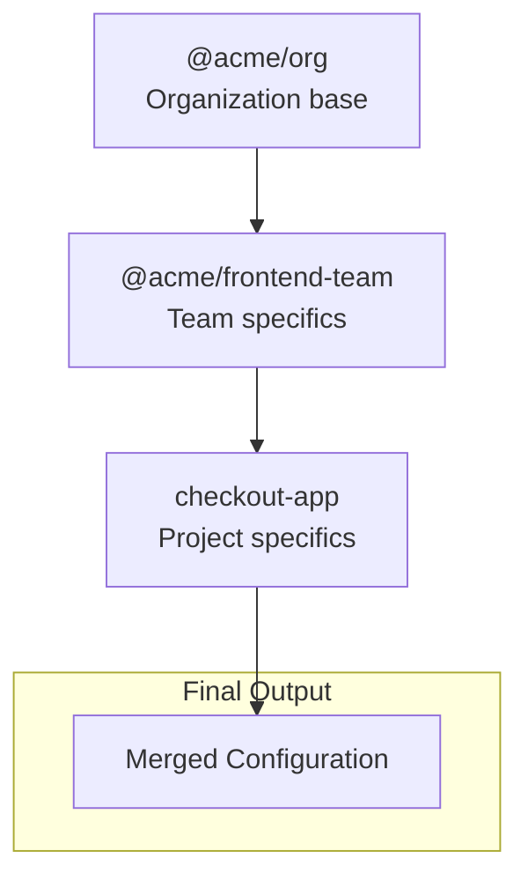

# Tutorial: Building Enterprise AI Infrastructure

In this tutorial, you will simulate a "PromptOps" deployment for a software team.
You won't just write a prompt—you will build a **hierarchical context system** that scales.

## Learning Objectives

By the end of this tutorial, you'll have:

- **Organization Registry:** A shared "base" configuration (`@acme/org`).
- **Team Inheritance:** A team layer that extends the base (`@acme/frontend`).
- **Project Implementation:** A specific project that inherits from both.
- **Native compilation:** Output for GitHub Copilot, Claude, and Cursor.

## Prerequisites

- Node.js 20+
- PromptScript CLI installed (`npm install -g @promptscript/cli`)
- A project to configure

## Step 1: Create Organization Base

Start by creating a base configuration that applies to your entire organization.

Create `registry/@acme/org.prs`:

```promptscript
@meta {
  id: "@acme/org"
  syntax: "1.0.0"
  org: "ACME Corporation"
}

@identity {
  """
  You are an AI assistant working at ACME Corporation.
  Follow company coding standards and best practices.
  """
}

@standards {
  code: [
    "Follow clean code principles"
    "Document all public APIs"
    "Write tests for all code"
  ]

  security: [
    "Validate all user input"
    "Never hardcode secrets"
  ]
}

@restrictions {
  - "Never expose API keys or secrets in code"
  - "Never commit sensitive data to version control"
  - "Always validate user input"
}

@shortcuts {
  "/security": "Review code for security vulnerabilities"
  "/docs": "Generate documentation for this code"
}
```

## Step 2: Create Team Configuration

Create a team-specific configuration that inherits from the org base.

Create `registry/@acme/frontend-team.prs`:

```promptscript
@meta {
  id: "@acme/frontend-team"
  syntax: "1.0.0"
  team: "Frontend"
}

# Inherit from organization
@inherit @acme/org

@identity {
  """
  You are a frontend development expert.
  Specialize in React, TypeScript, and modern web technologies.
  """
}

@context {
  """
  The frontend team uses:
  - React 18 with TypeScript
  - Vite for bundling
  - TailwindCSS for styling
  - Vitest + Testing Library for tests
  - React Query for server state
  """
}

# Extend org standards with frontend-specific rules
@extend standards.code {
  frameworks: [react]
  patterns: [hooks, composition, "render props"]
  stateManagement: "React Query + Context"
}

@shortcuts {
  "/component": "Create a new React component"
  "/hook": "Create a custom React hook"
  "/test": "Write tests using Vitest and Testing Library"
}
```

## Step 3: Create Project Configuration

Now create a project-specific configuration.

Create `.promptscript/project.prs` in your project:

```promptscript
@meta {
  id: "checkout-app"
  syntax: "1.0.0"
}

# Inherit from frontend team (which inherits from org)
@inherit @acme/frontend-team

@context {
  project: "Checkout Application"
  description: "E-commerce checkout flow"

  """
  This is the checkout application for ACME's e-commerce platform.
  Key features:
  - Multi-step checkout wizard
  - Payment processing with Stripe
  - Address validation
  - Order summary and confirmation
  """
}

# Project-specific standards
@extend standards {
  code: {
    testing: {
      coverage: 85
      e2e: required
    }
  }

  accessibility: {
    wcag: "2.1 AA"
    required: true
  }
}

@shortcuts {
  "/checkout": "Help with checkout flow logic"
  "/payment": "Help with Stripe payment integration"
  "/a11y": "Review code for accessibility issues"
}

@knowledge {
  """
  ## API Endpoints

  - POST /api/checkout/create - Create checkout session
  - PUT /api/checkout/:id - Update checkout
  - POST /api/checkout/:id/complete - Complete purchase

  ## Key Components

  - CheckoutWizard - Main wizard container
  - AddressForm - Shipping/billing address
  - PaymentForm - Stripe Elements integration
  - OrderSummary - Cart summary display
  """
}
```

## Step 4: Configure the Project

Create `promptscript.yaml`:

```yaml
input:
  entry: .promptscript/project.prs

registry:
  path: ./registry

targets:
  github:
    enabled: true
    output: .github/copilot-instructions.md

  claude:
    enabled: true
    output: CLAUDE.md

  cursor:
    enabled: true
    output: .cursorrules

validation:
  strict: true
```

## Step 5: Compile and Verify

Compile all targets:

```bash
prs compile
```

Preview without writing files:

```bash
prs compile --dry-run
```

Validate your configuration:

```bash
prs validate
```

## Understanding Inheritance

The inheritance chain creates a layered configuration:



**How merging works:**

| Block Type      | Merge Behavior                       |
| --------------- | ------------------------------------ |
| `@identity`     | Concatenates text                    |
| `@context`      | Concatenates text, merges properties |
| `@standards`    | Deep merges objects                  |
| `@restrictions` | Concatenates arrays                  |
| `@shortcuts`    | Merges, child overrides parent       |
| `@knowledge`    | Concatenates text                    |

## Step 6: Add to CI/CD

Add validation to your CI pipeline:

```yaml
# .github/workflows/promptscript.yml
name: Validate PromptScript

on: [push, pull_request]

jobs:
  validate:
    runs-on: ubuntu-latest
    steps:
      - uses: actions/checkout@v4

      - uses: actions/setup-node@v4
        with:
          node-version: '20'

      - name: Install PromptScript
        run: npm install -g @promptscript/cli

      - name: Validate
        run: prs validate --strict

      - name: Check compiled files are up to date
        run: |
          prs compile
          git diff --exit-code
```

## Next Steps

You now have a complete PromptScript setup! Here's what to explore next:

- [Language Reference](reference/language.md) - Full syntax documentation
- [Inheritance Guide](guides/inheritance.md) - Advanced inheritance patterns
- [Enterprise Setup](guides/enterprise.md) - Organization-wide deployment
- [CLI Reference](reference/cli.md) - All available commands
