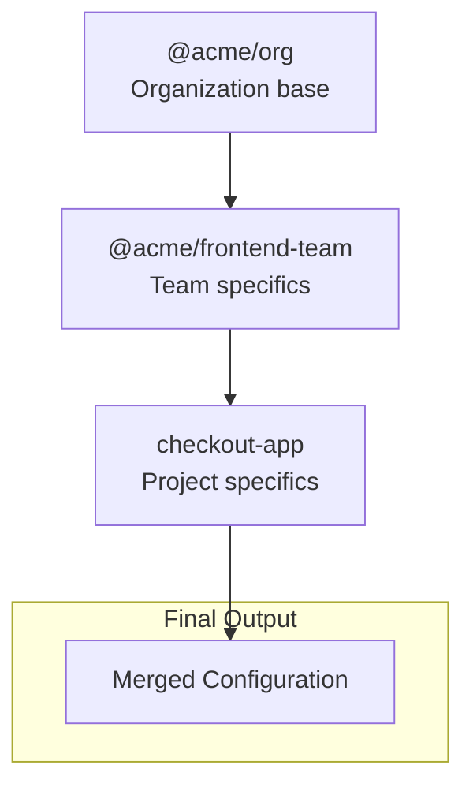

# Enterprise Tutorial: Building Layered AI Infrastructure

This tutorial starts after your first successful local compile. You will
simulate a PromptOps deployment for a software team and build a hierarchical
context system that scales.

## Learning Objectives

By the end of this tutorial, you'll have:

- **Organization Registry:** A shared "base" configuration (`@acme/org`).
- **Team Inheritance:** A team layer that extends the base (`@acme/frontend`).
- **Project Implementation:** A specific project that inherits from both.
- **Native compilation:** Output for GitHub Copilot, Claude, and Cursor.

## Prerequisites

- Node.js 20+
- PromptScript CLI installed (`npm install -g @promptscript/cli`)
- A project that completed [Getting Started](getting-started.md)
- A successful `prs validate --strict` and `prs compile`

## Step 1: Create Organization Base

Start by creating a base configuration that applies to your entire organization.

Create `registry/@acme/org.prs`:

```promptscript
@meta {
  id: "@acme/org"
  syntax: "1.0.0"
  org: "ACME Corporation"
}

@identity {
  """
  You are an AI assistant working at ACME Corporation.
  Follow company coding standards and best practices.
  """
}

@standards {
  code: {
    principles: [
      "Follow clean code principles",
      "Document all public APIs",
      "Write tests for all code"
    ]
  }

  security: [
    "Validate all user input",
    "Never hardcode secrets"
  ]
}

@restrictions {
  - "Never expose API keys or secrets in code"
  - "Never commit sensitive data to version control"
  - "Always validate user input"
}

@shortcuts {
  "/security": "Review code for security vulnerabilities"
  "/docs": "Generate documentation for this code"
}
```

<!-- playground-link-start -->
<a href="https://getpromptscript.dev/playground/?s=N4IgZglgNgpgziAXAbVABwIYBcAWSQwAeGAtmrAHRoBOCANCAMYD2AdljO-gAIkxYYABMAA6rQYIgATRIJEhuGRnwD0zagHN5YiXACe7DIVnyAjBQAMl7eMHqNJkAEEAwgFkAooJfq067BBsNgC+YmLc0pxYEFh6wjpyINpJtgCazACughjUMNniTgCS2XBwEHAC7IIA7uoA1hCsGtlYgq6e3r7+0WwUCQBizFBQzNWCLGQYrHEsUo3NFVNSOVJw+VKCAEbwrTRK0YzwfbbJIWGs3Iusy9Sr8bazMLKithI0jYwQ5PCyyAkSEnkg2Go3GsCm42YUjy71Yn2+cHkdH+APkABFmIwMnwqhhhoI0BlNlAIIw2gAFQqIkDI16okAAdWoMTyHAqazA6my+MeNgBggAuglQqwEnAYFjmbFfij5AA1PHSbB5PFQQQZcXUSSsQlYJGykAAORgADcYFqcCtHoJxYxclhqQkhawReFchVmYweqw1i8JABaRLGs1aoh+cUU4p1GB6NZc232taNSHQvmCQPyYPmyEkEgxG2cMrRM2CZYCQRYZiCENlNiQ9jUIZpjPOKDVDCx6uKst5DXZxq6s6ii5wHDqLBYh33QEgFS2jJSvTyRwAJVNEBgY2tnK188X1YyUFY5owm2gMQ3jpOs6kmOpjgA4pwTxxS5jsVEAnWdxWcOUUzAIQgMEAoMFE1B6PgRCkN8VC0DSIA1oErD4KYwFAA" target="_blank" rel="noopener noreferrer">
  
</a>
<!-- playground-link-end -->

## Step 2: Create Team Configuration

Create a team-specific configuration that inherits from the org base.

Create `registry/@acme/frontend-team.prs`:

```promptscript
@meta {
  id: "@acme/frontend-team"
  syntax: "1.0.0"
  team: "Frontend"
}

# In a multi-file setup, you would inherit from organization:
@inherit @acme/org

@identity {
  """
  You are a frontend development expert.
  Specialize in React, TypeScript, and modern web technologies.
  """
}

@context {
  """
  The frontend team uses:
  - React 18 with TypeScript
  - Vite for bundling
  - TailwindCSS for styling
  - Vitest + Testing Library for tests
  - React Query for server state
  """
}

# Extend org standards with frontend-specific rules
@extend standards.code {
  frameworks: [react]
  patterns: [hooks, composition, "render props"]
  stateManagement: "React Query + Context"
}

@shortcuts {
  "/component": "Create a new React component"
  "/hook": "Create a custom React hook"
  "/test": "Write tests using Vitest and Testing Library"
}
```

<!-- playground-link-start -->
<a href="https://getpromptscript.dev/playground/?s=N4IgZglgNgpgziAXAbVABwIYBcAWSQwAeGAtmrAHRoBOCANCAMYD2AdljO-gAIkxYYABMAA6rQYIgATRIJEhuGRnwD0Yamw6spAWg6l5YiXACe7DIVnyAjBQAM9w+MH6SVkADEN7TlKcBfMTEAYkEASXEhEgBXKCwIHUhYQTh+aLQ6QRNmaMEAdxyoKUlWHBhqCCxBdWYSQWZqAHMMVggAL2wINkQQwW4IUvLKvqVVBsaJUIAKahhGiDgsahNBHUEpBYwAI1hisAbBcgwTRo1o7QBKMX6pTnisFdFnQxAnCQBNHMEMWe-q7y0xVuADcYFBmGg+OxBEQ0OUsBQjIIAMpwxgQDBQdowEqCABKMCUWEyABUTHDkYwKmhid9tIISMxbtRxHkYFsXDBGDhWMxwfN4Ijnq8RWJAqxriwfIQqk8JC83oISWV-ppfJzSIJoqk4D1nGsCUTBNYABz5So4JXkmCU6lYJFrABqlRx+2ogi25ykWNYjQdSow0DyAykAGFkcjqgdFiYfX79YJnRxFoIANRK+DxX2CAAyEC21B+KzdnMWcH9hsYVQAitFysXo+VQe7FtgYEiFa9WOLegBRGXq8YpATaH5SODm3CqnzaHRwNEQSCMQTUWLwa5EQHDlpSMdwCgsW7CJHqUgwArUADWusEyFmRIAukjMFgOCyb8gcMxmNfMiwyMwcCVF0rCZPIszaOUhwaGg5YgE+zithwACyLQYI0MBQlg7iVjWdbLGmgihmqMoBEErDcHAX7UFgjDRFgE5ynIIAqP+aBsHc8juKG94cH8rDnvihJVoIbEcewiryCoX4-lxzE8YSfFCHRiy1EJRoyZekkscm9pIMxADqFR8bpE7agMExJpmdLFCSmYWbm+aFssAQgP4D4MHcyz4EQpDkDAVC0CADDNkBbD4NYblAA" target="_blank" rel="noopener noreferrer">
  
</a>
<!-- playground-link-end -->

## Step 3: Create Project Configuration

Now create a project-specific configuration.

Create `.promptscript/project.prs` in your project:

```promptscript
@meta {
  id: "checkout-app"
  syntax: "1.4.0"
}

# In a multi-file setup, you would inherit from frontend team:
@inherit @acme/frontend-team

@context {
  project: "Checkout Application"
  description: "E-commerce checkout flow"

  """
  This is the checkout application for ACME's e-commerce platform.
  Key features:
  - Multi-step checkout wizard
  - Payment processing with Stripe
  - Address validation
  - Order summary and confirmation
  """
}

# Project-specific standards
@extend standards {
  code: {
    testing: {
      coverage: 85
      e2e: required
    }
  }

  accessibility: {
    wcag: "2.1 AA"
    required: true
  }
}

@shortcuts {
  "/checkout": "Help with checkout flow logic"
  "/payment": "Help with Stripe payment integration"
  "/a11y": "Review code for accessibility issues"
}

@knowledge {
  """
  ## API Endpoints

  - POST /api/checkout/create - Create checkout session
  - PUT /api/checkout/:id - Update checkout
  - POST /api/checkout/:id/complete - Complete purchase

  ## Key Components

  - CheckoutWizard - Main wizard container
  - AddressForm - Shipping/billing address
  - PaymentForm - Stripe Elements integration
  - OrderSummary - Cart summary display
  """
}
```

<!-- playground-link-start -->
<a href="https://getpromptscript.dev/playground/?s=N4IgZglgNgpgziAXAbVABwIYBcAWSQwAeGAtmrAHRoBOCANCAMYD2AdljO-gAIkxYYABMAA6rQYIgATRIJFMcMRgGtmAVywBaDGjTyxEuAE92GQrPkBGCgBYKABn2sAvmLEBiQQElxQkmqgsCE1IWEE4fjU0OkEjdUEAd3UoKUlWRWoILEEwamYSHLz2TlSOUkQPQW4IdJhM7O4MRj4Aely2DlYpTTKCwU8ACmoYAHMIOCxqI0FNQSlxjAAjWFSwZmpBcgwjEby1LoBKMW4WYsJs0XFNvIArJSwLEABhRRV1bIBBXSgIRmwINhOCRSeCMTJoIJsR4AUU0LBIfGojBggkYr1UGhyUGYCScBjkIH0hKuABUcONJHBBLgUWilBjsjpyL9-mwcutBB8ngBZaEAcipMDh+URyM2UGwa2oJAo+IA0jBpmAYNg1MM4BUrrNuQEgpoJjA0Kj0e9EhAAF4YahSfGzAAK2z47GuzGRcDgNRGZtwggAypMIGgYLbOVIpOqqQA3DA-KSs1ghgDy1rq4TUCKt0wwXVRbEg0vj+KJTlcCdYnjtt3u+qDjAgkEY4QEXStUjgxyInVSE2zcetVMuEhYINkg4k1PgQVYI1H+PHucjdQwIxgsgAHABWOfjmAAJlXgmGAEc1BBhjarhJS1e3Fcmm6PYtoFkjLPL4k-jOCbuKJZOR8gXHY9T3PWRJjUYMrlLUtjjgHB1iwRgNAHIsQBaOk3g0eRHgACRgKAjQSLIcGNelTTAbEEkEbExkYQD5BaTAjCdLBsIJPCCO9Ej-XBFEmJYtIOF2QtiQkBiMEsSwjDY+QACUYEjCAYCo4cUSlQR73gR9nywaZxjgCD22JGDWG4ZRWBxFYV2EVDiyudxPA+O0vEEaEujQZgaiwdsywke1E19ElBBaHQIHQk0NHQ4ZsBRWYnmijhSMw7IIndAFfJmQQ7QAVSCkK0DCjCGRaRBpEy7K0DjRKiveEM7QCvLQvCsjItKqR0Pych+FiwQnk62BErQNU0QwCJbwkBzBAVaY+rINhOG88bMpeFqsAAdQtVtMu5DAajNS1rVzUwajqEMPjDCMADF1gKWZfXJXRPRaJ8oB+acNIurS6sdBbrulTKeMDFFoVgFiqS80ZqELLVBGTEFqF9dMSEzZarRSpGUfmOAtmkq5i2MkBnAAXQYBapnwIhSC6qhaBABhF1odL8EsQmgA" target="_blank" rel="noopener noreferrer">
  
</a>
<!-- playground-link-end -->

## Step 4: Configure the Project

Create `promptscript.yaml`:

```yaml
id: checkout-app
syntax: '1.4.0'

input:
  entry: .promptscript/project.prs

registry:
  path: ./registry

targets:
  - github:
      version: full
      output: .github/copilot-instructions.md
  - claude:
      version: full
      output: CLAUDE.md
  - cursor:
      version: full
      output: .cursor/rules/project.mdc
```

## Step 5: Add Agent Platform Capabilities

Add reusable capabilities to `.promptscript/project.prs`:

```promptscript
@skills {
  checkout-review: {
    description: "Review checkout changes"
    content: "Review payment safety, validation, tests, and user impact."
  }
}

@agents {
  checkout-reviewer: {
    description: "Review checkout pull requests"
    skills: ["checkout-review"]
    content: "Review changed checkout code against project standards."
  }
}

@hooks {
  validate-checkout: {
    event: "post-tool-use"
    matcher: "Edit|Write"
    command: ["pnpm", "test"]
    targets: {
      github: { enabled: false }
      cursor: { enabled: false }
    }
  }
}

@workflows {
  release: {
    description: "Prepare checkout release"
    content: "Run validation, summarize risk, and prepare release metadata."
  }
}
```

<!-- playground-link-start -->
<a href="https://getpromptscript.dev/playground/?s=N4IgZglgNgpgziAXAbVABwIYBcAWSQwAeGAtmrAHRoBOCANCAMYD2AdljO-gAJwDW0KHAAEwADqthwxjhiM+zAK5YAtNRgA3CDADuiURKlSAJvEbUIaLBDb6xIAEqbtO6bPlKsbjKwDm8e0MjFnZOLDtHZ11hTABPEjDhOAwwGCxYumENDCgIY2wbVkyOOCw4TJ9jYUU4GGphCDIMRiwKQMlhAF8JbtYJbgx-dhFxDpk5BWU1KJ06-VGjYVM4c0trW2F7Jy1o8Y9lGMUoKGF1AEdFeDL2xf5BOH1kez3J1XUdnXsAXSCpEI52BFti5vH4YFUXp5pMxTMJBhgIKxSjFqMwAFZyLylSoYajGOBtEBBXq9fo4ZjMPgjILZXL5DgqSHKea-YSaMIRNDMUoqLAUqAqGowG5GEjYcbUCIAUWMECwAB8AOoWDgiv7MEhi1jGR72NCsNAkeyZewlLDfVlYXH+MosjqLXxynCKABG8zZrAwLtgOuEYBytS6rL+ilozElog9Xp9+n9QhgQftiakJIk-R04b4YCgzB01I66lgGFqdsWy1WVkKEQACupMOo3BMoYWYMXhUSk-8OZtHIpJLS8gU2Jk4IpNbiIAAvBMWfgVbUomD1mcwIuBhJW+kYQnEnogTpfBhhaixfBEUjkGBUWggBgaOpwQr4ACM+6AA" target="_blank" rel="noopener noreferrer">
  
</a>
<!-- playground-link-end -->

See [Agent Platform](features/index.md) for MCP servers, plugins, and target-specific capabilities.

## Step 6: Compile and Verify

Compile all targets:

```bash
prs compile
```

Preview without writing files:

```bash
prs compile --dry-run
```

Validate your configuration:

```bash
prs validate --strict
```

## Understanding Inheritance

The inheritance chain creates a layered configuration:


```mermaid
flowchart TD
    A["@acme/org<br/>Organization base"] --> B["@acme/frontend-team<br/>Team specifics"]
    B --> C["checkout-app<br/>Project specifics"]

    subgraph "Final Output"
        D["Merged Configuration"]
    end

    C --> D
```

**How merging works:**

| Block Type      | Merge Behavior                       |
| --------------- | ------------------------------------ |
| `@identity`     | Concatenates text                    |
| `@context`      | Concatenates text, merges properties |
| `@standards`    | Deep merges objects                  |
| `@restrictions` | Concatenates arrays                  |
| `@shortcuts`    | Merges, child overrides parent       |
| `@knowledge`    | Concatenates text                    |

## Step 7: Add to CI/CD

Add validation to your CI pipeline:

```yaml
# .github/workflows/promptscript.yml
name: Validate PromptScript

on: [push, pull_request]

jobs:
  validate:
    runs-on: ubuntu-latest
    steps:
      - uses: actions/checkout@v4

      - uses: actions/setup-node@v4
        with:
          node-version: '20'

      - name: Install PromptScript
        run: npm install -g @promptscript/cli

      - name: Validate
        run: prs validate --strict

      - name: Check compiled files are up to date
        run: |
          prs compile
          git diff --exit-code
```

## Next Steps

You now have a complete PromptScript setup! Here's what to explore next:

- [Language Reference](reference/language.md) - Full syntax documentation
- [Agent Platform](features/index.md) - Agents, skills, integrations, and automation
- [Inheritance Guide](guides/inheritance.md) - Advanced inheritance patterns
- [Enterprise Setup](guides/enterprise.md) - Organization-wide deployment
- [CLI Reference](reference/cli.md) - All available commands
