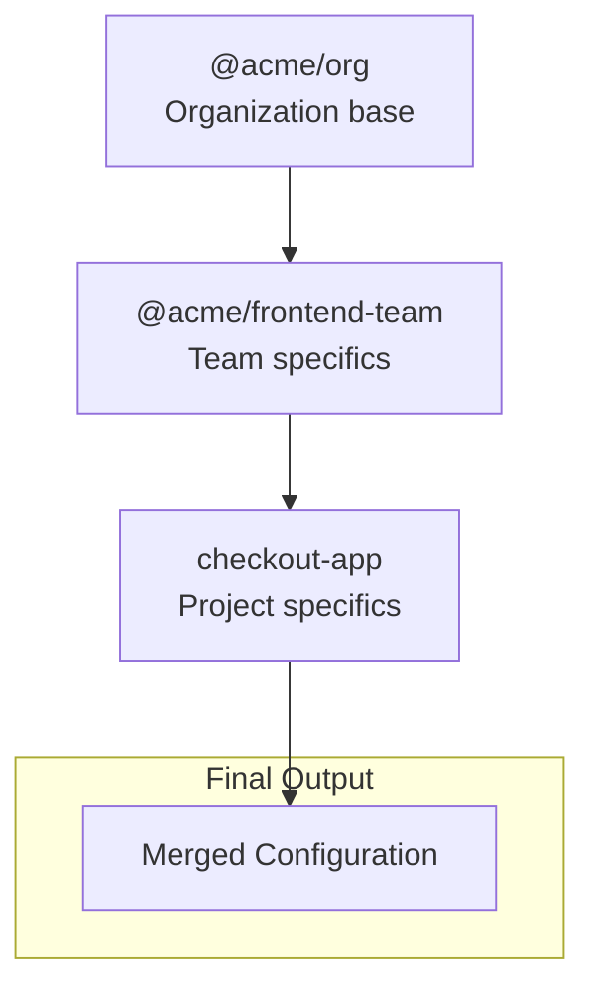

# Enterprise Tutorial: Building Layered AI Infrastructure

This tutorial starts after your first successful local compile. You will
build a layered configuration system for a software team: an organization
base, a team layer that inherits it, and a project that inherits both.

## Learning Objectives

By the end of this tutorial, you'll have:

- **Organization Registry:** A shared "base" configuration (`@acme/org`).
- **Team Inheritance:** A team layer that extends the base (`@acme/frontend`).
- **Project Implementation:** A specific project that inherits from both.
- **Native compilation:** Output for GitHub Copilot, Claude, and Cursor.

## Prerequisites

- Node.js 20+
- PromptScript CLI installed (`npm install -g @promptscript/cli`)
- A project that completed [Getting Started](getting-started.md)
- A successful `prs validate --strict` and `prs compile`

## Step 1: Create Organization Base

Start by creating a base configuration that applies to your entire organization.

Create `registry/@acme/org.prs`:

```promptscript
@meta {
  id: "@acme/org"
  syntax: "1.5.0"
  org: "ACME Corporation"
}

@identity {
  """
  You are an AI assistant working at ACME Corporation.
  Follow company coding standards and best practices.
  """
}

@standards {
  code: {
    principles: [
      "Follow clean code principles",
      "Document all public APIs",
      "Write tests for all code"
    ]
  }

  security: [
    "Validate all user input",
    "Never hardcode secrets"
  ]
}

@restrictions {
  - "Never expose API keys or secrets in code"
  - "Never commit sensitive data to version control"
  - "Always validate user input"
}

@shortcuts {
  "/security": "Review code for security vulnerabilities"
  "/docs": "Generate documentation for this code"
}
```

<!-- playground-link-start -->
<a href="https://getpromptscript.dev/playground/?s=N4IgZglgNgpgziAXAbVABwIYBcAWSQwAeGAtmrAHRoBOCANCAMYD2AdljO-gAIkxYYABMAA6rQYIgATRIJEhuGRnwD0zagHN5YiXACe7DIVnyAjBQCsFAAzbxg9RpMgAggGEAsgFFBb9WnVsCDY7AF8xMW5pTiwILD1hHTkQbRT7AE1mAFdBDGoYXPEXAElcuDgIOAF2QQB3dQBrCFYNXKxBd29ff0DYtgokgDFmKChmWsEWMgxWBJYpZtaqmak8qThCqUEAI3h2miVYxngB+1SwiNZuZdZV6nXE+3mYWVF7CRpmxghyeFlkJISCTyYajcaTWAzSbMKQFT6sb6-ODyOiAoHyAAizEYWT4NQwo0EaCy2ygEEYHQACsVkSBUe90SAAOrUOIFDhVDZgdS5QnPOxAwQAXSS4VYSTgMBxrPi-zR8gAagTpNgCgSoIIspLqJJWMSsCj5SAAHIwABuMB1ODWz0EksY+SwtKSItYYsi+SqrMYfVYGzeEgAtMlTRadUQApKqaUGjA9BsefbHRtmtDYQLBMH5KHLdCSCQ4nbOBVYhbBKsBIIsMxBGGKmxoexqCMM1nXFBahh47XlRWClrc819RdxVc4Dh1FgcU7HsCQCp7VkZXp5M4AErmiAwCa27k6xfL2tZKCsS0YbbQOJb51nedSbG05wAcU4Z445exuJiQQbe6rOEqNMYDCEBQiFBgYmoPR8CIUhfioWg6RAOtglYfBTFAoA" target="_blank" rel="noopener noreferrer">
  
</a>
<!-- playground-link-end -->

## Step 2: Create Team Configuration

Create a team-specific configuration that inherits from the org base.

Create `registry/@acme/frontend-team.prs`:

```promptscript
@meta {
  id: "@acme/frontend-team"
  syntax: "1.5.0"
  team: "Frontend"
}

# In a multi-file setup, you would inherit from organization:
@inherit @acme/org

@identity {
  """
  You are a frontend development expert.
  Specialize in React, TypeScript, and modern web technologies.
  """
}

@context {
  """
  The frontend team uses:
  - React 18 with TypeScript
  - Vite for bundling
  - TailwindCSS for styling
  - Vitest + Testing Library for tests
  - React Query for server state
  """
}

# Extend org standards with frontend-specific rules
@extend standards.code {
  frameworks: [react]
  patterns: [hooks, composition, "render props"]
  stateManagement: "React Query + Context"
}

@shortcuts {
  "/component": "Create a new React component"
  "/hook": "Create a custom React hook"
  "/test": "Write tests using Vitest and Testing Library"
}
```

<!-- playground-link-start -->
<a href="https://getpromptscript.dev/playground/?s=N4IgZglgNgpgziAXAbVABwIYBcAWSQwAeGAtmrAHRoBOCANCAMYD2AdljO-gAIkxYYABMAA6rQYIgATRIJEhuGRnwD0Yamw6spAWg6l5YiXACe7DIVnyAjBQCsFAAyHxg-SSsgAYhvacpLgC+YmIAxIIAkuJCJACuUFgQOpCwgnD8sWh0gibMsYIA7nlQUpKsODDUEFiC6swkgszUAOYYrBAAXtgQbIhhgtwQ5ZXVA0qqTc0S4QAU1DDNEHBY1CaCOoJSSxgARrClYE2C5BgmzRqx2gCUIayDUpyJWGuiroYgLhIAmnmCGPN-Wq+LSlB4ANxgUGYaD47EERDQlSwFCMggAyojGBAMFBOjAyoIAEowJRYbIAFRMiLRjCqaDJf20ghIzAe1HEBRgOzcMEYOFYzChi3gKLeH3FYmCrDE3BYfkINVeEnen0E5IqQM0-h5pEEsXScD6rg2xNJgmsAA5CtUcGqqTAaXSsKiNgA1ar4w7UQQ7S5SXGsZoutUYaAFIZSADCaLRtSOyxMAaDxsE7o4y0EAGo1fBEoHBAAZCA7aj-NZennLODB02MGoARVilXL8cqEO9y2wMFRKo+rCl-QAogrtZM0gJtP8pHBrbhNX5tDo4JiIJBGIJqPF4DKiCDx20pFO4BQWA9hKj1KQYEVqABrQ2CZDzUkAXVRmCwHHZD+QOGYzHvbIWDIZg4GqHpWGyeR5m0Spjg0NBqxAN9XE7DgAFk2gwZoYFhLBPFrBsm1WLNBEjLUFSCW5uDgP9qCwRhYiwGclTkEAVGAtA2EeeRPEjZ8OEBVhryJEk60ETjuPYVV5BUP8AN4tj+JJQShEY5Z6lEs15NvGT2PTZ0kDYgB1KpBIMmd9SGKY01zRlSnJXNrMLYtS1WIIQECF8GEeVZ8CIUhyBgKhaBABh2zAth8GsTygA" target="_blank" rel="noopener noreferrer">
  
</a>
<!-- playground-link-end -->

## Step 3: Create Project Configuration

Now create a project-specific configuration.

Create `.promptscript/project.prs` in your project:

```promptscript
@meta {
  id: "checkout-app"
  syntax: "1.5.0"
}

# In a multi-file setup, you would inherit from frontend team:
@inherit @acme/frontend-team

@context {
  project: "Checkout Application"
  description: "E-commerce checkout flow"

  """
  This is the checkout application for ACME's e-commerce platform.
  Key features:
  - Multi-step checkout wizard
  - Payment processing with Stripe
  - Address validation
  - Order summary and confirmation
  """
}

# Project-specific standards
@extend standards {
  code: {
    testing: {
      coverage: 85
      e2e: required
    }
  }

  accessibility: {
    wcag: "2.1 AA"
    required: true
  }
}

@shortcuts {
  "/checkout": "Help with checkout flow logic"
  "/payment": "Help with Stripe payment integration"
  "/a11y": "Review code for accessibility issues"
}

@knowledge {
  """
  ## API Endpoints

  - POST /api/checkout/create - Create checkout session
  - PUT /api/checkout/:id - Update checkout
  - POST /api/checkout/:id/complete - Complete purchase

  ## Key Components

  - CheckoutWizard - Main wizard container
  - AddressForm - Shipping/billing address
  - PaymentForm - Stripe Elements integration
  - OrderSummary - Cart summary display
  """
}
```

<!-- playground-link-start -->
<a href="https://getpromptscript.dev/playground/?s=N4IgZglgNgpgziAXAbVABwIYBcAWSQwAeGAtmrAHRoBOCANCAMYD2AdljO-gAIkxYYABMAA6rQYIgATRIJFMcMRgGtmAVywBaDGjTyxEuAE92GQrPkBGCgFYKABn2sAvmLEBiQQElxQkmqgsCE1IWEE4fjU0OkEjdUEAd3UoKUlWRWoILEEwamYSHLz2TlSOUkQPQW4IdJhM7O4MRj4Aely2DlYpTTKCwU8ACmoYAHMIOCxqI0FNQSlxjAAjWFSwZmpBcgwjEby1LoBKN1ZuFmLCbNFxTbyAKyUsCxAAYUUVdWyAQV0oCEZsCBsJwSKTwRiZNBBNhPACimhYJD41EYMEEjDeqg0OSgzASTgMchA+iJ1wAKjhxpI4IJcKj0UpMdkdOQ-gC2Dl1oJPs8ALIwgDk1Jg8PySJRmyg2DW1BIFAJAGkYNMwDBsGphnAKtdZjyAkFNBMYGg0RiPokIAAvDDUKQE2YABW2fHYN2YKLgcBqI3NuEEAGVJhA0DA7VypFINdSAG4YX5SNmsUMAeRtdXCakR1umGC6aLYkBlCYJxKcrkTrE89ruDwNwcYEEgjHCAi61qkcDE3CInVSExz8Zt1KuEhYoNkw4kNPgQVYI3HBMneajdQwIxgsgAHDYF5OYAAmdeCYYARzUEGGtuuEjL1+OEia7s9i2gWSM86viX+c8Je4oli5nzApOJ5nhesiTGoIbXGWZadnAODrFgjAaEOxYgC09LvBo8hPAAEjAUDGgkWQ4CaDJmmAOIJIIOJjIwQHyC0mBGM6WA4YS+GET6pEBhCqLMaxaQcLsRYkhIjEYJYlhGOx8gAEowFGEAwNRo6otKggPvAT4vlg0zjHAkEdiSsEnMorC4isa7CGhJbXO4nifPaXiCDCXRoMwNRYB25YSA6SZ+qSggtDoEAYaaGgYcM2CorMzzRRwZFYdkEQeoCvkzII9oAKpBSFaBhZhjItIg0iZdlaDxolRUfKG9oBXloXheRkWlVIGH5OQ-CxYIzydbAiVoOq6IYBEd79J4irTH1ZBsJw3njXFEVYAA6pabaZTyGA1OaVo2nmpg1HUoafOGkYAGLrAUsx+hSuhei0z5QL8s6aWd2l1U682XTKmW8UGqIwrArHUl5ozUEW2qCCmoLUH6GYkFmmXPNaKUI0j8xwFsMnXCWJkgM4AC6DDzVM+BEKQXVULQIAMMutDpfglgE0AA" target="_blank" rel="noopener noreferrer">
  
</a>
<!-- playground-link-end -->

## Step 4: Configure the Project

Create `promptscript.yaml`:

```yaml
id: checkout-app
syntax: '1.5.0'

input:
  entry: .promptscript/project.prs

registry:
  path: ./registry

targets:
  - github:
      version: full
      output: .github/copilot-instructions.md
  - claude:
      version: full
      output: CLAUDE.md
  - cursor:
      version: full
      output: .cursor/rules/project.mdc
```

## Step 5: Add Agent Platform Capabilities

Add reusable capabilities to `.promptscript/project.prs`:

```promptscript
@skills {
  checkout-review: {
    description: "Review checkout changes"
    content: "Review payment safety, validation, tests, and user impact."
  }
}

@agents {
  checkout-reviewer: {
    description: "Review checkout pull requests"
    skills: ["checkout-review"]
    content: "Review changed checkout code against project standards."
  }
}

@hooks {
  validate-checkout: {
    event: "post-tool-use"
    matcher: "Edit|Write"
    command: ["pnpm", "test"]
    targets: {
      github: { enabled: false }
      cursor: { enabled: false }
    }
  }
}

@workflows {
  release: {
    description: "Prepare checkout release"
    content: "Run validation, summarize risk, and prepare release metadata."
  }
}
```

<!-- playground-link-start -->
<a href="https://getpromptscript.dev/playground/?s=N4IgZglgNgpgziAXAbVABwIYBcAWSQwAeGAtmrAHRoBOCANCAMYD2AdljO-gMQAEAAiRhYMvDABNxMcbzjNeuCHF5hqGAOZD2vFmWjxebXhCzLmAd1bGruGL3IYAnuurMArq3EAdVoOGjgH15jcUReLwJiMlgIoNlHdgxCMIiARgoAVgoABljWAF8fH344AGtoKGVAqx0cGEZS9ywAWmoYADcIGHMw6uDgqThGagg0LAg2FJAAJQ6u81r6xrcsWoxWdXg8-p02DnYp2c7u+yctVbgMMGFHOl52jCgIcWwJ1juOOFM79Zk3OBg1GMZAwjCwFG2vEKBSKvg0nFMvD6iwaTVac26gN6cQG8GGo3Gk3CMwxC0YdVRK3sbigUF4bQAjm54KZIcEyhU4GFkBFyUs0W1juYIgBdHG7dgIw6ktYbaQo5arFhSMTqDAQVhfeyuABW9QuIk8GGo4jgEJAcWh0OKOGYzFKVTiDyeLw4zT5lKw2JqwQ6UuJaGYX2aWDtUGa-xgbN4JGwfOoUwAouITAAfADqIw40d0sc83IiaFYaBIETuEU+WFF4pE1E2pm9O2C6hMODcACNerxOBh27BQipHgCoeLgow3LRmAmkd3WL3+2EwEO7NCdquRzDWMVzFPSmAoBZHTU2rAMADG-1Bvixm8pgAFNqYNoKpr0mCngE5vb+iLTDz3R5nleNg7jgNwSFjEYAC87BGMofk8bUYCfWD3xgM87CEERXQwc1LR8fIQHyEUGARahHHwIhSHIGAqFoEAGHaQE4DefBUiIoA" target="_blank" rel="noopener noreferrer">
  
</a>
<!-- playground-link-end -->

See [Agent Platform](features/index.md) for MCP servers, plugins, and target-specific capabilities.

## Step 6: Validate and Compile

Validate your configuration first, so broken references and policy violations surface before
anything is written:

```bash
prs validate --strict
```

Then compile all targets:

```bash
prs compile
```

Preview what would change without writing files:

```bash
prs compile --dry-run
```

Inspect the generated diff before you commit:

```bash
prs diff --all
```

## Understanding Inheritance

The inheritance chain creates a layered configuration:


```mermaid
flowchart TD
    A["@acme/org<br/>Organization base"] --> B["@acme/frontend-team<br/>Team specifics"]
    B --> C["checkout-app<br/>Project specifics"]

    subgraph "Final Output"
        D["Merged Configuration"]
    end

    C --> D
```

**How merging works:**

| Block Type      | Merge Behavior                       |
| --------------- | ------------------------------------ |
| `@identity`     | Concatenates text                    |
| `@context`      | Concatenates text, merges properties |
| `@standards`    | Deep merges objects                  |
| `@restrictions` | Concatenates arrays                  |
| `@shortcuts`    | Merges, child overrides parent       |
| `@knowledge`    | Concatenates text                    |

## Step 7: Add to CI/CD

Add validation to your CI pipeline:

```yaml
# .github/workflows/promptscript.yml
name: Validate PromptScript

on: [push, pull_request]

jobs:
  validate:
    runs-on: ubuntu-latest
    steps:
      - uses: actions/checkout@v4

      - uses: actions/setup-node@v4
        with:
          node-version: '20'

      - name: Install PromptScript
        run: npm install -g @promptscript/cli

      - name: Validate
        run: prs validate --strict

      - name: Check compiled files are up to date
        run: |
          prs compile
          git diff --exit-code
```

## Your Daily Workflow

After the initial setup, everyday use is a short loop:

```bash
# 1. Edit the source
$EDITOR .promptscript/project.prs

# 2. Validate
prs validate --strict

# 3. Compile
prs compile

# 4. Review the generated diff, then commit
git status
git diff
git add .promptscript/project.prs CLAUDE.md .github .cursor
git commit -m "update agent instructions"
```

The generated files are committed next to the source, so reviewers see both in the pull request.
CI runs the same validation and fails when committed output no longer matches the source.

## Next Steps

You now have a complete PromptScript setup! Here's what to explore next:

- [Language Reference](reference/language.md) - Full syntax documentation
- [Agent Platform](features/index.md) - Agents, skills, integrations, and automation
- [Inheritance Guide](guides/inheritance.md) - Advanced inheritance patterns
- [Enterprise Setup](guides/enterprise.md) - Organization-wide deployment
- [CLI Reference](reference/cli.md) - All available commands
