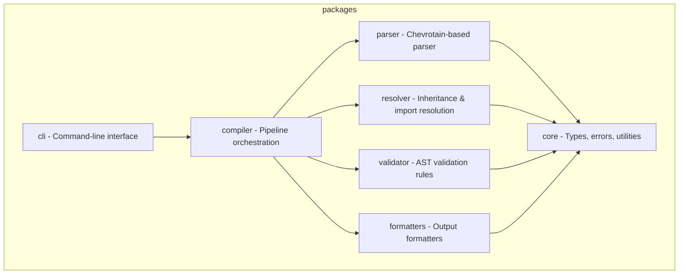

# Project Rules

> Auto-generated by PromptScript
> Source: promptscript (syntax 1.0.0)
> Generated: [TIMESTAMP]
>
> **Do not edit manually** - these rules are generated from PromptScript.
> To modify, update the source .prs file and recompile.

## Project Identity

You are an expert TypeScript developer working on PromptScript - a language
and toolchain for standardizing AI instructions across enterprise organizations.

PromptScript compiles `.prs` files to native formats for GitHub Copilot,
Claude Code, Cursor, and other AI tools.

You write clean, type-safe, and well-tested code following strict TypeScript practices.

## Tech Stack

**Languages:** typescript
**Runtime:** Node.js 20+
**Monorepo:** Nx with pnpm workspaces

## Architecture

The project is organized as a monorepo with these packages:



## Code Standards

### TypeScript

- Strict mode enabled, no `any` types
- Never use `any` type - use `unknown` with type guards
- Use `unknown` with type guards instead of any
- Prefer `interface` for object shapes
- Use `type` for unions and intersections
- Named only, no default exports
- Explicit return types explicit on public functions

### Naming Conventions

- Files: `kebab-case.ts`
- Classes/Interfaces: `PascalCase`
- Interfaces: `PascalCase`
- Functions/Variables: `camelCase`
- Variables: `camelCase`
- Constants: `UPPER_SNAKE_CASE`

### Error Handling

- Use custom error classes extending `extend PSError`
- Always include location information
- Provide actionable error messages

### Testing

- Test files: `*.spec.ts next to source`
- Follow AAA (Arrange, Act, Assert) pattern
- Framework: vitest
- Target >90% coverage for libraries
- Use fixtures for parser tests

## Git Commits

- Use [Conventional Commits](https://www.conventionalcommits.org/) format
- Keep commit message subject line max 70 characters
- Format: `<type>(<scope>): <description>`
- Types: `feat`, `fix`, `docs`, `style`, `refactor`, `test`, `chore`
- Example: `feat(parser): add support for multiline strings`

## Configuration Files

### ESLint

- ESLint: inherit from eslint.base.config.cjs

### Vite/Vitest

- Vite root: \_\_dirname (not import.meta.dirname)

## Commands

- **/review**: Review code for quality, type safety, and best practices
- **/test**: Write unit tests using:
- Vitest as the test runner
- AAA pattern (Arrange, Act, Assert)
- Fixtures for parser tests
- Target >90% coverage
- **/build**: Run verification commands:
- pnpm run format (Prettier)
- pnpm run lint (ESLint)
- pnpm run build (all packages)
- pnpm run typecheck (TypeScript)
- pnpm run test (all tests)
- **/newpkg**: Generate new package with Nx: pnpm nx g @nx/js:lib <name> --directory=packages/<name>

## Development Commands

```bash
pnpm install              # Install dependencies
pnpm nx build <pkg>       # Build package
pnpm nx test <pkg>        # Run tests
pnpm nx lint <pkg>        # Lint code
pnpm nx run-many -t test  # Test all packages
pnpm nx graph             # View dependency graph
```

## Post-Work Verification

After completing any code changes, run the following commands to ensure code quality:
After completing code changes, always run:

```bash
pnpm run format     # Format code with Prettier
pnpm run lint       # Check for linting errors
pnpm run build      # Build all packages
pnpm run typecheck  # Verify TypeScript types
pnpm run test       # Run all tests
```

## Documentation

- **Before** making code changes, review `README.md` and relevant files in `docs/` to understand documented behavior
- **After** making code changes, verify consistency with `README.md` and `docs/` - update documentation if needed
- Ensure code examples in documentation remain accurate after modifications
- If adding new features, add corresponding documentation in `docs/`
- If changing existing behavior, update affected documentation sections

## Diagrams

- Always use **Mermaid** syntax for diagrams in documentation
- Supported diagram types: flowchart, sequence, class, state, ER, gantt, pie, etc.
- Wrap diagrams in markdown code blocks with `mermaid` language identifier
- Example:
  ```mermaid
  flowchart LR
    A[Input] --> B[Process] --> C[Output]
  ```

## Don'ts

- Don't use `any` type - use `unknown` with type guards
- Don't use default exports - only named exports
- Don't commit without tests
- Don't skip error handling
- Don't leave TODO without issue reference
- Don't create packages manually - use Nx generators (nx g @nx/js:lib)
- Don't create custom ESLint rules in package configs - extend base config
- Don't use `import.meta.dirname` in vite/vitest configs - use `__dirname`
- Don't use ASCII art diagrams - always use Mermaid
- Don't reference line numbers in test names or comments
- Don't make code changes without verifying documentation consistency