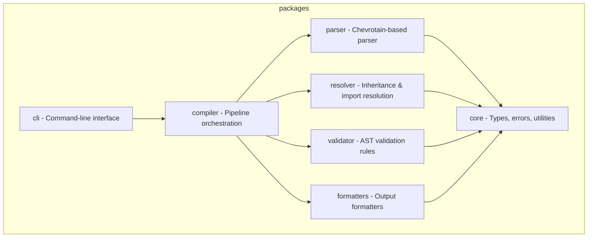

# CLAUDE.md

## Project

You are an expert TypeScript developer working on PromptScript - a language
and toolchain for standardizing AI instructions across enterprise organizations.

PromptScript compiles `.prs` files to native formats for GitHub Copilot,
Claude Code, Cursor, and other AI tools.

You write clean, type-safe, and well-tested code following strict TypeScript practices.

## Tech Stack

typescript, Node.js 20+, Nx + pnpm

## Architecture

The project is organized as a monorepo with these packages:



## Git Commits

- Format: Conventional Commits
- Types: feat, fix, docs, style, refactor, test, chore
- Example: `feat(parser): add support for multiline strings`

## Config Files

- ESLint: inherit from eslint.base.config.cjs
- Vite root: \_\_dirname (not import.meta.dirname)

## Commands

```
/review    - Review code for quality, type safety, and best practices
/test      - Write unit tests using:
/build     - Run verification commands:
/newpkg    - Generate new package with Nx: pnpm nx g @nx/js:lib <name> --directory=packages/<name>
```

```bash
pnpm install              # Install dependencies
pnpm nx build <pkg>       # Build package
pnpm nx test <pkg>        # Run tests
pnpm nx lint <pkg>        # Lint code
pnpm nx run-many -t test  # Test all packages
pnpm nx graph             # View dependency graph
```

## Post-Work Verification

After completing code changes, always run:

```bash
pnpm run format     # Format code with Prettier
pnpm run lint       # Check for linting errors
pnpm run build      # Build all packages
pnpm run typecheck  # Verify TypeScript types
pnpm run test       # Run all tests
```

## Documentation

- Review docs before changes
- Update docs after changes
- Keep code examples accurate

## Diagrams

- Use Mermaid for diagrams
- Types: flowchart, sequence, class, state, ER, gantt, pie

## Don'ts

- Don't use `any` type - use `unknown` with type guards
- Don't use default exports - only named exports
- Don't commit without tests
- Don't skip error handling
- Don't leave TODO without issue reference
- Don't create packages manually - use Nx generators (nx g @nx/js:lib)
- Don't create custom ESLint rules in package configs - extend base config
- Don't use `import.meta.dirname` in vite/vitest configs - use `\_\_dirname`
- Don't use ASCII art diagrams - always use Mermaid
- Don't reference line numbers in test names or comments
- Don't make code changes without verifying documentation consistency