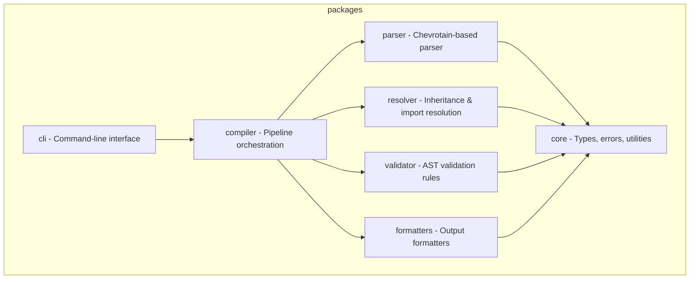

You are working on PromptScript at PromptScript.

Tech stack: typescript, Node.js 20+, Nx, pnpm workspaces

## Architecture

The project is organized as a monorepo with these packages:



## Key Libraries

- Parser: Chevrotain
- CLI: Commander.js
- Testing: Vitest
- Linting: ESLint + Prettier

Code style:
- useUnknown: with type guards instead of any
- interfaces: for object shapes
- types: for unions and intersections
- exports: named only, no default exports
- returnTypes: explicit on public functions
- files: kebab-case.ts
- classes: PascalCase
- interfaces: PascalCase
- functions: camelCase
- variables: camelCase
- constants: UPPER_SNAKE_CASE
- customClasses: extend PSError
- messages: actionable
- filePattern: *.spec.ts next to source
- pattern: AAA (Arrange, Act, Assert)
- fixtures: for parser tests
- framework: vitest

Git Commits:
- format: Conventional Commits
- reference: https://www.conventionalcommits.org/
- maxSubjectLength: 70
- types: feat, fix, docs, style, refactor, test, chore
- example: feat(parser): add support for multiline strings

Config:
- eslint: inherit from eslint.base.config.cjs
- viteRoot: __dirname (not import.meta.dirname)

Commands:
/review - Review code for quality, type safety, and best practices
/test - Write unit tests using:
/build - Run verification commands:
/newpkg - Generate new package with Nx: pnpm nx g @nx/js:lib <name> --directory=packages/<name>

Development Commands:
```bash
pnpm install              # Install dependencies
pnpm nx build <pkg>       # Build package
pnpm nx test <pkg>        # Run tests
pnpm nx lint <pkg>        # Lint code
pnpm nx run-many -t test  # Test all packages
pnpm nx graph             # View dependency graph
```

Post-Work Verification:
After completing code changes, always run:
```bash
pnpm run format     # Format code with Prettier
pnpm run lint       # Check for linting errors
pnpm run build      # Build all packages
pnpm run typecheck  # Verify TypeScript types
pnpm run test       # Run all tests
```

Documentation:
- keep accurate

Diagrams:
- Use Mermaid
- Types: flowchart, sequence, class, state, ER, gantt, pie

Never:
- Never use `any` type - use `unknown` with type guards
- Never use default exports - only named exports
- Never commit without tests
- Never skip error handling
- Never leave TODO without issue reference
- Never create packages manually - use Nx generators (nx g @nx/js:lib)
- Never create custom ESLint rules in package configs - extend base config
- Never use `import.meta.dirname` in vite/vitest configs - use `__dirname`
- Never use ASCII art diagrams - always use Mermaid
- Never reference line numbers in test names or comments
- Never make code changes without verifying documentation consistency